# 기업 오픈소스SW 거버넌스 가이드 — 2026 개정판

> 이 파일은 사이트 정본을 한 파일로 합친 **배포용 통합본**이다. 스크립트가 생성하므로
> 직접 편집하지 않는다 — 내용을 고칠 때는 `content/en/<장>/_index.md` 를 고치고 다시 생성한다.
>
> - 생성: `python3 .claude/skills/guide-revision-writing/scripts/build_single_file.py --out oss-governance-guide-2026.md`
> - 사이트: https://NIPA-OpenUP.github.io/oss-governance-guide/
> - 이전 판: `oss-governance-guide.md` (2023년 2월)
> - 라이선스: 공공누리 제1유형

## 목차

- [0. 들어가며](#0-들어가며)
  - [배경과 취지](#배경과-취지)
  - [구성](#구성)
  - [각 장 소개](#각-장-소개)
  - [결론 및 제언](#결론-및-제언)
- [1. 오픈소스SW 사용하기](#1-오픈소스sw-사용하기)
  - [배경](#배경)
  - [오픈소스SW 사용 가이드 - 기업 편](#오픈소스sw-사용-가이드---기업-편)
  - [오픈소스SW 사용 가이드 - 개발자 편](#오픈소스sw-사용-가이드---개발자-편)
- [2. 오픈소스SW 기여하기](#2-오픈소스sw-기여하기)
  - [오픈소스SW 기여, 왜?](#오픈소스sw-기여-왜)
  - [오픈소스SW 기여 가이드 - 기업 편](#오픈소스sw-기여-가이드---기업-편)
  - [오픈소스SW 기여 가이드 - 개발자 편](#오픈소스sw-기여-가이드---개발자-편)
- [3. 오픈소스SW 공개하기](#3-오픈소스sw-공개하기)
  - [오픈소스SW 공개, 왜?](#오픈소스sw-공개-왜)
  - [오픈소스SW 공개 가이드 - 기업 편](#오픈소스sw-공개-가이드---기업-편)
  - [오픈소스SW 공개 가이드 - 개발자 편](#오픈소스sw-공개-가이드---개발자-편)
- [4. OSPO](#4-ospo)
  - [OSPO 정의와 역할](#ospo-정의와-역할)
  - [OSPO 구성](#ospo-구성)
  - [OSPO 참고 자료](#ospo-참고-자료)
- [5. AI와 오픈소스SW](#5-ai와-오픈소스sw)
  - [AI 오픈소스SW 가이드 - 기업 편](#ai-오픈소스sw-가이드---기업-편)
  - [AI 오픈소스SW 가이드 - 개발자 편](#ai-오픈소스sw-가이드---개발자-편)

---

# 0. 들어가며


## 배경과 취지

정보통신기술(ICT)의 눈부신 성장으로 인해 기업들은 AI, 5G, 빅데이터, 클라우드 등 신기술을 활용한 새로운 서비스를 끊임없이 출시하고 있다. 또 우수한 소프트웨어 개발자를 영입하기 위하여 치열한 경쟁을 벌이기도 한다. 이러한 성장과 변화의 근간은 무엇일까? 바로 오픈소스SW이다. 오늘날 오픈소스SW를 빼고 새로운 서비스를 만들거나 기술 혁신을 이루기는 사실상 어렵다.

오픈소스SW는 단순한 개발 도구를 넘어 기업과 정부의 디지털 전략에서 중요한 위치를 차지하고 있다. 2026년 조사에서 대상 조직의 98%가 오픈소스SW 사용을 유지하거나 늘렸다고 답한 것이 그 방증이다(1장 [기업이 바라보는 오픈소스SW](#기업이-바라보는-오픈소스sw)). 인공지능(AI), 클라우드 컴퓨팅, 사이버보안 분야에서 오픈소스SW가 어디까지 스택의 기반이 되었는지는 이 가이드 1장과 5장에서 사례로 다룬다. 오픈소스SW와 공존할 수밖에 없다는 인식에 따라 글로벌 ICT 기업들은 자사 기술을 오픈소스SW로 공개하고, 오픈소스SW 커뮤니티와 협력하기 위해 많은 투자를 하고 있다.


오픈소스SW의 기본 전제는 소스 코드 공개와 자유로운 활용이다. 하지만 사용하는 데에 비용이 들지 않는다고 해서 저작권까지 없는 것은 아니다. 제대로 살펴보지 않고 무분별하게 사용했다가는 모르는 사이에 저작권을 침해하거나 보안 취약점에 노출될 가능성이 있다. [2026년판 "Open Source Security and Risk Analysis"(OSSRA) 보고서](https://news.blackduck.com/2026-02-25-Black-Duck-Research-Shows-Open-Source-Vulnerabilities-Have-Doubled-as-AI-Accelerates-Code-Creation)[^intro-compliance-risks]는 2024년 11월부터 2025년 10월까지 수행된 감사 데이터를 대상으로 947개 코드베이스·17개 산업을 분석했다. 이 보고서에 따르면 감사된 코드베이스의 68%가 라이선스 충돌을 포함한 오픈소스SW를 포함하며, 컴포넌트 간 충돌을 제외하고 자사 배포에 직접 영향을 주는 충돌만 세어도 59%다. 라이선스 충돌을 포함한 코드베이스의 비율은 53%(2024년판, 2023년 감사분) → 56%(2025년판) → 68%(2026년판, OSSRA 역사상 최고치이자 최대 단일 연도 상승폭인 12%p)로 올랐다[^intro-ossra-trend]. 같은 보고서가 인용한 Black Duck 공급망 보안 설문(소프트웨어 보안 실무자 540명 대상, 2025년 12월)에서는 AI 생성 코드를 IP·라이선스 관점에서 검토하는 조직이 54%에 그쳤으며, 이 문제는 5장에서 다룬다. 따라서 어떤 오픈소스SW를 사용하더라도 라이선스 조건이나 보안 취약점을 꼼꼼히 확인해야 한다.

[^intro-compliance-risks]: Black Duck, "Black Duck Research Shows Open Source Vulnerabilities Have Doubled as AI Accelerates Code Creation"(2026년판 OSSRA 보고서 보도자료), 2026-02-25 : https://news.blackduck.com/2026-02-25-Black-Duck-Research-Shows-Open-Source-Vulnerabilities-Have-Doubled-as-AI-Accelerates-Code-Creation

[^intro-ossra-trend]: 2023년 감사분 53%는 Black Duck, "OSSRA data answers open source questions"(2024년판 OSSRA 보고서 해설) : https://www.blackduck.com/blog/ossra-license-compliance-risks.html / 2024년 감사분 56%는 Black Duck, "New Black Duck Report: 86% of Commercial Codebases Contain Vulnerable Open Source"(2025년판 OSSRA 보고서 보도자료), 2025-02-25 : https://news.blackduck.com/2025-02-25-New-Black-Duck-Report-86-of-Commercial-Codebases-Contain-Vulnerable-Open-Source,-Exposing-Organizations-to-Security-Risks

국내 기업들도 오픈소스SW를 활용하여 소프트웨어 제품과 서비스를 개발하고 출시하고 있다. 그러나 아직은 많은 기업이 단순히 오픈소스SW를 도입하여 사용하는 수준에 그치고 있는 실정이다. 오픈소스SW 커뮤니티와 적극적으로 협력하지 않고 소비하기만 한다면 기업의 소프트웨어 발전은 한계에 다다를 것이다. 

이러한 배경에서, NIPA는 우리나라의 기업이 어떻게 하면 (1) 올바르게 오픈소스SW를 사용하고 (2) 커뮤니티에 적극적으로 참여하며 (3) 서로가 함께 발전할 수 있을지 고민하였다. 특히 이미 시행 단계에 들어선 규제 환경을 반영한다. 유럽 사이버 복원력 법(Cyber Resilience Act)은 2024년 12월 10일 발효해 2026년 9월 11일부터 제조사의 악용 취약점 보고 의무가, 2027년 12월 11일부터 전면 의무가 적용된다. 여기에 EU 인공지능법의 투명성 의무(2026년 8월 2일 적용)와 국내 인공지능 기본법(2026년 1월 22일 시행)이 더해져, 오픈소스SW 사용 기업이 실제로 맞는 기한이 이미 시작됐다. 이 가이드는 그에 맞춰 준수해야 할 사항들을 규제별로 나누어 안내한다. 유럽 사이버 복원력 법과 EU 인공지능법, EU 제조물책임지침의 적용 일정과 기업이 해야 할 일은 [1장 오픈소스SW 사용하기](#sbom-관리)에서 다룬다. 국내 인공지능 기본법이 요구하는 고지·표시 의무는 AI 자산 거버넌스와 함께 다루어야 하므로 [5장 AI와 오픈소스SW](#5-ai와-오픈소스sw)에서 설명한다.

이에 우리나라에서 오픈소스SW를 적극적으로 활용하는 대표 IT기업인 카카오, 라인플러스, SK텔레콤의 경험을 바탕으로 기업의 오픈소스SW 거버넌스 정책 및 모범 사례를 정리한 가이드를 제작하였다. 이들 기업의 오픈소스SW 전문가들은 오픈소스SW의 공유와 협업 정신에 따라 기업의 정책과 사례를 공유하였다. 

또한 이 가이드에서는 OSPO<sub>Open Source Program Office</sub> 설립과 운영에 대한 지침도 다룬다. 이는 기업들이 더 효율적이고 위험이 적은 오픈소스SW 전략과 프로토콜을 수립하는 데 도움이 될 것이다.

이 가이드가 우리나라의 많은 기업이 오픈소스SW를 올바르고 적극적으로 활용하고, 나아가 글로벌 오픈소스SW 생태계에서 주도적인 역할을 하도록 방향을 제시하기를 바란다.

## 구성

1. 오픈소스SW 사용하기 - 기업 편/개발자 편
2. 오픈소스SW 기여하기 - 기업 편/개발자 편
3. 오픈소스SW 공개하기 - 기업 편/개발자 편
4. OSPO<sub>Open Source Program Office, 오픈소스 프로그램 사무소</sub>
5. AI와 오픈소스SW - 기업 편/개발자 편

각 주제는 기업과 구성원의 입장에 따라 기업 편과 개발자 편으로 나누어 설명한다. 기업 편은 오픈소스SW 담당자가 정책과 프로세스를 구축하기 위해 알아야 할 사항을 중점적으로 다루고, 개발자 편에서는 기업에 속한 개발자가 오픈소스SW를 활용하는 데에 필요한 사항을 설명한다.

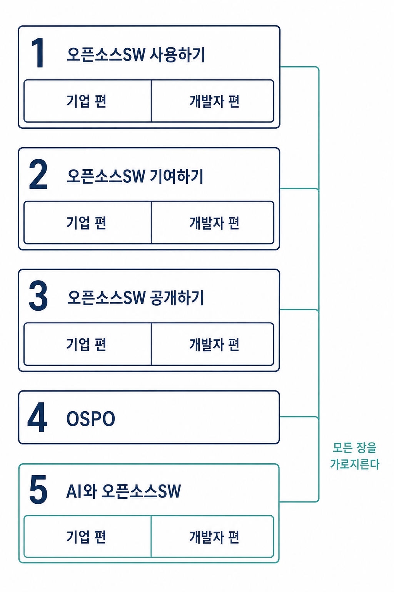

*[가이드 전체 구조 맵]*

## 각 장 소개

### 1. 오픈소스SW 사용하기

이 장에서는 오픈소스SW를 기업 자산의 일부로 도입할 때 기업이 고려해야 할 사항을 설명한다. 

이 장을 통해 기업의 오픈소스SW 담당자는 기업 내 오픈소스SW 컴플라이언스/보안 취약점 대응을 위한 정책과 프로세스를 수립할 수 있다. 각 프로세스에 필요한 도구와 자동화 정보도 확인할 수 있다. 2026년 개정판에서는 소프트웨어 공급망 보안과 규제 대응을 이 장에 함께 넣었다. 컴플라이언스와 취약점 대응, SBOM<sub>Software Bill of Materials</sub> 관리, 공급망 규제 대응이 하나의 관리 흐름으로 이어지기 때문이며, 그만큼 이 장의 분량이 가장 크다.

- 오픈소스SW 도입 시 고려사항
- 오픈소스SW 컴플라이언스
- 라이선스 의무사항
- SBOM 관리와 공급망 규제 대응
- 오픈소스SW 관리 도구
- 오픈소스SW 보안 취약점
- 오픈소스SW 보안 사고 유형과 통제
- 서명·프로비넌스 검증
- 하위 공급망 보안 관리

개발자는 기업의 정책을 이해하기 위해 필요한 라이선스 기본 지식을 쌓을 수 있고, 개발 현업에서 오픈소스SW를 도입할 때 고려해야 할 내용을 확인할 수 있다. 

- 오픈소스SW 라이선스
- 오픈소스SW 선택 가이드
- AI 코딩 도구를 쓸 때의 의존성 검증

### 2. 오픈소스SW 기여하기

이 장에서는 기업의 구성원이 외부 오픈소스SW 개발에 참여하고 직접 기여할 때 기업이 고려해야 할 사항을 설명한다. 

이 장을 통해 기업의 오픈소스SW 담당자는 기업의 기여 방향성과 올바른 기여 정책을 수립할 수 있다. 이런 견고한 전략이 없으면 노력을 투자하고도 오픈소스SW 커뮤니티에서 반응을 얻지 못하거나 법적 위험을 초래할 수 있다. 따라서 오픈소스SW 프로젝트의 특징과 운영 방식을 제대로 이해해야 한다. 

- 기업이 오픈소스SW에 기여해야 하는 이유
- 오픈소스SW 기여 전략 수립 시 고려 사항
- 오픈소스SW 기여 정책 포함 내용

개발자는 오픈소스SW에 기여할 때 필요한 기초 지식과 오픈소스SW 개발에 참여하는 방법을 확인할 수 있다. 

- 오픈소스SW 프로젝트 구성
- 오픈소스SW 기여 준비
- 좋은 기여자가 되기 위한 길잡이
- 기여 제출 방법

### 3. 오픈소스SW 공개하기

이 장에서는 내부에서 제작한 소프트웨어를 오픈소스SW로 공개하는 기업이 고려해야 할 사항을 설명한다. 

이 장을 통해 기업의 오픈소스SW 담당자는 오픈소스SW 공개의 궁극적인 목표를 설정하고 이에 따른 정책과 프로세스를 수립할 수 있다. 각 프로세스를 진행하는 실무도 이해할 수 있다. 

- 오픈소스SW 공개 이유
- 오픈소스SW 공개 규칙
- 문서화
- 오픈소스SW 공개 절차
- 공개 후에 해야 할 일

개발자는 회사 업무로 오픈소스SW를 공개하고 운영할 때 고려해야 할 사항을 확인할 수 있다. 
- 오픈소스SW 공개 준비
- 오픈소스SW 운영하기

### 4. OSPO

이 장에서는 OSPO<sub>Open Source Program Office, 오픈소스 프로그램 사무소</sub>가 무엇인지, 이를 만드는 방법과 절차를 설명한다.

지금까지 설명한 것처럼 오픈소스SW를 효과적으로 활용하기 위해서는 기업 내 오픈소스SW 거버넌스 체계를 수립해야 한다. 기업이 오픈소스SW와 관련된 여러 활동을 적극적으로 관리하면 오픈소스SW에서 최대한의 가치를 창출하는 동시에 법적 리스크를 완화할 수 있기 때문이다. 글로벌 ICT 기업은 오픈소스SW 거버넌스 체계를 구축하고 성장시키기 위해 OSPO 조직을 설립하고 있다. OSPO는 기업의 오픈소스SW 거버넌스 체계를 구축할 뿐만 아니라 기업의 성공을 위한 오픈소스SW 전략을 수립하고 실행하는데 필요한 정책, 프로세스 및 도구를 제공한다.

- OSPO란?
- OSPO 구성 절차
- OSPO 인원 구성
- OSPO 역할

이 장에서는 독자들이 자사에 맞는 OSPO를 구축하고 발전시킬 수 있는 실질적인 가이드를 제공한다. 또한 OSPO 운영에 필요한 도구와 플랫폼 정보, 국내외 기업의 OSPO 운영 사례를 확인할 수 있는 곳을 함께 안내한다.

### 5. AI와 오픈소스SW

이 장에서는 AI 모델·데이터셋·AI 생성 코드를 기존 오픈소스SW 거버넌스에 편입하는 방법을 설명한다.

이 장을 통해 기업의 오픈소스SW 담당자는 AI 자산을 별도 체계로 분리하지 않고 기존 반입 승인·대장 등록·SBOM·고지·배포 승인 절차에 편입하는 방법을 확인할 수 있다. 모델과 데이터셋의 라이선스를 검토하는 기준을 세우고, 아직 결론이 나지 않은 쟁점을 정책에 어떻게 반영할지 판단할 수 있다.

- AI 자산의 거버넌스 편입
- 오픈소스 AI의 기준(OSAID와 G7 개방성 4단계)
- 모델 라이선스 실사
- 데이터셋 거버넌스
- AI 규제와 미확정 쟁점

개발자는 AI 코딩 도구로 작성한 코드와 외부에서 가져온 모델을 다룰 때 지켜야 할 절차를 확인할 수 있다.

- AI 코딩 도구를 쓸 때의 확인 절차
- 모델 반입과 파생물 배포 확인


## 결론 및 제언

오픈소스SW의 영역은 앞으로도 빠르게 확장될 것이다. 오픈소스SW는 기업이 추구하는 혁신을 빠르게 이룰 수 있게 하는 중요한 동력일 뿐만 아니라, 디지털 전환과 AI 확산의 핵심 요소로 자리잡았다. 오픈소스SW 활용이 늘면 그만큼 라이선스·보안 취약점 문제도 늘어난다. 특히 최근 소프트웨어 공급망 보안에 관심이 커지면서 SBOM 관리가 중요해지고 있다.

기업은 문제 대응뿐만 아니라 효율성을 높이기 위해 오픈소스SW 거버넌스 정책과 프로세스를 구축해야 한다. 이를 위해 많은 기업이 OSPO(Open Source Program Office)를 설립하여 체계적인 오픈소스SW 관리를 시도하고 있다. 또한 단순히 오픈소스SW를 사용하는 데에서 그치지 않고 커뮤니티와 협조하며 오픈소스SW의 진정한 가치를 창출해야만 생태계의 자원이 고갈되지 않을 것이다. 

기업의 오픈소스SW 거버넌스는 대개 다음 다섯 단계를 거쳐 자란다. 이 구분은 국제 표준이나 특정 기관의 성숙도 모델이 아니라, 이 가이드가 다루는 내용을 조직의 성장 순서로 다시 배열한 것이다. TODO Group과 Linux Foundation이 공개한 OSPO 성숙도 모델과는 단계 구성이 다르므로 그것과 혼용하지 않는다.

1. **사용** — 어떤 오픈소스SW가 제품에 들어 있는지 파악한다. (1장)
2. **컴플라이언스** — 라이선스 의무를 식별해 고지·공개 절차로 만든다. (1장)
3. **보안·공급망** — SBOM을 상시 보유하고 취약점 유입 경로를 통제한다. (1장)
4. **기여** — 사내 개발자가 상류 프로젝트에 기여할 절차와 승인 체계를 갖춘다. (2장)
5. **공개·OSPO** — 자사 소프트웨어를 공개하고 전담 조직이 정책을 운영한다. (3·4장)

앞 단계를 건너뛰면 뒤 단계가 버티지 못한다. 무엇을 쓰고 있는지 모르는 상태에서 공개 심사 절차를 세울 수는 없다.

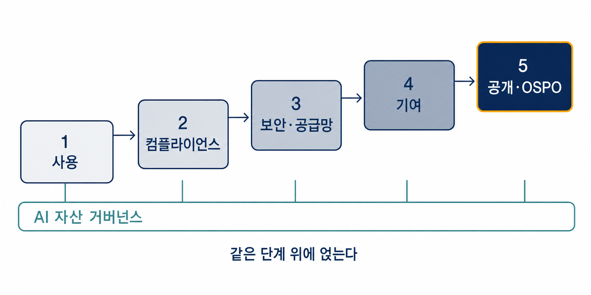

*[오픈소스SW 거버넌스 성숙도 5단계 — 이 가이드의 재구성]*

이 가이드는 위의 모든 활동을 위한 지침을 제공한다. 이미 여러 해외 기업이나 재단에서 내놓은 가이드 문서가 있지만, NIPA의 주관으로 국내 대표 ICT 기업의 오픈소스SW 전문가들이 오랜 경험과 실무 지식을 바탕으로 작성하였다. 이번 2026년 개정판은 오픈소스 AI 정의와 모델·데이터셋 라이선스(5장), AI 코딩 도구 사용 정책(5장), 소프트웨어 공급망 보안과 SBOM(1장), 규제 대응(1장)을 다룬다.

이 가이드는 오픈소스SW를 올바르고 적극적으로 활용하려는 기업에 길라잡이가 되기를 바란다. 또한 개발자에게는 오픈소스SW 생태계에 기여하고 성장할 수 있는 방향을 제시한다. 

이 가이드는 여러 일반적인 사항을 다루고 있지만, 모든 예외 사항까지 다룰 수는 없었다. 하지만 NIPA의 [GitHub Repository](https://github.com/NIPA-OpenUP/oss-governance-guide)에 가이드 전문을 공개하였고, 보완이 필요하다면 누구나 추가로 작성하여 직접 Pull Request를 제출할 수 있다. 또한 문의나 요청이 있으면 Issue를 생성할 수도 있다. 

이처럼 오픈소스SW 개발 방법을 가이드 제작에 적용하였으므로 오픈소스SW에 관심 있는 독자들의 많은 참여를 바란다. 이러한 협력적 접근 방식 덕분에 가이드를 지속적으로 개선하고 최신 상태로 유지할 수 있으며, 오픈소스SW 커뮤니티의 정신을 반영한다.

마지막으로, 오픈소스SW는 기술 혁신뿐만 아니라 사회적 가치 창출의 도구로서도 그 역할이 확대되고 있다. 기업은 오픈소스SW를 통해 지속가능한 발전과 사회적 책임을 실현할 기회를 모색해야 한다. 이 가이드가 그러한 노력의 시작점이 되기를 희망한다.

> **가이드 전문 GitHub Repository**
>
> *  https://github.com/NIPA-OpenUP/oss-governance-guide


---

# 1. 오픈소스SW 사용하기

## 배경

### 기업이 바라보는 오픈소스SW

최근 기업들의 오픈소스SW에 대한 인식과 활용이 크게 변화하고 있다. Perforce·Open Source Initiative·Eclipse Foundation이 공동 발간한 [2026 State of Open Source Report](https://www.openlogic.com/resources/state-of-open-source-report)[^using-perforce2026]에 따르면, 조사 대상 조직의 98%가 오픈소스SW 사용을 유지하거나 늘렸고 사용을 줄인 조직은 2% 미만이다. 도입 동인은 순위가 뒤바뀌지는 않았다. '라이선스 비용과 전체 비용 절감'이 여전히 1위다. 다만 '벤더 락인 회피'가 2025년 조사보다 22%p 뛰어올라 응답자 55%가 이를 이유로 꼽았다(유럽 63%). 예산 압박이라는 오래된 동기 위에 기술 주권과 공급자 종속 회피라는 동기가 빠르게 겹쳐지고 있다는 뜻이다.

[^using-perforce2026]: 2026 State of Open Source Report : https://www.openlogic.com/resources/state-of-open-source-report

또한 엔터프라이즈 소프트웨어 시장에서 독점 소프트웨어의 비중은 줄어드는 추세로 관측되어 왔다. RedHat의 [2022 오픈소스SW Enterprise 현황 보고서](https://www.redhat.com/en/resources/state-of-enterprise-open-source-report-2022)[^using-redhat2022]는 2022년 2월 시점에 독점 소프트웨어 비중 45%가 2년 뒤 37%로, 엔터프라이즈 오픈소스SW는 29%에서 34%로, 커뮤니티 기반 오픈소스SW는 21%에서 24%로 바뀔 것으로 전망했다. 다만 이 시리즈는 2022년판을 끝으로 중단되어 예측의 실현 여부를 확인할 후속판이 없으므로, 현재 시점의 채택률은 Perforce/OpenLogic 2026년판이나 Black Duck OSSRA 2026년판으로 확인해야 한다.

[^using-redhat2022]: 오픈소스 Enterprise 현황 보고서 (2022) : https://www.redhat.com/en/resources/state-of-enterprise-open-source-report-2022

이러한 추세는 오픈소스SW가 단순히 비용 절감을 위한 도구가 아니라, 기업의 혁신과 경쟁력 강화를 위한 전략적 자산으로 인식되고 있음을 보여준다.

그러나 오픈소스SW 도입에 따른 과제도 존재한다. 보안 정책 및 규정 준수 유지, 패치 및 릴리스 최신 상태 유지가 대표적이다. 이 두 과제는 이 장의 [오픈소스SW 컴플라이언스](#오픈소스sw-컴플라이언스)와 [오픈소스SW의 보안 취약점](#오픈소스sw의-보안-취약점) 절에서 실행 절차로 다룬다.

이러한 동향은 기업들이 오픈소스SW를 통해 기술 혁신을 가속화하고, 개발 생산성을 높이며, 글로벌 기술 생태계와의 연결성을 강화하고 있음을 보여준다. 동시에 오픈소스SW 관리와 보안에 대한 체계적인 접근의 필요성도 강조되고 있다.


### 국내 기업들의 오픈소스SW 도입 현황

#### 오픈소스SW 도입 현황

최근 국내 기업들의 오픈소스SW 도입은 급속도로 확산되고 있다. Future Market Insights는 한국의 오픈소스SW 서비스 시장이 2025년부터 2035년까지 연평균 성장률(CAGR) 18.3%로 성장할 것으로 전망한다[^using-fmi2024]. 다만 시장조사 벤더마다 시장 정의와 추정치가 달라, 같은 기간 글로벌 오픈소스SW 서비스 시장 성장률을 24.3%로 제시하는 보고서도 있다. 두 수치 모두 유료 보고서의 비공개 방법론에 근거하므로 절대값보다 성장 방향의 참고 지표로만 쓴다.

[^using-fmi2024]: Open Source Service Market Size, Share, Trends & Forecast 2034 : https://www.futuremarketinsights.com/reports/open-source-service-market

이러한 급격한 성장세는 국내 대기업들의 적극적인 오픈소스SW 도입과 정부의 지원 정책에 기인한다. 삼성, LG, SK 등 주요 기업들이 오픈소스SW 프로젝트에 투자하고 있으며, 특히 클라우드 네이티브 기술, 인공지능, 빅데이터 분야에서 오픈소스SW 활용이 두드러지고 있다.

DataReportal의 [Digital 2024: South Korea 보고서](https://datareportal.com/reports/digital-2024-south-korea)[^using-datareportal2024]에 따르면, 2024년 1월 기준 한국의 인터넷 사용자 수는 5,030만 명으로, 이는 전체 인구의 97.2%에 해당한다. 이러한 높은 인터넷 보급률은 오픈소스SW 기술의 확산과 활용에 긍정적인 영향을 미치고 있다.

[^using-datareportal2024]: Digital 2024: South Korea : https://datareportal.com/reports/digital-2024-south-korea

또한, 정부 차원에서도 오픈소스SW 활성화를 위한 정책을 추진하고 있다. 과학기술정보통신부는 '공개SW 활성화 계획'을 통해 오픈소스SW 생태계 조성과 전문인력 양성을 지원하고 있으며, 이는 국내 기업들의 오픈소스SW 도입을 더욱 가속화할 것으로 예상된다.


#### 국내 오픈소스SW 시장 현황

현재 국내 기업들의 오픈소스SW 전환 움직임은 주로 기술 지원 서비스를 보유한 상업적 버전에 초점이 맞춰져 있으나, 앞으로는 [커뮤니티 버전의 범위가 훨씬 커질 것으로 전망](https://www.itworld.co.kr/techlibrary/139540)[^using-itworld-139540]이 된다. 특히, 클라우드 네이티브 기술, 인공지능, 빅데이터 등의 분야에서 오픈소스SW 활용이 두드러지게 증가하고 있다.

[^using-itworld-139540]: 커뮤니티 버전의 범위가 훨씬 커질 것으로 전망 : https://www.itworld.co.kr/techlibrary/139540

최근 주목받고 있는 주요 오픈소스SW 기술들은 다음과 같다:

- [쿠버네티스(Kubernetes)](https://kubernetes.io)[^using-kubernetes]: 컨테이너 오케스트레이션의 de facto 표준
- [텐서플로우(TensorFlow)](https://www.tensorflow.org)[^using-tensorflow]: 머신러닝 및 인공지능 개발을 위한 오픈소스SW 플랫폼
- [아파치 카프카(Apache Kafka)](https://kafka.apache.org)[^using-kafka]: 대규모 실시간 데이터 스트리밍 처리
- [이스티오(Istio)](https://istio.io)[^using-istio]: 마이크로서비스 아키텍처를 위한 서비스 메시
- [프로메테우스(Prometheus)](https://prometheus.io)[^using-prometheus]: 모니터링 및 알림 시스템

[^using-kubernetes]: 쿠버네티스(Kubernetes) : https://kubernetes.io
[^using-tensorflow]: 텐서플로우(TensorFlow) : https://www.tensorflow.org
[^using-kafka]: 아파치 카프카(Apache Kafka) : https://kafka.apache.org
[^using-istio]: 이스티오(Istio) : https://istio.io
[^using-prometheus]: 프로메테우스(Prometheus) : https://prometheus.io

국내 오픈소스SW 시장은 빠르진 않아도 꾸준히 커지고 있다. NIPA 「2023 오픈소스SW(OSS) 실태조사 보고서」는 국내 시장 규모를 2023년 3,835억 원으로 집계했다[^using-nipa2023survey]. 2020년 2,843억 원, 2021년 3,032억 원, 2022년 3,380억 원을 거쳐 온 수치이며 2023년 성장률은 전년 대비 약 15%다. 기업의 활용률은 전체 69%, SW기업 100%, 비SW산업 56%로 업종 간 격차가 크다. 조사는 국내 기업 1,287개와 개발자 1,250명을 대상으로 했다. 국내 수치는 이 조사가 이 가이드 집필 시점에 확인 가능한 최신 전수 조사이므로 2023년 기준으로 읽어야 한다.

[^using-nipa2023survey]: NIPA 「2023 오픈소스SW(OSS) 실태조사 보고서」. 수치는 전자신문 2024년 6월 10일 보도로 확인했다 : https://www.etnews.com/20240610000212

이러한 추세는 국내 오픈소스SW 생태계가 단순한 사용을 넘어 글로벌 오픈소스SW 커뮤니티에 적극적으로 참여하고 기여하는 단계로 발전하고 있음을 보여준다. 특히 금융, 제조, 유통 등 전통 산업 분야에서도 오픈소스SW 기술 도입이 가속화되고 있어, 앞으로 국내 오픈소스SW 시장의 성장세는 더욱 가파를 것으로 전망된다.


### 오픈소스SW 도입 이유
해를 거듭할수록 기업들은 점점 더 많은 오픈소스SW를 도입하고 있다. 도입 이유의 1순위는 여전히 비용 절감이고, 그 위에 벤더 락인 회피와 기술 주권이라는 이유가 빠르게 겹쳐지고 있다. 독점 소프트웨어는 라이선스 비용이 계속 발생하고 벤더에 종속되는 문제가 있으며, 시장이나 기술의 변화에도 상대적으로 느리게 대응한다. 그 결과 기능, 품질, 보안 면에서 오픈소스SW가 독점 소프트웨어보다 낫다는 인식이 자리 잡았다. 이 밖에도 최신 기술 확보, IT 기술 역량 강화, 경쟁력 강화, 시장 확대, 인재 확보 등 도입 이유는 다양하다. 결과적으로 오픈소스SW는 총소유 비용(TCO) 감소뿐 아니라 여러 측면에서 기업에 유리하다. 오픈소스SW를 도입하는 이유를 항목별로 살펴본다.

#### 비용 절감
일반적으로 오픈소스SW는 권리자인 저작권자가 라이선스를 통해 이용을 허락한 것이며, [OSI(Open Source Initiative)](https://opensource.org)[^using-osi]에서 인증한 오픈소스SW 라이선스들은 모두 상업적 이용을 제한하지 않는다. 라이선스 의무 사항만 준수하면 기업은 비용을 지불하지 않고 자유롭게 오픈소스SW를 사용할 수 있다. 그리고 오픈소스SW는 완성된 패키지 형태로 제공되기도 하는데 종종 누구나 자유롭게 사용할 수 있는 커뮤니티 버전과 과금 정책이 포함된 엔터프라이즈 버전이 따로 존재하기도 한다. 엔터프라이즈 버전은 프리미엄 기능이나 보안 패치, 기술 지원 등을 통한 차별화 전략을 사용하기에 기업은 사용 환경에 따라 적절히 선택할 수 있다.

[^using-osi]: OSI(Open Source Initiative) : https://opensource.org


#### 최신 기술
오픈소스SW는 전 세계의 누구나 조건 없이 참여할 수 있으며, 급변하는 기술의 변화에 민첩하게 대응하다 보니 최신 기술이 자연스럽게 집약된다. 최근에는 클라우드 환경을 기반으로 하는 오픈소스SW, AI 관련 오픈소스SW들이 인기를 얻어 많이 등장하고 있다. 기업들은 최신 오픈소스SW를 적극적으로 도입하여 사내 개발자들에게 사용을 권장하고 최신 기술력을 확보하는 데 힘쓰고 있다.

#### 안정성

오픈소스SW는 독점 소프트웨어보다 안정적이라고 평가받는다. 그 이유는 다음과 같다. 

- 이슈를 발견하고 해결해 나가는 주기가 빠르다: 오픈소스SW는 코드가 공개되어 있으므로 해커가 보안 취약점 및 약점을 찾기가 더 쉽다는 주장도 있지만 실제로는 수많은 기여자에 의해 더 빨리 발견될 가능성이 크다. 커뮤니티가 활성화된 오픈소스SW일수록 이슈가 발생했을 때 더 빠르게 개선이 이루어진다.
- 패치와 신규 버전 배포가 빠르다: 오픈소스SW는 취약점 심각도가 높으면 빠르면 하루나 이틀 안에도 수정 사항이 배포된다. 반면 독점 소프트웨어는 개발 인력이 제한적이라 우선순위를 정해 순차적으로 패치하고, 패치가 언제 배포되는지는 벤더의 릴리스 계획이 정한다. 즉 기업은 벤더의 일정에 끌려갈 수밖에 없다. 자사가 쓰는 상용 제품의 실제 패치 주기는 벤더별로 다르므로 계약 단계에서 보안 패치 제공 주기와 지원 기간을 서면으로 확인한다.
- 독점 소프트웨어의 상당 부분도 이미 오픈소스SW를 사용 중이다: 독점 소프트웨어 개발기업가 사용 중인 오픈소스SW의 보안 이슈를 제대로 추적하고 관리하지 않으면 버그 및 취약점이 포함된 상태로 배포될 가능성이 크다. 또한, 개선되었다 하더라도 실제 배포까지는 오랜 시간이 걸린다.

#### 역량 강화
오픈소스SW는 수많은 개발자의 손을 거쳐 높은 품질의 소스 코드와 아키텍처를 가지게 된다. 이는 기존 코드에만 익숙한 개발자들에게 시각의 변화를 주거나 새로운 기술을 습득할 기회가 된다. 그뿐만 아니라 보편적 기능은 오픈소스SW로 대체하고 개발자는 비즈니스 로직 개발에 집중할 수 있는 환경을 만들 수 있기 때문에 오픈소스SW의 사용은 성공적으로 프로젝트를 완성하기 위한 필수 요건이 되어가고 있다.

#### 생산성의 증가
개발 프레임워크부터 모니터링, 테스트 자동화, 부하 테스트, 빌드, 배포까지 개발 프로젝트를 수행하는 과정 전체에서 오픈소스SW를 적극적으로 도입하게 되면 부서별로 각자 따로 개발할 필요가 없고, 코드 중복도 최소화할 수 있다. 이렇게 얻어진 효율성은 조금 더 혁신적인 기술에 투자할 여력을 만들어 준다.

#### 시장 확대
국내 소프트웨어 기업이 글로벌 시장에 진출하기는 현실적으로 매우 어렵다. 하지만 소스 코드를 공개하면 전 세계에서 사용자를 확보할 수 있고, 오픈소스SW는 안정적이고 보안성이 높으며 계속 발전한다는 긍정적 기대가 소프트웨어의 가치를 높인다. 그 결과 이전보다 훨씬 더 많은 글로벌 확장 기회를 얻을 수 있다.

#### 인재 확보
독점 소프트웨어를 사용하면 그 소프트웨어 개발 경력이 있는 인재를 확보하기가 상당히 어렵다. 하지만 오픈소스SW는 누구나 접근할 수 있는 코드이기 때문에 더 넓은 인력 풀에서 인재를 확보할 기회가 늘어난다. 기존 직원에게 오픈소스SW 교육을 하는 기업도 늘고 있다. 이제는 오픈소스SW를 사용하는 데 그치지 않고 직접 참여한 경력까지 요구하는 추세다. 실제로 오픈소스SW 역량을 갖춘 인재의 채용을 고려한다는 인사담당자가 늘고 있다는 조사 결과도 있다[^using-training-resource].

[^using-training-resource]: 2020 Open Source Jobs Report : https://training.linuxfoundation.org/resources/2020-open-source-jobs-report/


### 오픈소스SW 도입 시 고려사항
Gartner의 [Technology Insight for Software Composition Analysis (2019) 보고서](https://www.gartner.com/en/documents/3971011/technology-insight-for-software-composition-analysis)[^using-gartner-3971011]는 기업이 오픈소스SW를 도입할 때 고려할 사항으로 네 가지를 꼽는다. (1) 오픈소스SW의 장기 생존 가능성, (2) 보안 이슈 여부, (3) 벤더 이슈 여부, (4) 컴플라이언스 및 지식재산권 확인이다. 이 밖에 오픈소스SW가 자사 제품이나 서비스에 적합한 기술인지, 도입 후 충분한 기술 지원을 받을 수 있는지도 확인해야 한다. 이 중 몇 가지를 좀 더 자세히 살펴본다.


#### 보안
오픈소스SW를 도입할 때는 먼저 안전한지 검토해야 한다. 오픈소스SW는 코드가 공개되어 있어 공격자가 그 코드에서 결함을 찾아 악용할 수 있다. 다만 취약점이 발견되면 심각도에 따라 우선순위가 매겨지고, 심각한 취약점일수록 보안 패치가 신속하게 이뤄지는 편이다. 따라서 도입하려는 오픈소스SW 버전에 보고된 취약점이 있는지, 취약점이 얼마나 자주 보고되고 얼마나 신속하게 대응되는지를 먼저 확인해야 안전하게 도입할 수 있다. 도입한 뒤에도 취약점 현황을 지속적으로 모니터링하고 패치를 적용해야 하며, 이를 지원하는 도구가 시중에 다수 있으므로 도입 여부를 검토하길 권장한다. 자세한 내용은 뒤에 나올 [`오픈소스SW 관리 도구 소개`](#오픈소스sw-관리-도구-소개)를 참고할 수 있다.

#### 오픈소스SW 기술 지원
내부 인력만으로도 오픈소스SW의 도입과 지속적인 관리가 가능한지 검토해야 한다. 이를 위해서 내부 기술력이 뒷받침되어야 한다. 그렇지 아니한 경우에는 기술지원 서비스가 제공되는 엔터프라이즈 오픈소스SW를 도입할 수 있다. 엔터프라이즈 오픈소스SW를 도입할 경우에는 어느 수준까지 기술 지원을 받을 수 있는지도 확인이 필요하다.

#### 오픈소스SW 커뮤니티
오픈소스SW는 특정 단체가 관리하기도 하고, 개인 혹은 기업이 관리하기도 한다. 따라서 오픈소스SW를 운영하는 방식도 다양하므로 사전에 꼼꼼히 체크해야 향후 발생할 수 있는 리스크를 최소화할 수 있다. 얼마나 많은 사용자를 보유하고 있는지, 업데이트는 자주 이뤄지는지, 이슈가 발생했을 때 대응은 신속하게 이뤄지고 있는지 등 따져봐야 한다. 자세한 내용은 [`오픈소스SW 선택 가이드`](#오픈소스sw-선택-가이드) 편에서 다뤄질 예정이다.

#### 컴플라이언스, 지식재산권

오픈소스SW에도 독점 소프트웨어와 마찬가지로 저작권 등 지식재산권이 있다. 오픈소스SW 저작권자는 라이선스를 통해 오픈소스SW를 사용하는데 지켜야 할 의무 사항을 명시한다. 자유로운 복제 및 배포 및 수정의 허용은 모든 오픈소스SW에 동일하게 적용된다. GPL과 같은 라이선스는 오픈소스SW를 사용하게 되면 소프트웨어를 배포할 때 추가되거나 수정된 소스 코드를 모두 공개하도록 요구하기도 한다. 오픈소스SW 라이선스를 미리 파악하고 의무 사항을 준수해야 한다. 자세한 내용은 [`오픈소스SW를 사용하고 관리하기`](#오픈소스sw를-사용하고-관리하기) 편에서 다뤄질 예정이다.

#### 호환성
오픈소스SW가 기업에 적합한지 따져보려면 먼저 현재 기업 내 IT 시스템에 대한 충분한 파악이 선행되어야 한다. 현재 시스템의 아키텍처와 현황 등을 문서화하고 오픈소스SW를 도입했을 때 이슈가 될 부분은 없는지 확인이 되어야 한다. 또한 케이스에 따라 장기적으로 계획을 세워 점진적으로 도입해야 할 수도 있다.


---

이제는 기업이 오픈소스SW 사용 여부를 선택할 수 있는 것이 아니라, 오픈소스SW가 소프트웨어 개발의 필수 요소가 되었다. 이후에서는 기업이 오픈소스SW를 어떻게 올바르게 선택하고 사용해야 하는지 안내한다.


## 오픈소스SW 사용 가이드 - 기업 편

오픈소스SW 의존도가 높아지면서 기업은 이를 올바르게 사용할 방법을 지속적으로 고민하고, 정책을 수립해 실무에 반영해야 한다. 오픈소스SW에 적용되는 라이선스는 매우 다양하며, 조건에 따라 지켜야 할 의무사항도 라이선스마다 다르다. 따라서 기업은 사용 중인 오픈소스SW를 추적 관리하고 라이선스 의무 사항을 준수할 책임이 있다. 이번 장에서는 기업이 오픈소스SW를 사용할 때 필요한 관리와 그 과정 전반을 알아본다.


### 오픈소스SW를 사용하고 관리하기
오픈소스SW 라이선스를 관리하는 것은 독점 소프트웨어의 라이선스를 관리하는 것만큼 중요하다. 라이선스 의무를 지키지 않은 기업을 상대로 한 분쟁은 실제로 법정에서 다뤄져 왔다. 2017년 미국 연방 법원에서 있었던 [GPL이 법적 계약이라고 판결한 사례](https://www.linux.com/topic/open-source/artifex-v-hancom-open-source-now-enforceable-contract)[^using-hancom]가 그 출발점으로 자주 인용된다. 그 이후 확인된 주요 사건은 다음과 같다. 표는 1차 출처(법원 판결문 또는 소송 당사자·재단의 공식 사건 페이지)가 확인된 사건만 담았다.

| 사건 | 관할 | 쟁점 라이선스 | 결론 또는 진행 상태 | 기업에 주는 함의 |
|------|------|---------------|---------------------|------------------|
| Artifex v. Hancom | 미국 연방 법원 | GPLv2 (Ghostscript) | 2017년, GPL을 법적 구속력이 있는 계약으로 본 판단[^using-hancom] | 라이선스 조건 위반이 계약 위반 주장의 근거가 된다 |
| Software Freedom Conservancy v. Vizio | 미국 캘리포니아주 오렌지카운티 주법원 | GPLv2 (Linux 등) | 2021년 10월 제소, 재판은 2026년 8월 10~19일로 예정 — 진행 중(2026년 2월 27일 사건 페이지 갱신 기준)[^using-sfc-vizio] | 소스 코드를 저작권자가 아닌 최종 사용자가 제3자 수익자 지위에서 요구할 수 있는지가 다투어진다. 완제품을 판매하는 제조·가전 기업은 완전한 대응 소스<sub>Complete Corresponding Source</sub> 제공 체계를 미리 갖춰야 한다 |
| Neo4j, Inc. v. PureThink, LLC | 미국 제9순회항소법원 (사건번호 21-16029) | AGPLv3에 추가된 Commons Clause | 2022년 2월 18일, 예비적 금지명령을 인용한 원심을 유지. 미공개<sub>NOT FOR PUBLICATION</sub> 결정이다[^using-neo4j-purethink] | AGPLv3 제7조가 허용하는 '추가 제약 제거'는 상류 이용자가 붙인 제약에만 미친다. 원저작권자가 붙인 제약을 떼어내고 '자유·오픈소스SW'라고 표시하면 허위 표시로 다뤄질 수 있다 |
| Entr'ouvert v. Orange | 프랑스 파리 항소법원 | GPLv2 (Lasso) | 2024년 2월 14일, 라이선스 위반을 저작권 침해<sub>contrefaçon</sub>로 인정하고 경제적 손해 50만 유로, 정신적 손해 15만 유로, 침해로 얻은 이익 15만 유로의 배상을 명령[^using-entrouvert-orange] | 라이선스 위반이 계약 책임에 그치지 않고 저작권 침해로 구성될 수 있으며, 손해배상액이 실제로 산정된다 |

진행 중인 사건은 확정된 법리가 아니다. 사내 판단 근거로 인용할 때는 결론이 아니라 쟁점과 진행 상태를 함께 적는다.

[^using-hancom]: Linux.com, Artifex v. Hancom: Open Source is Now an Enforceable Contract : https://www.linux.com/topic/open-source/artifex-v-hancom-open-source-now-enforceable-contract
[^using-sfc-vizio]: Software Freedom Conservancy, SFC v. Vizio (사건 페이지) : https://sfconservancy.org/copyleft-compliance/vizio.html
[^using-neo4j-purethink]: United States Court of Appeals for the Ninth Circuit, Neo4j, Inc. v. PureThink, LLC, No. 21-16029, Memorandum (2022-02-18) : https://cdn.ca9.uscourts.gov/datastore/memoranda/2022/02/18/21-16029.pdf
[^using-entrouvert-orange]: Cour d'Appel de Paris, pôle 5 – ch. 1, arrêt du 14 février 2024 (Entr'ouvert c. Orange) : https://www.legalis.net/jurisprudences/cour-dappel-de-paris-pole-5-ch-1-arret-du-14-fevrier-2024/


### 오픈소스SW 컴플라이언스
#### 오픈소스SW 컴플라이언스의 정의

>
> <i>“Open source compliance is the process by which users, integrators and developers of open source software observe copyright notices and satisfy license obligations for their open source software components”
> — The Linux Foundation</i>
>


오픈소스SW 컴플라이언스란 오픈소스SW를 사용하고 개발하는 사람들이 저작권을 존중해 라이선스 의무를 이행하는 과정이다. 조직에서는 흔히 오픈소스SW 라이선스 컴플라이언스를 성가시다고 여긴다. 물론 모든 라이선스를 식별하고 각각의 의무를 준수하는 일은 쉽지 않다. 하지만 오픈소스SW가 고갈되지 않고 계속 유지되도록 지키는 일도 오픈소스SW를 활용하는 기업의 책임 중 하나다. 규정을 준수하려는 노력을 통해 기업은 오픈소스SW 사용 과정에서 발생할 수 있는 비용과 위험을 이해하게 되고, 결과적으로 오픈소스SW를 더 잘 이해하고 사용할 수 있게 된다. 

오픈소스SW 컴플라이언스의 범위는 사내 사용에 그치지 않는다. 제3자 공급자와 소프트웨어를 주고받는 계약 과정에서 발생하는 오픈소스SW 라이선스 의무를 준수하는 활동까지 포함한다. 이런 활동은 오픈소스SW 커뮤니티와 존중·신뢰를 바탕으로 한 관계를 쌓는 기반이 되기도 한다. 궁극적으로 오픈소스SW 컴플라이언스의 목적은 저작권자의 지식재산권을 보호하는 데 있다.


*[오픈소스SW 컴플라이언스 범위]*


> 참고로, 지난 2020년 12월, 오픈소스SW 컴플라이언스에 대한 국제 표준이 ISO에 등록되었다. 
> 
> [ISO/IEC 5230](https://www.iso.org/standard/81039.html)[^using-iso5230]은 기업이 오픈소스SW 컴플라이언스를 달성하기 위해 수행해야 할 최소한의 요구사항을 정의하고 있다. NIPA에서 출간한 기업 오픈소스SW 거버넌스 OpenChain 해설서에서는 이에 대한 자세한 내용 및 준수 방법을 설명한다. 
> 
> 가이드는 다음 페이지에서 다운받을 수 있다. : https://www.oss.kr/oss_guide/show/7050bff0-d06b-43f0-99a6-9975afcd486f

[^using-iso5230]: ISO/IEC 5230 : https://www.iso.org/standard/81039.html


#### 오픈소스SW 컴플라이언스 프로세스
기업은 오픈소스SW 라이선스 의무사항을 준수할 수 있도록 사용, 기여, 감사, 배포에 이르는 일련의 과정을 관리하고 감독해야 한다. 검증 단계까지 체크리스트를 작성해 두면 일관성을 지키고 검증을 빠뜨리지 않을 수 있다. 여기서는 일반적인 오픈소스SW 컴플라이언스 프로세스를 소개하고 단계별 주요 내용을 설명한다.


*[오픈소스SW 컴플라이언스 프로세스]*


##### **1. 오픈소스SW 라이브러리 식별**
프로젝트에 사용된 오픈소스SW를 식별하고 목록을 도출하는 단계이다. 모든 오픈소스SW 컴포넌트가 식별되어야 하며, 오픈소스SW 원본의 위치와 라이선스 정보 등도 함께 기록되어야 한다. 자동화된 스캐닝 도구를 통해 식별하는 것을 권장한다. 자동화된 스캐닝 도구는 [주요 오픈소스SW 관리 도구 소개](#주요-오픈소스sw-관리-도구-소개)에서 자세히 다룬다. 스캔은 배포 시점이나 변동 사항이 있을 때, 개발자의 요청이 있을 때, 혹은 주기적으로 수행할 수 있다.

##### **2. 소스 코드 감사**
코드 레벨 스캔으로 아직 식별되지 않은 오픈소스SW를 추가로 찾아내는 단계다. 코드 스캐닝 도구는 개발 언어가 바뀌거나 함수명·변수명이 변경되어도 오픈소스SW 코드를 식별할 수 있어야 하며, 기존 코드와 비교해 수동으로도 확인하는 과정을 거친다.

##### **3. 이슈 확인 및 해결**
도출된 오픈소스SW 목록에서 이슈가 있는지 파악하고 해결하는 단계다. 이슈가 발견되면 해당 오픈소스SW를 다른 것으로 대체하거나 제거해야 하므로 개발 부서와 긴밀히 협의한다. 코드를 수정한 뒤에는 다시 스캔 과정으로 돌아가 이슈가 해결되었는지 정확히 확인한다.

#####  **4. 아키텍처 리뷰**
프로젝트 전반의 아키텍처를 검토한다. 오픈소스SW는 결합 방식에 따라 준수해야 할 의무사항이 다르기 때문이다. 오픈소스SW 코드뿐 아니라 독점 코드, 상용 코드까지 확인하고 코드 간 의존성과 결합 방식을 함께 검토한다.

아래 표는 결합 방식과 라이선스 계열의 조합에서 소스 공개 의무가 발생하는지를 정리한 것이다. 표는 소프트웨어를 조직 밖으로 전달하거나 네트워크로 제공하는 상황을 전제로 한다. 전달 자체가 없으면 아래 판정을 적용하기 전에 [오픈소스SW 배포](#오픈소스sw-배포)의 판정표를 먼저 본다.

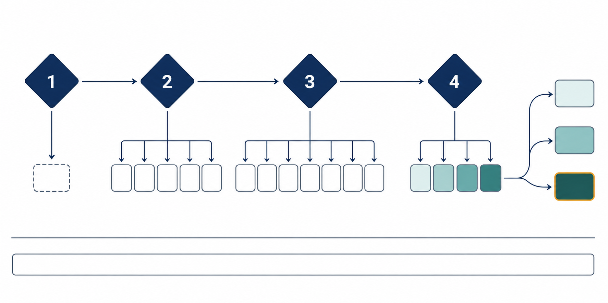

*[라이선스 의무 발생 판단 — 결합 방식 × 라이선스 계열]*

| 결합 방식 | permissive | LGPL | MPL·EPL | GPL | AGPL |
|-----------|-----------|------|---------|-----|------|
| 정적 링크 | X | 조건부 ① | 조건부 ② | O | O |
| 동적 링크 | X | 조건부 ③ | 조건부 ② | 조건부 ④ | 조건부 ④ |
| 별도 프로세스 실행(IPC·CLI 호출) | X | X | 조건부 ② | 조건부 ⑤ | 조건부 ⑤ |
| 컨테이너 이미지 동봉 | X | 조건부 ⑥ | 조건부 ⑥ | 조건부 ⑥ | 조건부 ⑥ |
| 사이드카 컨테이너 | X | X | 조건부 ② | 조건부 ⑤ | 조건부 ⑤ |
| 네트워크 API 호출 | X | X | X | X | 조건부 ⑦ |
| 모델 가중치 동봉 | X | X | X | 조건부 ⑧ | 조건부 ⑧ |

O는 의무가 발생함, X는 발생하지 않음, 조건부는 아래 조건에 따라 갈림을 뜻한다. 공통으로 저작권 고지와 라이선스 사본 첨부 의무는 결합 방식과 무관하게 모든 칸에 적용된다.

- ① 정적 링크한 LGPL 라이브러리는 이용자가 라이브러리를 교체할 수 있도록 재링크 수단(오브젝트 파일 또는 소스)을 제공해야 성립한다. 애플리케이션 전체를 LGPL로 공개하는 것이 아니다.
- ② MPL·EPL은 파일 단위 카피레프트다. 해당 라이선스가 붙은 파일을 수정한 경우에만 그 파일의 소스를 같은 라이선스로 공개하며, 결합 방식과 무관하다.
- ③ 동적 링크한 LGPL 라이브러리는 교체 가능성이 보장되면 애플리케이션 소스 공개 의무가 없다. 라이브러리 자체를 수정했다면 그 수정분은 공개한다.
- ④ 하나의 프로그램으로 볼 수 있는 결합인지에 따라 갈린다. 다툼이 가장 많은 지점이므로 사안별 법무 검토를 전제한다.
- ⑤ 통신이 단순한 데이터 교환에 그치면 별개 저작물로 보는 해석이 일반적이나, 자료 구조를 공유하는 등 결합도가 높으면 달리 볼 수 있다.
- ⑥ 이미지에 담긴 각 컴포넌트가 개별적으로 배포된 것으로 본다. 이미지 안의 GPL 바이너리에는 GPL 의무가, LGPL·MPL 컴포넌트에는 각 라이선스의 의무가 그대로 붙는다.
- ⑦ AGPL 컴포넌트를 네트워크로 이용자에게 제공하면 그 이용자에게 수정된 소스를 제공할 의무가 발생한다. 판정 기준은 [오픈소스SW 배포](#오픈소스sw-배포)에서 다룬다.
- ⑧ 모델 가중치 파일이 소프트웨어의 파생저작물에 해당하는지에 대해 확립된 기준이 없다. 가중치와 함께 동봉되는 추론 코드·스크립트에는 해당 라이선스의 의무가 그대로 적용되므로, 가중치와 코드를 분리해 판정한다.


이 표는 일반적 해석이며 최종 판단은 사안별 법무 검토가 필요하다.

#####  **5. 승인**
이전 단계들이 모두 완료되었는지 확인하며, 검토 결과를 토대로 오픈소스SW 책임자는 이 단계에서 오픈소스SW의 사용을 승인하거나 거절한다. 승인된 오픈소스SW와 관련 정보들은 취합 후 등록하여 중앙에서 관리한다.

#####  **6. 고지**
오픈소스SW를 포함한 프로그램을 배포하면, 즉 오픈소스SW를 재배포하면 기본적으로 저작권과 라이선스 정보를 고지할 의무가 발생한다. 고지문은 일반적으로 NOTICE라는 이름의 파일로 작성한다. 이에 포함할 내용은 사용된 오픈소스SW의 명칭, 오픈소스SW에 접근할 수 있는 URL, 라이선스 원문, 저작권 표기 등이 있다. GPL과 같이 소스 코드 공개의 의무가 발생하는 경우에는 소스 코드를 받는 방법도 함께 기재한다.

##### **7. 검증**
배포한 패키지를 확인하여 고지문이 정상적으로 제공되었는지 최종적으로 확인한다.

### 라이선스 의무사항
#### 오픈소스SW 배포
오픈소스SW 라이선스의 의무 사항은 배포하는 시점에 발생한다. 여기서 배포란 소스 코드 또는 바이너리의 복사본을 다른 사람에게 제공하는 행위를 의미한다. 앱스토어 배포, 판매, 3rd party 제공, 코드 공개 등이 배포에 해당한다. 다만 '사내 도구로만 쓰면 배포가 아니다'라고 단정할 수는 없다. AGPL 계열은 복사본을 전달하지 않고 네트워크로 기능을 제공하는 것만으로도 소스 제공 의무를 발생시키므로, 판정은 라이선스 계열에 따라 갈린다.

아래 표는 실무에서 판단이 갈리는 다섯 가지 사례를 정리한 것이다.

| 사례 | 배포·전달로 볼 가능성 | 판단을 가르는 요소 |
|------|----------------------|--------------------|
| (a) AGPL 컴포넌트를 사내 네트워크 서비스로 제공 | 중 | 원격으로 상호작용하는 이용자가 누구인가. 사내 구성원만 접속하는 경우와 협력사·계열사 계정이 섞이는 경우의 판정이 다르다 |
| (b) 외부 고객에게 SaaS 제공 | 상 | 사용된 컴포넌트가 AGPL 계열인가. AGPL이면 바이너리 전달이 없어도 의무가 발생하고, GPL·LGPL이면 전달이 없으므로 통상 발생하지 않는다 |
| (c) 컨테이너 이미지를 사내 레지스트리 밖으로 반출 | 상 | 이미지 사본이 조직 밖 주체에게 이전되는가. 공개 레지스트리 푸시, 고객사 온프레미스 설치, 파트너 전달이 모두 해당한다 |
| (d) 그룹사·계열사 간 제공 | 상 | 수령 주체가 별개 법인인가. 같은 그룹이라도 법인이 다르면 통상 배포로 본다 |
| (e) 위탁 개발 산출물 납품 | 상 | 발주처가 별개 법인이고 산출물 사본이 이전된다. 납품물에 포함된 오픈소스SW의 고지·소스 제공 의무는 납품하는 기업에 발생한다 |

'상'으로 판정된 사례는 앞의 아키텍처 리뷰 단계에서 제시한 결합 방식 판정표를 이어서 적용해 발생하는 의무의 범위를 확정한다.


#### 오픈소스SW 라이선스 공통 의무사항
오픈소스SW 라이선스는 오픈소스SW 저작자의 권리를 존중하기 위해 공통으로 네 가지의 의무 사항을 기본으로 둔다. 오픈소스SW 사용자는 저작권을 고지해야 하고, 라이선스 사본을 포함해야 한다. 오픈소스SW 사용 시 보증은 제공되지 않으며, 오픈소스SW 사용으로 인해 발생한 손해에 대해서도 책임을 지지 않는다.  


*[오픈소스SW 라이선스 공통 의무사항]*


### 오픈소스SW 라이선스 컴플라이언스 실행
#### 사용 중인 오픈소스SW를 추적해야 하는 이유
기업이 효과적으로 오픈소스SW를 활용하기 위해서는 제품별, 버전별 사용한 오픈소스SW 현황을 추적하여 관리해야 한다. 그 이유와 목적은 다음과 같다.

##### **오픈소스SW 목록 관리**
오픈소스SW를 효율적으로 관리하고 조직의 정책을 준수하기 위해서는 오픈소스SW 목록을 관리해야 한다.


##### **라이선스 확인**
사용 중인 오픈소스SW의 라이선스를 파악해야 의무 사항을 확인하고 준수할 수 있다. 모든 오픈소스SW 라이선스가 서로 호환되는 것은 아니며, 라이선스의 의무사항과 조건이 충돌할 수도 있다. 조직 내 모든 오픈소스SW 라이선스 준수 요구사항을 충족하는지 확인하려면 오픈소스SW 라이선스를 식별하고 추적하는 수밖에 없다.


##### **취약점 파악**
오픈소스SW는 악의적인 공격자의 표적이 되기 쉬우며, 특히 널리 쓰이는 엔터프라이즈 오픈소스SW일수록 공격 대상이 되기 쉽다. 오픈소스SW 목록을 확보하지 않으면 소프트웨어에 포함된 오픈소스SW의 알려진 취약점 여부조차 파악할 수 없어 수정도 할 수 없다.


##### **패치 및 버전 업데이트**
오픈소스SW는 기능 개선 및 버그 수정을 위하여 지속해서 업데이트가 이뤄진다. 오픈소스SW 목록을 관리하여 중요 패치 또는 버전 업데이트를 놓치지 말아야 한다.

#### 오픈소스SW 목록 수동 관리
오픈소스SW 목록을 관리하는 방법으로는 수동 방식과 자동 방식이 있다. 수동 방식은 개발자 또는 오픈소스SW 관리자가 모든 오픈소스SW 사용 현황을 직접 파악하는 방법이다. 수동으로 관리하는 경우 몇 가지 문제가 발생한다.
##### **오픈소스SW 파악의 어려움**
소스 코드 수준에서 사용된 오픈소스SW까지 일일이 파악하기는 매우 힘든 작업이다. 오픈소스SW 코드를 그대로 가져다 쓰거나 수정해서 쓰면, 일부 제한적인 라이선스에서는 그 오픈소스SW를 사용하는 모든 프로젝트의 소스 코드를 공개해야 할 수도 있다. 오픈소스SW 목록에서 누락되면 이후 패치나 버그 수정을 반영하지 못하고, 취약점이 발견되어도 파악하기 어려워진다.

##### **사용된 오픈소스SW 목록 누락**
사용 현황을 파악하는 과정에서 미처 확인하지 못해 누락이 생길 수 있다. 프로젝트 규모가 커지고 대상이 많아질수록 오픈소스SW를 직접 파악하기는 더 어려워진다. 개발이 진행되고 배포 단계에 이르기까지 수많은 변경 작업이 일어나므로, 관리 중인 오픈소스SW 목록과 실제 코드에 포함된 오픈소스SW를 완전히 일치시키기는 어렵다. 이런 변경 사항을 추적하는 데도 상당한 노력과 시간이 든다.

##### **배포 프로세스 지연**
수동 관리는 애플리케이션 개발과 배포 일정에도 영향을 줄 수 있다. 오픈소스SW 목록을 수동으로 관리하면 승인 프로세스도 수동으로 진행되어 매우 느려지기 쉽다. 이미 통합된 오픈소스SW에서 이슈가 발생하면 개발자에게 해당 오픈소스SW를 제거하고 대안을 찾도록 요구해야 할 수도 있는데, 이는 일정에 큰 차질을 준다.

#### 오픈소스SW 목록 관리의 자동화
앞서 살펴본 문제들 때문에 오픈소스SW 관리는 여러 측면에서 자동화가 필요하다. 이를 위해 아래와 같이 오픈소스SW를 식별할 적절한 도구를 구축하거나 도입해야 한다.
- 코드 레벨에서 사용 중인 오픈소스SW를 찾아내며 비교를 제공하는 소스 코드 스캐너
- 오픈소스SW 라이브러리 파일을 찾아내는 파일 스캐너
- 오픈소스SW를 패키지 단위로 가져오는 패키지 매니저 분석 도구
- 라이선스와 컴플라이언스 항목 및 리소스를 추적하기 위한 컴플라이언스 관리 도구
- 라이선스 결합 방식 분석 도구
- 오픈소스SW BOM(Bill of Materials, 사용된 소프트웨어 구성요소 목록) 관리 도구
- 전반적으로 프로젝트를 관리하고 오픈소스SW 목록을 관리할 포탈


### SBOM 관리

소프트웨어 공급망 보안의 중요성이 증가함에 따라 SBOM(Software Bill of Materials) 관리가 핵심 요소로 부상하고 있다. SBOM은 소프트웨어 구성 요소, 라이선스, 종속성 등에 대한 정보를 포함하는 문서이다.

#### 글로벌 SBOM 규제 동향

2026년부터 2028년 사이에 국내 기업이 실제로 맞는 오픈소스SW·공급망 규제 기한은 EU 일곱 개와 국내 세 단계다. 국가별로 나열하면 기한이 겹치는 구간이 드러나지 않으므로 기한 순으로 정리한다. 아래 표의 EU 기한은 규정 원문에 명시된 날짜이고, 국내 일정은 법령이 아니라 2026년 6월 발표된 정책 로드맵의 계획이므로 시행 시점이 달라질 수 있다.

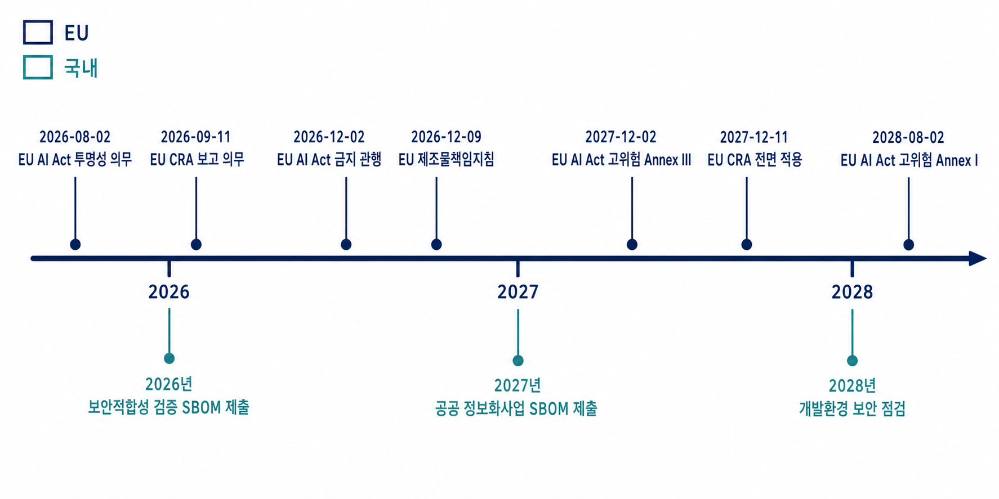

*[국내외 SBOM·공급망 규제 타임라인]*

| 기한 | 규제 | 적용 대상 | 국내 기업이 해야 할 일 |
|------|------|-----------|------------------------|
| 2026-08-02 | EU AI Act 제50조 투명성 의무[^using-ai-act][^using-ai-omnibus] | EU 시장에 AI 시스템을 공급하거나 EU 내에서 산출물이 사용되는 제공자·배포자 | AI와 상호작용한다는 고지와 생성 콘텐츠 표시 요건을 제품별로 점검한다 |
| 2026년 중(계획) | 국내 보안적합성 검증에 SBOM 제출 반영[^using-sw-roadmap2026] | 보안적합성 검증 대상 제품을 공공에 납품하는 기업 | 아래 [국내 SBOM 규제 동향](#국내-sbom-규제-동향) 참조 |
| 2026-09-11 | EU CRA 제14조 보고 의무[^using-cra] | EU 시장에 디지털 요소 제품을 출하하는 제조사 | 24시간·72시간·최종 보고 절차와 담당자를 사내 규정으로 문서화한다 |
| 2026-12-02 | EU AI Act 신설 금지 관행 적용(제5조(1) 첫째 문단 (ba)·(bb), 제5조(1a)·(1b))과 기존 생성형 AI 시스템에 적용된 제50조(2) 4개월 경과규정 만료[^using-ai-omnibus] | EU 시장에 AI 시스템을 공급하거나 EU 내에서 산출물이 사용되는 제공자·배포자 | 신설된 금지 관행에 자사 AI 활용 사례가 해당하는지 대조하고, 경과규정 대상 생성형 AI 시스템의 표시 요건 적용을 마친다 |
| 2026-12-09 | EU 제조물책임지침(PLD) 적용 개시[^using-eu-pld] | EU 시장에 소프트웨어 또는 소프트웨어 내장 제품을 공급하는 기업 | 공급계약의 구상권·보험 조항을 무과실 책임을 전제로 재검토한다 |
| 2027년 중(계획) | 국내 공공 정보시스템 구축·운영 사업의 보안 요구사항에 SBOM 제출 반영, 시범인증 개시[^using-sw-roadmap2026] | 공공 정보화사업 수주 기업과 하위 협력사 | 아래 [국내 SBOM 규제 동향](#국내-sbom-규제-동향) 참조 |
| 2027-12-02 | EU AI Act Annex III 고위험 의무[^using-ai-omnibus] | Annex III에 해당하는 독립형 고위험 AI 시스템 제공자 | 고위험 분류 해당 여부를 제품별로 판정한다 |
| 2027-12-11 | EU CRA 전면 적용[^using-cra] | 위와 같음 | 제품별 지원기간과 적합성평가 경로를 확정한다 |
| 2028년 중(계획) | 국내 주요 기관 납품 시 개발환경 보안 점검 체크리스트 우선 적용[^using-sw-roadmap2026] | 주요 기관에 제품을 납품하는 기업 | 아래 [국내 SBOM 규제 동향](#국내-sbom-규제-동향) 참조 |
| 2028-08-02 | EU AI Act Annex I 내장형 고위험 의무[^using-ai-omnibus] | 제품에 내장된 고위험 AI 시스템 제공자 | 위와 같음 |

Annex III 고위험 의무는 2026-08-02에서 2027-12-02로, Annex I 내장형 고위험 의무는 2027-08-02에서 2028-08-02로 각각 연기되었다. 근거는 2026-07-24 관보에 게재되고 2026-07-27 발효한 Regulation (EU) 2026/1744이다[^using-ai-omnibus]. 이 표가 이 가이드의 규제 일정 단일 정본이며, 다른 장은 일정을 다시 나열하지 않는다. 범용 AI 모델(GPAI) 고유 의무의 일자는 [AI와 오픈소스SW](#5-ai와-오픈소스sw)에서 다룬다.

[^using-ai-act]: Regulation (EU) 2024/1689 (AI Act) : https://eur-lex.europa.eu/eli/reg/2024/1689/oj/eng
[^using-ai-omnibus]: Regulation (EU) 2026/1744 of 8 July 2026 (Digital Omnibus on AI), OJ L, 2026/1744, 24.7.2026 : https://eur-lex.europa.eu/eli/reg/2026/1744/oj/eng
[^using-cra]: Regulation (EU) 2024/2847 (Cyber Resilience Act), OJ L, 2024/2847, 20.11.2024 : https://eur-lex.europa.eu/eli/reg/2024/2847/oj/eng
[^using-eu-pld]: Directive (EU) 2024/2853 on liability for defective products, OJ L, 2024/2853, 18.11.2024 : https://eur-lex.europa.eu/eli/dir/2024/2853/oj/eng
[^using-sw-roadmap2026]: 과학기술정보통신부·국가정보원·KISA, SW 공급망 보안 강화 로드맵 발표(2026.06.) : https://www.kisa.or.kr/2060204/form?postSeq=24&page=1

##### 미국 — 조달 요구의 후퇴와 최소 요소의 강화

미국의 SBOM 요구는 2021년 이후 다음 경로를 지나왔다. 2021-05-12 행정명령 14028[^using-order-14028] → 2025-01-16 행정명령 14144 → 2025-06-06 행정명령 14306[^using-eo14306]이 SBOM 관련 연방조달규정(FAR) 조항 신설 지시를 삭제 → 2026-01-23 OMB M-26-05가 M-22-18과 M-23-16을 폐지하고 기관이 위험평가에 근거해 필요하다고 판단할 때만 증명·SBOM을 요구하도록 전환.

이는 연방 조달 요건의 후퇴이지 SBOM 자체의 후퇴가 아니다. 같은 기간 CISA는 SBOM 최소 요소를 오히려 강화했고, EU CRA와 국내 공공 요구는 별개로 유지된다. 따라서 미국 정책 변화는 사내 SBOM 체계를 해체할 근거가 되지 않는다. 다만 개별 계약에 남아 있는 SSDF 자기증명·SBOM 조항의 효력은 계약별로 다르므로 계약서를 직접 확인한다.

정책 변화와 무관하게 유지되는 요구도 있다. 미국 FDA의 의료기기 SBOM 제출 요구는 가이던스가 아니라 연방식품의약품화장품법 제524B조라는 법률에 근거한다. 2022-12-29 신설되어 2023-03-29 효력이 발생했고, '사이버 기기' 제조사는 시판 전 제출 시 상용·오픈소스SW·기성 구성요소를 모두 포함한 기계 판독 가능 SBOM을 내야 한다[^using-fda-cyber]. 근거가 법률이므로 행정부 정책 방향이 바뀌어도 그대로 남는다.

[^using-order-14028]: Executive Order 14028 of May 12, 2021 : https://www.nist.gov/itl/executive-order-14028-improving-nations-cybersecurity
[^using-eo14306]: Executive Order 14306 — Sustaining Select Efforts to Strengthen the Nation's Cybersecurity (2025-06-06) : https://www.govinfo.gov/app/details/DCPD-202500669
[^using-fda-cyber]: Cybersecurity — Medical Devices, U.S. FDA : https://www.fda.gov/medical-devices/digital-health-center-excellence/cybersecurity

##### 함께 확인할 EU·일본 동향

- **NIS2 지침**: 국내법 전환 기한은 2024-10-17이었으나 대부분의 회원국이 지키지 못했다. 집행위는 2024-11-28 23개 회원국에 대해 위반 절차를 개시했고, 2026-07-08 아일랜드·스페인·프랑스·네덜란드를 EU 사법재판소에 회부했다[^using-nis2]. NIS2는 규정이 아니라 지침이므로 국내 기업이 실제로 마주하는 의무는 각 회원국의 국내법이다. 'EU 전체가 2024-10-17에 시행했다'고 정리하면 실제 기한을 놓친다. EU 사업장이 있는 회원국별로 시행일과 등록 의무를 개별 확인한다.
- **오픈소스SW 보안 인증**: CRA 제25조가 자유·오픈소스SW에 대한 자발적 보안 인증 프로그램의 위임법 근거를 두었으나 2026년 7월 현재 위임법은 채택되지 않았다. 인증 체계가 도입되었다고 단정할 수 없는 단계다.
- **일본**: 경제산업성이 2023년 10월 SBOM 가이드라인을 발표했고[^using-japan2023], 2026-07-29 CISA의 SBOM 최소 요소 개정판에 공동 저자로 참여했다.

[^using-nis2]: European Commission, Commission calls on 23 Member States to fully transpose NIS2 Directive : https://digital-strategy.ec.europa.eu/en/news/commission-calls-23-member-states-fully-transpose-nis2-directive
[^using-japan2023]: Japan METI SBOM Guidelines : https://www.meti.go.jp/english/press/2023/0728_001.html

#### EU 사이버복원력법(CRA)

2026년 개정 시점에서 국내 기업이 가장 먼저 맞는 기한이 CRA다. EU 시장에 디지털 요소가 있는 제품(소프트웨어·하드웨어·원격 데이터처리 솔루션)을 상업적 활동으로 출하하는 제조사에 적용되며, EU 역내 법인이 없어도 의무가 발생한다. 국내 완성품 업체에 부품·모듈·펌웨어를 납품하는 협력사도 통합자를 통해 같은 요구를 받는다.

##### **1. 적용 일정**

제71조 원문은 "This Regulation shall apply from 11 December 2027. However, Article 14 shall apply from 11 September 2026 and Chapter IV (Articles 35 to 51) shall apply from 11 June 2026."로 규정한다[^using-cra].

| 시점 | 적용 범위 |
|------|-----------|
| 2024-12-10 | CRA 발효 |
| 2026-06-11 | Chapter IV(제35~51조) 적용 — 적합성평가기관 통보 |
| 2026-09-11 | 제14조 적용 — 제조사 보고 의무 |
| 2027-12-11 | 전면 적용 — 본질적 사이버보안 요구사항, 적합성평가, CE 마킹, 기술문서 |

##### **2. 보고 절차**

2026-09-11부터 EU 시장에 디지털 요소 제품을 출하한 제조사는 적극적으로 악용되는 취약점과 중대한 사고를 ENISA 및 관할 CSIRT에 통지해야 한다. 통지는 24시간 조기경보 → 72시간 취약점 신고 → 14일 또는 1개월 최종 보고 순으로 진행된다[^using-cra]. 사고가 나고 나서 담당자를 정하면 24시간을 지킬 수 없다. 기한 전에 신고 담당자와 대응 절차를 사내 규정으로 문서화한다.

##### **3. SBOM 의무의 실제 범위**

Annex I Part II(1)은 제조사가 "identify and document vulnerabilities and components contained in products with digital elements, including by drawing up a software bill of materials in a commonly used and machine-readable format covering at the very least the top-level dependencies of the products"라고 규정한다[^using-cra]. 요구 범위는 '최소한 최상위 의존성'이다.

사용자 공개와 당국 제출은 성격이 다르다. Annex II(9)는 제조사가 SBOM을 사용자에게 제공하기로 결정한 경우에 접근 방법을 알리도록 하므로 사용자 공개는 선택이다. 반면 제13조(25)에 따라 시장감시당국은 SBOM 제출을 요구할 수 있다. 따라서 SBOM 정책은 '대외 공개용'과 '당국 제출용 보관' 두 갈래로 나누어 문서화한다. 제13조(24)는 집행위가 이행법으로 SBOM 포맷과 요소를 구체화할 수 있게 위임하고 있으므로 포맷 요구가 추후 구체화될 수 있다.

##### **4. 오픈소스SW 실사와 상류 보고 의무**

제13조(5)는 상업적 활동 과정에서 시장에 출하되지 않은 자유·오픈소스SW 구성요소를 통합하는 경우까지 포함해 제조사에 실사<sub>due diligence</sub> 의무를 지운다. 제13조(6)은 구성요소에서 취약점을 발견하면 그 구성요소를 제조·유지관리하는 주체에 보고하고 수정 코드와 문서를 공유하도록 요구한다[^using-cra].

이 조항은 오픈소스SW '사용'을 '기여'로 연결하는 법적 유인을 처음으로 만들었다. 보안 패치를 만들고도 사내에만 두는 관행은 CRA 적용 제품에서는 의무 위반이 된다. 사내에서 만든 패치를 상류 프로젝트에 제출하는 경로를 오픈소스SW 정책에 명문화해야 한다. 기여 승인 절차는 [오픈소스SW 기여하기](#2-오픈소스sw-기여하기)에서 다룬다.

한편 CRA는 오픈소스SW 스튜어드<sub>open-source software steward</sub>라는 지위를 두어 상업적 제조사와 다른 의무를 지운다. 스튜어드 판정 기준과 지위별 의무·제재 범위는 [오픈소스SW 공개하기](#3-오픈소스sw-공개하기)의 CRA 지위 판정표에서 다룬다.

##### **5. 적용 판단 체크리스트**

- [ ] EU 시장에 제품을 출하하는가 — 직접 출하뿐 아니라 국내 완성품 업체를 통한 간접 납품도 확인한다
- [ ] 그 제품이 디지털 요소가 있는 제품에 해당하는가 — 소프트웨어, 하드웨어, 원격 데이터처리 솔루션
- [ ] 제품별 지원기간<sub>support period</sub>을 확정했는가
- [ ] 2027-12-11 기준 적합성평가 경로(자체평가 또는 제3자)를 제품별로 판정했는가


#### 국내 SBOM 규제 동향

국내 SBOM 정책의 계보는 세 단계다. 2024-05-13 과학기술정보통신부·국가정보원·디지털플랫폼정부위원회가 공동으로 'SW 공급망 보안 가이드라인 1.0'을 발표해 SBOM 기반 관리체계 구축 방안을 제시했고[^using-2060204], 2024-09-01 국가안보실이 14개 부처와 함께 '국가 사이버안보 기본계획'을 100대 실천과제로 발표해 소프트웨어 공급망 보안을 국가 과제로 편입했으며[^using-cyber-basic-plan], 2026-06-24 과학기술정보통신부와 국가정보원이 'AI 일상화 시대를 준비하는 SW 공급망 보안 강화 로드맵'을 발표했다[^using-sw-roadmap2026]. 법적 기반으로는 「경제안보를 위한 공급망 안정화 지원 기본법」(법률 제19828호, 2023-12-26 공포, 2024-06-27 시행)을 포함한 3개 법률이 제정되어 소프트웨어를 경제안보 품목으로 지정할 근거가 생겼다[^using-korlaw].

2026년 로드맵은 3대 전략 9개 과제로 구성되며 연도별 일정은 다음과 같다. 로드맵은 법령이 아닌 정책 계획이고 세부 일정은 2차 출처를 기준으로 정리한 것이므로, 발표 시점과 시행 시점을 구분해 읽어야 한다.

| 연도 | 계획된 내용 | 대상 기업이 준비할 것 |
|------|-------------|----------------------|
| 2026년 | 공공 분야 SBOM 관리체계 개발, SBOM 등록·관리 통합관리시스템 구축 착수, 보안적합성 검증에 SBOM 제출 반영 | 릴리스마다 SBOM을 자동 생성하는 파이프라인 확보 |
| 2027년 | 공공 정보시스템 구축·운영 사업의 보안 요구사항에 SBOM 제출과 취약점 대응 절차 반영, 보안기능 시험 신청 제품 대상 SBOM 생성·검증 실증, 시범인증 개시, SBOM 제출 제도화 | SBOM 품질 검증 절차와 취약점 대응 SLA 문서화, 하위 협력사 계약에 SBOM 제출 조항 반영 |
| 2028년 | 외교·안보·국방 등 주요 기관 납품 시 체크리스트 우선 적용, 국내외 취약점 정보 DB 구축 | 개발환경 보안 점검 결과 유지, 납품 체크리스트 대응 |

로드맵은 중대 취약점이 발견된 제품에 대해 보안 패치 등 조치가 끝날 때까지 공공 조달을 일시 제한하는 방안도 담고 있다. 이 방안이 실행되면 '중대 취약점 발견부터 패치 완료까지의 소요 시간'이 곧 매출 정지 기간이 된다. 자사의 패치 리드타임을 지금 측정해 두는 것이 대응의 출발점이다.

별도로 국가정보원이 제정한 '보안기능 시험제도 운영지침'이 2026-01-01 시행되었고, 개발환경 보안 자체 점검 목록은 2026-07-01부터 적용되고 있다[^using-nis-testing]. 적용 대상은 정보보호제품, 네트워크 장비, 양자암호통신 장비, 영상정보처리기기 등이며, 점검 항목은 단계적으로 적용되고 취약점 개선 내역서 제출도 요구된다. 검증 범위가 제품 결과물에서 개발 환경과 관리 체계까지 확대되었다는 점이 핵심이다. 개발 환경이 하청에 있으면 원청만 점검해도 실효가 없으므로 협력사에도 같은 점검 목록을 전달해 사전에 정렬한다.

2026년 기준으로 보안적합성 검증에 SBOM 제출이 반영되기 시작했고, 정부는 2027년까지 공공 도입 SW의 SBOM 제출 제도화를 목표로 한다.

[^using-2060204]: SW 공급망 보안 가이드라인 1.0(전체본·요약본), 2024-05-13 : https://www.kisa.or.kr/2060204/form?postSeq=15&page=1
[^using-cyber-basic-plan]: 뉴스1, 안보실, 사이버안보 기본계획 발표…'선제 대응력' 방점 (2024-09-01) : https://www.news1.kr/politics/president/5527847
[^using-korlaw]: 경제안보를 위한 공급망 안정화 지원 기본법 (법률 제19828호) : https://www.law.go.kr/LSW/lsInfoP.do?lsiSeq=257271#0000
[^using-nis-testing]: 국가정보원, 보안적합성 검증 보안요구사항(보안기능 시험제도 운영지침 게시) : https://www.nis.go.kr/AF/1_7_2_4/list.do


#### SBOM 최소 요구 사항

2026-07-29 CISA는 NSA·FBI 및 13개국 15개 기관과 공동으로 '2026 Minimum Elements for a Software Bill of Materials (SBOM)'를 발표해 2021년 NTIA 최소 요소를 대체했다[^using-cisa-sbom2026]. 버전 이력은 1.0(2021-07-12, NTIA) → 2.0(2025-08-22 초안) → 2.1(2026-07-29 최종)이다. 공동 작성 기관에 한국 KISA와 국가정보원 국가사이버안보센터(NIS/NCSC)가 모두 포함되어 있어, 국내 공공 SBOM 요구사항이 이 문서에 정렬될 가능성이 높다.

문서는 데이터 필드 외에 실무·프로세스 요소로 Accommodation of Updates, Coverage, Distribution and Delivery, Explicitly Identifying Unknown Information, Frequency(버전·릴리스마다 새 SBOM 생성), Machine-Processable Data를 제시한다. Machine-Processable Data 요소는 SPDX와 CycloneDX를 모두 수용하되 deprecated 판번호로 생성된 SBOM은 신규 소프트웨어에 대해 받지 말라고 권고한다.

#### 데이터 필드

데이터 필드는 7개에서 17개로 늘었다. SBOM 메타데이터 9개와 컴포넌트 데이터 8개로 나뉘며, '신규' 표시가 있는 10개가 이번 개정에서 새로 필수가 된 항목이다.

| 구분 | 필드 | 설명 | 신규 |
|------|------|------|------|
| SBOM 메타데이터 | SBOM Author | SBOM 데이터를 만든 주체의 이름 | |
| SBOM 메타데이터 | SBOM Author Signature | 작성자의 디지털 서명 | 신규 |
| SBOM 메타데이터 | SBOM Data Format Name | 사용한 데이터 포맷의 이름 | 신규 |
| SBOM 메타데이터 | SBOM Data Format Version | 사용한 데이터 포맷의 판번호 | 신규 |
| SBOM 메타데이터 | SBOM Generation Context | 생성 시점 구분 — before build / build / after build | 신규 |
| SBOM 메타데이터 | SBOM Timestamp | SBOM 생성 날짜와 시간 | |
| SBOM 메타데이터 | SBOM Tool Name | SBOM을 생성한 도구의 이름 | 신규 |
| SBOM 메타데이터 | SBOM Tool Version | SBOM을 생성한 도구의 판번호 | 신규 |
| SBOM 메타데이터 | SBOM Version | 이 SBOM 문서 자체의 판번호 | 신규 |
| 컴포넌트 데이터 | Component Dependency Relationship | 상류 구성요소가 소프트웨어에 포함된다는 관계 | |
| 컴포넌트 데이터 | Component Hash Algorithm | 해시 알고리즘 | 신규 |
| 컴포넌트 데이터 | Component Hash Value | 구성요소의 해시값 | 신규 |
| 컴포넌트 데이터 | Component Identifiers | 구성요소 식별자 | |
| 컴포넌트 데이터 | Component License | 구성요소의 라이선스 | 신규 |
| 컴포넌트 데이터 | Component Name | 구성요소의 이름 | |
| 컴포넌트 데이터 | Component Producer | 구성요소를 만들고 정의하고 식별하는 주체의 이름 | |
| 컴포넌트 데이터 | Component Version | 구성요소의 판번호 | |

2021년판에서 달라진 점은 네 가지다.

- Supplier Name이 Component Producer로 이름이 바뀌었다.
- Depth가 Coverage로 대체되었다. 수직 깊이뿐 아니라 수평 범위를 포함하며 '최소 깊이 없음'이 명시되었다.
- Access Controls 요소가 삭제되고 Distribution and Delivery에 흡수되었다.
- '알 수 없는 정보'와 '의도적으로 비공개한 정보'를 명시적으로 구분해 표기하도록 요구한다.

Component License가 필수가 되면서 SBOM은 보안 문서인 동시에 라이선스 컴플라이언스 문서가 되었다. 앞서 다룬 오픈소스SW 목록 관리와 SBOM 생성 체계를 따로 운영하고 있다면 하나로 합칠 수 있는 근거가 생긴 셈이다.

##### **SBOM 생성 실무 체크리스트**

- [ ] 도구 출력을 직접 열어 컴포넌트 해시값과 라이선스 필드가 실제로 채워지는지 확인했는가 — 상당수 도구가 기본 설정에서 이 두 필드를 비운다
- [ ] 소스 기반(before build)과 바이너리 기반(after build) SBOM을 구분해 산출하고 두 결과의 차이를 검토했는가 — 차집합이 곧 누락 컴포넌트다
- [ ] 알 수 없는 값을 빈칸으로 두지 않고 'unknown'으로 명시했는가, 비공개 항목을 문의할 창구를 문서화했는가
- [ ] SBOM에 서명을 붙이고 버전별 URL 또는 API로 상시 제공하는 경로를 마련했는가

[^using-cisa-sbom2026]: 2026 Minimum Elements for a Software Bill of Materials (SBOM), CISA, 2026-07-29 : https://www.cisa.gov/resources-tools/resources/2026-minimum-elements-software-bill-materials-sbom

이러한 데이터 필드를 포함하는 SBOM은 기계가 판독(Machine Readable)할 수 있도록 표준화된 형식으로 작성되어야 한다.

#### SBOM 표준 형식

포맷 선택의 전제가 2025년 말에 바뀌었다. CycloneDX 1.7이 2025년 12월 ECMA-424 2판으로 채택되어 SPDX와 동등한 국제 표준 지위를 갖게 되었기 때문이다. '국제 표준이므로 SPDX를 먼저 지원한다'는 논거는 더 이상 성립하지 않으며, 선택 기준은 표준 지위가 아니라 용도가 되었다.

| 포맷 | 현행 판번호와 시점 | 표준 지위 | 강점 | AI 자산 표현 |
|------|-------------------|-----------|------|--------------|
| SPDX | 3.0.1 (2024-12-17). 3.1은 RC1(2026-01-24)로 정식 릴리스가 아니다[^using-spdx-releases] | ISO/IEC 5962:2021은 SPDX 2.2.1 기반이며, SPDX 3.0을 담은 ISO/IEC DIS 5962가 진행 중이다[^using-iso5962-221] | 라이선스 컴플라이언스. 패키지·파일·스니핏 단위의 라이선스·저작권 표현이 정밀하다 | 3.0 이상의 AI 프로필(AIPackage)과 Dataset 프로필로 가능[^using-spdx-ai-profile] |
| CycloneDX | 1.7 (2025-10-21), 패치 1.7.1 (2026-06-02)[^using-cdx17] | ECMA-424 2판(2025-12) | 취약점·VEX·암호자산(CBOM) 표현이 명세 안에 있다 | ML-BOM의 modelCard 오브젝트로 가능[^using-cdx-mlbom] |
| SWID Tags | ISO/IEC 19770-2:2015 | ISO/IEC 국제 표준 | 소프트웨어 자산 관리(SAM) 목적의 설치 식별 | 해당 없음 |

용도별 선택 기준은 다음과 같다.

- 라이선스 컴플라이언스가 중심이면 SPDX를 기본 포맷으로 삼는다.
- 취약점·VEX·암호자산 정보를 함께 담아야 하면 CycloneDX를 기본 포맷으로 삼는다.
- 어느 쪽을 택하든 두 포맷 사이의 양방향 변환 경로를 미리 확보한다. 발주처가 요구하는 포맷은 사업마다 다르다.

수용 정책에는 판번호 하한을 명시한다. 예를 들어 'SPDX 2.3 또는 3.0.1 이상, CycloneDX 1.5 이상'과 같이 정하고, deprecated 판번호로 생성된 SBOM은 신규 소프트웨어에 대해 거부한다. 이는 CISA 2026 최소 요소의 권고이기도 하다[^using-cisa-sbom2026].

[^using-spdx-releases]: Releases — spdx/spdx-spec (GitHub) : https://github.com/spdx/spdx-spec/releases
[^using-iso5962-221]: ISO/IEC 5962:2021 — SPDX Specification V2.2.1 : https://www.iso.org/standard/81870.html
[^using-spdx-ai-profile]: AI Profile — SPDX Specification 3.0.1 : https://spdx.github.io/spdx-spec/v3.0.1/model/AI/AI/
[^using-cdx17]: CycloneDX v1.7 Released : https://cyclonedx.org/news/cyclonedx-v1.7-released/
[^using-cdx-mlbom]: Inventory Management Use Case: AI Models and Model Cards, CycloneDX : https://cyclonedx.org/use-cases/ai-models-and-model-cards/


이 중 SPDX 표준을 좀 더 자세히 살펴본다.

#### SPDX

여기서는 Linux Foundation의 프로젝트인 SPDX가 만든 SPDX 표준과 SPDX 문서 작성 방법을 살펴본다. SPDX 2.2.1은 2021년 9월 ISO/IEC 5962:2021로 국제표준화되었다[^using-iso5962-221]. SPDX 3.0을 담은 ISO/IEC DIS 5962는 아직 진행 중이므로, 발주처가 '국제표준 SBOM'을 요구할 때 그것이 ISO/IEC 5962:2021(SPDX 2.2.1)을 뜻하는지 SPDX 3.x를 뜻하는지 계약 단계에서 확인해야 한다. SPDX는 당초 오픈소스SW 라이선스 컴플라이언스를 위해 만들어진 포맷이기에 기업의 오픈소스SW 라이선스 관리에 효율적으로 사용할 수 있다.

SPDX의 판번호 연혁은 3.0(2024-04-15) → 3.0.1(2024-12-17, 현행 안정판) → 3.1-RC1(2026-01-24, 정식 릴리스 아님)이다[^using-spdx-releases]. 이 문서는 여전히 널리 쓰이는 SPDX 2.3을 기준으로 문서 구조를 설명하고, 3.x에서 달라진 점을 이어서 다룬다.

SPDX 2.3은 2022년 6월에 릴리즈되었으며 다음과 같은 정보를 포함한다:


*[SPDX v2.3 format]*

SPDX는 소프트웨어에 포함된 패키지, 파일, 스니핏(코드 조각) 각각의 라이선스, 버전, 저작권 정보를 관리할 수 있다. 또한 여러 프로그래밍 언어에서 쉽게 읽고 쓸 수 있도록 널리 쓰이는 데이터 포맷을 채택했다. SPDX 2.3은 다음 네 가지 포맷을 지원한다:

- JSON
- YAML
- Tag/Value
- RDF/xml

각 포맷의 예제 문서는 SPDX 프로젝트가 릴리스 태그와 별도 예제 저장소로 관리한다[^using-spdx-examples].

[^using-spdx-examples]: spdx/spdx-examples — SPDX 예제 문서 저장소 : https://github.com/spdx/spdx-examples

[SPDX 3.0](https://spdx.github.io/spdx-spec/v3.0.1/)은 2024년 4월에 릴리즈되었으며, 이전 버전에 비해 더 유연하고 확장 가능한 구조를 제공한다. 주요 변경 사항으로는 모델 구조의 개선, 새로운 프로필 시스템 도입, 그리고 JSON-LD 기반의 직렬화 등이 있다[^using-spdx3]. 특히 AI 프로필과 Dataset 프로필은 3.x에만 존재하며, AIPackage 클래스는 모델의 선언 라이선스와 결론 라이선스를 각각 기록하도록 요구한다[^using-spdx-ai-profile]. 2.3에는 이에 대응하는 개념이 없다.

따라서 판번호 선택은 다음 조건으로 갈린다.

| 조건 | 선택 |
|------|------|
| AI 모델·데이터셋을 SBOM에 담아야 한다 | SPDX 3.0.1 이상 또는 CycloneDX 1.7 |
| 소프트웨어 컴포넌트만 다루고 수취처가 2.3을 요구한다 | SPDX 2.3 유지 |
| 수취처 요구가 확정되지 않았다 | 당분간 2.3과 3.0.1을 모두 출력하도록 도구를 구성한다 |

어느 경우든 발주처가 요구하는 포맷을 계약 단계에서 판번호까지 명시해 받는다. '국제표준 SBOM 제출'이라는 문구만으로는 어떤 판번호를 내야 하는지 확정되지 않는다.

[^using-spdx3]: SPDX 3.0.1 Specification : https://spdx.github.io/spdx-spec/v3.0.1/

#### SBOM 생성·보관·검증 자동화

SBOM 최소 요구사항은 SBOM이 자동으로 생성되는 환경을 전제한다. 사람이 표를 채워 변환하는 방식은 릴리스마다 새 SBOM을 만들어야 한다는 Frequency 요건을 충족할 수 없고, 빌드 결과와 문서가 어긋나도 알 수 없다. 여기서는 CI에서 SBOM을 만들고 보관하고 검증하는 최소 구성을 제시한다. SPDX 프로젝트가 제공하는 도구 목록은 별도로 참고할 수 있다[^using-spdx-tools].

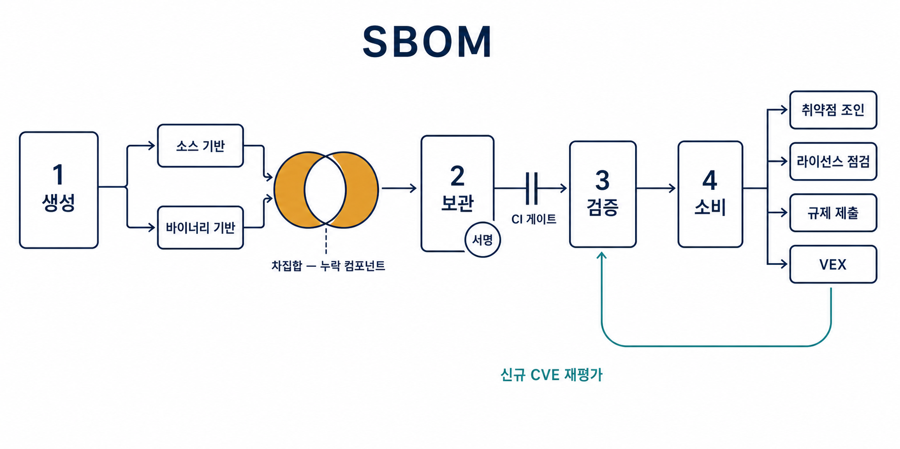

*[SBOM 생애주기 — 생성부터 소비까지]*

##### **1. 이미지 SBOM 생성**

Syft 또는 Trivy로 컨테이너 이미지에서 SBOM을 생성한다[^using-syft][^using-trivy-gh].

```bash
# Syft — SPDX JSON 출력
syft registry.example.com/myapp:1.4.0 -o spdx-json=sbom.spdx.json

# Trivy — CycloneDX 출력
trivy image --format cyclonedx --output sbom.cdx.json registry.example.com/myapp:1.4.0

# 소스 기반(before build) SBOM을 별도로 생성해 차이를 확인한다
syft dir:. -o spdx-json=sbom-source.spdx.json
```

##### **2. GitHub Actions 워크플로 예시**

```yaml
name: release-sbom
on:
  release:
    types: [published]
permissions:
  contents: write
jobs:
  sbom:
    runs-on: ubuntu-latest
    steps:
      - uses: actions/checkout@v4
      - name: Generate SBOM
        run: |
          syft "$IMAGE" -o spdx-json=sbom.spdx.json
        env:
          IMAGE: registry.example.com/myapp:${{ github.event.release.tag_name }}
      - name: Upload SBOM to Dependency-Track
        run: |
          curl -sS -X POST "$DT_URL/api/v1/bom" \
            -H "X-Api-Key: $DT_KEY" \
            -F "project=$DT_PROJECT" -F "bom=@sbom.spdx.json"
        env:
          DT_URL: ${{ vars.DT_URL }}
          DT_KEY: ${{ secrets.DT_API_KEY }}
          DT_PROJECT: ${{ vars.DT_PROJECT_UUID }}
      - name: Attach SBOM to release
        run: gh release upload "${{ github.event.release.tag_name }}" sbom.spdx.json
        env:
          GH_TOKEN: ${{ github.token }}
```

##### **3. 중앙 보관 — Dependency-Track**

생성한 SBOM은 릴리스 아티팩트로 첨부하는 것과 별개로 중앙 보관소에 적재한다. OWASP Dependency-Track은 SBOM을 수집해 취약점 데이터베이스와 대조하며 신규 CVE가 공개되면 기존 SBOM을 다시 평가한다. 업로드된 BOM을 CycloneDX 스키마와 대조해 위반 파일을 거부하는 검증은 v4.11.0(2024-05-07)에 들어갔고[^using-dtrack411], 5.0은 2026-06-09 GA되었다[^using-dtrack5]. 기존 파이프라인이 이 스키마 검증에서 깨질 수 있으므로, 4.11 이상으로 올리기 전에 생성한 SBOM이 스키마를 만족하는지 확인한다.

##### **4. 검수**

생성한 SBOM을 무엇으로 검수하는지는 [하위 공급망 보안 관리](#하위-공급망-보안-관리) 절의 검수 자동화 3종에서 다룬다. 사내 릴리스도 납품물과 같은 기준으로 통과시킨다.

여기에 더해 생성 도구의 한계를 알아 두어야 한다. Black Duck의 2026년 OSSRA 보고서는 감사 대상 상용 코드베이스에서 오픈소스SW 컴포넌트의 84%만 패키지 매니저·매니페스트 자동 탐지로 발견되었다고 보고한다[^using-ossra2026]. 나머지 16%는 스니펫 매칭·바이너리 분석·수동 검토가 필요했다. 매니페스트 기반 스캔만 쓰면 컴포넌트의 약 6분의 1이 SBOM에서 빠진다. 벤더 납품물과 오래된 레거시 모듈에는 릴리스마다 최소 1회 스니펫·바이너리 분석을 적용한다.

[^using-spdx-tools]: SPDX Community Tools : https://spdx.dev/spdx-tools/
[^using-syft]: anchore/syft — SBOM 생성 CLI : https://github.com/anchore/syft
[^using-trivy-gh]: aquasecurity/trivy : https://github.com/aquasecurity/trivy
[^using-dtrack5]: OWASP Dependency-Track 5.0 Is Now Generally Available (2026-06-09) : https://owasp.org/blog/2026/06/09/dependency-track-v5
[^using-dtrack411]: Dependency-Track v4.11.0 릴리스 노트, "Validate uploaded BOMs against CycloneDX schema" (PR #3522, 2024-05-07) : https://github.com/DependencyTrack/dependency-track/releases/tag/4.11.0
[^using-ossra2026]: 2026 Open Source Security and Risk Analysis (OSSRA) Report, Black Duck : https://www.blackduck.com/content/dam/black-duck/en-us/reports/rep-ossra.pdf

#### VEX로 오탐 줄이기 — SBOM만으로 안 되는 이유

SBOM은 '무엇이 들어 있는가'만 답하고, 그 취약점이 지금 악용 가능한가는 답하지 않는다. SBOM만 유통하면 받는 쪽이 대량의 오탐을 그대로 떠안는다. VEX<sub>Vulnerability Exploitability eXchange</sub>는 그 간극을 메우는 문서다. CISA 2026 SBOM 최소 요소도 별도 절에서 SBOM과 VEX·CSAF를 상관시킬 것을 권고한다[^using-cisa-sbom2026].

##### **OpenVEX 최소 문서**

필수 필드는 `@context`, `@id`, `author`, `timestamp`, `version`, `statements` 여섯 개이고, 상태값은 `not_affected`, `affected`, `fixed`, `under_investigation` 네 가지다[^using-openvex].

```json
{
  "@context": "https://openvex.dev/ns/v0.2.0",
  "@id": "https://example.com/vex/myapp-1.4.0-2026-08-01",
  "author": "Example Corp Product Security <psirt@example.com>",
  "timestamp": "2026-08-01T09:00:00+09:00",
  "version": 1,
  "statements": [
    {
      "vulnerability": { "name": "CVE-2026-12345" },
      "products": [
        { "@id": "pkg:oci/myapp@sha256:0123456789abcdef" }
      ],
      "status": "not_affected",
      "justification": "vulnerable_code_not_in_execute_path"
    }
  ]
}
```

`not_affected`를 쓰려면 `justification` 또는 `impact_statement`가 있어야 한다. `justification`의 허용값은 `component_not_present`, `vulnerable_code_not_present`, `vulnerable_code_not_in_execute_path`, `vulnerable_code_cannot_be_controlled_by_adversary`, `inline_mitigations_already_exist` 다섯 가지다. 판단 근거를 이 다섯 중 하나로 강제하는 것만으로 판단 품질이 올라간다. 오탐 판정을 스프레드시트의 자유 서술로 관리하고 있다면 그것을 VEX 문서로 옮기는 것이 첫 단계다.

##### **생성·소비 도구**

| 역할 | 도구 | 비고 |
|------|------|------|
| 생성 | vexctl | OpenSSF 프로젝트 |
| 소비 | Trivy `--vex` | 로컬 VEX 파일, VEX Repository, OCI 어테스테이션, SBOM 참조를 지원(실험적)[^using-trivy-vex] |
| 소비 | Dependency-Track | CycloneDX VEX/VDR 생성·소비[^using-dtrack5] |
| 미지원 | OSV-Scanner | VEX 문서를 소비하지 않는다. 억제는 `osv-scanner.toml`의 `[[IgnoredVulns]]` 항목으로만 가능해 저장소 로컬에 머문다[^using-osv-scanner] |

OSV-Scanner의 로컬 억제로는 판단을 조직 밖으로 전달할 수 없다. 원청에 오탐 판정을 전달해야 하는 상황이라면 처음부터 VEX로 발행해야 한다.

##### **수용 조건 계약 문구**

협력사가 제출한 VEX를 무조건 신뢰하지 않으려면 수용 조건을 계약에 적어 둔다.

```
수급인이 제출하는 VEX 문서는 다음 조건을 모두 충족하여야 한다.
1. 작성자(author) 항목에 책임 조직과 연락 창구를 명시하고, 문서에 디지털 서명을 첨부한다.
2. 상태값이 not_affected 인 항목은 justification 을 명세가 정한 허용값 중 하나로 기재한다.
   impact_statement 자유 서술만 있는 항목은 미제출로 본다.
3. VEX 는 대상 산출물의 SBOM 과 동일한 버전 식별자를 사용하고, 같은 버전별 URL 에서 함께 제공한다.
4. 하자보수 기간 중 상태가 변경되면 갱신본을 제출한다.
```

`impact_statement`만 있는 VEX는 자동 처리가 불가능하다는 점이 2번 조항의 근거다.

##### **안정성 경고**

OpenVEX 명세는 2023-07-18의 v0.2.0 이후 판번호가 오르지 않았고 OpenSSF sandbox 단계에 머물러 있다[^using-openvex]. '표준이 확정되어 안정적'이 아니라 '아직 표준화가 끝나지 않은 채 관행으로 쓰인다'가 정확한 서술이다. 따라서 VEX 저장 형식을 특정 도구에 종속시키지 말고 원본 JSON을 그대로 보존한다.

국내 SI 구조에서는 원청이 소비 측, 하청이 생성 측이 된다. 이 대응 관계에서 무엇을 계약에 담고 어떻게 검증하는지는 [하위 공급망 보안 관리](#하위-공급망-보안-관리)에서 이어서 다룬다.

[^using-openvex]: OpenVEX Specification (v0.2.0) : https://github.com/openvex/spec/blob/main/OPENVEX-SPEC.md
[^using-trivy-vex]: Trivy — VEX 문서로 취약점 필터링 : https://trivy.dev/latest/docs/supply-chain/vex/
[^using-osv-scanner]: google/osv-scanner releases : https://github.com/google/osv-scanner/releases


### 오픈소스SW 관리 도구 소개
오픈소스SW 사용에 따른 의무사항을 지키고 위험 요소를 확인하려면 SDLC(Software System Development Life Cycle) 전 과정에서 지속적으로 스캔하고 모니터링해야 한다. 이런 필요에서 **SCA(Software Composition Analysis)**라는 오픈소스SW 관리 도구가 등장했다. SCA는 보안과 라이선스 규정 준수를 자동으로 탐지하고 관리하는 프로세스를 제공한다.

#### 오픈소스SW 관리 도구를 선택하는 기준
Gartner의 [Technology Insight for Software Composition Analysis](https://www.gartner.com/en/documents/3971011/technology-insight-for-software-composition-analysis)[^using-gartner-3971011] 보고서는 SCA 도구 선택 기준을 다음과 같이 제시한다.
- [x] 충분한 취약점 데이터베이스가 마련되었는가?
- [x] IDE 및 Repository 연동, 코드 커밋 전 오픈소스SW 평가 기능 등 개발자 지원이 잘 되어 있는가?
- [x] 모든 라이선스를 추적하고 보고하는 기능이 있는가?
- [x] 라이선스 정책을 자동으로 설정할 수 있는가?
- [x] 취약점을 빠르게 감지하고 우선순위를 결정하는가?
- [x] 라이선스, 저작권, 버전 관리 등 관련 정보를 포함한 보고서 발급 기능이 있는가?

[^using-gartner-3971011]: Gartner, Technology Insight for Software Composition Analysis (2019) : https://www.gartner.com/en/documents/3971011/technology-insight-for-software-composition-analysis

#### 주요 오픈소스SW 관리 도구 소개

##### **FOSSology** - https://www.fossology.org


*[fossology]*

소스 코드 스캐닝 도구로 소스 파일 상단의 문구를 스캔하여 라이선스를 자동으로 확인한다. FOSSology의 자세한 설치 및 사용 방법은 공식 문서를 참고할 수 있다.  
https://www.fossology.org/get-started/

##### **SW360** - https://eclipse.dev/sw360


*[SW360]*

SW360은 소프트웨어에 포함된 구성요소를 관리하는 도구다. 오픈소스SW를 포함하는 제품을 개발하고 배포하는 기업이라면 제품과 릴리스 버전마다 사용한 오픈소스SW의 버전, 라이선스 등의 정보를 수집하고 추적해야 하며, SW360은 이를 통해 기업이 올바른 오픈소스SW 컴플라이언스 활동을 하도록 돕는다. 자세한 설치 및 사용 방법은 공식 문서를 참고할 수 있다.  
https://eclipse.dev/sw360/

##### **SPDX** - https://spdx.dev


*[SPDX]*

SPDX(Software Package Data Exchange)는 소프트웨어 정보를 표준화된 형식으로 교환할 수 있게 하는 표준과 도구를 제공한다.

##### **FOSSLight** - https://fosslight.org/


*[logo-fosslight]*

LG전자는 [FOSSLight 오픈소스SW Project](https://fosslight.org/)[^using-fosslight]로 FOSSLight Hub와 FOSSLight Scanner를 공개했다. **FOSSLight Hub**는 오픈소스SW와 라이선스, 보안취약점을 함께 관리해 오픈소스SW 사용 시 컴플라이언스를 지키고 보안취약점으로부터 안전하게 사용하도록 돕는다. 또한 프로젝트별 BOM 관리, 라이선스 의무사항 및 보안취약점 조회 기능을 제공해 OSC(Open Source Compliance) 프로세스를 수행하도록 지원한다. **FOSSLight Scanner**는 Dependency, 소스 코드, 바이너리로부터 오픈소스SW 정보를 스캔하는 도구다.  
* [FOSSLight 사용자 문서](https://fosslight.org/fosslight-guide/)[^using-fosslight-doc]

FOSSLight는 Apache-2.0으로 공개되어 있으며 2026년에도 릴리스가 이어지고 있다. fosslight-scanner의 최신 판번호는 2.1.26(2026-07-09)이다[^using-fosslight-release].

[^using-fosslight]: FOSSLight : https://fosslight.org/
[^using-fosslight-doc]: FOSSLight 사용자 문서 : https://fosslight.org/fosslight-guide/
[^using-fosslight-release]: fosslight-scanner 릴리스 : https://github.com/fosslight/fosslight_scanner/releases

##### **OLIVE Platform** - https://olive.kakao.com


*[logo-olive]*

Kakao는 자사의 여러 프로젝트에서 오픈소스SW 관리에 쓰던 시스템을 누구나 쓸 수 있도록 [OLIVE Platform](https://olive.kakao.com)[^using-olive]이라는 이름으로 무료 공개했다. **OLIVE Platform**은 프로젝트를 실시간으로 스캔해 사용한 오픈소스SW 컴포넌트를 조회하고, 오픈소스SW의 라이선스 의무사항과 이슈를 확인해 고지 의무를 지킬 수 있도록 돕는 오픈소스SW 관리 서비스다. 쉽고 빠르고 정확한 오픈소스SW 검증을 목표로 직관적인 기능과 UI를 갖췄으며, 소셜 로그인으로 프로젝트를 관리하고 라이선스 의무사항을 확인하며 고지문을 다운로드할 수 있다. 체험하기를 이용하면 로그인 없이도 간단하게 Dependency와 라이선스를 확인할 수 있다.

또한, 보안상 웹 서비스 사용이 어렵거나, 소스코드 노출이 우려되는 경우 안심하고 사용할 수 있도록 [OLIVE CLI](https://github.com/kakao/olive-cli)를 제공한다. **OLIVE CLI**는 사용자 PC에서 OLIVE Platform 기능을 수행할 수 있으며, 보안이 엄격한 금융권에서도 사용되고 있다.
* [OLIVE 사용자 문서](https://olive.kakao.com/docs/)[^using-olive-doc]
* [OLIVE CLI 사용자 문서](https://olive.kakao.com/docs/cli/)[^using-olive-cli-doc]

[^using-olive]: Kakao, OLIVE Platform : https://olive.kakao.com
[^using-olive-doc]: OLIVE 사용자 문서 : https://olive.kakao.com/docs/
[^using-olive-cli-doc]: OLIVE CLI 사용자 문서 : https://olive.kakao.com/docs/cli/

##### **Fossa** - https://fossa.com


*[logo-fossa]*

풍부한 오픈소스SW 메타데이터와 정책 거버넌스 엔진(Deny·Flag·Approve)을 제공하는 상용 SCA 서비스다. CI/CD 통합 등 DevOps 환경을 지원하며 개발자 친화적 기능들로 구성되어 있다. SBOM 포털과 SPDX·CycloneDX 생성 기능을 갖췄고, AI 코딩 도구가 생성한 코드의 라이선스 혼입 리스크를 탐지하는 Snippet Scanning 기능을 제공한다. 무료 티어를 제공하며 규모별 유료 플랜을 둔다.

##### **FossID** - https://fossid.com/


*[logo-fossid]*

2016년 스웨덴에서 설립된 FossID는 오픈소스SW 라이선스 및 보안 취약점 관리를 위한 솔루션이다. 소스 코드 내 오픈소스SW 컴포넌트를 탐지하고, 각 컴포넌트의 라이선스 및 보안 취약점을 식별한다. 스니펫 단위 매칭으로 코드 조각 수준의 유입을 찾아내고 대규모 코드 감사를 지원하는 것이 특징이다. 소유권 이력이 있다. 2021년 5월 Snyk에 인수되었다가 2022년 원 창업자들이 재인수해 현재는 독립 회사로 운영된다[^using-fossid-reacquire].

[^using-fossid-reacquire]: FossID is Reacquired from Snyk by Original Founders : https://fossid.com/news/fossid-reacquired-from-snyk-by-original-founders/

##### **Black Duck** - https://www.blackduck.com/


*[logo-blackduck]*

Black Duck은 오픈소스SW를 사용하는 동안 발생하는 라이선스와 취약점, 소스 코드 품질 관리를 위한 포괄적인 솔루션이다. 전반적인 소프트웨어의 공급망과 애플리케이션 라이프사이클 전반에 거쳐 오픈소스SW의 라이선스와 보안을 관리한다. 정확도를 높이고 오탐을 줄이기 위해 오픈소스SW 검색에 다각적 접근 방식을 취하여 신뢰성 있는 BOM을 생성한다. 2017년 Synopsys에 인수되어 Synopsys Software Integrity Group으로 운영되다가, 2024-10-01 Clearlake Capital과 Francisco Partners가 이 사업부를 인수해 독립 법인 Black Duck Software, Inc.로 재출범했다[^using-blackduck-spinoff].

[^using-blackduck-spinoff]: Clearlake and Francisco Partners Complete Acquisition of Black Duck Software : https://www.prnewswire.com/news-releases/clearlake-and-francisco-partners-complete-acquisition-of-black-duck-software-formerly-known-as-synopsys-software-integrity-group-302264926.html


##### **Snyk** - https://snyk.io


*[logo-snyk]*

오픈소스SW 취약점 관리를 위한 서비스를 제공하다가 2020년부터 라이선스 준수 관리 기능이 추가되었다. 개발자 워크플로에 직접 붙는 통합(IDE·저장소·CI), 도달 가능성 기반 취약점 우선순위, IaC와 컨테이너 이미지 스캔을 제공하며 전담 보안 연구팀이 취약점 데이터를 검토한다. 무료 티어를 제공하며 규모별 유료 플랜을 둔다.

##### **Mend (구 WhiteSource)** - https://www.mend.io


*[logo-whitesource]*

2011년 WhiteSource로 설립되어 라이선스 준수 및 취약점 관리 서비스를 제공했고, 2022-05-25 Mend로 리브랜딩했다[^using-mend-rebrand]. SCA에 정적 분석(SAST)을 더해 애플리케이션 보안 플랫폼으로 확장했다. 컨테이너와 서버리스를 포함한 다양한 실행 환경을 지원하며 Microsoft Azure DevOps 서비스로도 제공된다. 무료 티어를 제공하며 규모별 유료 플랜을 둔다.

[^using-mend-rebrand]: Whitesource Is Now Mend: You Code, We Cure : https://www.mend.io/blog/whitesource-is-now-mend/

##### **CodeEye** - https://www.olis.or.kr/codeEye/introduction.do


*[logo-codeeye]*

CodeEye는 오픈소스SW 라이선스를 비교·분석·검사하는 수작업(Eye Checking)을 지원하는 시스템으로, 오픈소스SW 사용 시 준수해야 할 라이선스(GNU GPL 등) 내용을 효과적으로 검사해 보여준다. 한국저작권위원회가 구축한 오픈소스SW DB(지속 갱신)를 기반으로 검사한다.


##### **Clarity** - https://insignary.com/


*[logo-insignary]*

Clarity는 바이너리 코드 분석을 통한 오픈소스SW 관리 솔루션으로, 바이너리 코드를 스캐닝해 소프트웨어에 존재하는 오픈소스SW 컴포넌트를 식별하고 해당 컴포넌트의 라이선스 및 보안 취약점 정보를 제공한다. 기업은 바이너리 코드를 점검해 라이선스 위반으로 인한 법적 이슈와 보안 취약점을 사전에 확인하고, 외부에서 공급되는 소프트웨어를 안전하게 활용할 수 있다. 매니페스트 기반 스캔이 놓치는 구간을 메우는 용도로 납품물 검수에 쓸 수 있다.

##### **LABRADOR** - https://www.labradorlabs.ai/


*[logo-labrador]*

LABRADOR는 R&D 및 공급망에서 오픈소스SW 취약점과 라이선스 이슈를 분석하고 수정하기 위해 제작되었다. 운영사 IoTcube, Inc.는 2022-08-30 Labrador Labs, Inc.로 사명을 변경했다[^using-labrador-rename]. 단순히 취약점을 나열하는 데 그치지 않고 수정 방안까지 다양하게 제시한다. 이를 통해 기업은 취약한 구성 요소를 식별하고 수정할 뿐 아니라, 문제가 될 수 있는 라이선스에도 미리 대응할 수 있다. 함수 단위 소스 취약점 분석으로 더 빠르고 정확한 진단이 가능하다.

[^using-labrador-rename]: Labrador Labs, IOTCUBE new company name: LABRADOR LABS : https://labradorlabs.ai/news/4-billion-won-raise-for-the-security-company-iotcube-series-a/

##### **ClearlyDefined** - https://clearlydefined.io


*[ClearyDefined]*

ClearlyDefined는 오픈소스SW 데이터베이스를 제공해 사용자가 컴포넌트의 출처, 라이선스 등의 정보를 확인할 수 있다. 정보에 오류가 있으면 사용자가 직접 데이터를 개선할 수 있어 커뮤니티 기반의 신뢰성 있는 데이터베이스로 발전한다. OSI와 AboutCode가 양해각서를 체결해 일상 운영은 ScanCode Toolkit을 함께 운영하는 AboutCode로 이관되었다[^using-clearlydefined-aboutcode].

[^using-clearlydefined-aboutcode]: Open Source Initiative, ClearlyDefined — A Three-Year Roadmap for Sustainability and Growth : https://opensource.org/blog/clearlydefined-a-three-year-roadmap-for-sustainability-and-growth


### 오픈소스SW 고지 의무사항
오픈소스SW 라이선스는 공통으로 저작권 고지와 라이선스 사본 첨부 의무가 있다. 따라서 오픈소스SW를 사용했다면 해당 오픈소스SW의 저작권과 라이선스 사본을 고지해 의무사항을 지켜야 한다. 여기서는 고지문과 관련된 내용을 살펴본다.

#### 고지 항목

##### 저작권 고지

소스 코드의 저작권 고지는 보통 "copyright"라는 단어에 연도와 저작권자 또는 회사명을 붙인 문자열로 이루어진다. 이 고지는 저작물에 저작권이 있음을 잠재적 사용자에게 알리고 저작권 소유자를 식별하는 역할을 한다. 오픈소스SW에 따라 저작권자뿐 아니라 특허권자, 기여자를 함께 표시하기도 한다. 연도는 보통 최초 게시 연도를 뜻하며, 저작권 보호 기간을 판단하는 근거가 되기도 한다.    

```
Copyright (C) year1, year2, year3 저작권 보유자
```

##### 라이선스 고지 (사본 첨부)

많은 오픈소스SW 라이선스는 사용한 오픈소스SW의 라이선스를 명시하고 사본을 첨부하도록 요구한다. 이는 오픈소스SW 사용자가 자신의 권리를 제대로 이해하도록 하기 위해서다.


> **Apache License (예)**
>
>
> 1. You must give any other recipients of the Work or Derivative Works a copy of this License.
>
>    저작물이나 파생 저작물을 양도받는 모든 사람에게 본 라이선스의 사본을 제공해야 한다.
>


##### 수정 내용 고지

Apache 2.0, MPL, GPL 2.0, GPL 3.0 등의 라이선스는 소스 코드를 수정하면 수정 내용을 고지하도록 요구한다. 수정한 사람과 수정 일자 등을 함께 표시해 원본과 구별되도록 해야 한다.  

> **Apache License (예)**
>
>
> 2. You must cause any modified files to carry prominent notices stating that You changed the files.
>
>    수정된 파일에 대해서는 수정을 했다는 사실을 설명하는 명확한 안내문구를 첨부해야 한다.
>


#### 고지 방법
오픈소스SW 고지 의무는 라이선스마다 방법이 세부적으로 정해져 있기도 하다. 대표적으로 Apache 2.0은 LICENSE 파일과 NOTICE 파일을 두고 라이선스 및 저작권 고지 등을 포함하도록 안내한다.

##### Apache Royale 프로젝트[^using-royale]의 예

[^using-royale]: Apache Royale 프로젝트https://infra.apache.org/licensing-howto.html

~~~
Apache Royale  
Copyright 2020 The Apache Software Foundation  

This product includes software developed at  
The Apache Software Foundation (http://www.apache.org/).  

The Initial Developer of some parts of the framework, which are copied from, derived from, or  
inspired by Adobe Flex (via Apache Flex), is Adobe Systems Incorporated (http://www.adobe.com/).  
Copyright 2003 - 2012 Adobe Systems Incorporated. All Rights Reserved.  

The Initial Developer of the examples/mxroyale/tourdeflexmodules,  
is Adobe Systems Incorporated (http://www.adobe.com/).  
Copyright 2009 - 2013 Adobe Systems Incorporated. All Rights Reserved.  
 
The ping sound effect (ping.mp3) in  
examples/mxroyale/tourdeflexmodules/src/mx/effects/assets  
was created by CameronMusic. (http://www.freesound.org/people/cameronmusic/sounds/138420/)  
~~~


##### Apache Hive 프로젝트[^using-hive]의 예    

[^using-hive]: Apache Hive 프로젝트 : https://github.com/apache/hive

###### 1. NOTICE
~~~
Apache Hive  
Copyright 2008-2018 The Apache Software Foundation  
  
This product includes software developed by The Apache Software  
Foundation (http://www.apache.org/).  
  
This project includes software licensed under the JSON license.  
~~~

###### 2. LICENSE : Pointer 방식으로 고지  
~~~
For the SQLLine package:  

Copyright (c) 2002, 2003, 2004, 2005 Marc Prud'hommeaux  
From: http://sqlline.sourceforge.net/#license  
"SQLLine is distributed under the BSD License, meaning that you are free to redistribute, modify, or sell the software with almost no restrictions."  

Statement from Marc Prud'hommeaux regarding inconsistent licenses in some SQLLine source files:  

SQLLine was once GPL, but it was changed to be BSD a few years back.  
Any references to the GPL are vestigial. Hopefully the license  
declaration at http://sqlline.sourceforge.net/#license is sufficiently  
authoritative in this regard.  
~~~

###### 3. /binary-package-licenses/ : 바이너리 파일에 포함된 오픈소스SW 라이선스와 저작권 고지


##### 카카오톡[^using-kakaotalk]의 예

[^using-kakaotalk]: 카카오톡 : https://www.kakaocorp.com/service/KakaoTalk


*[kakaoNotice]*


##### LG전자[^using-lge]의 예

[^using-lge]: LG전자 : https://opensource.lge.com


*[lgNotice]*

### 오픈소스SW의 보안 취약점


#### 오픈소스SW 보안 현황

오픈소스SW는 현대 소프트웨어 개발의 근간이 되었고, 그만큼 공격면도 함께 커졌다. 아래 수치는 규모와 위협의 증가 속도를 보여주는 배경 자료다.

| 항목 | 수치 | 출처와 기준 |
|------|------|-------------|
| 4대 레지스트리 연간 다운로드 | 2025년 9.8조 건, 전년 대비 67% 증가 | Sonatype, 2026-01-28 발표(2025년 데이터)[^using-sonatype2026] |
| 신규 악성 패키지 | 2025년 454,600건 이상 | 위와 같음 |
| 누적 차단 악성 패키지 | 1,233,000건 이상, 전년 대비 75% 증가 | 위와 같음 |
| 오픈소스SW를 포함한 코드베이스 비율 | 98% | Black Duck 2026 OSSRA, 2024-11~2025-10 감사한 947개 상용 코드베이스[^using-ossra2026] |
| 애플리케이션당 평균 오픈소스SW 컴포넌트 수 | 1,180개 | 위와 같음 |
| 취약점을 1건 이상 포함한 코드베이스 비율 | 87% | 위와 같음 |

Sonatype이 참고 지표로 함께 제시한 이전 판의 다운로드 수치는 2024년 6.6조 건이다[^using-sonatype2024]. 두 수치는 발표 시점의 표기를 그대로 옮긴 것이며, 발표사가 산출 방식을 공개하지 않았으므로 두 값을 직접 나누어 증가율을 계산하지 않는다. 보고서 명칭은 발간 연도를 따르고 데이터는 직전 연도를 담는다는 점도 인용 시 유의한다.

행동에 직접 연결되는 수치는 다음 세 가지다.

- 악성 패키지의 99% 이상이 npm에 집중되어 있다[^using-sonatype2026]. Node.js 생태계를 쓰는 조직은 레지스트리 통제의 우선순위가 다르다.
- CVE가 있는데도 수명이 끝나 패치가 불가능한 패키지 버전이 최소 81,000개 확인되었다[^using-sonatype2026]. 대응은 패치가 아니라 교체다.
- Log4Shell은 2025년에도 4,200만 회 다운로드되었다[^using-sonatype2026]. 알려진 취약점이 사라지는 데는 공개 이후에도 수년이 걸린다.

주요 취약점 유형과 공격 벡터는 OWASP의 [오픈소스SW 소프트웨어 Top 10 리스크](https://owasp.org/www-project-open-source-software-top-10/)[^using-owasp2024]가 정리하고 있다.

- **알려진 취약점**: CVE, GitHub Security Advisories 등을 통해 공개된 취약점으로, 패치가 제공되지 않거나 적용되지 않은 경우 위험하다.
- **정당한 패키지의 손상**: 공격자가 기존의 정당한 프로젝트나 배포 인프라를 손상시켜 악성 코드를 주입하는 경우이다.
- **이름 혼동 공격**: 타이포스쿼팅, 브랜드재킹 등의 방법으로 정당한 패키지와 유사한 이름의 악성 패키지를 배포하는 공격이다.
- **유지보수되지 않는 소프트웨어**: 더 이상 적극적으로 개발되지 않는 컴포넌트나 버전을 사용하는 경우 보안 패치가 제공되지 않는다.
- **오래된 소프트웨어**: 새로운 버전이 존재함에도 오래된 버전을 계속 사용하는 경우이다.

여기까지의 통계는 배경으로만 쓴다. 사내 의사결정의 근거로는 자사 SBOM에서 추출한 수치, 곧 총 컴포넌트 수, 수명이 끝난 컴포넌트 수, KEV 해당 건수를 쓴다.

[^using-sonatype2026]: Sonatype, Sonatype Research Reveals Open Source Malware Grows 75% as Yearly Open Source Downloads Surpass 9.8 Trillion (2026-01-28 발표, 2025년 데이터) : https://www.sonatype.com/press-releases/sonatype-research-reveals-open-malware-grows-75-percent
[^using-sonatype2024]: Sonatype, 2024 State of the Software Supply Chain Report : https://www.sonatype.com/state-of-the-software-supply-chain/2024/scale
[^using-owasp2024]: OWASP Top 10 Risks for Open Source Software : https://owasp.org/www-project-open-source-software-top-10/

#### 주요 오픈소스SW 보안 사고 사례 분석

사고 사례는 유형별로 읽어야 한다. 사건의 이름이 아니라 침해 경로가 반복되기 때문이다. 아래 여덟 유형은 '무슨 일이 있었나 → 근본 원인 → 우리 조직이 이 유형을 막는 통제' 순으로 정리했다.

##### 1. 유지관리자 신뢰 악용 — XZ Utils (2024-03, CVE-2024-3094)

공격자가 약 2년에 걸쳐 XZ Utils에 기여하며 신뢰를 쌓아 공동 유지관리자 권한을 얻은 뒤, 소스 저장소가 아니라 릴리스 tarball에만 존재하는 빌드 스크립트와 테스트 픽스처 형태로 백도어를 삽입했다[^using-cve-2024-3094]. 여러 계정이 원 유지관리자에게 릴리스가 느리다는 압박을 가한 정황도 보고되었다[^using-openssf-takeover]. xz 5.6.0과 5.6.1을 포함한 배포판에서 sshd 인증 우회가 가능했고, 안정 배포판에 도달하기 직전 발견되어 대규모 실피해는 회피되었다.

근본 원인은 두 가지다. 사실상 1인 유지관리 프로젝트가 광범위한 배포판의 핵심 경로에 있었다는 구조적 리스크, 그리고 소스 저장소와 배포 tarball의 내용이 달랐다는 점이다. 소스만 리뷰해서는 발견할 수 없었다.

통제는 다음 네 가지다.

- 자사 제품의 필수 경로에 있는 오픈소스SW 중 유지관리자가 1~2명인 프로젝트를 식별해 목록화한다. OpenSSF Scorecard의 Maintained 체크와 기여자 수가 판단 자료가 된다.
- 그 목록에 대해 후원·기여·인력 배정 중 하나를 선택해 실행한다. 목록만 만들고 아무것도 하지 않으면 리스크는 그대로다.
- 배포 tarball이 아니라 VCS 태그에서 빌드하는 것을 원칙으로 하고, tarball을 써야 하면 소스와의 차이를 검증한다.
- 상류 프로젝트의 유지관리자 변경 이벤트를 모니터링한다.

[^using-cve-2024-3094]: CVE-2024-3094 — NVD : https://nvd.nist.gov/vuln/detail/CVE-2024-3094
[^using-openssf-takeover]: OpenSSF and OpenJS Foundations Issue Alert for Social Engineering Takeovers of Open Source Projects : https://openssf.org/blog/2024/04/15/open-source-security-openssf-and-openjs-foundations-issue-alert-for-social-engineering-takeovers-of-open-source-projects/

##### 2. 빌드 시스템 침해 — TanStack npm 침해 (2026-05)

2026-05-11 공격자가 42개 `@tanstack/*` 패키지의 84개 악성 버전을 6분 만에 게시했다[^using-tanstack-postmortem]. 경로는 세 단계였다. 첫째, `bundle-size.yml` 워크플로가 `pull_request_target`으로 포크 PR의 코드를 실행해 최초 기여자 승인 게이트를 우회했다. 둘째, 공격자가 난독화된 스크립트를 PR head에 강제 푸시하자 `actions/cache`의 post-job save가 오염된 pnpm 스토어를 base 저장소 캐시 키로 저장했다. 셋째, 릴리스 워크플로가 그 캐시를 복원해 빌드하는 동안 공격자 바이너리가 러너 프로세스 메모리에서 OIDC 토큰을 추출해 레지스트리에 직접 게시했다. 게시부터 tarball 삭제 완료까지 약 4시간 35분이 걸렸고, 페이로드는 클라우드 메타데이터 서비스·Kubernetes 토큰·`~/.npmrc`·SSH 키를 수집해 반출했다.

근본 원인은 세 취약점이 각각 상대가 지킨다고 가정한 신뢰 경계를 하나씩 넘었다는 데 있다. 포크 PR 코드가 base 저장소 캐시에 접근했고, 그 캐시가 릴리스 워크플로까지 지속되었으며, 릴리스 워크플로가 배포 가능한 OIDC 토큰을 들고 있었다. 어느 하나만으로는 성립하지 않았다.

통제는 뒤의 'CI/CD 자체가 공격면이다' 절에서 여덟 항목의 체크리스트로 정리한다. 2020년 SolarWinds Orion 침해는 빌드 프로세스 침투가 공급망 공격이라는 개념을 널리 알린 사건이지만, 상용 제품 사건이고 이후 프로비넌스·서명 검증 수단이 모두 새로 생겨 오늘의 통제를 도출하기에는 적합하지 않다.

[^using-tanstack-postmortem]: TanStack, Postmortem: TanStack npm supply-chain compromise : https://tanstack.com/blog/npm-supply-chain-compromise-postmortem

##### 3. 계정 탈취 — axios 침해 (2026-03-31)

axios 대표 유지관리자를 겨냥한 소셜 엔지니어링 캠페인이 침해 약 2주 전에 있었고, 그 결과 원격 접근 트로이목마에 기기가 감염되면서 npm 자격증명이 탈취되었다. 공격자는 백도어가 심긴 axios@1.14.1과 axios@0.30.4를 수동으로 게시했고 두 버전 모두 악성 의존성이 주입되어 있었다. 게시부터 삭제까지 약 3시간이 걸렸다[^using-axios-postmortem].

근본 원인은 코드 저장소나 CI가 아니라 사람과 기기였다. 유지관리자 개인 기기의 침해가 곧 장수명 배포 자격증명의 탈취로 이어졌다.

통제는 다음 다섯 가지다.

- 의존성 버전을 lockfile로 고정하고 `npm ci`를 쓰며, 릴리스 브랜치에서 신규 버전 자동 승격을 금지한다.
- 신규 버전이 게시되고 일정 시간(예: 24~72시간)이 지난 뒤에만 사내 미러로 승격하는 유예 정책을 둔다. 이번 사고는 3시간 내에 삭제되었으므로 유예만으로 회피된다.
- `npm audit signatures`로 프로비넌스 검증을 강제한다. 수동으로 게시된 버전은 프로비넌스가 없어 검증에서 걸린다.
- 사내 유지관리자 계정은 OIDC Trusted Publishing으로 전환해 개인 기기에 배포 자격증명 자체를 두지 않는다.
- 개발자 기기에 EDR과 피싱 저항 다중 인증(WebAuthn)을 의무화한다.

[^using-axios-postmortem]: axios/axios, Post Mortem: axios npm supply chain compromise (issue #10636) : https://github.com/axios/axios/issues/10636

##### 4. CI 액션 침해 — tj-actions/changed-files (2025-03, CVE-2025-30066)

2025-03-14~15 널리 쓰이는 GitHub Action인 tj-actions/changed-files의 여러 버전 태그가 악성 커밋을 가리키도록 소급 이동되었다. 악성 코드는 러너 프로세스 메모리에서 시크릿을 추출해 워크플로 로그에 출력했고, 공개 저장소는 로그가 공개이므로 시크릿이 그대로 노출되었다. 사용 저장소는 23,000개 이상이었고 액세스 키·GitHub PAT·npm 토큰·개인 RSA 키가 유출 대상이었다[^using-cisa-tjactions].

근본 원인은 태그가 불변이 아니라 이동 가능한 참조라는 Git의 성질을 신뢰 지점으로 삼은 것, 그리고 액션 유지관리 봇 계정의 장수명 토큰이다.

통제는 서드파티 액션을 40자 커밋 SHA로 고정하고, Dependabot으로 그 SHA를 갱신 관리하며, 워크플로에 최소 권한을 명시하고 시크릿이 필요 없는 잡에는 시크릿을 주입하지 않는 것이다. 사고 시에는 노출 가능한 모든 자격증명을 회전한다.

[^using-cisa-tjactions]: CISA, Supply Chain Compromise of Third-Party tj-actions/changed-files (CVE-2025-30066) and reviewdog/action-setup@v1 (CVE-2025-30154) : https://www.cisa.gov/news-events/alerts/2025/03/18/supply-chain-compromise-third-party-tj-actionschanged-files-cve-2025-30066-and-reviewdogaction

##### 5. 자가 전파 웜 — Shai-Hulud 1차·2차와 파생

2025년 9월 npm 생태계에서 자가 복제 웜 Shai-Hulud가 확산했다. 유지관리자 자격증명 탈취로 초기 접근한 뒤, 악성코드가 환경을 스캔해 GitHub PAT와 클라우드 API 키를 수집하고, 탈취한 npm 토큰으로 그 개발자의 다른 패키지에 코드를 주입해 게시하는 과정을 자동화했다[^using-cisa-npm-worm]. 1차(2025-09-14~18)의 감염 규모는 자료마다 200개 이상에서 500개 이상 패키지로 엇갈리게 보고된다. 2차(2025-11-24~)는 약 350개 계정에 걸쳐 25,000개 이상의 악성 저장소가 생성될 만큼 확산 폭이 컸다[^using-shaihulud2]. 2026년 6월에는 공개된 파생 도구킷 Miasma가 Red Hat의 `@redhat-cloud-services` 네임스페이스 32개 패키지 침해에 재사용되었다[^using-rhsb2026006].

근본 원인은 레지스트리 토큰이 장수명이고 범위가 넓어 하나의 탈취가 유지관리자의 전체 패키지 권한으로 이어진다는 점, install 라이프사이클 스크립트가 기본 실행되어 설치만으로 코드가 돌아간다는 점, 개발자 워크스테이션과 CI가 클라우드 자격증명을 평문으로 보유한다는 점이다.

통제는 다음 세 가지다.

- CI 컨테이너와 개발자 기기에서 클라우드 장수명 키를 제거하고 단기 OIDC 자격증명으로 전환한다. 웜의 수익 모델이 바로 이 키다.
- `npm ci --ignore-scripts`를 기본으로 하고 스크립트가 필요한 패키지만 허용 목록으로 관리한다. 이 설정을 표준 `.npmrc`로 배포한다.
- 사고 대응 플레이북에 '레지스트리 웜' 시나리오를 추가하고 자격증명 일괄 회전에 걸리는 시간을 미리 측정해 둔다.

[^using-cisa-npm-worm]: CISA, Widespread Supply Chain Compromise Impacting npm Ecosystem (2025-09-23) : https://www.cisa.gov/news-events/alerts/2025/09/23/widespread-supply-chain-compromise-impacting-npm-ecosystem
[^using-shaihulud2]: Microsoft Security Blog, Shai-Hulud 2.0: Guidance for detecting, investigating, and defending : https://www.microsoft.com/en-us/security/blog/2025/12/09/shai-hulud-2-0-guidance-for-detecting-investigating-and-defending-against-the-supply-chain-attack/
[^using-rhsb2026006]: Red Hat, RHSB-2026-006 Supply chain compromise of @redhat-cloud-services npm packages : https://access.redhat.com/security/vulnerabilities/RHSB-2026-006

##### 6. 개발도구 침해 — Red Hat npm 패키지 침해 (2026-06)

개발자가 설치한 악성 VS Code 확장으로 GitHub 계정이 탈취되었고, 2026-05-29 Red Hat GitHub 조직의 저장소에 악성 코드가 주입되어 `@redhat-cloud-services` 네임스페이스 32개 패키지가 침해되었다. 해당 패키지는 개발 전용 프론트엔드 라이브러리였고 침해 기간 중 릴리스가 없었으며 배포 프로세스가 install 스크립트를 제거하는 설계였기 때문에 운영 환경까지 도달하지 않았다[^using-rhsb2026006].

근본 원인은 에디터 확장이 개발자 계정 권한 전체에 접근할 수 있는 신뢰 지점이라는 점이다. 패키지 레지스트리와 CI만 방어하고 IDE 확장 생태계는 통제하지 않은 공백이 경로가 되었다. 사내 오픈소스SW 사용 정책이 라이브러리만 다루고 에디터 확장을 다루지 않는다면 같은 공백이 그대로 있는 것이다. 확장 허용 목록, 설치 승인 절차, 확장 업데이트 모니터링을 보안 정책 문서에 신설한다. 피해를 줄인 요인이 '배포 파이프라인이 install 스크립트를 제거하는 설계'였다는 점도 그대로 가져올 만한 통제다.

##### 7. 이름 혼동 — 타이포스쿼팅과 조직 스코프 사칭

2026-07-07 npm 13개와 PyPI 4개의 악성 패키지가 PaySafe·Skrill·Neteller 결제 SDK를 사칭했다. 발동 조건은 레지스트리마다 다르다. npm 쪽은 개발자가 API 키를 설정하고 해당 메서드를 호출해야 자격 증명이 외부로 나가고, PyPI 쪽만 별도 호출 없이 동작하되 그 시점도 설치가 아니라 import 다[^using-socket-typosquat]. 정상 SDK의 인터페이스를 그대로 모방하기 때문에, 개발자가 평소 쓰던 방식으로 호출하는 순간 발동한다. 2026-05-28~29에는 세 개의 npm 계정이 9개 조직 스코프를 사칭한 45개 악성 패키지를 게시했다. 버전을 100.100.100처럼 비정상적으로 높게 매겨, 사내 레지스트리와 공개 레지스트리를 함께 조회하는 설정에서 공개 쪽 패키지가 선택되도록 설계했다[^using-ms-depconfusion].

근본 원인은 레지스트리가 이름 등록을 사전 심사하지 않는 구조와, 사내 패키지 이름이 구인 공고·공개 저장소·Docker 레이어 메타데이터 등으로 외부에 새어 나간다는 점이다. 발동에 개발자의 호출이 필요하다는 점은 위안이 되지 않는다. 이름이 정상 SDK와 구분되지 않으면 호출은 어차피 일어난다.

통제 네 가지를 신규 프로젝트 생성 템플릿에 넣는다.

- `.npmrc`에 스코프별 레지스트리를 고정한다(`@회사명:registry=https://사내레지스트리`). 이것 하나로 의존성 혼동 대부분이 차단된다.
- 사내 스코프명을 공개 레지스트리에 선점 등록해 둔다.
- 사내 프록시에서 게시된 지 일정 기간이 지나지 않은 패키지를 차단한다.
- `--ignore-scripts`를 기본값으로 하고 예외를 허용 목록으로 관리한다. 이 캠페인의 발동 경로는 설치 스크립트가 아니었지만, 설치 시 자동 실행은 다른 사례에서 반복되는 경로이므로 함께 막아 둔다.

[^using-socket-typosquat]: Socket, Coordinated npm and PyPI Campaign Typosquats Popular Secure Payment Apps : https://socket.dev/blog/npm-pypi-campaign-typosquats-popular-secure-payment-apps
[^using-ms-depconfusion]: Microsoft Security Blog, Malicious npm packages abuse dependency confusion to profile developer environments (2026-05-29) : https://www.microsoft.com/en-us/security/blog/2026/05/29/33-malicious-npm-packages-abuse-dependency-confusion-profile-developer-environments/

##### 8. 알려진 취약점 미패치 — Log4Shell (2021-12, CVE-2021-44228)

2021년 12월 Apache Log4j 라이브러리에서 발견된 Log4Shell 취약점은 원격 코드 실행을 가능하게 해 수많은 Java 기반 애플리케이션과 서비스에 영향을 주었다[^using-infosecurity2024]. 이 사례가 지금도 유효한 이유는 취약점 자체가 아니라 그 뒤에 있다. Log4Shell은 공개 4년 뒤인 2025년에도 4,200만 회 다운로드되었다[^using-sonatype2026].

근본 원인은 어떤 제품의 어느 버전에 그 컴포넌트가 들어 있는지 즉시 답할 수 없었다는 것이다. 통제는 SBOM을 상시 보유하고 신규 CVE 공개 시 SBOM과 조인해 영향 범위를 자동 산출하는 체계다.

[^using-infosecurity2024]: Infosecurity Magazine, Log4j Vulnerability: 12 Months On : https://www.infosecurity-magazine.com/news-features/log4j-vulnerability-12-months-on/

##### 유형별 통제 요약

| 유형 | 대표 사례 | 핵심 통제 |
|------|-----------|-----------|
| 유지관리자 신뢰 악용 | XZ Utils (2024-03) | 단일 유지관리자 프로젝트 목록화와 후원·기여·대체 결정 |
| 빌드 시스템 침해 | TanStack (2026-05) | `pull_request_target` 제거, 캐시 키 분리, 빌드·배포 잡 분리 |
| 계정 탈취 | axios (2026-03) | lockfile 고정, 신규 버전 유예, 프로비넌스 검증, OIDC 배포 |
| CI 액션 침해 | tj-actions (2025-03) | 액션 커밋 SHA 고정, 최소 권한, 시크릿 미주입 |
| 자가 전파 웜 | Shai-Hulud (2025-09~) | 장수명 클라우드 키 제거, `--ignore-scripts` 기본화 |
| 개발도구 침해 | Red Hat (2026-06) | IDE 확장 허용 목록과 설치 승인 |
| 이름 혼동 | 결제 SDK 사칭 (2026-07) | 스코프별 레지스트리 고정, 사내 스코프 선점 등록 |
| 알려진 취약점 미패치 | Log4Shell (2021-12) | SBOM 상시 보유와 CVE 조인 자동화 |

오픈소스SW 보안과 관련된 규제·정책 동향은 앞의 [SBOM 관리](#sbom-관리) 절에서 기한 순으로 정리했다.

#### 오픈소스SW 보안 취약점 대응 체계

취약점 대응은 탐지 → 선별 → 조치 → 검증 → 기록의 한 흐름이다. 각 단계를 서로 다른 조직이 서로 다른 문서로 관리하면 사고가 났을 때 흐름이 끊긴다. 조직 차원의 정책 수립, 개발자 교육 체계, 전담 조직 구성은 [OSPO](#4-ospo)에서 다루고, 이 절에서는 실행 절차만 다룬다. 보안 관점에서 OSPO이 소유해야 할 결정은 세 가지다 — 오픈소스SW 도입 승인 정책, 취약점 대응 SLA, 예외 승인 권한.

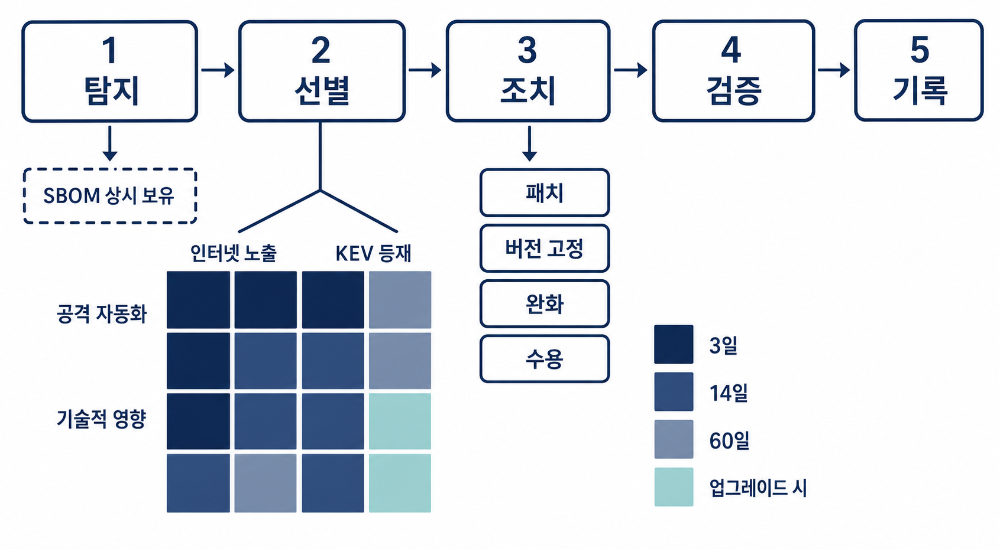

*[취약점 대응 파이프라인]*

##### **1. 탐지**

- SCA 도구를 CI 파이프라인에 통합해 빌드마다 검사한다.
- SBOM을 중앙 보관소에 적재하고 신규 CVE 공개 시 야간 재평가가 돌게 한다. 대응 속도는 패치 작업 속도가 아니라 영향 범위 확정 속도로 결정된다.
- CISA KEV 카탈로그 JSON 피드를 매일 자동 동기화하고, SBOM 컴포넌트 목록과 CVE ID로 조인해 '자사 영향 KEV' 목록을 상시 유지한다. 2026-07-29 기준 KEV 카탈로그는 총 1,656건이고 연도별 등재는 2021년 311건, 2022년 555건, 2023년 187건, 2024년 186건, 2025년 245건, 2026년 7월 29일까지 172건이다[^using-kev-feed]. 전체 CVE 유입량에 비하면 작은 집합이므로 자사 영향 목록은 대개 사람이 관리할 수 있는 규모다.
- 사용 중인 오픈소스SW 프로젝트의 보안 공지와 벤더 어드바이저리를 구독한다.

[^using-kev-feed]: CISA Known Exploited Vulnerabilities Catalog (JSON 피드) : https://www.cisa.gov/sites/default/files/feeds/known_exploited_vulnerabilities.json

##### **2. 선별 — 대응 기한 판정**

CVSS 점수 하나로 대응 시간을 정하는 표는 2026년 기준으로 작동하지 않는다. 이유는 두 가지다. 첫째, FIRST 자신이 CVSS v4.0 문서에서 기본 점수는 위험이 아니라고 명시한다. 둘째, 2026-04-15 NVD 보강 정책 전환으로 상당수 CVE에 CVSS 점수 자체가 붙지 않는다. 점수가 없으면 점수 기반 표는 멈춘다.

CISA는 2026-06-10 BOD 26-04를 발령해 BOD 22-01과 BOD 19-02를 폐지하고, 네 개 변수에 따른 조치 기한표로 전환했다[^using-bod2604]. 변수는 자산의 인터넷 노출 여부, KEV 등재 여부, 공격 자동화 가능성, 기술적 영향(부분 제어 또는 전체 제어)이다. 아래는 BOD 26-04 Table 1의 기한값이다. 미국 연방기관에 대한 구속 지침이며 계약자에게 자동 적용되지는 않지만, 사내 SLA의 기준표로 그대로 이식할 수 있다.

| 인터넷 노출 | KEV 등재 | 자동화 가능 | 기술적 영향 | 조치 기한(달력일) |
|-------------|----------|-------------|-------------|-------------------|
| Y | Y | Y | 전체 제어 | 3일 + 포렌식 트리아지 |
| Y | Y | Y | 부분 제어 | 3일 |
| Y | Y | N | 전체 제어 | 3일 + 포렌식 트리아지 |
| Y | Y | N | 부분 제어 | 14일 |
| Y | N | Y | 전체 제어 | 3일 |
| Y | N | Y | 부분 제어 | 14일 |
| Y | N | N | 전체 제어 | 14일 |
| Y | N | N | 부분 제어 | 60일 |
| N | Y | Y | 전체 제어 | 3일 + 포렌식 트리아지 |
| N | Y | Y | 부분 제어 | 14일 |
| N | Y | N | 전체 제어 | 14일 |
| N | Y | N | 부분 제어 | 14일 |
| N | N | Y | 전체 제어 | 60일 |
| N | N | Y | 부분 제어 | 60일 |
| N | N | N | 전체 제어 | 시스템 업그레이드 시 조치 |
| N | N | N | 부분 제어 | 시스템 업그레이드 시 조치 |

노출도 없고 KEV에도 없고 자동화도 불가능한 조합은 정기 업그레이드로 미루는 것이 CISA가 공식화한 판단이다. 모든 취약점을 기한 내에 처리하려는 규정은 실패한다.

타이머는 KEV 등재 시점과 자산에서 해당 CVE를 식별한 시점 중 먼저 오는 쪽에서 시작한다. 인터넷 노출을 해제하는 등 완화 조치로 변수 값이 바뀌면 기한도 다시 계산한다. 이 표를 쓰려면 자산의 인터넷 노출 여부가 자동으로 태깅되어야 하므로, 조직·환경(prod·dev)·노출(public·internal)·자산 유형을 사내 구성관리 데이터베이스의 필드로 먼저 정의한다.

두 번째 축으로 EPSS를 넣는다. EPSS는 공개된 CVE가 향후 30일 내 실제로 악용될 확률을 0에서 1 사이 값으로 매일 산출한다. 현행 모델은 v5이고 공식 데이터 피드의 model_version은 v2026.06.15다[^using-epss]. API는 무료이고 인증이 필요 없어 사내 스크립트로 바로 연동할 수 있다. 주의할 점은 값이 매일 바뀐다는 것이다. 티켓 생성 시점의 값으로 고정하지 말고 재조회한다. EPSS는 악용 확률이지 자사 영향도가 아니므로 자산 중요도는 별도 축으로 유지한다.

CVSS는 판번호를 명시한 보조 축으로 내린다. 데이터셋에 v3.1과 v4.0이 혼재하므로 사내 규정에서 임계값을 쓸 때는 'CVSS v3.1 기준 7.0 이상'처럼 판번호를 함께 적는다. 두 판번호가 모두 있을 때 어느 쪽을 쓸지도 사내 규칙으로 명문화한다[^using-cvss].

점수가 없는 CVE의 처리 분기를 반드시 넣는다. 2026-04-15부터 NVD는 KEV 등재 CVE, 연방정부 사용 소프트웨어, 중요 소프트웨어에 해당하는 CVE만 보강하고, 2026-03-01 이전 발행 CVE 약 2.9만 건을 'Not Scheduled'로 전환했다. 제출 기관이 이미 점수를 제공한 경우에는 NIST가 별도 점수를 부여하지 않는다[^using-nvd-enrichment]. 따라서 사내 SLA를 NVD의 CVSS 점수에만 연동해 두면 점수가 없는 CVE에서 프로세스가 멈춘다. 제출 기관 제공 점수를 쓰거나 자체 평가로 대체하는 분기를 규정에 명시한다.

[^using-bod2604]: CISA, BOD 26-04: Prioritizing Security Updates Based on Risk : https://www.cisa.gov/news-events/directives/bod-26-04-prioritizing-security-updates-based-risk
[^using-epss]: Exploit Prediction Scoring System (EPSS), FIRST : https://www.first.org/epss/
[^using-cvss]: CVSS v4.0 Specification Document, FIRST : https://www.first.org/cvss/specification-document
[^using-nvd-enrichment]: NIST, NIST Updates NVD Operations to Address Record CVE Growth (2026-04-15) : https://www.nist.gov/news-events/news/2026/04/nist-updates-nvd-operations-address-record-cve-growth

##### **3. 조치**

조치는 패치, 버전 고정, 완화, 수용 네 가지 중 하나를 고르고 근거를 남기는 일이다.

- 패치를 적용할 때는 테스트 환경에서 영향을 평가하고 롤백 계획을 함께 준비한다.
- 직접 의존성과 전이 의존성을 모두 본다. 의존성 그래프를 분석해 취약점 전파 경로를 파악한다.
- 지원이 끝난 컴포넌트는 패치 대상이 아니라 교체 대상이다. 마이그레이션 계획을 별도로 세운다.
- 제로데이처럼 패치가 없는 상황에서는 임시 완화 조치를 적용하고 완화 상태 자체를 티켓으로 관리한다.
- 영향이 없다고 판단해 수용하는 경우 그 판단을 VEX 문서로 남긴다. 자유 서술이 아니라 정해진 근거값으로 적어야 자동 처리가 된다.

##### **4. 검증**

조치 후 재스캔으로 해당 취약점이 사라졌는지 확인하고, 패치가 시스템 안정성과 성능에 미친 영향을 모니터링한다. 재스캔 없이 티켓을 닫으면 조치와 상태가 어긋난다.

##### **5. 기록**

대응 이력은 컴플라이언스 증빙이 된다. CVE 식별자, 영향 컴포넌트와 버전, 판정 근거(노출·KEV·자동화·영향), 조치 방식, 소요 시간을 남긴다. 이 기록이 있어야 공공 사업의 보안 요구사항 대응이나 CRA 보고 의무 이행을 증명할 수 있다.

#### 서명·프로비넌스 검증

오픈소스SW를 가져다 쓰는 단계에서 무결성을 확보하는 2026년의 표준 수단은 서명과 프로비넌스 검증이다. 앞의 사고 사례 중 계정 탈취와 빌드 시스템 침해는 이 검증만으로 상당 부분 걸러진다.

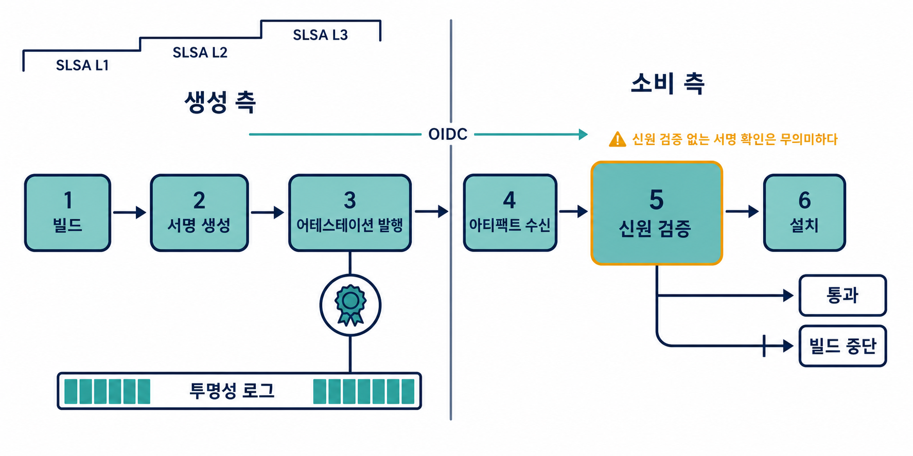

*[서명·프로비넌스 생성과 검증 흐름]*

##### **1. 검증 실무 두 갈래**

레지스트리 수준에서는 `npm audit signatures`가 설치된 npm 패키지의 레지스트리 서명과 프로비넌스 어테스테이션을 일괄 검증한다. `--json --include-attestations`를 붙이면 원문 번들을 뽑을 수 있다. PyPI는 PEP 740 기반 어테스테이션을 Trusted Publishing 환경에서 생성한다[^using-sigstore-verify][^using-pypi-attestations].

아티팩트 수준에서는 cosign 또는 GitHub CLI로 검증한다.

```bash
# cosign — 신원 검증을 반드시 함께 지정한다
cosign verify-blob-attestation \
  --bundle app.sigstore.json --new-bundle-format \
  --certificate-oidc-issuer=https://token.actions.githubusercontent.com \
  --certificate-identity-regexp='^https://github.com/<org>/<repo>/.github/workflows/release.yml' \
  app.tar.gz

# GitHub CLI — 동일한 역할
gh attestation verify app.tar.gz --repo <org>/<repo>
```

##### **2. 가장 중요한 경고**

신원 검증 없이 서명만 확인하는 것은 무의미하다. 서명은 누구나 만들 수 있다. OIDC 발급자와 워크플로 경로를 허용 목록으로 관리하지 않으면 공격자가 자기 저장소에서 만든 정상 서명도 검증을 통과한다. `--certificate-identity-regexp`는 패턴 일치, `--certificate-identity`는 완전 일치라는 차이도 알고 써야 한다[^using-sigstore-verify].

##### **3. CI 게이트 규칙**

의존성 설치 직후 단계에 검증을 넣고, 검증 실패 시 빌드를 중단한다. 경고만 남기는 설정은 사고가 났을 때 아무 역할도 하지 못한다.

##### **4. SLSA 레벨 목표**

SLSA는 v1.2가 현행이며 Build 트랙(L0~L3)과 Source 트랙(L1~L4)으로 구성된다[^using-slsa12]. 아래는 국내 기업이 각 레벨에 도달하는 조건이다.

| 레벨 | 요구 내용 | 도달 조건 |
|------|-----------|-----------|
| Build L1 | 프로비넌스가 존재한다. 위조는 쉽다 | 빌드 산출물에 프로비넌스를 생성해 첨부 |
| Build L2 | 호스팅 빌드 플랫폼이 프로비넌스를 생성·서명한다 | GitHub Actions는 `actions/attest-build-provenance` 도입으로 즉시 도달 |
| Build L3 | 빌드 간 상호 영향을 차단하고 서명 키를 사용자 정의 빌드 단계로부터 격리한다 | 조직 공용 reusable workflow로 빌드를 강제 |
| Source L2 | 브랜치 이력이 연속·불변으로 보존되고 리비전마다 소스 프로비넌스가 발급된다 | 강제 푸시 금지와 이력 보존. 국내 기업의 현실적 1차 목표 |

자체 호스팅 Jenkins 환경은 Build L2부터가 난관이다. 빌드 노드 임시화, 서명 키를 빌드 스텝에서 분리(HSM·KMS 또는 OIDC 키리스), 빌드 정의를 파이프라인 코드로 고정 — 이 세 가지를 먼저 확보한다. 개발 중이라고 알려진 Build Environment 트랙과 Dependency 트랙은 v1.2에 포함되어 있지 않으므로 이미 있는 것처럼 계획에 넣지 않는다.

##### **5. npm 인증 개편 대응 체크리스트**

npm 인증 체계 개편의 사실관계, 곧 classic token 폐기 일자와 granular token의 최대 수명은 [오픈소스SW 공개하기](#3-오픈소스sw-공개하기)의 안전 배포 체크리스트에서 다룬다. 여기서는 소비자 관점에서 사내에 남은 잔재를 감사하는 항목만 확인한다.

- [ ] 사내 CI/CD에 남아 있는 npm classic token 잔재를 전수 조사했는가
- [ ] OIDC Trusted Publishing으로 전환했는가. 전환 시 프로비넌스 어테스테이션이 자동 생성·게시된다
- [ ] 전환이 불가한 파이프라인의 granular token 회전을 스케줄에 등록했는가. 회전 절차가 없으면 토큰 수명이 끝나는 시점에 배포가 멈춘다
- [ ] 개인 개발자 계정의 다중 인증을 WebAuthn으로 상향했는가
- [ ] GitHub 조직에서 immutable releases를 기본 정책으로 켰는가. 비용이 들지 않고 태그 소급 변조를 차단한다[^using-gh-immutable]

[^using-sigstore-verify]: Sigstore Blog, cosign Verification of npm Provenance, GitHub Artifact Attestations, and Homebrew Provenance : https://blog.sigstore.dev/cosign-verify-bundles/
[^using-pypi-attestations]: PyPI Blog, PyPI now supports digital attestations (PEP 740) : https://blog.pypi.org/posts/2024-11-14-pypi-now-supports-digital-attestations/
[^using-slsa12]: SLSA Specification v1.2 : https://slsa.dev/spec/v1.2/
[^using-gh-immutable]: GitHub Changelog, Immutable releases are now generally available (2025-10-28) : https://github.blog/changelog/2025-10-28-immutable-releases-are-now-generally-available/

#### 오픈소스SW 보안 취약점 데이터베이스 및 도구

결론부터 적는다. 취약점 데이터 소스를 하나에 묶지 않는다. 2026년에는 단일 데이터베이스 구성의 미탐 위험이 이전보다 커졌다.

##### 주요 취약점 데이터베이스

1. **NVD (National Vulnerability Database)**
   - 운영: 미국 국립표준기술연구소(NIST)
   - 특징: CVE 기반의 포괄적인 취약점 메타데이터 제공
   - 2026-04-15부터 보강 대상이 축소되었다. 우선순위 밖 CVE에는 CVSS 점수·CPE 제품 매핑·CWE 분류가 붙지 않는다[^using-nvd-enrichment]. CPE가 없으면 NVD 기반 스캐너는 그 CVE를 제품에 매칭할 수 없다. 보안 전문지 Help Net Security는 이 정책 전환을 보도하면서 우선순위 범주가 향후 CVE 물량의 15~20%만 커버할 것이라는 업계 추산을 전했다[^using-nvd-estimate]. NIST가 발표한 확정 수치가 아니라 추산이므로 사내 판단에 쓸 때는 추산임을 함께 적는다
   - 링크: https://nvd.nist.gov/

2. **CVE (Common Vulnerabilities and Exposures)**
   - 운영: MITRE Corporation
   - 특징: 공개된 사이버 보안 취약점에 대한 표준 식별자 체계. 취약점마다 개별 CVE 번호가 부여되어 관리된다
   - 링크: https://cve.mitre.org/
   - 예) CVE-2015-5211 에 대한 CVE 정보


*[cve]*

   CVE 프로그램의 거버넌스는 진행 중인 사안이다. 2025년 4월 계약 만료 직전의 자금 위기 이후 CVE 재단 설립이 공표되었고, 2026년 1월 기준 CISA는 자금 절벽이 없다고 밝혔다. 장기 구조는 확정되지 않았다[^using-cve-governance]

3. **OSV (Open Source Vulnerabilities)**
   - 운영: Google 및 오픈소스SW 커뮤니티
   - 특징: 오픈소스SW 프로젝트에 특화된 취약점 데이터베이스. 40개 이상 생태계의 권고를 OSV 스키마로 정규화한다. 언어 패키지의 버전 범위 표현이 정밀해 CPE 매칭보다 오탐과 미탐이 적다[^using-osv]
   - 링크: https://osv.dev/

4. **GitHub Advisory Database**
   - 운영: GitHub
   - 특징: GitHub 생태계 내의 보안 취약점 정보 제공
   - 링크: https://github.com/advisories

5. **CISA KEV (Known Exploited Vulnerabilities) 카탈로그**
   - 운영: CISA
   - 특징: 실제 악용이 확인된 취약점 목록. 우선순위 판정의 1차 기준이며 JSON 피드로 매일 동기화할 수 있다[^using-kev-feed]
   - 링크: https://www.cisa.gov/known-exploited-vulnerabilities-catalog

6. **ENISA EUVD (European Union Vulnerability Database)**
   - 운영: ENISA
   - 특징: CRA 이행의 일환으로 개시되었다. CVE ID를 그대로 복제하지 않고 자체 식별 체계를 사용한다[^using-euvd]
   - 링크: https://euvd.enisa.europa.eu/

7. **Sonatype OSS Index**
   - 운영: Sonatype
   - 특징: Maven, npm, Go, PyPI 등 여러 패키지 관리 체계에서 보고된 오픈소스SW 취약점 정보 제공
   - 2026년 4월부터 Sonatype Guide API 토큰 체계로 이관이 시작되었고 기존 OSS Index API 키는 연말 이전에 폐지될 예정이다. 이 키로 인증하는 파이프라인은 폐지 전에 이관한다[^using-ossindex-migration]
   - 링크: [Sonatype OSS Index](https://ossindex.sonatype.org)
   - 예) CVE-2015-5211 에 대한 OSS Index 정보


*[sonatype-oss-index]*

소스별로 용도가 다르다. NVD는 CVE 메타데이터, OSV는 언어 패키지의 정밀 매칭, KEV는 악용 확인, EPSS는 악용 확률, EUVD는 EU 대응이다. 하나로 다른 하나를 대체할 수 없다.

##### 실행 지시

- 컨테이너와 OS 패키지는 Trivy 또는 Grype로, 언어 패키지는 OSV-Scanner로 최소 2계층 스캔한다.
- 스캐너를 계약하거나 갱신할 때 데이터 소스 목록과 NVD 미보강 CVE에 대한 대응 방식을 서면으로 확인한다.
- 사내 취약점 관리 시스템이 CVE ID 외에 GHSA, OSV ID, EUVD ID를 저장할 수 있는지 스키마를 점검한다. CVE ID만 지원하면 대체 소스를 붙일 수 없다.

[^using-cve-governance]: ENISA, Consult the European Vulnerability Database to enhance your digital security! : https://www.enisa.europa.eu/news/consult-the-european-vulnerability-database-to-enhance-your-digital-security
[^using-nvd-estimate]: Help Net Security, NIST admits defeat on NVD backlog (2026-04-16) : https://www.helpnetsecurity.com/2026/04/16/nist-national-vulnerability-database-nvd-enrichment/
[^using-osv]: OSV — Open Source Vulnerabilities : https://osv.dev/
[^using-euvd]: European Union Vulnerability Database, ENISA : https://euvd.enisa.europa.eu/
[^using-ossindex-migration]: AppSec Santa, OWASP Dependency-Check 2026 리뷰 : https://appsecsanta.com/owasp-dependency-check

##### 오픈소스SW 보안 관리 도구 및 플랫폼

1. **OWASP Dependency-Check**
   - 기능: 프로젝트의 종속성을 분석하여 알려진 취약점 식별
   - 지원 언어: Java, .NET, JavaScript, Ruby 등
   - 링크: [OWASP Dependency-Check](https://owasp.org/www-project-dependency-check/)

2. **Trivy**
   - 기능: 컨테이너 이미지, 파일시스템, Git 저장소의 취약점 스캔
   - 특징: 빠른 스캔 속도, 다양한 환경 지원, `--vex` 플래그로 VEX 필터링 지원
   - 링크: [Trivy GitHub](https://github.com/aquasecurity/trivy)

3. **Grype**
   - 기능: 컨테이너 이미지 및 파일시스템의 취약점 스캔
   - 특징: 높은 정확도, 빠른 스캔 속도
   - 링크: [Grype GitHub](https://github.com/anchore/grype)

4. **OSV-Scanner**
   - 기능: OSV.dev 데이터를 기반으로 언어 패키지 의존성의 취약점 식별
   - 특징: v2.4.0(2026-06-18)에서 CycloneDX 1.7 출력과 다수 소스 플러그인 지원. VEX 문서 소비는 지원하지 않는다[^using-osv-scanner]
   - 링크: [OSV-Scanner GitHub](https://github.com/google/osv-scanner)

이 도구들은 각각 다른 강점이 있으므로 조직의 요구사항과 개발 환경에 맞는 도구를 선택해야 한다. 또한 CI/CD 파이프라인에 통합해 지속적으로 보안을 모니터링해야 한다.

#### CI/CD 자체가 공격면이다 — 워크플로 보안 체크리스트

CI는 방어 수단이면서 동시에 공격 대상이다. 2025년부터 2026년 사이 발생한 오픈소스SW 공급망 사고의 다수가 CI 경로를 거쳤다. 아래 여덟 항목은 1회성 감사로 수행하고, 재발은 조직 정책(GitHub ruleset 등)으로 막는다. 감사만 하고 정책을 걸지 않으면 같은 설정이 새 저장소에서 되살아난다.

- [ ] `pull_request_target`을 쓰는 워크플로를 전수 조사해 제거했는가. 불가피하면 `repository_owner` 가드를 건다
- [ ] 서드파티 액션을 40자 커밋 SHA로 고정하고 Dependabot으로 갱신을 병행하는가. 태그·브랜치 참조는 소급 변조가 가능하다
- [ ] 포크 PR 워크플로와 릴리스 워크플로의 캐시 키를 분리했는가. 사고 시 조직 전체 캐시를 퍼지하는 절차가 있는가
- [ ] 빌드 잡과 배포 잡을 분리하고 배포용 OIDC 토큰의 유효 범위를 배포 잡으로 한정했는가
- [ ] `permissions:`를 명시해 최소 권한을 적용하고, 시크릿이 필요 없는 잡에는 시크릿을 주입하지 않는가. 공개 저장소의 워크플로 로그는 공개이므로 마스킹만 믿지 않는다
- [ ] 조직 설정에서 '허용된 액션' 목록을 강제하는가
- [ ] 자사 패키지의 레지스트리 게시 이벤트를 실시간 모니터링해 '내가 하지 않은 배포'를 탐지하는가. 프로비넌스의 소스 워크플로를 검증해 예상치 못한 워크플로의 배포를 걸러내는가
- [ ] 개발자 IDE 확장을 허용 목록으로 통제하는가

#### 하위 공급망 보안 관리

한국의 소프트웨어 개발 환경, 특히 공공 부문과 대기업이 주도하는 SI(시스템 통합) 프로젝트에서 하위 공급망의 보안 관리는 종종 간과되지만 매우 중요한 부분이다. 하청이 SBOM을 제출하지 않는 이유는 대개 세 가지다. 계약서에 산출물로 정의되어 있지 않고, 정의되어 있어도 무엇이 합격인지가 없어 빈 파일도 통과하며, 검수 담당자가 SBOM을 읽을 도구가 없다. 협력 수단만으로는 이 셋 중 어느 것도 해결되지 않는다.

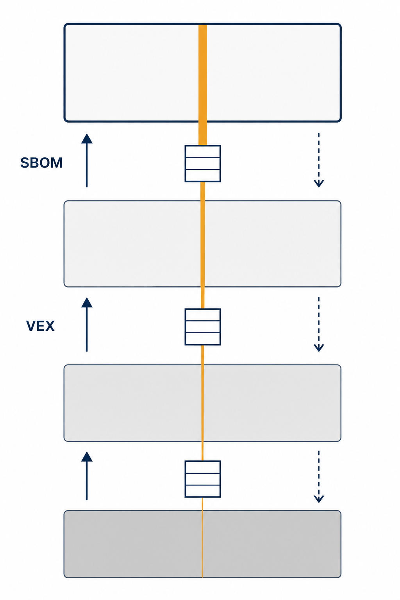

*[SI 다단 하도급 구조에서의 SBOM 흐름]*

아래 표는 하위 공급망 관리의 네 영역을 정리하되, 각 방안에 계약 문구 예시와 검증 방법을 붙인 것이다.

| 영역 | 방안 | 계약 문구 예시 | 검증 방법 |
|------|------|----------------|-----------|
| 협력 | 보안 협의체 운영 | "수급인은 분기 1회 이상 정기 보안 협의에 참석하고 협의 결과를 회의록으로 남긴다." | 회의록 제출 여부와 조치 항목의 이행 상태 확인 |
| 협력 | 공동 보안 대응팀 구성 | "보안 사고 발생 시 수급인은 인지 후 24시간 이내에 도급인에게 통지하고 공동 대응에 참여한다." | 통지 시각과 인지 시각의 간격을 사고 보고서로 확인 |
| 교육 | 통합 보안 교육 | "수급인은 프로젝트 투입 인력에 대해 연 1회 이상 공급망 보안 교육을 이수시킨다." | 이수자 명단과 투입 인력 명단 대조 |
| 교육 | 보안 기술 지원 | "도급인은 SBOM 생성 도구와 CI 템플릿을 제공하고, 수급인은 이를 빌드 파이프라인에 적용한다." | 제공한 템플릿의 적용 여부를 파이프라인 설정으로 확인 |
| 모니터링 | 통합 보안 모니터링 | "수급인은 납품물의 SBOM을 도급인이 지정한 보관소에 업로드한다." | 보관소 적재 여부와 릴리스 버전 일치 확인 |
| 모니터링 | 주기적 보안 점검 | "수급인은 하자보수 기간 중 신규 취약점 발생 시 갱신 SBOM과 대응 계획을 제출한다." | 신규 CVE 공개일과 갱신 SBOM 제출일의 간격 측정 |
| 관리 | 보안 요구사항 명확화 | "SBOM은 SPDX 2.3·3.0.1 또는 CycloneDX 1.5 이상으로 작성하며 전이 의존성을 포함한다." | 아래 검수 자동화 3종 |
| 관리 | 재하도급 관리 | "수급인은 재하도급 시 본 계약의 보안 산출물 의무를 동일하게 부과한다." | 재하도급 계약서 사본에서 해당 조항 확인 |

##### **1. 계약 — 산출물로 정의한다**

과업지시서와 기술협상서의 산출물 목록에 다음을 명시한다.

```
[산출물 정의]
1. SBOM — 포맷과 판번호를 지정한다.
   예) SPDX 2.3 또는 3.0.1, 혹은 CycloneDX 1.5 이상. deprecated 판번호로 생성된 문서는 불인정.
2. VEX — 취약점이 보고된 컴포넌트가 있는 경우 필수. 형식과 수용 조건은 별첨에 따른다.
3. 하자보수 기간 중 신규 취약점이 확인되면 갱신 SBOM과 대응 계획을 N일 이내 제출한다.
4. 재하도급이 있는 경우 수급인은 위 1~3의 의무를 재수급인에게 동일하게 부과한다(flow-down).
```

##### **2. 수용 기준 — 무엇이 합격인가**

아래는 규제 최소선보다 높은 자사 수용 기준이다. CRA가 요구하는 범위는 '최소한 최상위 의존성'이고 CISA 2026 최소 요소는 최소 깊이를 규정하지 않지만, 납품물을 받는 쪽은 전이 의존성까지 확보해야 신규 CVE 공개 시 영향 범위를 산출할 수 있다. 규제 준수와 사내 수용은 층위가 다른 판단이므로 계약서에 어느 기준을 적용하는지 명시한다.

- CISA 2026 SBOM 최소 요소 17개 필드를 충족한다.
- 포맷 판번호 하한을 지정하고 deprecated 판번호는 거부한다.
- 전이 의존성을 포함한다. 최상위 의존성만 담은 문서는 반려한다.
- 알 수 없는 정보는 빈칸이 아니라 'unknown'으로 명시한다.
- SBOM에 작성자 서명을 첨부한다.

'무엇이 합격인가'를 적지 않으면 빈 파일도 통과한다.

##### **3. 검증 — 검수 자동화 3종**

| 검사 | 무엇을 보는가 | 도구 | 실패 시 처리 |
|------|---------------|------|--------------|
| 스키마 유효성 | 파일이 선언한 포맷·판번호의 스키마를 만족하는가 | Dependency-Track 업로드 검증(v4.11.0 이상)[^using-dtrack411] | 검수 미완료 |
| 최소 요소 충족 | 필수 필드가 실제로 채워졌는가 | spdx/ntia-conformance-checker[^using-ntia-checker], interlynk-io/sbomqs[^using-sbomqs] | 검수 미완료 |
| 납품 바이너리 재스캔 대조 | 제출된 SBOM이 실제 산출물과 일치하는가 | Syft·Trivy로 재스캔 후 컴포넌트 목록 차집합 확인 | 검수 미완료 |

세 번째가 핵심이다. 서류만 보면 하청은 빌드와 무관한 SBOM을 낼 수 있다. 실물 대조를 넣어야 SBOM이 문서가 아니라 산출물의 성분표가 된다. 이 세 검사는 사내 릴리스의 SBOM에도 같은 기준으로 적용한다.

[^using-ntia-checker]: spdx/ntia-conformance-checker : https://github.com/spdx/ntia-conformance-checker
[^using-sbomqs]: interlynk-io/sbomqs — SBOM 품질·컴플라이언스 점수 도구 : https://github.com/interlynk-io/sbomqs

##### **4. 수단을 함께 준다**

요구만 하고 수단을 주지 않으면 형식적 제출물만 늘어난다. 도급인이 SBOM 생성 도구와 CI 템플릿을 제공하고, 검수 기준을 사전에 공개해 수급인이 스스로 확인할 수 있게 한다.

KISA는 2026년 'SW 공급망 보안 모델 구축' 사업에 총 40억 원을 투입하며, 공급망 보안 관리체계 구축 6개 과제와 위협 모니터링·대응체계 2개 과제로 나누어 컨소시엄당 최대 5억 원을 지원한다. 지원 대상이 SW 개발·공급 기업뿐 아니라 제품을 도입·운영하는 기업까지 확대되었다[^using-kisa-support]. 협력사 지원 재원으로 활용할 수 있다.

##### **5. 대기업 주도 공급망 지원 사례**

현대자동차·기아·현대모비스·현대오토에버는 2023년 11월 8일 정보통신산업진흥원(NIPA)과 업무협약을 체결했다[^using-hyundai-nipa]. 자동차 부품 중소·중견기업을 대상으로 오픈소스SW 기술 솔루션맵을 구축하고, 컴플라이언스와 SW 안전진단을 지원하며, 저작권법 위반 리스크를 예방하기 위한 라이선스 검증을 지원하는 내용이다. 완성차 기업이 자사 컴플라이언스에 그치지 않고 하위 부품 공급망의 거버넌스까지 지원하는 구조로, 다단 하도급이 일반적인 산업에서 참고할 만한 형태다.

이러한 접근 방식은 한국정보보호산업협회(KISIA)의 [공급망 보안 가이드라인](https://www.kisa.or.kr/2060204/form?postSeq=15&page=1)[^using-kisia2024]과 [소프트웨어 개발 보안 가이드](https://www.kisa.or.kr/2060204/form?postSeq=5&lang_type=KO&page=1)[^using-security2024]를 참고하여 수립되었다. 특히, 공공 부문 SI 프로젝트에서는 [정보보호 관리체계(ISMS) 인증](https://isms.kisa.or.kr/main/)[^using-isms2024]을 활용하여 하청업체의 보안 관리 수준을 객관적으로 평가하고 개선할 수 있다.

[^using-kisa-support]: 보안뉴스, "공급망 보안, 생태계 전체 문제"…KISA, 40억 투입해 SBOM 도입·운영 기업 지원 : https://m.boannews.com/html/detail.html?idx=142637
[^using-hyundai-nipa]: ZDNet Korea, NIPA, 현대차그룹과 오픈소스 기반 디지털 전환 협력 (2023-11-08) : https://zdnet.co.kr/view/?no=20231108213941
[^using-kisia2024]: 한국정보보호산업협회, 공급망 보안 가이드라인 : https://www.kisa.or.kr/2060204/form?postSeq=15&page=1
[^using-security2024]: 과학기술정보통신부, 소프트웨어 개발보안 가이드 : https://www.kisa.or.kr/2060204/form?postSeq=5&lang_type=KO&page=1
[^using-isms2024]: 정보보호 관리체계(ISMS) 인증 : https://isms.kisa.or.kr/main/


### DevSecOps
2012년 Gartner는 보고서 "DevOpsSec: Creating the Agile Triangle"[^using-devopsset]에서 DevOps 이니셔티브에 보안 기반을 구축해야 한다는 점을 강조하며 DevSecOps라는 개념을 소개했다. DevSecOps는 소프트웨어 개발<sub>Development</sub>과 운영<sub>Operation</sub>, 보안<sub>Security</sub>의 합성어로, 개발자와 운영·보안 실무자 간의 소통·협업·통합을 강조하는 개발 문화를 뜻한다.

[^using-devopsset]: DevOpsSec: Creating the Agile Triangle : https://www.gartner.com/en/documents/1896617/devopssec-creating-the-agile-triangle


*[devsecops]*


SDLC<sub>Software System Development Life Cycle</sub> 전체에 걸쳐 가능한 한 빠르고 자주 보안을 통합해야 한다. 앞의 [오픈소스SW 보안 현황](#오픈소스sw-보안-현황) 표가 보여주듯 오늘날 애플리케이션의 구성 요소 대부분은 직접 작성하지 않은 외부 코드다. 자사가 작성하지 않은 코드의 결함은 개발 단계 뒤에 붙이는 점검으로는 걸러지지 않는다. 따라서 DevSecOps에서는 오픈소스SW 취약점을 지속적으로 추적하고 사용자에게 알리는 일이 특히 중요하다.

컨테이너, 마이크로서비스 같은 혁신적인 기술로 전환하면서도 분리된 팀 간에 긴밀하게 협업하기는 쉽지 않다. IBM이 제시한 [모범 사례 (2020)](https://developer.ibm.com/recipes/tutorials/open-source-security-trends-for-2020)[^using-bestpractive2020]를 통해 DevSecOps 관점에서 오픈소스SW 취약점 관리를 좀 더 살펴본다.

[^using-bestpractive2020]: IBM, Open Source Security Trends (2020) : https://developer.ibm.com/recipes/tutorials/open-source-security-trends-for-2020

#### IBM DevSecOps 모범 사례
##### **자산 추적**
먼저 보호해야 할 자산이 무엇인지 알아야 한다. 오픈소스SW를 식별하고 추적하면 어떤 자산이 중요한지 파악하는 데 도움이 된다.


##### **위협 평가 수행**
이 단계에서는 예상되는 위협 유형을 평가한다. 가능한 공격 방법과 구현할 수 있는 보안 조치의 실행 가능성을 평가한다.


##### **보안 체크리스트**
명확한 실천 체계를 세우면 일상 업무에서도 규정을 쉽게 지킬 수 있다. 그 결과 패치를 쉽게 적용해 보안 격차를 줄일 수 있다.


##### **가능한 자동화**
오픈소스SW 가시성을 높일 수 있는 애플리케이션 보안 테스트 및 오픈소스SW 보안 솔루션이 있다. [SonarQube](https://www.sonarqube.org)[^using-sonarqube] 같은 모니터링 도구를 사용하면 오픈소스SW 구성요소를 추적하여 버그와 결함을 실시간으로 탐지할 수 있다.

[^using-sonarqube]: SonarQube : https://www.sonarqube.org

##### **보안 우선 문화 구축**
유관 부서 전반에 보안을 적용하고 개발 프로세스의 모든 단계에서 보안을 관리해야 한다. DevOps 전반에 보안을 결합한 DevSecOps 모델을 채택하면 보안 우선 문화를 만드는 데 도움이 된다.


##### **컨테이너 보안 모범 사례 적용**
컨테이너화는 자체적인 운영체제를 고려할 때 보안상의 이점이 있다.


##### **모든 것을 암호화**
모든 데이터에 암호화를 적용한다.


#### GitHub 기능을 활용한 보안 관리 사례
GitHub은 소스 코드 저장소로 널리 쓰인다. [GitHub Octoverse (2021)](https://octoverse.github.com)[^using-github-octoverse] 자료에 따르면 **Fortune 100대 기업 중 84%가 GitHub Enterprise를 사용**한다. 이에 맞춰 GitHub도 단순한 소스 코드 저장소 기능을 넘어 새로운 기능을 계속 추가하고 있으며, 특히 보안 관련 기능을 다양하게 제공해 주목받고 있다. 이러한 보안 기능을 활용한 보안 관리 사례를 살펴본다.

[^using-github-octoverse]: GitHub Octoverse (2021) : https://octoverse.github.com

##### **Dependency Graph**
프로젝트에서 사용 중인 외부 라이브러리 정보를 보여주는 기능이다. 사용 중인 라이브러리와 버전 정보를 조회할 수 있으며, Ruby, JavaScript, Python 등 다양한 언어와 패키지 매니저를 지원한다. Dependency Graph는 사용 중인 라이브러리뿐 아니라 자신의 프로젝트를 참조하는 다른 프로젝트도 확인할 수 있다.


*[dependency-graph]*

##### **dependabot**
프로젝트에서 사용 중인 오픈소스SW 중 오래된 버전이 있으면 PR(Pull Request)을 자동으로 생성해 준다. 개발자는 변경된 릴리스 정보를 검토해 새 버전을 머지(Merge)할 수 있다.


*[dependabot]*


##### **코드 스캐닝**
코드 스캐닝은 GitHub 네이티브 환경에서 제공된다. 코드 스캔이 활성화되면 모든 `git push`에서 새로운 잠재적 보안 취약점을 스캔하고 결과를 풀 리퀘스트에 직접 표시한다. 코드 스캐닝은 세계에서 가장 진보된 시맨틱 분석 엔진인 CodeQL을 사용하며, 실제 취약점을 발견하는 데 최고의 기록이 있다. 오픈소스SW 코드 스캔은 무료로 제공된다.


*[code-scanning]*


##### **Secret 스캐닝**
GitHub Private Repository와 Enterprise 버전에 추가된 기능으로, 코드 내 Secret 코드를 스캔한다. 소스 코드에 포함되어 노출된 민감한 정보를 찾아내 실수로 커밋된 자격 증명이 부정 사용되는 것을 막는다. 일치하는 Secret 포맷이 발견되면 지정된 HTTP 주소로 payload가 전달된다.


*[secret-scanning]*


---

지금까지 기업이 오픈소스SW를 사용할 때 활용할 수 있는 가이드를 살펴보았다. 이어서 개발자가 오픈소스SW를 어떻게 사용하고 관리해야 하는지 살펴본다.


## 오픈소스SW 사용 가이드 - 개발자 편

오픈소스SW 생태계는 매년 규모가 매우 빠르게 커지고 있다. 규모를 나타내는 수치는 앞의 [오픈소스SW 보안 현황](#오픈소스sw-보안-현황)에서 한 번 정리했으므로 여기서 되풀이하지 않는다.

이처럼 오픈소스SW가 수없이 생겨나면서 선택의 폭도 그만큼 넓어졌다. 이번 장에서는 오픈소스SW를 올바르게 선택하는 방법을 살펴본다.

### 오픈소스SW 생태계의 이해
오픈소스SW를 선택하는 방법을 살펴보기 전에 먼저 오픈소스SW 생태계를 이해해야 한다. 오픈소스SW 생태계는 크게 생산자, 공급자, 소비자로 나뉜다. 생산자는 오픈소스SW 커뮤니티·재단과 오픈소스SW 기여자로 구성되고, 공급자에는 소프트웨어 인프라 공급자, 교육·컨설팅 기업, 기술지원 기업이 있다. 소비자는 일반 사용자와 오픈소스SW를 활용하는 조직이다.

#### 오픈소스SW 생태계 구성


*[오픈소스SW 생태계]*

##### **생산자**
- **오픈소스SW 커뮤니티** : 오픈소스SW 생태계에서 허브 역할
- **오픈소스SW 재단** : 오픈소스SW 커뮤니티와 상용 오픈소스SW 밴더 사이에서 공동 작업을 지원
- **오픈소스SW 기여자** : 오픈소스SW를 개발하고 다양한 오픈소스SW 이슈를 처리하는 개발자

##### **공급자**
- **소프트웨어 인프라 공급자** : 오픈소스SW 공급망 제공
- **교육 및 컨설팅 기업** : 오픈소스SW 프로젝트를 중심으로 비즈니스 생태계 조성
- **기술 지원 기업** : 오픈소스SW 커뮤니티와 협력 관계를 유지하며 오픈소스SW를 지원하기 위한 기술 인력을 운영

##### **소비자**
- **일반 사용자** : 오픈소스SW를 사용하고, 커뮤니티를 통해 오픈소스SW의 개선에 참여
- **오픈소스SW 유료 사용자** : 유료 서비스를 통해 차별화된 지원을 받는 사용자 또는 조직


#### 오픈소스SW 커뮤니티
오픈소스SW 커뮤니티의 구성은 흔히 양파 구조에 비유된다. 프로젝트 리더(또는 창시자)와 핵심 기여자, 기여자, 신입 기여자, 사용자로 이루어진다. 이 중 프로젝트 리더는 오픈소스SW 프로젝트 전반의 사항에 대해 최종 의사 결정을 내린다. 핵심 기여자는 프로젝트에서 경험이 가장 많은 실력자로, 커뮤니티 구성원을 지도하고 멘토링한다. 그 외 자세한 내용은 오픈소스SW 기여하기 편에서 다룬다.

#### 오픈소스SW 재단
오픈소스SW 생태계에는 다양한 오픈소스SW 재단이 존재한다. 오픈소스 이니셔티브(OSI, Open Source Initiative)의 앨리슨 랜달 회장은 "기업들이 신뢰할 수 있는 비영리 독립 단체를 통해 오픈소스SW 프로젝트를 공동 추진할 수 있다고 생각함에 따라 재단 설립이 증가하고 있다. 이는 아주 중요한 의미를 지닌다. 경쟁 관계에 있는 기업들이 협력할 경우 통상 많은 장애물은 만나게 된다. 중립적이면서도 경쟁적이지 않은 재단을 매개체로 삼는 방법이 아주 유용할 수 있다"라고 설명했다.

몇 가지 주요 오픈소스SW 재단은 아래와 같다.
##### **OSI (Open Source Initiative)** - http://opensource.org/
이 조직은 1998년 Netscape에서 영감을 받아 오픈소스SW 사용을 장려하기 위해 만들어진 단체다. 현재는 OSI 라이선스 검토와 승인 등 OSD(Open Source Definition)을 관리한다.


##### **Free Software Foundation** - https://www.fsf.org
오픈소스SW 분야에서 유명한 리처드 스톨만이 1985년에 설립한 재단으로 자유(Free) 소프트웨어의 생산과 보급을 장려하고 있다. 주로 컴퓨터 소프트웨어를 만들어 배포하고 수정하는 보편적인 자유를 추구한다.


##### **Linux Foundation** - https://linuxfoundation.org
리눅스의 성장을 지원하고 상업적 지원을 진행하고 있는 기술 컨소시엄이다. 최근에는 오픈소스SW 이벤트, 교육 및 인증, 오픈소스SW 프로젝트 지원 프로그램 등으로 영역을 확장하고 있다.


##### **Apache Software Foundation** - http://apache.org
1993년 Apache HTTP 개발자들에서 시작한 이 그룹은 전 세계 분산 개발자 커뮤니티로 발전해 다양한 오픈소스SW 프로젝트를 진행하고 있다. 이들이 개발하는 소프트웨어는 아파치 라이선스로 배포된다. 재단의 목적 중 하나는 아파치 프로젝트에 참여하는 사람들을 법적으로 보호하고, 허가 없이 다른 조직이 아파치 브랜드를 사용하지 못하도록 막는 데 있다. 또한 아파치 프로젝트 관련 기술과 아파치 개발자들이 함께 모이는 ApacheCon 콘퍼런스를 해마다 연다.


##### **Cloud Foundry Foundation** - https://www.cloudfoundry.org/foundation/
클라우드 파운드리 재단은 클라우드 파운드리 오픈소스SW 프로젝트의 전 세계적인 인식과 채택을 이끌고 기여자 공동체를 키우며, 모든 파트너 기업의 전략과 조치가 일관되게 맞물리도록 조율한다. EMC, HP, IBM, 인텔, SAP가 공동 참여하고 있다.


### 오픈소스SW 라이선스
오픈소스SW는 저작권법의 보호를 받는다. 오픈소스SW는 일반적으로 소스가 공개되어 있어 누구나 접근해 자유롭게 사용, 수정, 배포할 수 있다. 오픈소스SW 라이선스는 사용자가 오픈소스SW를 사용할 때 지켜야 할 의무 사항을 명시한다. 이 의무 사항을 제대로 지키지 않고 사용하면 저작권법 위반이 된다.

GPL 라이선스는 해당 오픈소스SW를 포함한 소프트웨어를 배포할 때, 파생저작물에 해당하는 소스 코드를 동일 라이선스로 공개할 것을 요구한다. 의무가 발생하는 시점은 '사용'이 아니라 '배포'이며, 공개 범위는 무엇이 파생저작물인지에 따라 결정된다. 배포에 해당하는지 판단하는 기준은 기업 편의 [오픈소스SW 배포](#오픈소스sw-배포)에, 결합 방식별로 의무가 어디까지 미치는지는 같은 편의 아키텍처 리뷰 판정표에 정리되어 있다. 코드 공개 없이 GPL 라이선스의 오픈소스SW를 상용 소프트웨어에 넣어 배포하면 저작권 침해에 해당할 수 있으며, 민사·형사 책임이 문제될 수 있다.


#### 오픈소스SW 라이선스 구분
오픈소스SW 라이선스는 의무의 강도에 따라 네 구간으로 나뉜다. permissive와 copyleft 두 갈래로만 나누면 2026년 실무에서 사고가 나는 두 지점, 곧 AGPL의 네트워크 조항과 OSI 비승인 소스 공개형 라이선스를 구분하지 못한다.

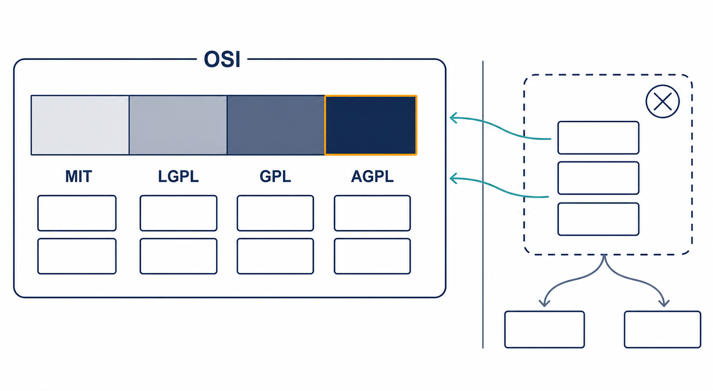

*[오픈소스SW 라이선스 스펙트럼]*

| 구간 | 대표 라이선스 | 배포 시 발생하는 의무 | 도입 시 확인할 것 |
|------|---------------|----------------------|-------------------|
| permissive | MIT, BSD, Apache-2.0 | 저작권 고지와 라이선스 사본 첨부 | Apache-2.0은 수정 내용 고지도 요구한다 |
| weak copyleft | LGPL, MPL, EPL | 해당 컴포넌트나 파일 범위의 소스 공개 | LGPL은 라이브러리 교체 가능성 보장, MPL·EPL은 수정한 파일 단위 공개 |
| strong copyleft | GPL | 파생저작물 전체를 동일 라이선스로 공개 | 결합 방식에 따라 파생 범위가 달라진다 |
| network copyleft | AGPL | 네트워크로 이용자에게 제공하는 것도 배포에 준해 소스 제공 의무가 발생 | SaaS로 제공하는 서비스에 포함되었는지 별도 확인 |

##### **OSI 비승인 소스 공개형 — 오픈소스SW가 아니다**

BUSL, SSPL, Elastic License, PolyForm, FSL은 소스가 공개되어 있으나 OSI가 승인한 오픈소스SW 라이선스가 아니다. 사내 목록에서 이들을 오픈소스SW로 분류하면 승인 절차가 통째로 잘못 적용된다. 도입을 검토한다면 다음 세 가지를 확인한다.

- **전환 조항**: BUSL은 통상 3~4년 후 오픈소스SW 라이선스로 자동 전환되는 조항을 둔다. 도입 시점에 따라 판단이 달라진다.
- **경쟁 제한 조항**: 어떤 형태의 상업적 이용이 금지되는지 확인한다. SSPL은 서비스 형태로 제공할 때 관리 소프트웨어 전체 공개를 요구해 SaaS 사업자에게는 사실상 사용이 어렵다.
- **유상화 시점**: 어느 규모·용도부터 유료 계약이 필요한지 확인한다.

##### **라이선스 전환 대응 절차**

라이선스 변경은 한 번의 사건이 아니라 반복되는 리스크다. 변경은 대개 특정 버전부터 적용되므로, 변경 이전 버전을 계속 쓰면 기존 라이선스가 유지된다. 따라서 첫 단계는 '즉시 제거'가 아니라 '버전 고정으로 유예기간 확보'다.

1. **버전 고정** — 변경 직전 버전으로 고정해 판단할 시간을 번다.
2. **선택지 검토** — (a) 커뮤니티 포크로 이전, (b) 상용 라이선스 계약, (c) 대체 기술 전환, (d) 소스 공개 수용 중 하나를 고른다.
3. **결정과 기록** — 선택 근거를 오픈소스SW 승인 대장에 남긴다.
4. **이후 감시** — 같은 프로젝트에서 추가 변경이 있는지 계속 본다.

확인된 사례는 다음과 같다. HashiCorp는 2023년 8월 Terraform을 MPL 2.0에서 BSL 1.1로 전환했고 커뮤니티는 OpenTofu로 포크했다. Redis는 2024년 3월 BSD에서 RSALv2/SSPLv1 이중 라이선스로 전환했고 Valkey가 포크되었으며, 2025-05-01 Redis 8부터 OSI 승인 라이선스인 AGPLv3를 선택지로 추가했다[^using-redis-agpl]. Elastic은 2024년 8월 AGPLv3를 세 번째 선택지로 추가했으나 OpenSearch 포크는 유지된다[^using-redmonk-2026].

여기서 실무 결론 두 가지를 반드시 기억한다.

- AGPLv3로 복귀한 프로젝트를 'OSI 승인'이라는 이유로 자동 승인하지 않는다. AGPLv3는 SaaS로 제공할 때 소스 공개 의무를 발생시키므로 별도 심사가 필요하다. SSPL보다 낫다는 것이 안전해졌다는 뜻은 아니다.
- 전환 이후 생긴 포크는 그대로 남는다. 조직은 원본과 포크 두 생태계를 동시에 관리해야 한다.

운영 규칙으로는 사내 오픈소스SW 목록에 '라이선스 변경 이력' 필드를 추가하고 버전별 라이선스를 기록한다. 인프라 계열과 단일 벤더가 주도하는 프로젝트를 감시 대상으로 표시해 분기 단위로 LICENSE 파일 변경을 자동 점검한다.

[^using-redis-agpl]: Redis, Redis is now available under the AGPLv3 open source license (2025-05-01) : https://redis.io/blog/agplv3/
[^using-redmonk-2026]: RedMonk, The State of Open Source Licensing in 2026 (2026-03-25) : https://redmonk.com/sogrady/2026/03/25/open-source-licensing-2026/

오픈소스SW 라이선스에 대한 세부 사항은 NIPA에서 출간한 "오픈소스SW 라이선스 가이드"를 참고할 수 있다.


### 오픈소스SW 선택 가이드
오픈소스SW가 워낙 많다 보니 요구 사항에 가장 적합한 오픈소스SW를 선택하기 어려울 수 있다. 여기서는 오픈소스SW를 선택하는 기준을 몇 가지 제시한다.

#### 오픈소스SW 선택 기준
##### **기능성**
자신의 프로젝트에 필요한 기능을 충분히 충족하면서 사용하기에 적합한지 따져봐야 한다. 예를 들어 메시지 큐 기능을 위한 오픈소스SW를 선택할 때는 기본 메시징 기능이 적합한지, 업계에서 널리 쓰이는 프로토콜과 호환되는지 확인해야 한다. 필요한 기능 이상으로 과도한 기능을 제공하지는 않는지도 중요하다. 예를 들어 단순히 문서 파일 포맷 변환만 필요한데 이미지·영상 포맷까지 다양하게 제공하는 오픈소스SW라면, 필요하지 않은 기능 때문에 더 많은 용량이나 리소스를 차지할 수도 있다.
오픈소스SW가 프로젝트에서 요구하는 기능을 완벽히 충족하지 못한다면 필요한 기능을 직접 수정해서 사용하는 방법도 고려할 수 있다. 다만 이렇게 수정할 때는 오픈소스SW 기여와 변경에 따른 라이선스 등 여러 사항을 살펴보고 진행해야 한다.


##### **오픈소스SW 사용 조건 및 성능**
오픈소스SW 사용 조건과 같은 비기능적 요소도 반드시 살펴봐야 한다. 프로젝트에서 사용하는 아키텍처나 운영체제와 호환되어야 하며, 프로젝트가 현재 Linux에서 작동하지만 이후 Windows로도 확장할 계획이라면 두 시스템을 모두 지원하는 오픈소스SW여야 한다. 오픈소스SW의 성능이 요구 조건을 충족하는지도 살펴보고, 성능이 중요하다면 벤치마킹으로 직접 측정해야 한다.


##### **라이선스**
오픈소스SW에 명시된 라이선스를 반드시 확인해야 한다. 상업용 프로젝트에 비상업용 라이선스가 붙은 오픈소스SW를 쓰거나, GPL 라이선스가 붙은 오픈소스SW를 써서 의도치 않게 자신의 코드를 전부 공개해야 하는 상황은 피해야 한다. 이런 경우에는 Apache나 MIT처럼 상대적으로 관대한 허용적 라이선스를 쓰는 오픈소스SW를 선택하는 것이 바람직하다.


##### **보안**
Black Duck의 2026년 OSSRA 보고서에 따르면 2024년 11월부터 2025년 10월까지 감사한 947개 상용 코드베이스 중 87%가 취약점을 1건 이상 포함했고, 코드베이스당 평균 취약점은 581건, 중앙값은 78건이었다[^using-ossra2026]. 오픈소스SW를 검토할 때는 보안 관련 사항을 반드시 확인해야 하며, 취약점이 발견되었을 때 빠르게 조치되는지도 함께 살펴야 한다. 마지막 릴리스가 오래되었다면 그만큼 보안 취약점이 있을 가능성이 높다. GitHub 이슈 또는 프로젝트가 명시한 이슈 트래커를 통해 보안 문제가 있는지 확인하고, 지난 버전 릴리스 노트를 살펴본다.

##### **인기도**
인기도는 여러 지표로 가늠하되 신뢰도가 높은 순서로 본다. 다음 순서를 권한다.

1. 다운로드 수와 의존 저장소 수 — 실제로 얼마나 쓰이는지를 가장 잘 나타낸다
2. 릴리스 주기와 최근 릴리스 시점
3. 이슈·PR 응답 중앙값
4. 유지관리자 수
5. Star 수

Star는 마지막에 둔다. 조작이 가능한 지표이므로 단독 근거로 쓰지 않는다. 여러 지표를 종합해 커뮤니티 건강성을 측정하는 [CHAOSS](https://chaoss.community/metrics)[^using-chaoss] 같은 도구를 함께 쓸 수 있고, 다운로드 수와 의존 관계는 deps.dev에서 확인할 수 있다.

[^using-chaoss]: CHAOSS : https://chaoss.community/metrics

##### **공급망 무결성**
릴리스가 서명되어 있고 출처를 증명할 수 있는지 확인한다. Trusted Publishing으로 게시되는 프로젝트인지, 유지관리자 계정에 다중 인증이 적용되어 있는지도 함께 본다. 확인 방법은 npm 패키지의 경우 `npm audit signatures`, GitHub 릴리스 아티팩트의 경우 `gh attestation verify`다.

##### **라이선스 변경 리스크**
단일 기업이 지배하는 프로젝트인지, 기여자 라이선스 동의(CLA)를 통해 저작권이 한 주체에 집중되는지, 과거에 재라이선스한 이력이 있는지 확인한다. 확인 방법은 LICENSE 파일의 git 히스토리와 프로젝트의 거버넌스 문서다.

##### **유지관리자 수와 버스 팩터**
유지관리자가 1~2명인 프로젝트는 신뢰 악용과 유지 중단 양쪽에 취약하다. 확인 방법은 저장소의 contributors 목록과 OpenSSF Criticality Score다.

##### **SBOM과 SECURITY.md 제공 여부**
프로젝트가 릴리스마다 SBOM을 제공하는지, 취약점 신고 창구를 담은 SECURITY.md가 있는지 확인한다. 신고 창구가 없으면 취약점을 발견해도 알릴 곳이 없다.

##### **OpenSSF Scorecard**
저장소의 프로세스 위생(브랜치 보호, 의존성 고정, 코드 리뷰, 위험한 워크플로, 서명된 릴리스 등)을 0에서 10 사이로 자동 채점한다. 확인 방법은 scorecard.dev와 deps.dev다[^using-scorecard].

다만 총점을 통과·탈락 기준으로 쓰지 않는다. Zahan 등의 실증 연구는 npm·PyPI 패키지를 대상으로 집계 보안 점수가 높아질수록 보고된 취약점 수가 오히려 증가하는 결과를 얻었고, 회귀 모델의 설명력은 9~12%에 그쳤다[^using-zahan]. 개별 실천 중에서는 Maintained, Code-Review, Branch-Protection, Security-Policy 네 가지가 취약점 수에 가장 큰 영향을 준 것으로 보고되었다. 따라서 이 네 개 체크만 심사 항목으로 삼고, 총점은 동일 기능 후보를 비교할 때의 참고 지표로 쓴다. 낮은 점수는 탈락 사유가 아니라 추가 확인 사유다. 심사 문서에 '점수와 실제 취약점 수의 상관은 실증되지 않았다'는 한계를 함께 적어 둔다. 이 문장이 없으면 점수가 면책 근거로 오용된다.

[^using-scorecard]: OpenSSF Scorecard : https://scorecard.dev/
[^using-zahan]: Zahan et al., Do Software Security Practices Yield Fewer Vulnerabilities? (arXiv:2210.14884, ICSE-SEIP 2023) : https://arxiv.org/abs/2210.14884

##### **소스 코드**
오픈소스SW의 소스 코드 품질도 중요하다. 프로젝트에서 사용 중이거나 익숙한 프로그래밍 언어로 작성된 것을 쓰는 편이 유리하다. 직접 수정하지 않더라도 이슈가 발생했을 때 디버깅하거나 원인을 파악하는 데 도움이 되기 때문이다. 코드 품질이 낮은 오픈소스SW는 버그, 보안 취약점, 성능 저하, 유지관리 문제를 안고 있을 가능성이 크다. 코드 품질은 세부 로직을 몰라도 단위 테스트 코드가 있는지, 메서드나 함수 이름이 읽기 쉽게 붙어 있는지, 코딩 컨벤션이 잘 지켜지고 있는지 등을 참고해 판단할 수 있다.


##### **문서화**
오픈소스SW 코드 품질과 더불어 문서화 수준도 살펴봐야 한다. 설치 방법, 튜토리얼, 참조 설명서가 잘 갖춰진 오픈소스SW는 그만큼 성숙한 프로젝트로 볼 수 있다. 문서화가 잘되어 있으면 코드를 직접 보지 않아도 세부 사용 방법을 손쉽게 파악하고 빠르게 적용할 수 있어 활용도가 올라간다.


#### AI 코딩 도구를 쓸 때의 의존성 검증

AI 코딩 도구가 제안한 코드에는 존재하지 않는 패키지를 import하는 경우가 있다. USENIX Security 2025에서 발표된 연구는 16개 LLM과 2개 프롬프트 데이터셋의 576,000개 코드 샘플을 분석해, 추천된 패키지의 약 19.7%가 환각이었고 고유한 비존재 패키지 이름이 205,000개 이상 나왔다고 보고한다. 모델군별 환각률은 상용 모델 평균 5.2%, 오픈 모델 평균 21.7%다[^using-pkg-hallucination].

문제는 환각 이름이 무작위가 아니라는 점이다. 같은 이름이 반복 재현되므로 공격자가 예측해 선점 등록할 수 있다. 이것이 슬롭스쿼팅<sub>slopsquatting</sub>이 성립하는 근거이며, 앞서 다룬 타이포스쿼팅과 같은 계열의 이름 혼동 공격이다. 위 비율은 2025년 시점의 모델 판본을 기준으로 측정한 값이므로 최신 모델에서는 다를 수 있다.

##### **통제 4가지**

- [ ] AI가 제안한 import와 의존성 추가는 사람이 레지스트리에서 실제 존재와 게시자를 확인한 뒤에만 커밋한다. 코드 리뷰 체크리스트에 이 항목을 넣는다
- [ ] CI에 신규 의존성 감지 게이트를 두어 `package.json`·`requirements.txt`에 새 항목이 들어오면 리뷰어를 자동 지정한다
- [ ] 사내 프록시에서 게시된 지 얼마 되지 않았거나 다운로드 수가 임계 이하인 패키지를 차단한다
- [ ] 사내 AI 코딩 정책에 '환각 패키지 확인 의무'를 명문 조항으로 넣는다

##### **의존성 스캔으로는 잡히지 않는 부분**

의존성 기반 SCA는 매니페스트에 선언된 패키지를 본다. 검출 원리의 차이와 스니펫 매칭 구성, 릴리스 전 3중 검사와 AI 모델 라이선스 판정은 [AI와 오픈소스SW](#5-ai와-오픈소스sw)에서 다룬다. 여기서 확인할 것은 코드 조각 수준의 검사를 의존성 스캔과 별도로 구성해야 한다는 점이다.

AI 생성 코드에도 동일한 정적 분석을 예외 없이 적용한다. 이때 데이터 흐름 분석<sub>taint analysis</sub>을 반드시 포함한다. Veracode의 반복 측정에서 LLM 생성 코드의 보안 검사 통과율은 약 55%로 2년째 개선되지 않았고, CWE 유형별로는 SQL 인젝션과 취약한 암호 알고리즘이 82~86%로 양호한 반면 데이터 흐름 분석이 필요한 XSS와 로그 인젝션은 13~15%에 그쳤다[^using-veracode-genai]. 패턴 매칭만 하는 린터는 AI 코드가 가장 약한 유형을 그대로 통과시킨다.

수치를 사내 문서에 인용할 때는 측정 방식을 함께 적는다. 과제 기반으로 코드를 생성시켜 측정한 결과와 실제 저장소를 정적 분석한 결과는 모수가 달라 직접 비교할 수 없다[^using-ai-code-cwe].

취약점 보고 시 AI 생성 보고서를 그대로 제출하지 않는 규칙은 [오픈소스SW 기여하기](#2-오픈소스sw-기여하기)에서 다룬다.

[^using-pkg-hallucination]: Spracklen et al., We Have a Package for You! A Comprehensive Analysis of Package Hallucinations by Code Generating LLMs, USENIX Security 2025 : https://www.usenix.org/conference/usenixsecurity25/presentation/spracklen
[^using-veracode-genai]: Veracode, Spring 2026 GenAI Code Security Update : https://www.veracode.com/blog/spring-2026-genai-code-security/
[^using-ai-code-cwe]: Schreiber & Tippe, Security Vulnerabilities in AI-Generated Code: A Large-Scale Analysis of Public GitHub Repositories (arXiv:2510.26103) : https://arxiv.org/abs/2510.26103

#### 오픈소스SW 선택 체크리스트

각 항목에 판정 기준과 확인 방법을 붙였다. 그대로 사내 심사 양식으로 쓸 수 있다.

- [ ] **사용 규모** — 다운로드 수와 의존 저장소 수가 동일 기능 후보 중 상위인가 (확인: deps.dev, 레지스트리 통계)
- [ ] **학습 비용** — 공식 문서에 설치 방법·튜토리얼·참조 설명서가 모두 있는가 (확인: 저장소의 문서 디렉터리와 공식 사이트)
- [ ] **유지보수** — 최근 90일 내 커밋이 있고 이슈 응답 중앙값이 30일 이내인가 (확인: 저장소 커밋 이력, 이슈 목록)
- [ ] **대안 비교** — 동일 기능 후보 2개 이상과 기능·성능·의존성 규모를 비교했는가 (확인: 비교표 작성)
- [ ] **도입하지 않을 때의 비용** — 직접 구현 시 소요 공수를 산정했는가 (확인: 설계 검토 기록)
- [ ] **라이선스** — 라이선스가 OSI 승인 목록에 있고 제품의 배포 형태에서 의무를 감당할 수 있는가 (확인: LICENSE 파일과 기업 편의 결합 방식 판정표)
- [ ] **라이선스 변경 이력** — 최근 3년 내 라이선스가 변경된 적이 있는가 (확인: LICENSE 파일의 git 히스토리)
- [ ] **커뮤니티** — 유지관리자가 3명 이상이고 최근 12개월 내 릴리스가 있는가 (확인: contributors 목록, 릴리스 페이지)
- [ ] **서명·출처 증명** — 릴리스에 서명 또는 프로비넌스가 있는가 (확인: `npm audit signatures`, `gh attestation verify`)
- [ ] **SBOM·SECURITY.md** — 릴리스마다 SBOM을 제공하고 취약점 신고 창구를 문서로 두었는가 (확인: 릴리스 아티팩트, 저장소 루트의 SECURITY.md)
- [ ] **Scorecard 개별 체크** — Maintained, Code-Review, Branch-Protection, Security-Policy 네 항목을 통과하는가 (확인: scorecard.dev, deps.dev. 총점이 아니라 개별 체크로 판정한다)

---

여기까지 오픈소스SW를 사용하는 방법을 살펴보았다. 기업 편에서는 도입 시 고려 사항, 컴플라이언스 프로세스, 라이선스 의무사항, 관리 도구, SBOM과 보안 취약점 대응을 다뤘고, 개발자 편에서는 생태계 이해와 선택 기준을 다뤘다.

지금 착수할 것은 세 가지다.

1. **사용 중인 오픈소스SW 목록을 SBOM으로 확보한다.** 릴리스마다 자동 생성되도록 파이프라인에 넣고, 소스 기반과 바이너리 기반을 구분해 산출한다. 목록이 없으면 그다음의 어떤 대응도 시작할 수 없다.
2. **취약점 대응 SLA와 예외 승인 절차를 문서화한다.** 대응 기한은 CVSS 단일 축이 아니라 인터넷 노출과 악용 확인을 축으로 정하고, 점수가 없는 CVE의 처리 분기를 반드시 넣는다.
3. **EU 시장 대상 제품이라면 CRA 2026-09-11 보고 의무 대응을 점검한다.** 24시간·72시간 통지 절차와 담당자가 정해져 있는지 확인한다. 이 기한은 이 가이드의 발간 직후에 도래한다.

다음 장에서는 기업 구성원이 외부 오픈소스SW 개발에 참여하고 직접 기여할 때 기업이 고려해야 할 사항을 살펴본다.


---

# 2. 오픈소스SW 기여하기

우수한 ICT 기업은 오픈소스SW를 제품 개발에 사용하는 데 그치지 않고, 오픈소스SW 프로젝트에 다시 기여해 가치를 창출하는 전략도 중요하게 여긴다. 그러나 오픈소스SW 프로젝트와 그 운영 방식을 제대로 이해하지 못한 채, 또는 뚜렷한 전략 없이 기여 활동에 참여하면 오픈소스SW 커뮤니티에서 기업의 명성이 훼손되거나 법적 위험을 초래할 수 있다.

이 가이드에서는 기업이 오픈소스SW 프로젝트에 기여함으로 얻을 수 있는 이익과 올바른 기여 정책의 필요성 및 정책 수립 방법을 다룬다. 이어서 기업의 구성원이 오픈소스SW 프로젝트에 기여하는 방법을 세부적으로 설명한다.

이 장에서는 두 가지 입장에 따라 오픈소스SW 기여 과정을 서술한다.

1. 오픈소스SW 기여 가이드 - 기업 편: 

    OSPO을 운영하는 입장을 위한 가이드이다. 기업의 구성원으로부터 오픈소스SW 기여 요청이 있을 경우, 혹은 기업에서 필요에 따라 오픈소스SW 기여를 추진하는 경우에 고려해야 할 내용을 다룬다. 

2. 오픈소스SW 기여 가이드 - 개발자 편:

   기업에 속한 개발자의 입장을 위한 가이드이다. 회사 업무의 목적으로 오픈소스SW에 기여하는 경우, 신경 쓰면 좋을 부분을 다룬다. 

> 이 장의 내용은 다음 문헌을 참고하였다.
> * TODO Group의 [Participating in open source communities](https://todogroup.org/resources/guides/participating-in-open-source-communities/)[^contributing-todo-participating]
> * GitHub Open Source Guide의 [How to Contribute to Open Source](https://opensource.guide/how-to-contribute/)[^contributing-github-contribute]
> * OpenSSF의 [OpenSSF Guides](https://openssf.org/resources/guides/)[^contributing-openssf-guides]
> * TODO Group의 [Open Source Policy Examples and Templates](https://github.com/todogroup/policies)[^contributing-todo-policies]

[^contributing-todo-participating]: Participating in open source communities : https://todogroup.org/resources/guides/participating-in-open-source-communities/
[^contributing-github-contribute]: How to Contribute to Open Source : https://opensource.guide/how-to-contribute/
[^contributing-openssf-guides]: OpenSSF Guides : https://openssf.org/resources/guides/
[^contributing-todo-policies]: Open Source Policy Examples and Templates : https://github.com/todogroup/policies


## 오픈소스SW 기여, 왜?

다른 업무와 병행해 오픈소스SW에 기여하려고 하면 그 작업을 자꾸 뒤로 미루게 된다. 기업에서는 오픈소스SW 기여보다 당장의 업무가 우선시되기 때문이다. 이렇게 미루는 일이 반복되면 그 기업은 결국 오픈소스SW에 기여하지 않는 기업으로 남는다. 기업이 오픈소스SW에 어떻게 기여해야 하는지를 다루기 전에, 기여의 동기를 분명히 하기 위해 '오픈소스SW에 기여해서 얻을 수 있는 이점'을 먼저 정리한다.

### 기업에서 얻는 이점

기업이 오픈소스SW에 기여하는 목적과 이익은 무엇인가? 구성원의 기여 활동을 장려해야 하는 이유, 즉 기업의 비즈니스 관점에서 오픈소스SW에 기여해야 하는 이유는 다음과 같다.

#### 1. 유지 관리 비용을 절감할 수 있다

기업이 오픈소스SW를 사용해 제품을 만들면서 버그를 수정하거나 새로운 기능을 추가했다고 하자. 이 수정 사항을 오픈소스SW 프로젝트에 다시 기여하지 않으면, 그 프로젝트가 보안 패치 등으로 새 버전을 배포할 때마다 같은 문제가 반복된다. 기업은 새 버전을 적용하기 전에 자체 수정 사항을 다시 반영하고, 기능과 성능에 이상이 없는지 매번 테스트해야 한다. 이 과정이 반복될수록 투입해야 하는 인력과 시간, 즉 관리 비용이 계속 늘어난다. 반대로 수정 사항을 오픈소스SW 프로젝트에 미리 기여해 두면 다음 버전에 그 수정이 이미 포함되므로 추가로 관리할 필요가 없다.

따라서 오픈소스SW를 사용하는 기업은 기여의 중요성을 개발자에게 교육해야 한다. 오픈소스SW 프로젝트에 기여하는 데는 적지 않은 수고와 시간이 든다. 개발자는 빠듯한 개발 일정 때문에 패치를 만들어도 당장 제품에만 적용하고 기여는 미루기 쉽다. 그러나 기여하지 않으면 새 버전이 배포될 때마다 자신이 만든 패치를 다시 적용해야 하고, 이 작업이 반복될수록 시간과 노력을 더 쏟아야 하는 악순환에 빠진다.

#### 2. 오픈소스SW 프로젝트의 방향에 영향을 미칠 수 있다

기업이 제품 개발에 중요하게 사용하는 오픈소스SW 프로젝트에 기업에 꼭 필요한 기능이 없다면, 그 기능을 제안하고 필요하면 일부를 직접 개발해 기여하는 등 적극적으로 활동할 것을 권한다. 기업이 이렇게 기여하면 커뮤니티의 여러 개발자가 참여해 해당 기능을 안정화하고 고도화하며, 결과적으로 프로젝트가 기업이 원하는 방향으로 성장한다.

#### 3. 우수한 개발자를 고용할 수 있다

우수한 오픈소스SW 개발자를 찾을 수 있는 가장 좋은 곳은 오픈소스SW 커뮤니티다. 오픈소스SW에 적극적으로 기여하는 기업은 이 커뮤니티에서 좋은 평판을 쌓고, 그 평판 덕분에 우수한 개발자가 그 기업에서 일하고 싶어 한다. 반대로 기여 활동을 전혀 하지 않는 기업은 우수한 오픈소스SW 개발자를 채용하기 어렵다.


### 개발자가 얻는 이점

#### 1. 공공의 이익에 기여할 수 있다

사용 중인 오픈소스SW의 버그를 직접 수정하거나 새로운 기능을 추가하여 기여하면 소프트웨어가 개선될 뿐만 아니라 이 소프트웨어를 사용하는 모두에게 이익을 제공하게 된다. 작은 기여로 글로벌 커뮤니티에 공헌하는 것이다.

#### 2. 실력을 키울 수 있다

오픈소스SW에 기여하면서 새로운 기술을 배우고, 반복적인 연습과 훈련으로 역량을 키울 수 있다. 버전 관리, Unit Test, Integration Test, CI/CD 등은 오픈소스SW 프로젝트 개발에서 나와 지금은 거의 모든 소프트웨어 개발에 쓰이는 방법론인데, 이런 방법론도 오픈소스SW 프로젝트에서 배울 수 있다. 회사 업무와 달리 오픈소스SW 프로젝트는 초보자의 실수에 비교적 관대해서, 의지만 있다면 기술을 향상하기에 좋은 공간이다. 코딩뿐만 아니라 UI, 그래픽 디자인, 문서 작성 등의 실무도 배울 수 있다.

#### 3. 오픈소스SW를 깊은 수준에서 이해하고 기술을 습득할 수 있다.
단순히 오픈소스SW를 사용하는 수준을 넘어, 기여를 위해 이슈를 이해하고 문제를 해결하다 보면 오픈소스SW 기술을 더 깊이 습득하게 된다. 이런 경험이 쌓이면 오픈소스SW의 향후 변경 사항을 쉽게 식별하고 유연하게 대응할 수 있으며, 오픈소스SW 활용 범위도 넓혀갈 수 있다.

#### 4. 협업을 배울 수 있다

오픈소스SW 커뮤니티는 전 세계의 다양한 지역, 다른 시간대의 사람들이 모여 있는 공간이다. 이러한 제약 가운데 공통 과제를 수행하기 위해서는 고도의 협업 능력이 필요하다. 오픈소스SW 프로젝트에서는 분업, 위험관리를 고려한 진정한 협업이 이뤄진다. 이와 더불어 협업을 가능하게 하는 여러 도구에도 익숙해질 수 있다. 이슈 트래커, 버전 관리 시스템, 메일링리스트와 같은 도구가 대표적이다.

#### 5. 많은 사용자를 경험할 수 있다

활발한 오픈소스SW 프로젝트에 참여하면 평소에 접하기 어려운 다양한 사용자 환경을 경험할 수 있다. 다양한 사용자의 기능 요구를 접하고 소프트웨어 품질에 대한 기대와 실제 반응을 가늠할 수 있어서, 학교 과제나 개인 프로젝트에서는 얻기 어려운 실전 경험을 여러 훌륭한 개발자와 협업하며 쌓을 수 있다.

#### 6. 새로운 사람을 만날 수 있다

오픈소스SW에는 커뮤니티가 있다. 공통 관심사가 있는 사람들이 참여하면서 자연스럽게 관계를 맺어 갈 수 있다. 어떤 사람을 만나느냐가 경력의 방향에 큰 영향을 미칠 수 있다. 신뢰할 수 있는 관계가 되고 나면 서로 새로운 업무나 직장으로 이끌어줄 수 있다. 오픈소스SW 커뮤니티에서는 항상 전문적으로 협업하면서 서로 업무 스타일과 인성을 깊이 있게 파악할 수 있어서 가능한 일이다. 이처럼 오픈소스SW 프로젝트에 기여하면서 형성된 관계야말로 왜 기여해야 하는지를 설명하는 분명한 답변 중 하나이다.

#### 7. 평판과 경력을 키울 수 있다

오픈소스SW 작업은 모두에게 공개된다. 오픈소스SW에서 수행한 작업은 어디에서나 누구에게든 보여줄 수 있으며, 이는 개인의 평판을 높이는 데 큰 도움이 된다.

#### 8. 리더쉽을 배울 수 있다

오픈소스SW에서는 팀 구성, 갈등 해결, 우선순위 조정과 같은 리더십과 관리 기술을 배울 수 있다. 오픈소스SW 프로젝트에서 공동 작업을 하려면 다른 사람에게 업무 수행 방식을 설명하거나 도움을 요청해야 할 때가 있다. 이렇게 배우고 가르치는 과정에서 리더십을 경험하고 성취감을 맛보게 된다.

---

이렇게 오픈소스SW 기여를 전략적으로 활용하면 기업과 개인 모두에게 유익하다. 다음 장에서는 기업과 개인 각각의 측면에서 효과적이고 안전하게 기여하기 위해 알아야 할 사항을 설명한다.


## 오픈소스SW 기여 가이드 - 기업 편

기업은 올바른 오픈소스SW 기여 문화를 만들고 예기치 않은 법적 리스크를 줄이기 위해 기여 정책과 프로세스를 갖춰야 한다. 이 장에서는 기업이 기여 정책을 올바르게 수립해 저작권 침해 리스크를 줄이면서도, 구성원의 기여를 장려해 오픈소스SW로부터 최대한의 이익을 얻는 방법을 다룬다.


### 오픈소스SW 기여 전략을 수립하라

기업은 오픈소스SW 기여 전략을 수립해야 한다. 기여 전략은 다음 두 가지에 도움을 준다.
(1) 오픈소스SW 프로젝트에 기여하려는 구성원에게 기업의 정책을 안내
(2) 오픈소스SW 기여 활동을 기업의 비즈니스 전략과 연계하여 경영진이 오픈소스SW 기여의 필요성과 정당성을 이해
기업은 비즈니스 목표와 연계된 오픈소스SW 기여 목표와 전략을 세우고, 이를 실행할 계획을 수립해야 한다. 이때 고려해야 할 사항은 다음과 같다.

#### 1. 기업에 오픈소스SW 기여가 중요한 이유가 무엇인가?
오픈소스SW 기여가 기업의 비즈니스에 왜 중요한지에 대한 설득력 있는 주장을 준비한다. 그래야 경영진을 설득하고, 적극적인 지원을 받을 수 있다. 이러한 준비 없이 기업이 오픈소스SW 커뮤니티에 참여하려 한다면 시작하기조차 어려울 수 있다.

#### 2. 기업이 전략적으로 사용하는 오픈소스SW 프로젝트가 무엇인가?
기업에서 비즈니스에 전략적으로 사용하는 오픈소스SW 프로젝트가 무엇인지 확인한다. 중요한 비즈니스 인프라일 수도 있고, 제품 성능에 영향을 미치는 중요한 기능을 제공하는 소프트웨어일 수도 있다.

#### 3. 어떤 프로젝트에 기여해야 하는가?
기업이 사용하는 모든 오픈소스SW에 기여하기보다는 중요한 프로젝트에 집중해야 한다. 물론 중요하지 않은 프로젝트에는 기여할 수 없다는 뜻은 아니다. 다만 중요한 프로젝트에 자원을 집중해 기여하는 것이 기업에 더 도움이 된다는 의미다. 기업의 비즈니스와 제품·서비스에 큰 영향을 미치는 프로젝트를 주요 기여 대상으로 우선 검토한다.

#### 4. 이미 기여하고 있는 현황을 파악하라
이미 일부 구성원들이 자발적으로 오픈소스SW 프로젝트에 기여하고 있는지 확인한다. 내부적으로 유지보수를 위해 생성한 패치를 업스트림에 기여하였거나, 우연히 발견한 버그를 제보하는 경우가 있을 수도 있다. 이렇게 기업 내 오픈소스SW 기여에 관심과 역량이 있는 구성원을 파악한다. 그들이 기업의 큰 자산이다.

#### 5. 이미 전문가를 보유하고 있는가? 아니면 추가로 채용해야 하는가?
오픈소스SW 기여 역량을 갖춘 인재를 찾는 것은 중요하다. 기업 내 구성원 중에서 찾을 수도 있지만, 그렇지 않다면 기업이 주요 기여 대상으로 선택한 오픈소스SW 프로젝트에 이미 활발하게 기여하고 있는 오픈소스SW 개발자의 채용을 고려하는 것도 방법이다. 이를 위해 필요한 자원과 예산을 확보한다.

#### 6. 오픈소스SW 프로젝트를 후원하기 위한 자금이 필요한가?
기업이 선택한 오픈소스SW 프로젝트의 거버넌스 모델을 살펴보고, 기업 멤버십이나 후원 방법이 있는지, 이를 담당하는 비영리 재단이 있는지 확인한다. 프로젝트의 성공을 위해 자금을 지원할 수 있으며, 기업이 운영 위원회에 참가하여 프로젝트의 방향에 영향을 줄 수도 있다. 프로젝트에 직접 자금을 지원하는 것 외에도 관련 콘퍼런스를 후원하는 것도 좋은 방법이다. 이를 통해 기업의 오픈소스SW 전략과 비전을 커뮤니티에 홍보할 수 있다.

#### 7. 기업의 오픈소스SW 활동을 어떻게 홍보할 것인가?
기업의 오픈소스SW 기여 활동을 홍보하려면 오픈소스SW 프로젝트의 콘퍼런스나 이벤트를 후원하고 세션 발표를 하는 것이 좋은 방법이 될 수 있다. 특히 기업 내 구성원이 오픈소스SW 프로젝트의 커뮤니티 활동에 참여하는 것을 허용하고 적극적으로 권장한다. 그러면 중요한 오픈소스SW 프로젝트 안에서 기업의 적극적인 활동이 알려지고, 열정적인 외부 개발자를 채용할 기회도 늘어난다.

#### 8. 기업의 오픈소스SW 기여 가이드와 프로세스는 준비했는가?
강제적인 정책과 규정보다는 기업의 구성원이 오픈소스SW 프로젝트에 성공적으로 기여할 수 있도록 지원하는 것이 더 중요하다. 물론, 라이선스 침해, 영업비밀 누수 등의 문제없이 기여하기 위한 정책과 가이드를 제공하여 오픈소스SW 기여 시 발생할 리스크를 최소화한다. 특히, 신규 기여자가 법적, 기술적 피드백을 받을 수 있는 내부 검토 프로세스를 제공한다.

#### 9. 충분한 교육은 제공하는가?
기업이 구성원에게 오픈소스SW 라이선스, 거버넌스 및 오픈소스SW 커뮤니티 참여, 오픈소스SW 기여 모범 사례 등의 교육을 제공한다면 오픈소스SW 기여 문화 확산에 매우 유용하다. 신규 기여자 양성을 위해 숙련된 기여자를 멘토로 지원하는 멘토링 프로그램도 큰 도움이 된다.


### 오픈소스SW 기여 정책의 방향을 설정하라

기업의 소프트웨어 개발 환경에 따라 오픈소스SW 기여 정책은 개방적일 수도 있고 보수적일 수도 있다. 오픈소스SW 기여에 개방적인 기업이라면 다음과 같이 구성원의 기여를 독려하는 정책을 마련할 수 있다.

> **오픈소스SW 기여 정책 (장려)**
>
>
> 우리는 [기업] 외부의 오픈소스SW (및 유사) 프로젝트에 참여할 것을 권장한다. 프로젝트에 참여하고 싶은 경우 자세한 내용은 오픈소스SW 컴플라이언스 책임자에게 문의할 수 있다. [기업]이 관여하는 프로젝트 외에도 자신의 시간에 다른 프로젝트에 자유롭게 기여할 수 있다. 그러나 [기업]의 영업 비밀 및 지식 재산 보호 의무가 있음에 유의해야 한다. 따라서 [기업]에서의 업무와 관련이 있을 수 있는 오픈소스SW 프로젝트에 기여하기 전에 오픈소스SW 컴플라이언스 책임자와 문제 될 만한 여지를 모두 제거한다.
>


반면에, 영업비밀 노출 최소화를 위해 구성원의 기여를 세밀하게 관리하고자 한다면 다음과 같이 정책을 수립할 수 있다.

> **오픈소스SW 기여 정책 (제한)**
>
>
> 일반적으로 [기업] 외부의 오픈소스SW (및 유사) 프로젝트에 참여하는 것을 권장하지 않는다. [기업] 외부 프로젝트에 참여하고 싶다면 오픈소스SW 연락 담당자에게 명시적인 허가를 요청해야 한다. 이것은 [기업]의 영업 비밀 및 지식 재산 보호 의무를 고려할 때 필요하다.
>


### 오픈소스SW 기여 정책에는 어떤 내용을 포함해야 하나?

기업의 오픈소스SW 기여 정책의 방향을 설정한 후에는 세부 정책을 수립하기 위해 몇 가지 고려해야 할 사항이 있다.

#### 1. 기여를 허용하는 기준을 수립하라

기업의 OSPO<sub>Open Source Program Office</sub>가 구성원의 외부 오픈소스SW 기여를 모두 점검할지, 구성원의 판단에 맡겨 자율적으로 기여하게 할지 정책으로 정해 두어야 한다.

예를 들어, 오픈소스SW 기여에 친화적인 기업이라면 다음과 같이 일정 부분은 별도의 리뷰 절차 없이 구성원이 자율적으로 기여할 수 있게 할 수 있다.

1. 100 라인 이하의 작은 코드 조각
2. Stack Overflow 문의/ 답변
3. Bug Report
4. GitHub 활동 : Pull Request 수락, Comment 대응, 버전 릴리즈 등

또한, 구성원이 외부 오픈소스SW 프로젝트에 기여할 때 다음과 같은 상황에서는 기업의 리뷰와 승인을 거쳐야만 이뤄질 수 있도록 제한을 할 수도 있다.

1. 상당한 양의 기여
2. 자사 라이선스 정책상 사용이 제한된 프로젝트로의 기여 (예: 상업적 사용을 제한하는 라이선스, 사내 심사에서 승인되지 않은 AGPL 계열 등). 라이선스별 의무의 강도는 [오픈소스SW 사용하기: 오픈소스SW 라이선스 구분](#오픈소스sw-라이선스-구분)의 구간표로 판단하고, 특정 라이선스를 일괄 금지 목록에 올리는 대신 사내 심사 결과를 기준으로 삼는다.
3. Private Repository (단, 기업과 별도의 서면 약정이 체결된 경우는 예외)

다만 OSPO<sub>Open Source Program Office</sub>가 모든 기여 코드의 Commit을 일일이 리뷰하고 승인된 코드만 기여하게 하는 정책은 OSPO와 구성원 모두에게 큰 부담이 될 수 있다. 따라서 오픈소스SW 프로젝트에 기여하려는 구성원에게 가능한 한 자율권을 주되 다음과 같은 기준을 정하고, 기준이 모호한 경우에만 OSPO에 문의한 뒤 기여하게 하는 정책도 고려할 수 있다.

> **오픈소스SW 기여 정책**
>
>
> - 기여할 권리가 있는 코드만 기여한다. 즉, 직접 작성한 코드를 기여한다.
> - 민감한 정보, 특허 등 기업의 지식재산 노출이 우려되는 코드나 문서는 기여하지 마라.
> - 가능한 한 프로젝트의 기여 프로세스(CONTRIBUTING.md)에서 요구하는 바를 준수한다.
> - 수준 이하의 코드는 기여하지 마라. 이는 기업의 평판에도 영향을 미칠 수 있다.
> - 이 밖에 바람직하지 않아 보이는 상황이 있다면 주저하지 말고 OSPO에 문의한다.
>


#### 2. 개인이 업무 시간 이외에 개발한 코드라면?

어떤 개발자는 근로 외 시간에 업무와 전혀 상관없이 개인적으로 관심 있는 분야에서 작성한 코드라면 기업의 승인 없이 개인 이메일로 기여해도 된다고 생각한다. 하지만 기업의 고용 계약에 따라 근로 외 시간에 개인 기기로 작성한 소스 코드라도 그 내용이 업무와 관련이 있다면 기업이 저작권을 갖게 될 수 있다. 업무 연관성 여부는 입증하기 쉽지 않으므로 되도록 보수적으로 판단하는 것이 좋다. 따라서 기업은 지식재산 유출 사고를 막기 위해, 오픈소스SW에 기여하려는 구성원이 특정 오픈소스SW 프로젝트에 처음 기여할 때는 OSPO<sub>Open Source Program Office</sub>의 리뷰와 승인을 한 차례 받도록 정책으로 정한다. 이를 통해 구성원은 한 번 더 불필요한 지식재산 유출에 주의하게 되고, 기업도 기여자 Pool을 관리하는 차원에서 의미가 있다.


#### 3. 기업 계정의 이메일을 사용하게 하라

기업은 오픈소스SW에 기여하는 구성원이 자신의 개인 이메일이 아닌 기업의 이메일을 사용하도록 의무화한다. 이를 통해 기업은 (1) 오픈소스SW에 기여하는 구성원이 기업을 대표하여 커뮤니티와 커뮤니케이션한다는 책임감을 부여하고, (2) 오픈소스SW 커뮤니티에 기여 활동을 활발히 하는 기업으로 인지도를 개선할 수 있다.

GitHub에서는 개인 계정이라도 기업의 이메일을 사용할 수 있는 설정하는 [방법](https://docs.github.com/en/github/setting-up-and-managing-your-github-user-account/setting-your-commit-email-address)[^contributing-github-email]을 제공한다. 

[^contributing-github-email]: Setting your commit email address
 : https://docs.github.com/en/github/setting-up-and-managing-your-github-user-account/setting-your-commit-email-address


#### 4. CLA / DCO에 주의하라

어떤 오픈소스SW 프로젝트는 모든 기여자에게 CLA<sub>Contributor License Agreement</sub>에 서명할 것을 요구한다. 이는 프로젝트가 여러 기여자의 저작물을 관리하면서 발생할 수 있는 저작권 분쟁을 최소화하기 위해 기여자들에게 동의를 구하는 약정서이다. 기업은 오픈소스SW 프로젝트에서 기여자에게 서명을 요구하는 CLA를 검토하여 기업의 지식 재산이 예기치 않게 노출되는 상황이 발생하지 않도록 주의해야 한다. 보통 대기업이 주도하는 프로젝트에서 CLA에 서명할 것을 요구한다.

기업은 구성원에게 오픈소스SW에 기여하기 전에 CLA 서명을 요구받을 시, 반드시 서명 전에 OSPO<sub>Open Source Program Office</sub>에 의한 리뷰 과정을 거칠 수 있도록 의무화해야 한다.

##### CLA

CLA는 프로젝트마다 다르지만 주로 다음 사항을 동의한다는 내용을 담고 있다.

* 나(또는 소속 기업)는 내가 기여하려고 하는 기여물을 프로젝트에 기여할 권리가 있다. (즉, 이 기여물의 저작자이다.)
* 나(또는 소속 기업)는 나의 기여물을 프로젝트가 수정, 배포, 관리할 수 있는 권한을 프로젝트에 부여한다.
* 나(또는 소속 기업)는 부여한 권한을 철회하지 않는다.
* 나(또는 소속 기업)는 프로젝트가 향후 필요에 따라 라이선스를 변경할 수 있는 권한을 프로젝트에 부여한다.

이러한 CLA는 여러 기여물이 모여 만들어진 결과물을 사용하거나 배포하는 과정에서 생길 수 있는 법적 분쟁 가능성을 최소화하기 위한 장치다. 기여하려는 프로젝트가 CLA 서명을 요구하는데 기업의 구성원이 동의하기 어려운 항목이 하나라도 있다면 절대 서명하게 해서는 안 된다. 예를 들어 기여물에 3rd party의 소프트웨어가 포함되어 있다면 CLA에 서명하게 해서는 안 된다. 따라서 구성원은 CLA에 서명하기 전에 반드시 OSPO나 법무 조직에 문의해 승인을 얻어야 예기치 않은 저작권 침해 이슈에 휘말리지 않을 수 있다.

또한, 드문 경우지만, 어떤 CLA는 다음과 같은 조건에 대해서도 동의를 요구한다.

* 나(또는 소속 기업)는 나의 기여물을 기여함과 동시에 나의 저작권을 프로젝트 또는 프로젝트 관리 조직으로 양도한다.

이러한 저작권 양도 요구는 논쟁의 여지가 있다. 기업에 따라 위와 같이 저작권 이전을 요구하는 CLA에는 서명을 금지하고, 그런 프로젝트에는 기여를 제한하는 정책을 시행하고 있기도 하다.

##### DCO

CLA의 복잡성과 서명 부담 때문에 DCO<sub>Developer Certificate of Origin</sub>가 CLA의 대안으로 주목받고 있다. DCO는 리눅스 재단이 만들었고, 리눅스 커널에 기여하는 기여자들이 기여를 제출할 권한이 있음을 확증하는 역할을 하는 간단한 문서이다.

~~~
Developer Certificate of Origin
Version 1.1

Copyright (C) 2004, 2006 The Linux Foundation and its contributors.

Everyone is permitted to copy and distribute verbatim copies of this
license document, but changing it is not allowed.


Developer's Certificate of Origin 1.1

By making a contribution to this project, I certify that:

(a) The contribution was created in whole or in part by me and I
    have the right to submit it under the open source license
    indicated in the file; or

(b) The contribution is based upon previous work that, to the best
    of my knowledge, is covered under an appropriate open source
    license and I have the right under that license to submit that
    work with modifications, whether created in whole or in part
    by me, under the same open source license (unless I am
    permitted to submit under a different license), as indicated
    in the file; or

(c) The contribution was provided directly to me by some other
    person who certified (a), (b) or (c) and I have not modified
    it.

(d) I understand and agree that this project and the contribution
    are public and that a record of the contribution (including all
    personal information I submit with it, including my sign-off) is
    maintained indefinitely and may be redistributed consistent with
    this project or the open source license(s) involved.
~~~

출처 : https://developercertificate.org/ (Version 1.1)

DCO는 별도의 서명을 요구하지 않고, Git 환경에서 `--signoff` 플래그를 사용하여 자신의 기여에 서명하는 단순한 방식이다. 그래서, CLA가 기여의 확산을 방해한다고 생각하는 사람들에게는 DCO가 지지받고 있다.

DCO의 본질은 커밋 메시지(또는 패치 헤더)에 남기는 `Signed-off-by:` 한 줄이고, `git commit --signoff`는 그 한 줄을 자동으로 삽입하는 편의 기능이다. 따라서 메일링 리스트로 패치를 받는 리눅스 커널, Gerrit, GitLab, Codeberg/Forgejo 등 기여 제출 경로가 다른 프로젝트에서도 DCO를 동일하게 적용할 수 있다. 복잡한 지식재산권 이슈를 고려해야 하는 프로젝트를 주도하는 기업이라면 DCO 도입이 적절하지 않을 수 있다.


#### 5. 기업 저작권을 표시하게 하라

구성원이 재직 기간에 생성한 저작물의 지식재산은 기본적으로 기업이 소유한다. 따라서, 기업은 구성원이 외부 오픈소스SW 프로젝트에 코드를 기여할 때 기업의 저작권을 표기한다. 

하나 이상의 파일을 기여할 때는 다음과 같이 파일 상단에 저작권과 라이선스를 표기하도록 안내한다.

~~~
Copyright 2023 SK TELECOM CO., LTD.
SPDX-License-Identifier: {$SPDX_license_name}
~~~

여기서 $SPDX_license_name은 해당 오픈소스SW 프로젝트의 라이선스 정책에 따라 작성한다.

단, 버그 수정 등의 목적으로 기존 코드를 수정하는 정도라면 해당 코드 수정에 대해 기업이 저작권을 주장하기가 쉽지 않기 때문에 저작권 표기도 강제화하지 않는다.

#### 6. 행동 강령을 준수하게 하라

대부분의 주요 오픈소스SW 프로젝트는 참여자에게 행동 강령<sub>Code of Conduct</sub>의 준수를 요구한다. 행동 강령은 프로젝트의 건강하고 건설적인 커뮤니티 성장을 위해 참여자 간의 존중과 신사적인 태도를 강조한다.

기업은 구성원에게 오픈소스SW 프로젝트 행동 강령의 중요성을 알린다. 구성원이 행동 강령을 위반해 오픈소스SW 프로젝트로부터 경고나 활동 제한 등의 조치를 받았다면 즉시 OSPO에 알리도록 해야 한다. 그래야 개인과 오픈소스SW 프로젝트 사이에 소모적인 논쟁이 벌어지지 않도록 기업 차원에서 신속히 현황을 파악하고 이슈를 해결할 수 있다. 불필요하게 논란을 키워 오픈소스SW 진영에서 기업의 평판을 잃을 이유가 없다.

#### 7. 기여자 목록을 확보하여 활용하라

기업에서 다수의 오픈소스SW 프로젝트에 기여하고 있다면, 기여자 목록은 귀중한 자산이 될 수 있다. 여기에는 (1) 기여 대상 오픈소스SW 프로젝트, (2) 기여 형태, (3) 기여자 이름/조직, (4) 기여 내용 등의 정보를 포함한다. 이러한 목록을 확보하여 사내 공유한다면 다음과 같은 유익을 기대할 수 있다.

1. 동일한 오픈소스SW 프로젝트에 기여하고 있는 여러 조직 및 구성원이 기업 내 커뮤니티를 구성하여 기술 세미나, 밋업 등의 방식으로 기술 공유 및 상호 발전을 도모할 수 있다.
2. 특정 오픈소스SW 프로젝트에서 이슈가 발생했을 때, 사내 기여자 목록에서 해당 프로젝트의 기여자를 찾을 수 있다면 이슈 해결을 위한 컨설팅을 요청할 수 있다. 이때 기여자에게 기업 차원의 보상을 제공하면 고품질의 사내 컨설팅을 지속할 수 있다.

#### 8. 보안 패치의 상류 제출 경로를 정하라

CRA 제13조(5)는 상업적 활동 과정에서 시장에 출하되지 않은 오픈소스SW 구성요소를 통합하는 경우까지 포함해 제조사에 통합 부품 실사 의무를 지운다. 제13조(6)은 구성요소에서 취약점을 확인하면 그 구성요소를 제조하거나 유지관리하는 주체에 보고하고 수정 코드와 문서를 공유하도록 요구한다[^contributing-cra-art13]. 제13조는 2027-12-11부터 전면 적용된다. 이 조항은 오픈소스SW '사용'을 '기여'로 연결하는 법적 유인을 처음으로 만들었다. 취약점 패치를 사내에만 두는 관행은 CRA 적용 제품에서 의무 위반이 된다. 규제의 적용 범위와 일정은 [오픈소스SW 사용하기: EU 사이버복원력법(CRA)](#eu-사이버복원력법cra)에서 다루므로, 기여 정책에는 제출 경로를 다음 항목으로 명문화한다.

[^contributing-cra-art13]: Regulation (EU) 2024/2847 (Cyber Resilience Act) : https://eur-lex.europa.eu/eli/reg/2024/2847/oj/eng

- [ ] **판단 주체** — 자사 제품에 포함된 오픈소스SW에서 취약점을 발견했을 때 상류 보고가 필요한지 판단하는 조직을 지정한다(기술 판단은 보안 조직, 기여 절차 판단은 OSPO).
- [ ] **승인 주체** — 상류 제출을 최종 승인하는 직위를 지정하고, 승인자가 부재할 때의 대행 승인자를 함께 지정한다.
- [ ] **보고 전 사내 검토** — 제출물에 자사 코드, 사내 시스템 정보, 고객 데이터, 미공개 제품 정보가 섞이지 않았는지 확인한다.
- [ ] **제출 범위 분리** — 상류에 보내는 수정과 자사 제품에만 적용하는 수정을 분리해 제출 대상 커밋을 특정한다.
- [ ] **라이선스 표기** — 제출 코드에 상류 프로젝트 라이선스의 SPDX 식별자와 기업 저작권을 표기한다([5. 기업 저작권을 표시하게 하라](#5-기업-저작권을-표시하게-하라)).
- [ ] **CLA / DCO 처리** — 대상 프로젝트가 요구하는 CLA 서명 또는 DCO의 `Signed-off-by` 처리를 제출 전에 끝낸다([4. CLA / DCO에 주의하라](#4-cla--dco에-주의하라)).
- [ ] **CVD 원칙 준수** — 미공개 취약점은 공개 Issue나 Pull Request로 올리지 않는다. 비공개 보고 경로 확인과 조율된 공개 일정 합의가 먼저이며, 절차는 [보안 취약점은 공개 Issue로 보고하지 않는다](#보안-취약점은-공개-issue로-보고하지-않는다)를 따른다.
- [ ] **공개 일정 연동** — 상류의 공개 일정과 자사 제품의 패치 배포 일정을 함께 관리하는 담당자를 정한다.
- [ ] **기록 보존** — 취약점 식별 일자, 보고 대상, 보고 일자, 공유한 수정 코드와 문서, 승인 이력을 규제 대응 증빙으로 보관한다.
- [ ] **미제출 사유 기록** — 프로젝트가 종료되었거나 접수 창구가 없어 보고할 수 없다면 확인한 경로와 판단 근거를 기록으로 남긴다.

> ****
>
>
> 기업마다 비즈니스가 다르고 오픈소스SW를 사용하려는 목적도 다르므로 모든 기업에 획일적으로 적용할 수 있는 정책은 없다. 기업의 오픈소스SW 프로그램 매니저는 위 설명을 참고해 자사의 오픈소스SW 전략에 맞는 기여 정책과 실행 방안을 수립해야 진정한 오픈소스SW의 가치를 창출할 수 있다.
>


## 오픈소스SW 기여 가이드 - 개발자 편

개발자라면 누구나 자기 계발로 역량을 키우고 더 능력 있는 개발자로 성장하기를 바란다. 오픈소스SW 커뮤니티에 참여하고 관심 있는 오픈소스SW 프로젝트에 기여하는 것은 개발자로서 역량을 키우고 평판을 높이는 최고의 방법이다.

### 기여 전에 알아야 할 기본 지식

여기서는 개발자들이 오픈소스SW에 기여하기 위해 알아야 할 오픈소스SW의 기본 지식을 알아본다.

#### 저작권을 고려하라

오픈소스SW 기여는 저작권 관점에서 저작자가 저작물을 수정·사용·배포할 수 있는 권한을 오픈소스SW 프로젝트에 부여하는 것이다. 때로는 오픈소스SW 프로젝트에 여러분의 저작권을 양도해야 하는 경우도 있다. 저작권을 고려하지 않고 오픈소스SW에 기여하면 예기치 않은 저작권 침해로 법적 문제가 생길 수 있다. 이는 기여하는 개인뿐 아니라 소속 기업에도 리스크가 된다.

일반적으로 고용 기간에 만든 저작물은 고용주가 소유한다. 따라서 기업의 구성원이 만든 저작물은 기업이 소유하게 된다. 그렇기 때문에 기업의 구성원이 오픈소스SW 기여를 하기 위해서는 저작물의 저작자인 기업의 승인을 받아야 한다.

어떤 이는 '나는 회사 업무 시간이 아닌 개인 시간에 회사 기기가 아닌 개인 기기로 회사 업무와 무관한 분야의 프로젝트에 기여 활동을 하고 있다. 이런 경우도 회사의 승인을 받아야만 하는가?'라고 질문한다. 이는 고용 계약 내용에 따라 달라질 수 있다. 모호한 부분이 있다면 가능한 한 보수적으로 판단해 저작권 침해 위험을 만들지 않는 것이 좋다. 굳이 본인과 기업의 리스크를 감수하면서까지 오픈소스SW 기여 활동을 할 필요는 없다.

#### 소속 기업의 오픈소스SW 정책을 확인하고 따르라

최근 ICT 기업들은 정책적으로 구성원의 오픈소스SW 기여를 허락할 뿐만 아니라 적극적으로 장려한다. 따라서 소속 기업의 오픈소스SW 정책을 확인하고 따르면서 기여하는 것이 불필요한 저작권 리스크를 유발하지 않는 가장 좋은 방법이다.

기업에 속한 구성원이라면 오픈소스SW 프로젝트에 기여하기에 앞서, 소속 기업의 오픈소스SW 기여 정책을 확인한다. 외부 오픈소스SW 프로젝트로의 기여를 허용하는지, 어떤 주의 사항이 있는지, 제약 사항은 무엇인지 정확히 파악해야 한다. 어떤 기업은 오픈소스SW 기여가 가능한 프로젝트 리스트를 별도로 관리하기도 하고, 기업의 이메일 계정으로 기여하는 것만 허용하기도 한다.

소속 기업에 아직 오픈소스SW 기여 정책이 없다면 소속 조직의 팀장이나 법무 조직에 문의하여 기여에 대한 승인을 받고, 승인받은 문서를 잘 보관한다. 혹시 모를 향후 저작권 논쟁이 발생했을 때 문서화된 근거는 요긴하게 활용할 수 있다.

#### 소스 코드만 기여할 수 있나?

오픈소스SW 프로젝트는 주로 소프트웨어 개발자가 소스 코드를 수정해 버그를 고치거나 기능을 개선하는 방식으로 기여를 받는다. 그러나 개발자만 오픈소스SW 프로젝트에 기여할 수 있는 것은 아니다. 오픈소스SW 프로젝트는 다음과 같이 문서화, 디자인 등 다양한 유형의 기여를 필요로 한다.

##### 문서 작성 / 번역
* 프로젝트 문서, 튜토리얼을 작성한다.
* 프로젝트의 뉴스레터를 작성하거나 메일링 리스트의 중요 사항을 요약한다.
* 프로젝트 문서를 자국어로 번역한다.

##### 테스트 / 이슈 생성
* 소프트웨어가 정상적으로 동작하는지 테스트한다.
* 문서에 기재된 대로 빌드 / 설치되는지 테스트한다.
* 문서, API가 일관성 있게 작성되었는지 확인한다.

##### 디자인
* 프로젝트 웹사이트의 레이아웃, 메뉴 등을 개선한다.
* 프로젝트가 일관성 있는 디자인을 가질 수 있도록 스타일 가이드를 만든다.
* 새로운 로고 또는 티셔츠를 만드는 데 기여한다.

##### 코드 작성
* 해결할 수 있는 오픈된 이슈를 찾는다.
* 새로운 기능을 추가한다.
* 자동화를 위한 도구와 테스팅을 개선한다.

##### 마케팅
* SNS, 세미나 발표 등 다양한 방법으로 프로젝트의 목적과 효용성을 홍보한다.

##### 이벤트 행사
* 프로젝트의 콘퍼런스, 워크숍, 밋업 등 다양한 모임을 기획하고 주관한다.


#### 오픈소스SW 프로젝트에는 누가 있나?

오픈소스SW 프로젝트는 서로 모르는 다수의 사람이 코드를 함께 작성하면서도 고품질의 소프트웨어 개발을 지속하고, 안정적인 소프트웨어를 만들어 내야 한다. 오픈소스SW 프로젝트는 명확한 역할 구분으로 이를 가능하게 한다.


*[오픈소스SW 프로젝트 구성]*

##### 리더 (Leader)

모든 프로젝트에는 리더가 있으며, 일반적으로 창시자가 그 역할을 맡는다. 리더는 프로젝트의 방향을 결정하며, 의사 결정이 필요할 때 최종 결정을 담당한다. 리더는 개인일 수도 있지만, 규모가 큰 프로젝트의 경우 운영 위원회<sub>Steering Committee</sub>를 조직하여 리더의 역할을 수행한다.

* 예를 들어, Linus Torvalds는 [Linux Kernel](https://github.com/torvalds/linux)[^contributing-linux] 의 원저작자로서 진행 상황의 모든 것에 대해 최종 결정권을 가지고 있다.
* Node.js 프로젝트에서는 [Technical Steering Committee](https://github.com/nodejs/TSC)[^contributing-nodejs]가 리더 역할을 수행한다.

[^contributing-linux]: Linux Kernel : https://github.com/torvalds/linux
[^contributing-nodejs]: Technical Steering Committee : https://github.com/nodejs/TSC

##### 메인테이너 (Maintainer)
메인테이너는 핵심 기여자로서 프로젝트에서 가장 신뢰할 수 있는 기술 역량을 보유한 자들이다. 리더로부터 특정 영역을 위임받아서 주도적으로 관리하는 역할을 맡는다.

##### 커미터 (Committer)
커미터는 프로젝트 내 특정 모듈의 코드를 충분히 이해하면서 정기적인 기여 활동을 하는 자들이다. 기여자의 기여를 Review하고 승인할 권한이 있으며, 특정 모듈에 대해서는 메인테이너의 승인 없이도 Merge할 권한이 있다.

##### 기여자 (Contributor)
누구든지 간단하게라도 기여한 사실이 있다면 기여자다. 기여자는 기능 추가, 버그 수정, 문서화 등의 방법으로 오픈소스SW 프로젝트에 기여한다. 이 기여는 숙련된 커미터와 메인테이너가 리뷰하며 보완한 뒤 저장소에 Merge한다.

##### 사용자 (User)
사용자는 오픈소스SW 프로젝트가 존재하는 이유 그 자체다. 프로젝트가 아무리 잘 준비되었다고 해도 사용하는 사람이 없다면 프로젝트는 성공할 수 없다. 사용자는 프로젝트를 사용하면서 버그 리포트, 새로운 기능 제안 등 아이디어를 제공함으로써 프로젝트에 존재의 목적을 부여한다.
* 프로젝트의 리더나 기여자들이 사용자의 요청을 신중히 듣지 않게 되면 장기적으로 건강하게 성장하기는 어렵다.
* 프로젝트는 사용자의 필요를 충족시키는 방향으로 성장해야 지속할 수 있다.


#### 오픈소스SW 프로젝트는 어떤 문서를 제공하는가?

올바르게 기여하기 위해서는 각 오픈소스SW 프로젝트의 동작 방식을 이해하고 프로젝트에서 원하는 대로 활동하는 것이 중요하다. 대부분의 오픈소스SW 프로젝트는 README, CONTRIBUTING 등의 문서를 통해 이러한 요구 사항을 사용자에게 제공한다. 오픈소스SW 프로젝트에서는 다음과 같이 몇 가지 공통으로 사용되는 문서가 있으며, 대개 저장소의 최상위 레벨에 위치한다. 기여하기 전에 이러한 문서를 통해 프로젝트의 문화와 행동 강령, 기여 방법을 익혀야 한다.

##### README
README 파일은 프로젝트에 처음 접근했을 때 보이는 파일로서, 프로젝트 소개와 이 프로젝트를 사용해야 하는 이유, 사용 방법 등을 설명하는 문서다. 어떤 프로젝트인지 파악하려면 반드시 봐야 하는 문서다.

##### LICENSE (혹은 COPYING)
LICENSE는 프로젝트를 누구나 사용할 수 있다고 명시하고 있는 오픈소스SW 라이선스를 담고 있는 파일이다. 모든 오픈소스SW 프로젝트는 오픈소스SW 라이선스가 있어야 한다. 오픈소스SW 라이선스가 없다면 오픈소스SW가 아니다. 소스 코드는 공개되었지만, 사용이나 배포할 수 있는 권리가 부여되지 않은 상태이다. 이런 소스 코드를 제품이나 서비스에 포함한다면 저작권 침해 이슈가 발생할 리스크가 있음에 주의해야 한다.

오픈소스SW 라이선스의 자세한 내용은 [1. 오픈소스SW 사용하기의 오픈소스SW 라이선스](#오픈소스sw-라이선스) 장을 참고한다.

##### CONTRIBUTING

README가 프로젝트를 사용하는 사람들에게 도움이 된다면, CONTRIBUTING은 프로젝트에 기여하는 사람들을 위한 문서이다. 어떤 유형의 기여가 필요한지와 기여하는 방법을 설명하기 때문에 오픈소스SW에 기여하고자 할 때는 이 문서를 자세히 살펴보아야 한다. 기여자는 이 문서에서 설명하는 기여 방법을 따라야 한다.

기여하고자 하는 프로젝트에 CONTRIBUTING 파일이 없다면 커뮤니티에 기여 방법을 문의한다. 만약 적절한 답변을 받지 못한다면, 기여할 가치가 없는 프로젝트로 간주하고 다른 프로젝트를 찾아도 된다.

##### CODE OF CONDUCT

CODE OF CONDUCT는 행동 수칙, 행동 강령이라고도 불리며 프로젝트가 건강하게 유지되기 위한 참가자의 행동 규칙을 정의한다. 예를 들어 성별, 인종, 종교, 나이 등의 차별이 있어서는 안 되고 누구나 따뜻하게 환영받고, 안전한 활동을 보장하기 위해 행동해야 함을 강조한다. 그리고 누군가 그 규칙을 어길 경우, 신고할 방법을 안내하고 있다.

##### 기타 문서
(규모가 큰 오픈소스SW 프로젝트의 경우) 튜터리얼, 거버넌스 정책과 같은 문서도 제공한다.


#### 어떤 프로젝트에 기여해야 하나?

물론 업무와 연관이 있거나 기술적으로 관심 있는 분야의 오픈소스SW 프로젝트에 기여해야 한다. 그런 프로젝트가 여러 개라면 그중 어떤 프로젝트가 기여할 만한지 확인해야 한다. 그렇지 않으면 애써 한 기여가 아무 응답도 받지 못하고 묻힐 수도 있다.

다음은 관심 있는 오픈소스SW 프로젝트가 기여 활동에 적합한지 확인하기 위한 체크리스트이다.

##### 오픈소스SW 라이선스 파일이 있는가?

- [x] LICENSE 파일이 있는가? 일반적으로 저장소의 루트 디렉터리 내에 LICENSE라는 파일이 있다.

오픈소스SW 라이선스가 적용되지 않은 프로젝트라면 오픈소스SW가 아니다. 소프트웨어의 저작권자가 오픈소스SW 라이선스를 통해 누구나 사용하고 배포할 수 있는 권리를 부여해야 기업은 그 소프트웨어를 자유롭게 사용할 수 있다. 오픈소스SW 라이선스가 없는 소프트웨어를 임의로 사용한다면 저작권 침해 등의 법적 리스크를 유발할 수 있다.

##### 프로젝트가 활발히 기여를 받고 있는가?

- [x] 가장 최근 Commit은 언제인가?
- [x] 얼마나 많은 기여자가 있는가?
- [x] 얼마나 자주 Commit이 있는가?

기여자가 거의 없거나, 최근 수년간 Commit이 없다면 관리가 되지 않고 있는 프로젝트로 볼 수 있다.

GitHub에서의 Commit 현황은 화면 상단의 "Commits"에서 확인할 수 있다.


*[commits]*


##### 프로젝트 이슈를 확인하라

- [x] 얼마나 많은 이슈가 오픈되어 있는가?
- [x] 이슈가 오픈되면 메인테이너는 신속히 대응하는가?
- [x] 이슈에 대한 활발한 토론이 있는가?
- [x] 이슈들은 최근 것인가?
- [x] 이슈들이 Close 되고 있는가?

이슈가 오픈되지 않고 있거나, 오픈되더라도 대응이 없다면 관리가 되지 않는 프로젝트로 볼 수 있다.

GitHub에서 Issues 페이지 내 "closed" tab을 보면 Close 된 이슈 현황을 확인할 수 있다.


*[closed]*

##### 프로젝트의 Pull Request를 확인하라.

- [x] 얼마나 많은 Pull Request가 오픈되어 있는가?
- [x] Pull Request가 오픈되면 메인테이너는 신속히 대응하는가?
- [x] Pull Request에 대한 활발한 토론이 있는가?
- [x] Pull Request들은 최근 것인가?
- [x] 얼마나 최근의 Pull Request들이 머지되었는가?

GitHub에서 Pull Request 페이지 내 "closed" tab을 누르면 Close 된 Pull Request를 볼 수 있다.


*[pullrequests]*


##### 프로젝트가 기여를 환영하는 분위기인가?

- [x] 이슈 관련 질문에 대해 메인테이너가 도움이 되는 답변을 하는가?
- [x] 이슈, 포럼, 채팅 (슬랙 등)에서 사람들이 친절한가?
- [x] Pull Request를 하면 Review가 진행되는가?
- [x] 메인테이너가 사람들의 기여에 감사 표시를 하는가?

기여를 환영하지 않는 분위기인 프로젝트는 장기적으로 발전하기가 어렵다. 이런 부분도 기여할 만한 가치가 있는 프로젝트인지를 판단하는 기준이 될 수 있다.

---

지금까지 오픈소스SW에 기여하기 위한 프로젝트의 일반적인 구조 및 동작 방식 등을 설명했다. 지금부터는 기업의 구성원이 오픈소스SW 프로젝트에 기여하기 위해 실제로 필요한 사항을 설명한다.


#### 좋은 기여자가 되기 위한 길잡이

본격적으로 기여 방법을 설명하기 전에 어떻게 하면 좋은 기여자가 될 수 있는지를 간단히 살펴본다. 물론 프로젝트마다 운영되는 방식이 다르므로 하나의 정답은 없다. 새로운 프로젝트에 참여할 때마다 운영 방식을 습득하기 위한 시간을 투자해야 한다. 다음 사항들은 좋은 기여자가 되기 위해 공통으로 도움이 될 수 있는 내용이다.

##### 1. 커뮤니티에 참여하라

오픈소스SW 프로젝트에는 사용자/개발자들이 모인 커뮤니티가 있다. 각 커뮤니티는 참여 방식이 조금씩 다르다. 커뮤니티에서 제공하는 문서를 읽고, 메일링 리스트, 포럼, IRC, Slack, Bug tracker 등 주요 커뮤니케이션 채널에 가입한다.

##### 2. 잠시 살펴보라

커뮤니티에 가입한 후에는 잠시 커뮤니티의 문화를 흡수하는 시간을 가진다. 이전 커뮤니케이션을 살펴보는 것도 좋은 방법이다. 이런 과정을 거칠수록 첫 번째 기여가 수락될 가능성이 커진다.

##### 3. 거버넌스를 이해하라

기여하기 전에 프로젝트 관리 및 거버넌스 문서를 통해 프로젝트의 거버넌스 방식을 이해한다. 누가, 어떤 방법으로 결정을 내리는지 알 수 있다.

##### 4. 작은 것부터 시작하라

간단한 버그나 문서 수정으로 시작한다. 중요도가 크지 않은 작은 기여를 해보면서 프로세스를 배우고, 실수를 수정해가는 것이 좋다. 이러한 경험을 바탕으로 더 크게 기여하면서 점차 프로젝트에 영향을 미칠 수 있다.

##### 5. 이벤트에 참가하라

오픈소스SW 커뮤니티의 다른 참여자와 지속적인 관계를 구축하는 것은 중요하다. 가장 좋은 방법은 콘퍼런스 등의 이벤트에 참석하는 것이다. 직접 만나는 것만큼 관계 형성에 좋은 것은 없다.

##### 6. 초기 단계의 코드부터 기여하라

어떤 이는 코드의 양이 상당히 커질 때까지 개발을 완료한 다음 이를 한 번에 기여하려고 한다. 이러한 기여는 오픈소스SW 프로젝트로부터 수락되기가 쉽지 않다. 프로젝트에서 많은 양의 코드를 한꺼번에 리뷰하기도 어렵고, 기여한 코드가 프로젝트가 원하는 방향과 다를 수도 있다. 아이디어 단계에서부터 커뮤니티와 논의하고, 개발 초기부터, 그리고 자주 기여한다.


### 기여를 준비해보자

이제 본격적으로 오픈소스SW 기여를 준비한다. 여기서는 여러분이 필요에 따라 기여할 오픈소스SW 프로젝트를 이미 선택했다고 가정한다.

#### 1. 오픈소스SW 프로젝트의 문서를 숙지하라

몇 차례 언급했지만, 오픈소스SW 프로젝트마다 기여자에게 요구하는 절차가 다르다.

> ****
>
>
> * 코딩 스타일, language, formatting, bug/ticket 관리, 릴리즈 시기 등에 대해 다양한 가이드라인을 갖고 있다.
> * 어떤 프로젝트는 CLA(Contributor License Agreement)를 요구하는 반면, 어떤 프로젝트는 DCO(Developer Certificate of Origin)를 요구한다.
> * Patch를 받는 방식도 요즘은 대부분 Github의 Pull Request로 받지만, 어떤 프로젝트는 여전히 메일링 리스트를 이용하기도 한다.
>


그러므로 기여하고자 하는 프로젝트의 프로세스를 제대로 이해하기 위해서는 우선 프로젝트에서 제공하는 문서를 잘 확인해야 한다. 대개의 프로젝트는 CONTRIBUTING 또는 README 파일로 이러한 문서를 제공한다.

예를 들어, Kubernetes는 기여자를 위한 자세한 [가이드](https://github.com/kubernetes/community/tree/master/contributors/guide)[^contributing-k8s-guide]를 제공한다. 문서에서 요구하는 사항을 잘 준수할수록 여러분의 기여가 수락될 가능성이 커진다.

[^contributing-k8s-guide]: Kubernetes Contributor Guide : https://github.com/kubernetes/community/tree/master/contributors/guide

#### 2. CLA / DCO 서명은 주의하라

어떤 오픈소스SW 프로젝트는 기여자에게 CLA나 DCO에 서명할 것을 요구한다. CLA와 DCO의 자세한 사항은 [앞장](#4-cla--dco에-주의하라)에서 자세히 설명하였다.

여러분이 기업의 구성원으로서 오픈소스SW에 기여하려 한다면 이러한 문서에 서명하는 것을 기업에서 허용하고 있는지 반드시 확인해야 한다. 이러한 문서는 기여하려는 저작물의 저작권을 본인이 소유했음을 보장하도록 요구한다. 여러분이 기업에 속한 구성원이라면 일반적으로 여러분이 만든 저작물의 저작권은 기업이 갖는다. 따라서 기업의 허락 없이 CLA에 서명하면 예기치 않은 저작권 침해 이슈에 휘말릴 수 있음을 반드시 주의해야 한다. CLA에 서명하기 전에 기업의 오픈소스SW 정책을 확인하거나 OSPO 혹은 법무 조직에 문의해 위험 요소를 확실히 제거한다.

CLA를 요구하는 대부분의 프로젝트는 번거로운 서면 서명 대신 bot을 이용하여 기여자가 몇 번의 클릭만으로 서명할 수 있도록 편의를 제공한다. 그래서 오히려 기여자가 쉽게 서명하고 지나갈 수 있다는 점에 더 유의해야 한다.


*[cla-bot]*


#### 3. 기여 코드를 점검하라

소스 코드를 기여하려 한다면, 제출하기 전에 다음 사항을 확인해 저작권 침해와 같은 이슈를 최소화한다.

* 기여할 권리가 있는 코드인가? 만약 기여하려는 코드에 직접 작성하지 않은 코드가 포함되었다면 여러분에게 기여할 권리가 있는지 확인해야 한다.
* 기업의 민감하거나 독점적인 정보가 노출될 수 있는 코드는 제외한다.
* 기여하려는 코드에 특허가 포함되어 있는지 확인한다. 오픈소스SW 라이선스는 특허 라이선스까지 부여할 것을 요구하기도 한다. 이것이 기업의 정책과 충돌되지 않는지 사전에 확인해야 한다.
* 스스로 확인하기 어렵거나 모호한 부분이 있다면 기업의 OSPO에 문의한다. OSPO가 없다면 법무 조직이나 상사에게 문의한다.

#### 4. 기업 내부 승인을 받아라

기업의 오픈소스SW 정책이 요구하는 대로 내부 승인 절차를 따른다. 다시 한번 말하지만 오픈소스SW는 저작권과 라이선스를 기반으로 성장하고 있어서 기여할 때도 저작권 측면의 확인 절차가 필요하다. 기업에 오픈소스SW 기여 정책이 없으면 조직 내 의사 결정권자에게 기여 의사를 밝히고 승인받는다. 이 과정은 개발자의 입장에서 불편한 과정으로 보일 수도 있지만, 불필요한 저작권 침해 이슈를 일으키지 않도록 돕고, 이후에는 기여 작업에 집중할 수 있는 환경을 만든다.


### 기여는 어떻게 제출해야 하나?

이제 기여를 제출하는 방법을 살펴본다. 일반적인 오픈소스SW 프로젝트의 기여 제출 방법과 절차는 다음과 같다.

#### 1. 이전 이력을 확인하라

제출하려고 하는 기여가 이전에 다뤄진 이력이 있는지 확인한다. 프로젝트의 README, 이슈, 메일링 리스트를 살펴보라. 모든 문서를 다 확인할 필요 없이, 몇 가지 키워드를 검색하면 쉽게 확인할 수 있다.

이전 자료에서 관련 내용을 찾을 수 없다면 이슈를 열거나 Pull Request를 통해 커뮤니케이션을 시작할 단계이다. GitHub에서는 Issues와 Pull Request 기능을 제공한다.

* Issues : 대화나 토론을 시작할 수 있다.
* Pull Request : 문제의 솔루션을 기여한다.

Issue 또는 Pull Request를 열기 전에 프로젝트가 제공하는 문서 (일반적으로 CONTRIBUTING 또는 README)를 확인하여 기여 절차 및 방법을 확인한다. 예를 들어 특정 템플릿을 따르도록 요구하거나, 사전 테스트를 요구할 수 있다.

기여 작업을 시작하기 전에 Issues를 열어 커뮤니티 구성원에게 어떤 작업을 하려는지 먼저 알리는 것도 좋은 방법이다. 그러면 불필요한 작업을 하지 않도록 도움을 받을 수도 있다.

#### 2. Issue를 생성하라

일반적으로 다음 상황에서 Issue를 생성한다.

* 스스로 해결할 수 없는 오류 보고
* 새로운 기능 또는 아이디어 제안
* 커뮤니티 비전, 또는 정책 토론

##### 보안 취약점은 공개 Issue로 보고하지 않는다

아직 공개되지 않은 보안 취약점을 공개 Issue나 Pull Request로 올리면 수정본이 배포되기 전에 공격 방법이 함께 공개된다. 기업 구성원이 회사 계정으로 이 사고를 내면 상류 프로젝트의 이용자 전체가 위험에 노출되고, 기업에는 법적 리스크와 평판 손상이 동시에 발생한다. 따라서 취약점을 발견했을 때는 Issue를 생성하는 대신 다음 순서를 따른다.

- [ ] 1. 대상 저장소의 SECURITY.md에 적힌 보고 경로를 먼저 확인한다.
- [ ] 2. SECURITY.md가 없으면 GitHub의 Private vulnerability reporting 기능으로 비공개 보고를 제출한다[^contributing-gh-private-report].
- [ ] 3. 두 경로가 모두 없으면 메인테이너에게 비공개로 연락해 조율된 공개(CVD<sub>Coordinated Vulnerability Disclosure</sub>) 일정에 합의한다.
- [ ] 4. 사내에서는 즉시 OSPO와 보안 조직에 알린다. 상류 프로젝트와의 연락 창구를 개인이 혼자 유지하지 않는다.
- [ ] 5. CVE 발급이 필요하면 해당 프로젝트의 CNA<sub>CVE Numbering Authority</sub> 또는 GitHub Security Advisory 경로를 따른다.

[^contributing-gh-private-report]: Privately reporting a security vulnerability : https://docs.github.com/en/code-security/security-advisories/guidance-on-reporting-and-writing-information-about-vulnerabilities/privately-reporting-a-security-vulnerability

자사가 공개한 오픈소스SW 프로젝트에 SECURITY.md를 두고 취약점 접수 채널을 운영하는 방법은 [오픈소스SW 공개하기](#3-오픈소스sw-공개하기)에서 다룬다. 자사 제품에 포함된 오픈소스SW에서 발견한 취약점을 상류에 보고하고 수정 코드를 공유하는 일은 CRA 제13조(6)의 의무이기도 하다. 이때 누가 판단하고 누가 승인하는지는 기업이 정할 사항이므로 [8. 보안 패치의 상류 제출 경로를 정하라](#8-보안-패치의-상류-제출-경로를-정하라)의 항목을 따른다.

##### AI가 만든 취약점 보고를 그대로 보내지 않는다

curl은 2019년에 시작한 버그바운티에서 87건의 실제 취약점을 확인하고 총 10만 달러 이상을 지급했다. 그런데 2024년 하반기부터 보고의 성격이 바뀌어, 예전에는 15%를 웃돌던 '보고 → 실제 취약점' 비율이 2025년에는 5% 미만으로 떨어졌다(스무 건 중 한 건도 실제 취약점이 아니었다). curl의 메인테이너 Daniel Stenberg는 2026년 1월 26일 버그바운티 종료를 공지했고, 버그바운티는 2026년 1월 31일 공식 종료되었다. 접수 창구도 HackerOne에서 GitHub Private vulnerability reporting으로 옮겼다[^contributing-curl-bounty-end]. 그러나 무효 보고를 공개할 수 없고 자체 CNA임에도 CVE 번호를 직접 넣을 수 없는 등의 제약 때문에 2026년 3월 1일 다시 HackerOne으로 돌아왔으며, 포상금은 부활시키지 않았다[^contributing-curl-security-moves]. 결과는 기업이 참고할 만하다. Stenberg는 2026년 4월 보고 건수가 2025년의 약 두 배로 늘었지만 '보고 → 실제 취약점' 비율은 AI 이전 수준인 15~16%대로 회복했고 슬롭은 더 이상 병목이 아니라고 정리했다 — 금전적 유인을 제거하자 보고의 양이 아니라 질이 바뀐 것이다[^contributing-curl-high-quality-chaos].

[^contributing-curl-bounty-end]: The end of the curl bug-bounty (2026-01-26) : https://daniel.haxx.se/blog/2026/01/26/the-end-of-the-curl-bug-bounty/
[^contributing-curl-security-moves]: curl security moves again (2026-02-25) : https://daniel.haxx.se/blog/2026/02/25/curl-security-moves-again/
[^contributing-curl-high-quality-chaos]: High-Quality Chaos (2026-04-22) : https://daniel.haxx.se/blog/2026/04/22/high-quality-chaos/

이 사례가 보여주는 것은 병목의 위치가 한 번 더 옮겨 갔다는 점이다. 금전적 유인을 없애자 '무엇이 진짜 취약점인지 판별하는' 비용은 내려갔다. 대신 보고 건수 자체가 두 배로 늘어 진짜 취약점의 절대량이 커졌고, Stenberg는 이 유입이 유지관리자의 과부하를 오히려 심화시킬 것이라고 본다[^contributing-curl-high-quality-chaos]. 남은 병목은 판별이 아니라 확인된 취약점을 고쳐 내는 처리량이다.

그렇다고 검증하지 않은 AI 도구의 출력을 상류에 그대로 보내도 된다는 뜻은 아니다. 그것은 이미 빠듯한 처리량을 판별에 되돌려 쓰게 만드는 일이며, 회사 계정으로 보냈다면 기업의 평판 리스크가 된다. 따라서 기업은 다음 세 가지를 사내 규칙으로 명문화한다.

> **사내 취약점 보고 규칙**
>
>
> 1. 사람이 재현을 검증한 것만 상류 프로젝트에 보고한다.
> 2. AI 도구의 출력을 그대로 전달하지 않는다.
> 3. 보고할 때는 재현 절차, 영향 범위, 검증자 이름을 함께 적는다.
>


Linux Foundation이 2026년 3월 17일 발표한 1,250만 달러 규모의 보조금도 'AI가 생성한 취약점 보고를 감당하는 유지관리자 지원'을 용도의 하나로 명시한다[^contributing-lf-grant-2026].

[^contributing-lf-grant-2026]: Linux Foundation Announces $12.5 Million in Grant Funding to Advance Open Source Security (2026-03-17) : https://openssf.org/press-release/2026/03/17/linux-foundation-announces-12-5-million-in-grant-funding-from-leading-organizations-to-advance-open-source-security/

> **커뮤니케이션 Tip**
>
>
> 1. 다루고자 하는 오픈된 Issue가 있다면, 먼저 comment를 남겨서 다른 사람들이 중복으로 작업하지 않게 한다.
> 2. 오래전에 오픈된 Issue라면, 이미 해결된 것일 수 있다. 작업을 시작하기 전에 comment로 해결이 된 것은 아닌지 확인한다.
> 3. Issue를 오픈했지만, 나중에 스스로 답을 알아낸 경우, 해당 Issue의 답을 다른 사람도 알 수 있도록 comment를 작성하고 이슈를 close 한다. 이렇게 문서로 만드는 것조차도 프로젝트에 기여하는 것이다.
>


프로젝트에서의 커뮤니케이션 방법을 아래에서 좀 더 구체적으로 살펴본다.

#### 3. 커뮤니케이션을 시작하라

오픈소스SW에 기여하는 모든 과정은 커뮤니티 멤버들과 커뮤니케이션의 연속이다. 먼저 효과적인 커뮤니케이션을 위해 다음 사항을 기억한다.

##### 정확한 의사를 전달하라

오류 보고라면 어떤 작업에서 발생했는지, 재현 경로는 어떻게 되는지 정확히 설명한다. 새로운 아이디어 제안이라면 아이디어가 프로젝트에 유용하다고 생각하는 이유를 설명한다.

> **좋은 예**
>
>
> "Y를 하는 과정에서 X가 동작하지 않습니다."
>


> **나쁜 예**
>
>
> “X가 안 돼요. 고쳐주세요.”
>


##### 무조건 물어보지 말고, 먼저 스스로 해볼 수 있는 걸 하라

도움을 요청하기 전에 프로젝트의 README 등의 문서, 이슈, 메일링 리스트 또는 검색을 통해 답을 찾아보라. 이런 노력을 보여주는 것이 좋다.

> **좋은 예**
>
> "X를 구현하는 방법을 잘 모르겠습니다. README 와 메일링 리스트 이력을 확인했지만, 내용을 찾지 못하였습니다."


> **나쁜 예**
>
> “X는 어떻게 하는 거죠?”


##### 대화는 가능한 간결하게 하라

내가 생성한 모든 기여는 누군가는 검토해야 한다. 어떤 프로젝트는 검토하기 어려울 정도로 많은 기여나 요청이 발생한다. 따라서 가능한 한 간결하게 요청해야 접수될 가능성이 커진다.

> **좋은 예**
>
> "API 튜토리얼 작성하는 일을 지원하겠습니다."


> **나쁜 예**
>
> “얼마 전에 고속도로를 운전하다가 주유소에 들렀습니다. 그때 우리가 해야 할 일에 대한 놀라운 아이디어가 떠올랐습니다. 아이디어를 설명하기 전에 한 가지 보여드릴 게 있습니다."


##### 모든 커뮤니케이션은 공개하라

메인테이너에게 개인적으로 연락하는 것은 좋지 않다. 모든 대화를 공개한다. 이를 통해 더 많은 사람이 배우고 혜택을 받을 수 있다.

> **좋은 예**
>
> (Comment로) "@maintainer 안녕하세요, 이 PR을 어떻게 진행해야 할까요?"


> **나쁜 예**
>
> (이메일로) “안녕하세요, 나의 PR을 언제 확인해줄 건가요?”


##### 문의하였으면 기다려라

메인테이너라도 모든 부분을 완벽히 대응할 수 없다. 그들에게도 확인해야 할 시간이 필요하다.

> **좋은 예**
>
> "이 오류를 검토해주셔서 감사합니다. 당신의 제안을 따랐지만, 이번에는 이러한 오류가 나타났습니다."


> **나쁜 예**
>
> "왜 내 문제를 해결할 수 없나요? 당신이 메인테이너 아닌가요?”


##### 커뮤니티의 결정을 존중하라

여러분의 아이디어가 프로젝트의 우선순위나 비전과 다를 수 있다. 커뮤니티에서 우리의 아이디어를 채택하지 않기로 할 수 있다. 이를 받아들여야 한다. 만약, 이에 대해 타협점을 찾지 못하거나, 결코 동의할 수 없다면 Fork 하여 여러분 자신의 프로젝트를 새롭게 시작하는 것을 고려할 수도 있다.

> **좋은 예**
>
> "내게 제출한 Use Case가 채택되지 않아서 유감이지만, 그 이유를 자세히 설명해주셔서 고맙습니다. 잘 이해했습니다."


> **나쁜 예**
>
> "왜 내 Use Case를 지원하지 않나요? 용납할 수 없습니다."


##### 무엇보다도 품위를 유지하라

오픈소스SW 프로젝트에서는 전 세계의 구성원과 협업한다. 언어, 문화, 지역 및 시간대에 따라 소통 방법에 온도 차이가 있다. 또한 직접 대면해서 대화하는 것이 아니라 글로써 의사소통하기 때문에 어조나 분위기를 정확히 전달하기가 어려울 수 있다. 이런 어려움을 극복하는 좋은 방법으로는 항상 상대방의 글은 좋은 의도라고 가정하는 것이다. 상대의 제안을 거절할 때도 정중히 하고, 자신의 입장은 명확히 표현하는 것이 좋다. 오픈소스SW라는 인터넷 공간에서 자신을 품위 있게 유지한다.

#### 4. Pull Request를 생성하라

기여할 내용이 모두 준비가 된다면, Pull Request를 통해 기여를 제출한다.

##### Pull Request 시기

일반적으로 다음 상황에서 Pull Request를 생성한다.

* 사소한 수정 사항 제출 (예: 오타, 링크 오류 등)
* Issue에서 이미 논의가 된 사항의 작업 시작

Pull Request는 작업이 완료된 이후에 해야 하는 것은 아니다. 가능한 한 Pull Request를 일찍 생성해 다른 사람들의 피드백을 받는 것이 좋다. 제목 줄에 "WIP"(Work in Progress)라고 표시해 아직 진행 중인 작업임을 알리고, 나중에 언제든지 더 많은 Commit을 추가할 수 있다.


##### GitHub에서의 Pull Request 절차

일반적으로 오픈소스SW 프로젝트는 다음 절차대로 Pull Request 할 것을 요구한다.

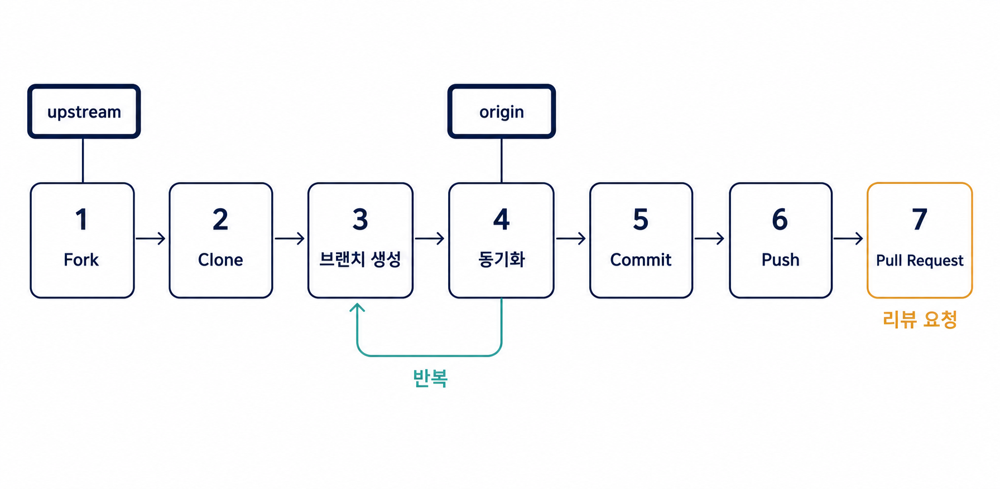

*[GitHub Pull Request 절차]*

**Step 1. Fork**

Upstream Repository를 자신의 GitHub 계정으로 [Fork](https://help.github.com/en/github/getting-started-with-github/fork-a-repo)[^contributing-fork]한다.

[^contributing-fork]: Fork : https://help.github.com/en/github/getting-started-with-github/fork-a-repo

**Step 2. Clone**

Fork한 Repository를 자신의 Local working directory로 Clone 한다.

```text
$ mkdir -p $working_dir
$ cd $working_dir
$ git clone https://github.com/$user/[repository]
```
Upstream Repository를 [Remote](https://git-scm.com/book/ko/v2/Git-%EB%B8%8C%EB%9E%9C%EC%B9%98-%EB%A6%AC%EB%AA%A8%ED%8A%B8-%EB%B8%8C%EB%9E%9C%EC%B9%98)[^contributing-remote]에 추가한다.

[^contributing-remote]: 리모트 브랜치 : https://git-scm.com/book/ko/v2/Git-브랜치-리모트-브랜치

```text
$ cd [repository]
$ git remote add upstream https://github.com/[upstream]/[repository]

# Confirm that your remotes make sense: 
$ git remote -v
```

**Step 3. Create a branch**

먼저 main [branch](https://git-scm.com/book/ko/v2/Git-%EB%B8%8C%EB%9E%9C%EC%B9%98-%EB%B8%8C%EB%9E%9C%EC%B9%98%EB%9E%80-%EB%AC%B4%EC%97%87%EC%9D%B8%EA%B0%80)[^contributing-branch]를 fetch와 [rebase](https://git-scm.com/book/ko/v2/Git-%EB%B8%8C%EB%9E%9C%EC%B9%98-Rebase-%ED%95%98%EA%B8%B0)[^contributing-rebase]하여 최신 상태로 유지한다.

[^contributing-branch]: Git 브랜치 - 브랜치란 무엇인가 : https://git-scm.com/book/ko/v2/Git-브랜치-브랜치란-무엇인가
[^contributing-rebase]: Git 브랜치 - Rebase 하기 : https://git-scm.com/book/ko/v2/Git-브랜치-Rebase-하기

```text
$ cd $working_dir/[repository]
$ git fetch upstream
$ git checkout main
$ git rebase upstream/main
```

그리고 개발용 branch인 myfeature를 생성한다.

```text
$ git checkout -b myfeature
```

**Step 4. Keep your branch in sync**

Branch를 fetch와 [rebase](https://git-scm.com/book/ko/v2/Git-%EB%B8%8C%EB%9E%9C%EC%B9%98-Rebase-%ED%95%98%EA%B8%B0)[^contributing-rebase]하여 최신 상태로 유지한다.

```text
# While on your myfeature branch
$ git fetch upstream
$ git rebase upstream/main
```

그 상태에서 code 작업을 한다.

**Step 5. Commit**

수정 사항을 [commit](https://git-scm.com/book/ko/v2/Git%EC%9D%98-%EA%B8%B0%EC%B4%88-%EC%88%98%EC%A0%95%ED%95%98%EA%B3%A0-%EC%A0%80%EC%9E%A5%EC%86%8C%EC%97%90-%EC%A0%80%EC%9E%A5%ED%95%98%EA%B8%B0)[^contributing-commit]한다.

[^contributing-commit]: Git의 기초 - 수정하고 저장소에 저장하기 : https://git-scm.com/book/ko/v2/Git의-기초-수정하고-저장소에-저장하기

```text
$ git commit -a -m '[commit message]'
```

**Step 6. Push**

myfeature branch의 수정 사항을 자신의 GitHub Repository에 Push한다.

```text
$ git push -u origin myfeature
```

Step 4에서 rebase한 뒤 다시 푸시해야 하면 `$ git push --force-with-lease origin myfeature`를 쓴다. `--force-with-lease`는 원격에 내가 모르는 커밋이 있으면 푸시를 거부하므로 남의 커밋을 덮어쓰지 않는다.

**Step 7. Create a pull request**

GitHub에서 자신의 Repository에 가면 Compare & pull request 버튼이 활성화 된 것을 볼 수 있다. 이를 눌러서 Pull Request를 생성한다.

이후 Upstream Repository의 관리자는 요청된 Pull Request를 검토하여 Merge 여부를 결정한다.

> **Git 사용이 처음이라면**  
> 
> 다음의 Git에 대한 안내서를 참고할 수 있다. 
> * [Git cheat sheet](https://training.github.com/downloads/ko/github-git-cheat-sheet)[^contributing-gitcheatsheet]
> * [Do it! 지옥에서 온 문서 관리자 깃&깃허브 입문](https://opentutorials.org/course/2708)[^contributing-opentutorial]
> * [누구나 쉽게 이해할 수 있는 Git입문](https://backlog.com/git-tutorial/kr/intro/intro1_1.html)[^contributing-git-tutorial]

[^contributing-gitcheatsheet]: Git cheat sheet : https://training.github.com/downloads/ko/github-git-cheat-sheet
[^contributing-opentutorial]: Do it! 지옥에서 온 문서 관리자 깃&깃허브 입문 : https://opentutorials.org/course/2708
[^contributing-git-tutorial]: 누구나 쉽게 이해할 수 있는 Git입문 : https://backlog.com/git-tutorial/kr/intro/intro1_1.html

---


> **Pull Request가 처음이라면**
> 
> * [Make a Pull Request](http://makeapullrequest.com/)[^contributing-makepr](비디오 강의)를 참고한다.
> * 또한, [First Contributions](https://github.com/Roshanjossey/first-contributions)[^contributing-first-contributions]에서 Pull Request 만드는 것을 연습할 수 있다.

[^contributing-makepr]: Make a Pull Request : http://makeapullrequest.com/
[^contributing-first-contributions]: First Contributions : https://github.com/Roshanjossey/first-contributions


#### 5. Feedback을 받아라

기여를 제출하면 프로젝트로부터 Feedback을 받게 된다.

>
> 일반적으로 Feedback은 개선이나 변경 사항이 어떤 방식으로 동작하는지, 왜 그런 방식을 채택하였는지 등의 설명을 요구한다. 이 Feedback은 때로는 대응하기 어려울 수도 있지만, 기여의 수준을 높이는 과정이라고 받아들이는 것이 좋다.
>


Feedback은 보통 다음 네 가지 중 하나에 해당한다.

##### 응답이 없다?

기여하기 전에 프로젝트가 활발한지 먼저 확인하는 것이 좋다. 어느 정도 활발한 프로젝트에서도 기여에 대한 응답을 받지 못할 수 있다. 일주일 이상 응답을 받지 못했다면 동일한 스레드에 정중하게 누군가에게 검토를 요청하는 것이 좋다. 적절한 사람의 이름을 알고 있다면 @-멘션 기능을 이용한다.

> 단, 개인적으로 연락하지는 마라. 오픈소스SW 프로젝트에서 공개 커뮤니케이션은 필수이다.

그런데도 여러 가지 이유가 있겠지만 아무도 반응하지 않을 수도 있다. 썩 좋은 기분은 아니지만 낙담할 필요는 없다. 이는 누구에게나 일어날 수 있는 일이다. 기여할 수 있는 다른 방법이나 다른 프로젝트를 찾아보라.

##### 수정을 요청한다?

아이디어 설명이나 코드를 수정하라는 요청을 받는 것은 일반적이다. 이렇게 누군가 수정을 요청했다면 바로 응답한다. 그는 자기 시간을 내서 여러분의 기여를 검토했다.

Pull Request를 생성한 상태로 응답하지 않고 남겨두는 것은 실례다. 더 이상 문제를 해결할 여건이 아니라면 메인테이너에게 더 진행할 수 없다고 알려라. 그렇게 Pull Request를 Close 하거나 다른 사람이 인수해 추가로 진행할 수 있게 한다.

##### 거절됐다?

여러분의 기여는 결국 수락될 수도 있고, 수락되지 않을 수도 있다. 수락되지 않은 이유가 잘 이해되지 않을 경우, 메인테이너에게 설명을 요청할 수도 있다. 그러나 그들의 결정을 존중해야 한다. 논쟁하거나 적대적으로 행동하지 마라. 끝까지 이견이 조율되지 않으면, 언제든지 Fork 하여 자신의 프로젝트에 작업할 수 있다.

> 코드가 승인되기까지 여러 차례의 반복적인 수정 과정을 거쳐야 할 수도 있으며, 때에 따라서는 거부될 수도 있다. 이때는 낙심하거나 포기하기보다는 거부된 이유를 자세히 알아보고, 다음 기여가 향상되는 기회로 삼는 것이 좋다.

##### 수락됐다!

축하한다! 드디어 오픈소스SW 기여에 성공했다.

---

지금까지 오픈소스SW 기여의 혜택과 필요성, 기업이 기여 정책을 수립할 때 고려할 사항, 개인의 오픈소스SW 기여 방법을 살펴보았다. 오픈소스SW 기여를 통해 오픈소스SW 커뮤니티에 참여해보라. 회사에서는 배울 수 없었던 새로운 경험을 하게 될 것이다. 업계의 진정한 고수들을 만나면 다시 열정이 솟아오른다. 그렇게 쌓인 역량은 회사 안에서 영향력으로 이어지고, 회사의 개발 역량도 함께 향상된다.
기업은 구성원이 오픈소스SW 커뮤니티에 참여하는 것을 장려해야 한다. 그러면 기업의 자산인 개발자들의 역량이 결국 늘어난다. 단, 기업은 지식재산 보호를 위한 최소한의 정책을 수립하고 개발자들이 이를 충분히 인식하도록 교육해야 한다. OSPO를 만들어 이런 활동이 회사 전체에 퍼지게 한다.

다음 장에서는 한 걸음 더 나아가서 기업이 개발한 소프트웨어를 오픈소스SW로 공개하고, 커뮤니티를 활성화하는 과정을 설명한다.


---

# 3. 오픈소스SW 공개하기

>
> 이 책에서는 기업이 오픈소스SW를 공개하는 과정에서 일반적으로 발생하는 일을 다룬다. 특정 기업의 예외 사항까지 모두 다루지는 않는다.
>


이번 장에서는 두 가지 입장에 따라 오픈소스SW 공개 과정을 서술한다.

1. 오픈소스SW 공개 가이드 - 기업 편:  
   OSPO을 운영하는 입장을 위한 가이드이다. 기업 구성원으로부터 오픈소스SW 공개 요청이 있을 때, 혹은 기업의 사업 차원에서 오픈소스SW 공개를 진행할 때 고려해야 할 내용을 다룬다.
2. 오픈소스SW 공개 가이드 - 개발자 편:  
   기업에 속한 개발자 입장을 위한 가이드이다. 회사 업무 목적으로 오픈소스SW를 공개하는 경우 신경 쓰면 좋을 내용을 다룬다.

## 오픈소스SW 공개, 왜?

오픈소스SW 공개와 운영에는 여러 사람의 의지가 필요하다. 물론 한 사람의 강력한 의지만으로 성공하는 경우도 있다. 다만 이 가이드에서는 기업의 오픈소스SW 공개를 다루므로 좀 더 일반적인 상황을 가정한다. 오픈소스SW 공개 의지가 있는 몇몇 사람이 먼저 모이고, 의지가 없던 다른 구성원의 동의를 얻은 뒤에야 공개 절차가 본격적으로 시작된다. 어떤 과정을 거쳐 새로운 오픈소스SW를 공개하는지 설명하기 전에, 다른 사람을 설득할 때 도움이 되는 '오픈소스SW를 공개해서 얻을 수 있는 이점'을 먼저 정리한다.

### 기업에서 얻는 이점

기업 입장에서는 힘들여 만든 소스 코드를 공개하는 이유에 의문을 가지기 쉽다. 당장 손해로만 보일 수 있기 때문이다. 그러나 기업이 얻는 이점도 분명히 있다.

#### 1. 기술 브랜드 인지도 향상

개발자를 채용하는 기업은 대부분 채용이 어렵다고 말한다. 원하는 인재를 찾기도 어렵고, 그 인재가 자사를 마음에 들어 하게 만들기는 더 어렵기 때문이다. 좋은 개발자를 채용하려고 기업은 여러 방법을 시도한다. 자사의 개발 문화를 알리기 위해 소책자를 만들기도 하고, 광고나 동영상을 제작하거나 채용 설명회에서 발표하기도 한다. 이런 여러 방법 중에서 오픈소스SW 공개 소식은 특히 매력적인 소재가 된다. 예를 들어 안드로이드 애플리케이션 개발에 쓰는 라이브러리를 오픈소스SW로 공개하면, 구직 중인 안드로이드 개발자에게 다음과 같은 내용을 함축적으로 전달할 수 있다.

- 기업에서 안드로이드 개발을 할 때 어떤 부분에 신경 쓰는지
- 기업에서 이미 근무 중인 안드로이드 개발자들이 어떻게 개발하고 있는지
- 기업에서 이미 근무 중인 안드로이드 개발자들이 얼마나 열정적인지

백문이 불여일견이다. 설명으로 전달할 수도 있지만, 오픈소스SW로 직접 보여주면 전달력이 다르다.

#### 2. 직원 리텐션 효과

오픈소스SW를 공개하고 나면 성취감을 얻는다. 평소 서비스나 제품을 개발했을 때 느끼는 성취감과는 확연히 다르다. 유능한 직원을 회사에 머물게 하려면 여러 노력이 필요한데, 업무 만족도를 높여 자긍심을 갖게 하는 일도 오픈소스SW 공개로 할 수 있다.

#### 3. 직원들 기술 역량 향상

직원이 알아서 성장하면 좋겠지만 쉬운 일이 아니다. 새로운 기술은 계속 나오는데 조직 분위기가 침체되어 있으면 좋은 결과물을 내기 어렵다. 사내 교육 프로그램을 잘 구성하는 것도 중요하지만, 오픈소스SW를 공개하고 운영하는 과정에서 배우는 기술은 교육만으로는 얻기 어렵다. 구체적으로 어떤 기술을 배우는지는 뒤에 나오는 '개발자로서 얻는 이점'에서 다룬다.

#### 4. 오픈소스SW 커뮤니티로부터 받는 지지 (오픈소스SW 생태계 선순환)

이 이점은 당장 체감하기는 어렵다. 그러나 먼 미래에 결정적인 도움을 받는다면 대개 이런 경우다. 설명을 위해 같은 오픈소스SW를 사용하는 두 기업을 가정한다.

- 기업 A: 오픈소스SW를 단순히 사용한다. 사용하는 오픈소스SW가 요구하는 라이선스 의무는 꼼꼼히 지킨다. 이 오픈소스SW로 개발한 프로그램으로 수익을 낸다.
- 기업 B: 기업 A처럼 오픈소스SW에 많이 의지하지만, 필요한 플러그인을 직접 개발해 오픈소스SW로 공개했다. 많지는 않아도 몇몇 외부 사람이 이 오픈소스SW의 목적과 주요 기능을 알고 있다.

두 기업이 각각 이 오픈소스SW를 사용하다가 문제를 만나 커뮤니티에 해결 방안을 문의하는 상황을 생각해보자. 커뮤니티는 그동안 관계를 쌓아 온 기업 B의 질문에 더 우호적으로 반응할 가능성이 크다. 단순히 답을 얻는 데서 그치지 않고 직접적인 해결책을 제시받을 수도 있다. 정리하면 오픈소스SW에서 도움을 받은 기업이 새로운 오픈소스SW를 만들어 돌려주고, 다시 서로 돕는 단계로 이어진 것이다. 이것이 선순환의 한 예다.

#### 5. 커뮤니티 리소스 유입

이 장점은 앞서 언급한 다른 장점을 모두 제치고 가장 강력한 설득 포인트가 된다. 이 장점을 이해하려면 먼저 오픈소스SW가 잘 운영되는 방식을 살펴본다.

오픈소스SW가 공개되어 성공적으로 궤도에 오르면 다음과 같은 순환이 만들어진다. 채택할 만큼 매력이 있으면 사용자가 늘어나고, 그 사용자들이 문제를 만날 때마다 버그를 제보하거나 새 기능을 제안한다. 나아가 사용자가 기여자가 되어 개발에 직접 참여하면 프로젝트의 성장은 더 가속화된다.


*[오픈소스SW 운영]*


오픈소스SW로 공개하지 않은 내부 프로그램과 비교하면 다음과 같이 요약할 수 있다.
- 훨씬 더 많은 사람에게서 받는 피드백과 아이디어
- 훨씬 더 다양한 환경에서 사용되어 얻는 안정성(미처 발견하지 못한 오류를 찾을 가능성이 커짐)
- 훨씬 더 많은 사람의 자발적 참여로 기업이 투입해야 하는 리소스가 줄어듦

#### 6. 제품의 셀링 포인트<sub>Selling Point</sub>로 작용

기업은 이윤을 추구하는 조직이다. 어떤 행동이든 이윤으로 이어질 때 결정을 내린다. 제품의 고객층이 개발자라면 오픈소스SW 공개가 제품 판매에 도움이 된다. 예를 들어 제품의 SDK<sub>Software Development Kit</sub>를 제공하는 상황을 가정해보자. SDK를 배포하는 이유는 다른 개인이나 기업이 SDK를 잘 사용하게 해서 제품의 활용도와 의존도를 높이기 위해서다. SDK를 배포할 때는 사용 가이드와 함께 샘플 코드를 제공하는 경우가 많다. 그런데도 사용자는 문제 상황을 만나 질문을 남기거나 버그를 제보하고, SDK와 샘플 코드를 내려받기 전에는 사용 규칙 동의서에 서명한다. 이 모든 상황은 오픈소스SW 개발과 크게 다르지 않다. 오히려 사용자에게 친숙한 환경에서 소스 코드를 공개하고 질문을 받고 공지 사항을 게시하는 쪽이 이해에 더 도움이 된다. 결과적으로 개발자가 사용자인 제품이라면, 오픈소스SW 환경에서 사용자와 소통해 사용자 친화적인 제품을 만들고 커뮤니티를 형성하며 제품 판매에도 도움을 받을 수 있다.

---

이 모든 장점은 단기간에 체감하기 어렵다는 점도 덧붙인다. 처음 몇 년은 사막에서 오아시스를 찾는 것처럼 성과가 보이지 않을 수 있다. 그러나 시간이 지나면 사람들이 끊임없이 찾는 사막의 호수가 될 수 있다.

### 개발자로서 얻는 이점

학생 시절 과제를 예로 들어보자. 혼자 하는 과제와 조별 과제 중 하나를 고른다면 대다수는 조별 과제에서 크게 고생한 기억을 떠올릴 것이다. 그만큼 다른 사람과 무언가를 함께 한다는 것은 쉬운 일이 아니다. 그런데 오픈소스SW는 다른 사람, 심지어 만난 적도 만날 일도 없을 사람과 함께할 때 비로소 그 장점이 드러난다. 이를 위해서는 다양한 노력이 필요하다. 이런 노력을 통해 어떤 실력이 향상되는지 정리한다.

#### 1. 가독성 높은 코드의 작성 실력

혼자만 알아볼 수 있는 코드를 작성했는데 다른 사람이 사용하다가 예상과 다르게 동작한다고 가정해보자. 사용자는 어느 부분이 문제인지 스스로 찾지 못하고 질문만 남기거나 다른 제품으로 대체해 버릴 수 있다. 반대로 읽기 쉬운 코드를 작성했다면, 문제를 겪은 사람이 직접 원인을 찾아 해결하는 Pull Request를 보내기도 한다. 따라서 미래의 자신에게 돌아올 부담을 줄이려면 다른 사람이 쉽게 이해할 수 있는 코드를 작성해야 한다.

#### 2. 문서 작성 실력

코드 작성 이외에도 오픈소스SW의 동작 방식을 설명하는 문서와 주석을 적절히 갖춰야 한다. 너무 길고 상세하게만 쓴 글은 가독성이 떨어지고, 반대로 너무 짧게 쓴 글은 이해도를 낮춘다. 이 과정에서 의도를 적절한 순서로 설명하는 글쓰기 연습을 하게 된다. 사용자가 궁금해하는 내용을 문서에서 찾지 못하면 질문을 남기고, 그 질문을 통해 문서의 부족한 부분을 보완할 수 있다.

#### 3. 커뮤니케이션 실력

오픈소스SW 개발에서는 코딩보다 커뮤니케이션에 더 많은 시간을 쓰기도 한다. 소통하는 사람들이 서로 다른 지식과 언어, 시간대를 갖고 있기 때문이다. 그래서 하나의 문제를 해결하려면 효율적으로 설명하고 질문하는 연습이 필요하다. 기술적인 커뮤니케이션 능력뿐 아니라 다른 사람의 입장을 이해하고 자만하거나 소극적이지 않은 태도도 효율적인 커뮤니케이션에 필수적이다. 오픈소스SW를 공개하고 운영하는 과정에서 이런 다양한 커뮤니케이션 능력을 익힐 수 있다.

#### 4. 오픈소스SW의 동작 원리 이해

오픈소스SW를 잘 사용하는 방법을 누군가 친절하게 알려주면 좋겠지만, 대부분은 스스로 검색하고 찾아보며 익혀야 한다. 어떤 오픈소스SW의 사용법을 익혀 잘 쓰다가 문제에 부딪혔다고 가정해보자. 동작 방식을 모르면 어디에 질문하고 어떻게 답을 얻어야 할지 알기 어렵다. 오픈소스SW의 동작 원리를 이해하고 있으면 이런 상황에서 유리하다.

#### 5. 포트폴리오

최근 경력 개발자 채용 공고에서는 특정 대형 오픈소스SW 사용 경험이나 오픈소스SW 활동 경험을 우대 사항으로 명시하는 경우를 흔히 볼 수 있다. 기업이 이미 쓰고 있는 오픈소스SW와 관련된 활동을 한 사람은 이직 후에도 바로 실무에 투입될 수 있다고 기대하기 때문이다. 또한 면접관이 이력서를 볼 때 이전 직장 경력은 지원자의 설명에만 의존해 이해해야 하지만, 오픈소스SW 활동 경력은 직접 확인해 직관적으로 이해할 수 있다는 이유도 있다. 오픈소스SW를 직접 공개하고 운영한 경험은 앞서 나열한 여러 실력을 쌓아왔다는 증거가 되어 더 설득력 있는 이력서로 이어진다.


## 오픈소스SW 공개 가이드 - 기업 편

지금까지 '왜?'라는 물음에 답했다. 이제 누가, 언제, 어디서, 무엇을, 어떻게라는 다섯 개의 물음이 남았다. 앞으로는 이 다섯 물음에 답하며 오픈소스SW 공개의 여정을 살펴본다.

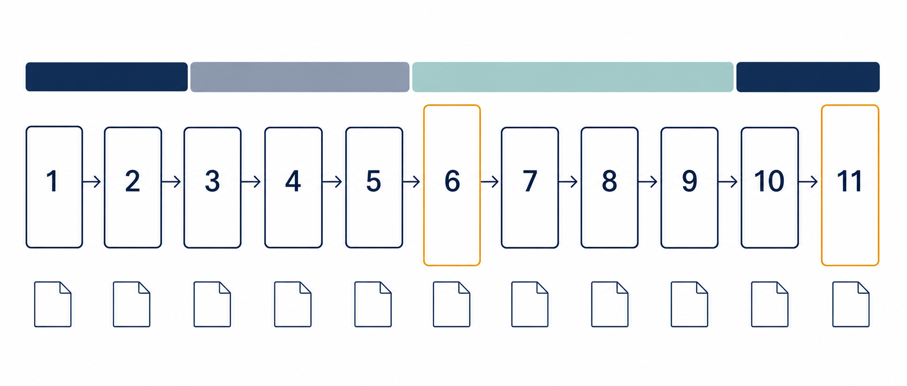

*[오픈소스SW 공개 여정 — 단계별 담당 주체와 산출물]*

### 공개 규칙 마련하기

#### 누가?(1) — 누가 검토할 것인가? 유관부서들에 오픈소스SW 공개에 관해 설명하기

오픈소스SW와 관련이 있을 부서를 상세히 나열하면 특허팀, 상표팀, 보안팀, 오픈소스SW 검수팀(컴플라이언스), 인사팀, 홍보팀·마케팅팀, 법무팀 등 7개 부서로 꼽을 수 있다. 조직 사정에 따라 미리 만나야 할 팀이 더 많거나 적을 수 있다. 요점은 오픈소스SW 공개 계획을 처음 알릴 때 유관부서가 자신과 상관없는 일이라고 여겨 관심을 잃기 전에, 각 부서가 주로 어떤 점을 검토해야 하는지 미리 설명하는 데 있다.

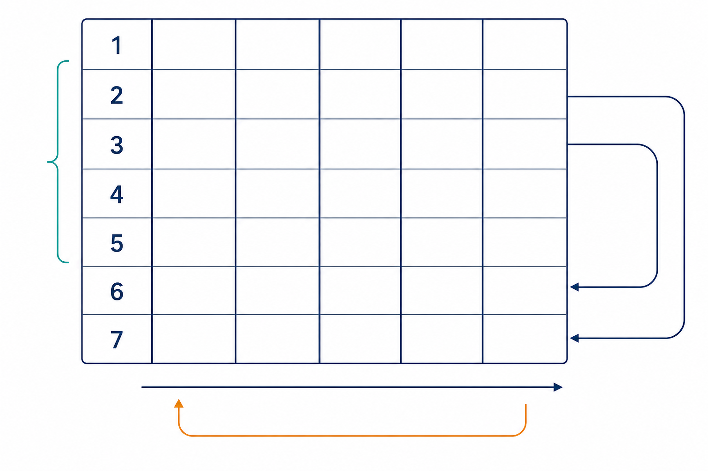

*[공개 검토에 참여하는 유관부서와 검토 관점]*

##### 1. 특허팀: 공개하려는 프로그램에 자사의 특허가 포함되어있지는 않은지 확인한다.
특허가 포함되어 있다면 특허에 우선권을 줄지, 오픈소스SW 공개로 얻는 혜택을 택할지 고민해야 한다. 방어 목적의 특허라면 대개 사업 이익과는 거리가 멀므로, 오픈소스SW 공개로 얻는 혜택을 잘 설명할 필요가 있다.
공개하려는 프로그램에 특허로 출원할 부분이 없는지도 함께 검토하는 것이 좋다. 오픈소스SW에 특허가 포함된 경우에는 특허권을 보호하는 오픈소스SW 라이선스를 선택해야 한다. 라이선스 선택에 관한 자세한 내용은 오픈소스SW 공개 가이드 - 기업 편 [어떻게? — 어떤 조건으로 공개할 것인가? 공개에 적합한 라이선스 후보군 정하기](#어떻게--어떤-조건으로-공개할-것인가-공개에-적합한-라이선스-후보군-정하기)에서 다룬다.

##### 2. 상표팀: 공개하려는 프로그램의 명칭이 타사의 상표권을 침해하지 않는지 확인한다.
부르기 쉽고 의미도 알기 쉬운 이름은 오픈소스SW가 널리 알려지는 데 중요한 역할을 한다. 그러나 이미 출시된 상표는 이 세상에 아주 많다. 게다가 오픈소스SW를 어느 국가의 사람들이 사용하게 될지 특정할 수 없으므로 광범위한 조사가 필요하다. 공개한 오픈소스SW의 명칭이 다른 상표권을 침해했을 때 발생하는 비용과, 상표권 출원에 드는 비용 중 어느 쪽을 선택할지 고민해야 한다. 어떤 명칭이 타사 상표와 동일한 경우를 긍정적으로 본다면, 기존 상표의 브랜드에 '오점'이 될 만한 나쁜 일을 한 것은 아니며 오히려 사회에 오픈소스SW를 기부했다는 긍정적 이미지로 해석되기도 한다. 반대로 부정적으로 본다면 상표 침해로 인한 피해 보상과 기업 이미지 타격까지 고려해야 한다. 따라서 공개할 오픈소스SW의 운영 기간과 전파 범위에 따라 상표 출원까지 할지, 아니면 상표 조사만으로 현시점에 침해 리스크가 없는 명칭을 고르는 데 그칠지 현실적으로 판단해야 한다.
명칭의 모든 후보를 다 검토하기에는 많은 시간이 걸리므로, 후보 상표가 이미 출원되었는지 직접 검색해 보는 것도 좋은 방법이다. 한국의 경우에는 [KIPRIS 상표 검색](https://www.kipris.or.kr/khome/search/searchResult.do?tab=trademark)[^releasing-kipris]을 이용할 수 있다.

[^releasing-kipris]: KIPRIS 상표 검색 : https://www.kipris.or.kr/khome/search/searchResult.do?tab=trademark

##### 3. 보안팀: 공개하려는 프로그램에 기업의 기밀 정보가 포함되어있지는 않은지, 그리고 보안 취약점이 없는지 확인한다.
소스 코드가 직접 공개되므로 민감한 IP 주소, 내부 시스템 관련 정보, 직원 개인정보 같은 특정 키워드가 포함되어 있지 않은지 확인해야 한다. 또한 공개하려는 프로그램이 널리 쓰이려면 안정성을 보장해야 하므로 보안 취약점이 없는지도 확인해야 한다.

##### 4. 오픈소스SW 검수팀: 공개하려는 프로그램에 어떤 오픈소스SW가 포함되었는지 확인한다.
공개할 소스 코드에 포함된 오픈소스SW 라이선스 준수 여부를 확인하려면 평소와는 다른 접근이 필요하다. 기존에 기업이 하던 배포 형식과 다르기 때문이다. 응용 프로그램이 아니라 소스 코드 자체를 배포하는 경우를 확인해야 한다. 따라서 소스 코드 형태로 재배포되는 오픈소스SW가 있는지, 의존성은 어떻게 배포되는지 확인한다. 또 공개할 오픈소스SW를 npm, pip, Maven Central 등으로 패키지 배포하는 경우에는 무엇이 패키지 배포에 포함되는지 확인한다. 마지막으로 새 오픈소스SW에 적용할 라이선스와, 소스 코드에 포함된 다른 오픈소스SW의 라이선스가 서로 상충하지 않는지도 확인한다. 이런 다양한 배포 형태를 고려해 고지문을 작성한다.

##### 5. 인사팀: 직원이 입사할 때 작성한 근로계약서, 비밀유지서약서 등에서 오픈소스SW 공개는 예외로 간주됨을 인지한다.
모든 직원은 입사할 때 근로계약서를 작성한다. 소프트웨어 개발 직군은 대개 '업무 중에 작성한 소스 코드는 기업의 자산이다', '기업에서 작성한 소스 코드는 정해진 곳에만 게시한다'는 내용의 동의서도 함께 작성한다. 오픈소스SW로 공개하는 일을, 업무 중 작성한 기업 자산을 외부 서버에 올리는 행위로 오해할 수 있다. 그러나 실제로는 기업 이름으로, 기업이 정한 장소에 소스 코드를 올리는 것이므로 이 점을 명확히 설명해야 한다.
오픈소스SW를 공개하고 운영하는 데는 적지 않은 시간과 노력이 든다. 이 과정이 다른 직원에게 '업무가 아닌 일'로 비치지 않도록 균형을 맞춰야 한다. 예를 들어 기업이 공개한 오픈소스SW를 외부인이 사용하다가 문제를 겪고 질문을 남겼다고 하자. 메인테이너가 반드시 답할 의무는 없지만, 사용자를 잘 유지하는 것도 오픈소스SW 운영에서 필수적인 일이므로 대부분 답변에 시간을 쓴다. 이 또한 기업 자산을 더 높은 품질로 발전시키는 업무의 일부라는 공감대를 형성해야 한다. 이 공감대가 형성되지 않으면 누구도 개인 시간을 들여 기업의 오픈소스SW를 개발하려 하지 않으므로 세심한 주의가 필요하다.

##### 6. 홍보팀&마케팅팀: 공개한 오픈소스SW가 세상에 널리 알려지도록 노력한다.
오픈소스SW를 공개했다고 가정해보자. 사람들이 저절로 모여 이 오픈소스SW를 구경하고 사용하고 발전시켜 주지는 않는다. 새로운 오픈소스SW가 탄생했다는 사실을 꾸준히 알려야 한다. 소셜 미디어, 동영상, 기사, 블로그 등 다양한 매체로 오픈소스SW의 기능을 설명해야 사용자에게 인식되며, 이런 작업이 앞으로도 꾸준히 필요하다는 점을 홍보팀이 인지해야 한다.
오픈소스SW 자체를 홍보하는 것에 더해, 기업이 오픈소스SW 활동을 적극적으로 지원한다는 이미지를 알리는 매체 인터뷰에 응하면 기업 브랜딩에도 좋은 수단이 된다.

##### 7. 법무팀: 법적인 부분을 검토하고 오픈소스SW를 접하는 사람들이 안전한 환경에 있도록 보장한다.
소스 코드를 공개해 사람들이 널리 활용하고 여러 사람이 개발에 함께 참여하는 과정에는, 일상에서 쉽게 이해하기 어려운 규칙이 따른다. 법무팀은 대표적으로 다음 두 가지 상황에서 어떤 리스크가 있는지 법적으로 검토해야 한다.
- 소스 코드를 공개하는 시각: 소스 코드를 공개하는 과정에는 여러 리스크가 따른다. 예를 들어 오픈소스SW에 자사 특허가 포함된 경우 특허 침해로 손해를 입지 않아야 한다. 또한 오픈소스SW에 심각한 결함이 있어 사용자가 피해를 본 경우, 공개한 쪽이 배상하느라 손해를 보는 일도 없어야 한다. 이런 내용은 라이선스에 명시되어 있으며, 법적으로 기업에 피해가 가지 않도록 보장해야 한다. 라이선스 선택에 관한 자세한 내용은 오픈소스SW 공개 가이드 - 기업 편 [어떻게? — 어떤 조건으로 공개할 것인가? 공개에 적합한 라이선스 후보군 정하기](#어떻게--어떤-조건으로-공개할-것인가-공개에-적합한-라이선스-후보군-정하기)에서 다룬다.
- 오픈소스SW에 기여를 받는 시각: 기업이 공개한 오픈소스SW에 외부에서 기여를 받는 상황을 가정해보자. 기여자가 작성한 코드에만 다른 공개 규칙(라이선스)이 적용되면, 이후 오픈소스SW를 사용하는 사람들이 혼란에 빠질 수 있다. 더 심각하게는 기여자가 이전에 제공한 내용을 되돌려 받고 싶다고 요구할 수도 있다. 이렇게 오픈소스SW에 기여를 받을 때(또는 기여할 때) 지켜야 할 규칙은 기여자 라이선스 동의서(Contributor License Agreement, 이하 CLA)에서 명시한다. 개인 기여에는 ICLA(Individual CLA), 기업이나 단체를 대표한 기여에는 CCLA(Company CLA)를 각각 적용한다. 규모가 큰 오픈소스SW 재단이 작성한 라이선스를 적용하는 경우에는 이에 상응하는 CLA가 있는 경우가 많다. 따라서 법무팀은 이 CLA의 내용을 검토하고 리스크가 없는지 확인해야 한다.

대표적인 CLA 양식은 다음을 참고한다.
- [Apache Software Foundation Contributor License Agreement](https://www.apache.org/licenses/contributor-agreements.html)[^releasing-apache-cla]
- [Cloud Native Computing Foundation Contributor License Agreement](https://github.com/kubernetes/community/blob/master/CLA.md)[^releasing-k8s-cla]
- [Python Software Foundation Contributor Agreement](https://www.python.org/psf/contrib/)[^releasing-python-cla]

[^releasing-apache-cla]: Apache Software Foundation Contributor License Agreement : https://www.apache.org/licenses/contributor-agreements.html
[^releasing-k8s-cla]: Cloud Native Computing Foundation Contributor License Agreement : https://github.com/kubernetes/community/blob/master/CLA.md
[^releasing-python-cla]: Python Software Foundation Contributor Agreement : https://www.python.org/psf/contrib/

기여 규칙으로는 CLA와 DCO(Developer Certificate of Origin, 이하 DCO) 두 방식이 병존한다. 따라서 공개하려는 프로젝트의 특성에 따라 어떤 기여 규칙을 적용할지 판단한다.

두 방식의 개념과 차이, 서명 부담, 기업이 검토해야 할 항목은 [오픈소스SW 기여 가이드 - 기업 편: 4. CLA / DCO에 주의하라](#4-cla--dco에-주의하라) 를 참고한다.

#### 누가?(2) — 누가 공개하고 운영할 것인가? 멤버 역할과 권한 설정 규칙 정하기

오픈소스SW가 잘 운영되려면 특정 역할을 맡은 사람이 있어야 한다. 메인테이너가 한 명뿐인 오픈소스SW에서 그 한 명이 퇴사하면, 커뮤니티가 이미 강력하게 형성되어 있지 않은 한 그 오픈소스SW는 점차 잊힌다. 반대로 너무 많은 사람에게 소유자 권한을 주면 누군가 실수로 설정을 바꾸는 사고가 날 수 있다. 따라서 프로젝트 규모에 따라 최소 몇 명의 멤버가 어떤 권한을 가질지 사전에 정해야 한다. GitHub을 기준으로 역할별 권한을 다음 표로 정리한다.

|역할|권한|
|---|---|
|Read|저장소에 접근하고 clone 하기<br>issue 생성하고 의견남기기<br>pull request를 생성하고 의견남기기<br>`@` 기호로 언급할 수 있는 후보에 등록|
|Triage|Read 역할의 권한 전부<br>issue 관리하기|
|Write|Triage 역할의 권한 전부<br>저장소에 push하기<br>pull request 관리하기|
|Maintain|Write 역할의 권한 전부<br>저장소 설정 중 일부에 접근하기|
|Admin|Maintain 역할의 권한 전부<br>멤버 관리를 포함한 저장소 설정의 전부에 접근하기|

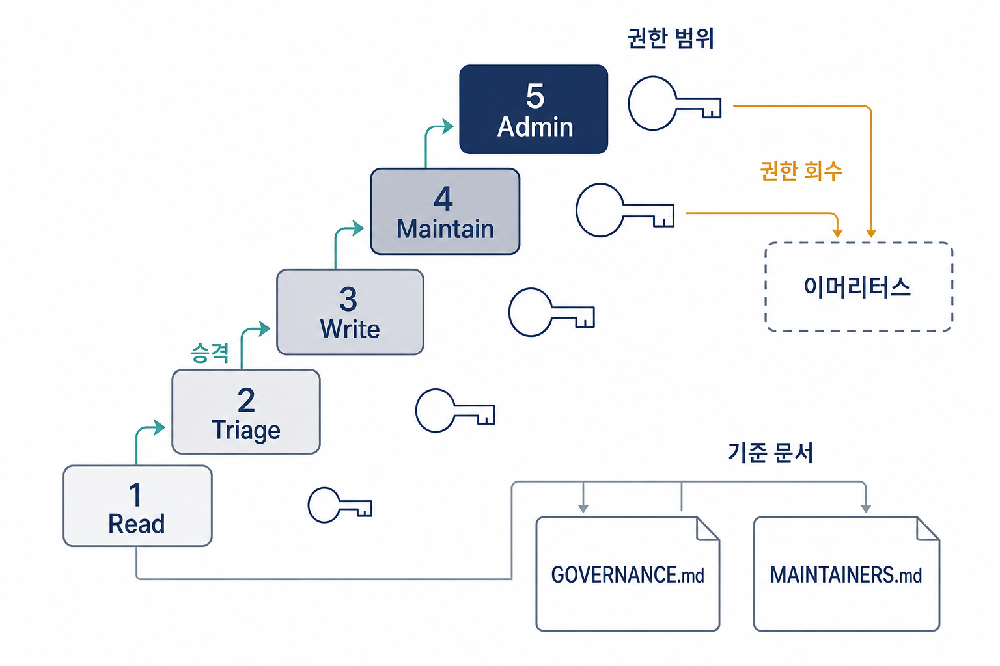

*[기여자 사다리 — 승격 기준과 권한 회수 경로]*

#### 언제? — 언제 공개할 것인가? 공개 시점 정하기

오픈소스SW를 공개할 때 완성도가 너무 떨어진 소스 코드를 내놓으면 안 된다는 것은 널리 알려져 있다. 그렇다고 지나치게 완벽한 상태(소프트웨어 개발에 완벽이란 사실상 없지만)로 공개하는 것도 좋은 전략은 아니다. 공개 이후 코드 변경, 문서 작성, 이슈 관리를 포함해 꾸준히 활동하지 않으면 관리되지 않고 정체된 인상을 주기 때문이다. 따라서 적당한 시점에 오픈소스SW로 내놓고 이후에 발전시키는 접근이 필요하다. 어느 정도가 완성인지 정량적으로 표현하기는 어려우므로, 공개할 때마다 이 점을 염두에 두고 시점을 정한다. 예를 들어 홍보 시점은 자사 개발자 콘퍼런스처럼 주목도가 높은 시점으로 잡을 수 있다.

#### 어디서? — 어디에 공개할 것인가? 공개 위치 선정하기

기업이 처음 오픈소스SW를 공개하는 경우라면 GitHub나 GitLab 등 인기 있는 저장소 플랫폼에 기업 이름으로 조직(Organization)을 만들 수 있는지 먼저 확인해야 한다. 먼저 선점하는 쪽이 이름을 갖게 되므로, 여러 절차 중에서도 가장 먼저 처리해 두는 것이 좋다.
라이브러리를 오픈소스SW로 공개할 때는 사람들이 손쉽게 사용할 수 있도록 패키지 저장소에도 배포해야 한다. 잘 알려진 패키지 저장소로는 프로젝트 성격에 따라 Maven Central, npm, PyPI 등이 있으며, 소스 코드 저장소와 마찬가지로 Organization 단위로 동작하는 경우가 많으므로 권한을 미리 확보해 둔다.
소스를 공개할 때는 소개 홈페이지, 기술 블로그 등을 함께 공개하고, 그 링크를 소스 저장소에서 확인할 수 있도록 하는 것이 좋다.

#### 어떻게? — 어떤 조건으로 공개할 것인가? 공개에 적합한 라이선스 후보군 정하기

오픈소스SW에 적용할 라이선스를 고르려면 다양한 상황과 우선순위를 고려해야 한다.

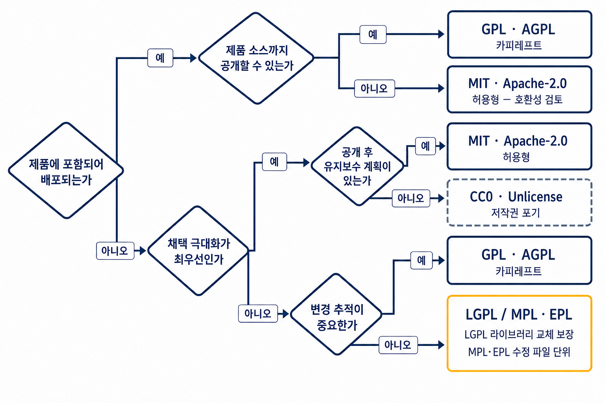

*[공개 라이선스 결정 트리]*

##### 공개할 오픈소스SW가 제품에 포함되고, 제3자에게 이 제품이 배포되는 경우
- 이 오픈소스SW에 Copyleft license를 적용해도, **저작권이 회사에 단독으로 있는 동안은** 저작권자와 라이선스 의무를 지킬 주체가 같으므로 법적 이슈가 생길 여지가 없다. 다만 커뮤니티에서는 제품의 소스 코드까지 공개하기를 기대할 수 있다.
- 이 전제는 외부 기여를 받는 순간 달라진다. 기여자의 저작권이 섞이면 회사도 그 부분에 대해서는 라이선스를 지켜야 하는 쪽이 된다. 이 장이 권하는 컨트리뷰터 사다리를 운영하려면 CLA로 저작권을 회사에 집중시킬지, DCO로 기여자 저작권을 그대로 둘지 공개 시점에 정해 두어야 한다. 두 방식의 차이와 기업이 검토할 항목은 이 장의 법무팀 검토 항목과 [오픈소스SW 기여 가이드 - 기업 편: 4. CLA / DCO에 주의하라](#4-cla--dco에-주의하라) 에서 다룬다.
- 이 오픈소스SW에 Permissive license를 적용한다면 제품에 포함될 법적 고지문에 라이선스와 저작권 표기를 추가하면 된다. 다만 제품에 포함된 다른 오픈소스SW와의 호환성도 함께 검토하는 것이 좋다.
##### 공개할 오픈소스SW가 널리 사용되는 것이 최우선의 목표일 경우
- 사용자의 진입 장벽을 낮추려면 Permissive license를 적용하는 것이 유리하다.
- 공개 이후 유지보수 계획이 없다면 Public domain, CC0, Unlicense 등 저작권을 포기하는 방식도 고려할 만하다. (발표나 데모에서 쓰는 code snippet 등)
##### 공개할 오픈소스SW의 변경 사항을 추적하는 것이 중요할 경우
- 오픈소스SW 버전과 상용 버전으로 나누어 사업을 한다면 오픈소스SW의 변경 사항을 추적하는 것이 중요하다. 아무 제한을 두지 않으면 수익에 지장을 줄 수 있기 때문이다. 이런 경우에는 Copyleft license를 적용하는 편이 유리하다. 변경 사항 추적 외에 특허권까지 폭넓게 보호할 수 있는 라이선스를 선택해야 한다.

#### 우리는 CRA상 무엇인가 — 제조사·스튜어드·무의무 판정

EU 사이버복원력법<sub>Cyber Resilience Act</sub>(규정 (EU) 2024/2847, 이하 CRA)은 오픈소스SW를 공개하는 주체를 제조사<sub>manufacturer</sub>와 오픈소스SW 스튜어드<sub>open-source software steward</sub>로 나누고, 어느 쪽에도 해당하지 않는 경우를 따로 둔다[^releasing-cra-reg]. 지위에 따라 부과되는 의무와 제재가 다르므로, 공개를 결정하는 단계에서 프로젝트마다 지위를 판정한다. 다음 표를 판정 기준으로 사용한다.

| 지위 | 해당하는 배포 형태 | 부과되는 의무 | 과징금 적용 여부 | 적용 시점 |
|------|-------------------|--------------|-----------------|----------|
| **제조사** | 오픈소스SW를 포함한 디지털 요소 제품을 EU 시장에 상업적으로 공급한다 | 제품 전체에 대한 CRA 준수 책임을 진다. 제품에 통합한 FOSS 구성요소 자체의 CRA 준수 책임은 지지 않으나, 제13조(5) 실사 의무와 제13조(6) 상류 프로젝트 보고·수정 공유 의무는 진다(지침 86~88항) | 적용된다. 다만 제64조(10)(a)는 마이크로·소기업 제조사가 제14조(2)(a)·제14조(4)(a)의 신고 기한을 지키지 못한 경우에 한해 과징금을 면제하고, 같은 항 (b)는 스튜어드의 규정 위반 전반을 면제한다 | 제14조 신고 의무 2026-09-11, 전면 적용 2027-12-11(제71조) |
| **오픈소스SW 스튜어드** | 제조사가 아닌 법인으로서, 상업적 활동에 쓰이는 특정 FOSS 제품의 개발을 지속적·체계적으로 지원하고 그 제품의 존속을 보장한다(제3조(14)) | 제24조의 세 가지 의무를 진다. ① 안전한 개발과 취약점 처리를 촉진하는 사이버보안 정책을 '검증 가능한 방식으로' 수립·문서화, ② 시장감시당국의 합리적 요청 시 문서 제공·협조, ③ 개발에 관여한 범위에서 제14조(1) 악용 취약점 신고와, 제공하는 인프라가 영향받는 경우 제14조(3)·(8) 중대 사고 신고 | 원칙적으로 적용되지 않는다. 제64조(10)은 제3항부터 제9항까지의 과징금에 대한 특례로서 (b)에서 '오픈소스SW 스튜어드의 이 규정 위반'을 제외 대상으로 명시한다. 다만 제2항의 과징금(부속서 I 필수요건 및 제13조·제14조 의무 위반)은 특례 열거에 포함되어 있지 않으므로, 제24조(3)을 통해 지는 제14조 신고 의무의 위반까지 완전히 면제되는지는 특례 문언상 단정할 수 없다 | 제24조 전면 적용 2027-12-11(제24조(3)을 매개로 하는 제14조(1)·(3)·(8) 신고 의무 포함). 제71조(2)의 적용 개시 예외는 제14조(2026-09-11)와 제4장 제35~51조(2026-06-11)뿐이며 제24조는 예외에 포함되지 않는다 |
| **어느 쪽도 아님** | 상업적 활동과 무관하게 공개하며, 특정 제품의 개발을 지속적으로 지원하지도 않는다 | CRA상 의무가 발생하지 않는다. 다만 같은 코드가 제3자의 제품에 통합되면 그 제품의 제조사 의무는 별도로 발생한다 | 적용되지 않는다 | 해당 없음 |

2026-09-11부터 신고 의무가 발생하는 것은 제조사이며, 스튜어드의 신고 의무는 제24조(3)을 근거로 하므로 2027-12-11부터 적용된다. 다만 지침 80항이 밝히듯 스튜어드는 그 전에도 인지한 악용 취약점 정보를 사이버보안 정책에 따라 메인테이너와 공유하는 것이 바람직하다. 제조사와 스튜어드 모두 2027-12-11이 전면 적용일이며, 그 이전에 앞당겨 적용되는 것은 제14조(2026-09-11)와 제4장 제35~51조(2026-06-11)뿐이다[^releasing-cra-reg]. CRA 적용 일정 전체와 제조사 관점의 대응 절차는 [오픈소스SW 사용하기](#1-오픈소스sw-사용하기)에서 다룬다.

집행위는 2026-07-27 CRA 적용 지침을 채택하면서 판정 규칙 두 가지를 확정했다[^releasing-cra-guidance-news][^releasing-cra-guidance]. 판정에서 다투기 쉬운 지점이므로 표와 함께 적용한다.

- CRA의 FOSS 정의(제3조(48))는 '자유·오픈소스SW 라이선스로 배포될 것'과 '소스코드가 공개적으로 공유될 것'을 모두 충족할 것을 요구한다. 따라서 유료 고객에게만 소스코드를 제공하는 소프트웨어는 CRA상 FOSS가 아니다(지침 44~46항).
- 상업적 활동 여부는 개발 경위나 자금 조달 방식이 아니라 수익화 여부로 판정한다. 가격 청구, 실비를 초과하는 기술지원 유료화, 플랫폼을 통한 부수 서비스 수익화, 보안·호환성 개선 외의 목적으로 개인정보 처리를 요구하는 행위, 개발·제공 비용을 초과하는 기부 수령이 여기에 해당한다(지침 41~42항).

같은 법인이 프로젝트마다 다른 지위를 가질 수 있다. 커뮤니티 에디션과 엔터프라이즈 에디션을 함께 운영하는 구조에서는 한 프로젝트에 스튜어드, 다른 제품에 제조사가 되는 경우를 지침 72~74항이 명시한다. 따라서 판정은 법인 단위가 아니라 프로젝트 단위로 한다.

판정 결과는 근거와 함께 문서로 남기고 감사 대응용으로 보관한다. 스튜어드로 판정된 프로젝트에는 `SECURITY.md` 수준의 안내가 아니라 취약점 접수·처리·공개 절차와 담당자, 목표 처리 기간을 담은 사이버보안 정책 문서를 갖춘다.

[^releasing-cra-reg]: Regulation (EU) 2024/2847 (Cyber Resilience Act), 제71조 적용 일자(전면 적용 2027-12-11, 제14조 2026-09-11, 제4장 제35~51조 2026-06-11) : https://eur-lex.europa.eu/eli/reg/2024/2847/oj/eng
[^releasing-cra-guidance-news]: Commission publishes new guidance to support timely Cyber Resilience Act implementation (2026-07-27) : https://digital-strategy.ec.europa.eu/en/library/commission-publishes-new-guidance-support-timely-cyber-resilience-act-implementation
[^releasing-cra-guidance]: Commission guidance on the application of Regulation (EU) 2024/2847, C(2026) 5252 final ANNEX, 27.7.2026 : https://ec.europa.eu/newsroom/dae/redirection/document/131456

### 문서화하기

오픈소스SW 공개 기반을 다지는 마지막 단계는 명확한 문서 작성이다. 지금까지 고민한 왜, 누가, 언제, 어디서, 무엇을, 어떻게에 해당하는 내용을 이해하기 쉬운 문서로 정리한다. 이 문서를 읽는 대상은 주로 오픈소스SW 공개를 신청하는 개발자이므로 개발자의 관점에서 작성한다. 문서에는 다음 내용이 들어가면 좋다.

- [ ] 기업이 오픈소스SW를 공개하는 취지와 포부
- [ ] 신청서 작성부터 공개까지 걸리는 전체 예상 시간과 과정
- [ ] 오픈소스SW 공개 신청서 작성 방법
- [ ] 오픈소스SW를 공개하기 위해 필요한 검토의 종류와 순서
- [ ] 검토의 목적
- [ ] 각 검토에 걸리는 예상 시간
- [ ] 도움을 받을 수 있는 연락처
- [ ] 오픈소스SW를 공개하기 전에 개발자가 알아 두면 좋은 내용(미래의 사용자를 위한 문서 작성, 필요한 인프라 등)

#### 오픈소스SW 공개 신청서

신청서 양식은 검토 과정을 어떻게 정하느냐에 따라 달라지므로 이 가이드에서 고정된 양식을 제시하지 않는다. 오픈소스SW 공개 검토에 필요한 내용을 각 부서에 확인하고 신청서에 담는다. 예를 들어 상표 검토를 위해 오픈소스SW의 명칭, 명칭 후보, 명칭을 정한 이유를 제출하게 하거나, 보안 검토를 위해 소스 코드 저장소 위치 등을 물어볼 수 있다. 또는 신청서에 검토 항목을 나열하지 않고, 신청자가 각 항목의 검토를 직접 신청하도록 안내하는 방식도 있다. 신청서 내용은 기업과 부서 상황에 따라 편차가 크므로 이 가이드에서는 항목을 따로 나열하지 않는다.

다만 검토에 필요한 정보 이외에 신청서 항목으로 추가하면 도움이 될 내용을 정리한다.

- 공개 목적: 이 항목에는 흔히 교과서적인 내용을 적는 경우가 많다. 이 항목을 적으면서 오픈소스SW 생태계에 기여하겠다는 의지를 다지는 계기도 된다. 다만 특수한 목적으로 공개하는 경우도 있다. 예를 들어 발표용 데모 코드를 공개하거나, 더 이상 유지보수되지 않는 다른 오픈소스SW를 fork하는 등 다양한 이유가 있을 수 있다. 이런 경우에는 운영 방침이 달라질 수 있으므로 목적을 미리 확인한다.
- 유사 오픈소스SW와의 비교: 대개 코드를 작성하는 이유는 어떤 문제를 해결하기 위해서다. 그런데 그 문제를 겪은 사람이 그 개발자뿐이라는 보장은 없다. 세상 어딘가의 누군가가 같은 문제를 겪고 이미 오픈소스SW로 공개했을 수도 있다. 따라서 이미 공개된 다른 오픈소스SW와의 차별점을 명확히 하는 것이 좋다.
- 로드맵: [언제? — 언제 공개할 것인가? 공개 시점 정하기](#언제--언제-공개할-것인가-공개-시점-정하기)에서 언급했듯, 공개 이후에도 기능을 꾸준히 개선하는 등 지속적인 관리가 필요하다. 정체된 오픈소스SW로 사람들의 기억 속에서 잊히기 전에, 간단하게라도 계획을 세워 둔다.
- 기술 평가 의견: 오픈소스SW 담당자가 기술적인 부분까지 모두 확인하기는 어렵다. 이 오픈소스SW가 공개되었을 때 해당 분야에서 어떤 평가를 받을지는 그 분야 전문가에게 미리 들어보는 것이 좋다. 공개를 신청하는 개발자의 상위 리더에게 받은 평가 의견이 있으면 프로젝트를 이해하고 홍보하는 데 큰 도움이 된다.
- 리소스 운영 계획: 로드맵을 세우면 개발자도 자연히 깨닫는다. 소스 코드를 공개하는 데서 끝나지 않고 앞으로도 꾸준히 시간을 들여야 한다는 사실이다. 현실적으로 리소스 운영 계획은 다른 업무 상황에 크게 좌우되므로, 구체적인 계획을 세우기보다는 이 오픈소스SW에도 계속 시간을 할애해야 한다는 점을 인지시키는 데 목적을 둔다.


### 공개하기

누군가 신청서를 제출했다고 가정해보자. 먼저 신청서 양식이 빠짐없이, 항목의 목적에 맞게 작성되었는지 확인한다. 이후 절차에 따라 검토를 진행한다. 오픈소스SW 담당자는 검토가 순서와 일정대로 진행되는지, 예상하지 못한 변수는 없는지 확인하고 챙긴다.

#### 신청서 확인

신청서 양식의 각 항목에는 확인하려는 의도가 있다. 신청서에 그 의도와 다른 내용이 있거나 빠진 내용은 없는지 확인한다.

#### 검토

앞서 문서화한 검토 단계에 따라 진행한다. 오픈소스SW 담당자는 검토가 일정대로 진행되는지, 변수는 없는지 확인한다.

#### 공개 준비

검토를 모두 마쳤다면 원칙적으로는 공개 준비가 끝난 셈이다. 이제 소스 코드를 실제로 공개하기 위해 해야 할 일을 설명한다. GitHub과 GitLab을 기준으로 참고 링크를 덧붙인다.

##### 오픈소스SW 거버넌스 문서 추가

거버넌스는 오픈소스SW 커뮤니티를 형성하고 사람들이 문제없이 어울리기 위해 필요하다. 사용 규칙, 행동 강령, 기여 규칙, 취약점 신고 창구를 각각 정해진 이름의 파일에 둔다. 이 형식을 따라야 사람들이 규칙을 쉽게 찾아볼 수 있고, 자동 점검 도구도 문서의 존재를 인식할 수 있다. 각 문서에 대한 자세한 설명은 [오픈소스SW 기여 가이드 - 개발자 편: 오픈소스SW 프로젝트는 어떤 문서를 제공하는가?](#오픈소스sw-프로젝트는-어떤-문서를-제공하는가) 를 참고한다.

공개 저장소에 두어야 할 문서 세트를 다음 표로 확정한다. 저장소 호스팅 서비스의 화면 구성은 바뀌므로 화면에 표시되는 항목 수가 아니라 이 표를 기준으로 점검한다.

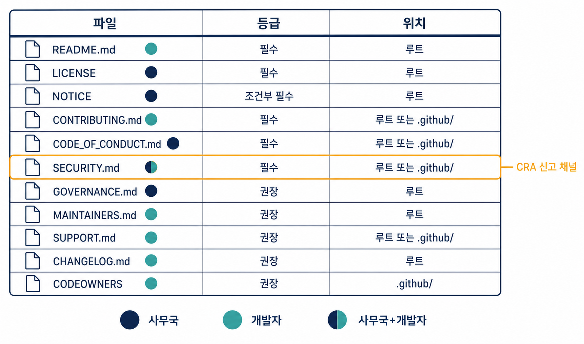

*[공개 저장소 문서 세트와 배치]*

| 문서 | 필수·권장 | 최소 항목 | 작성 주체 | 위치 |
|------|----------|----------|----------|------|
| `README.md` | 필수 | 프로젝트 이름과 한 문장 설명, 설치·사용 예시, 지원 창구, 라이선스 표기 | 개발자 | 루트 |
| `LICENSE` | 필수 | 적용 라이선스 전문. 파일명을 바꾸지 않는다 | 사무국 | 루트 |
| `NOTICE` | 조건부 필수 | 포함된 서드파티 오픈소스SW의 저작권 표기와 라이선스 고지. 고지 의무가 있는 구성요소가 하나라도 있으면 필수 | 사무국(검수팀) | 루트 |
| `CONTRIBUTING.md` | 필수 | 받고자 하는 기여의 종류, 개발 환경 설정, 제출 절차, 커밋·코딩 규칙, CLA/DCO 서명 방법 | 개발자 | 루트 또는 `.github/` |
| `CODE_OF_CONDUCT.md` | 필수 | 금지되는 언행, 신고 연락처, 위반 시 조치 절차 | 사무국 | 루트 또는 `.github/` |
| `SECURITY.md` | 필수 | ① 지원 버전 표, ② 신고 채널(저장소의 비공개 취약점 신고 기능 활성화), ③ 접수→분류→패치→공개까지의 목표 기간, ④ CVE 발급 경로(저장소 보안 권고 기능) | 사무국(보안팀)+개발자 | 루트 또는 `.github/` |
| `GOVERNANCE.md` | 권장 | 의사결정 방식, 역할 정의, 메인테이너 승격·회수 기준 | 사무국 | 루트 |
| `MAINTAINERS.md` | 권장 | 현재 메인테이너 명단과 담당 영역, 연락 방법 | 개발자 | 루트 |
| `SUPPORT.md` | 권장 | 질문 채널과 이슈 트래커의 용도 구분, 응답을 기대할 수 있는 범위 | 개발자 | 루트 또는 `.github/` |
| `CHANGELOG.md` | 권장 | 버전별 변경 사항, 호환성 깨짐 표시, 보안 수정 표시 | 개발자 | 루트 |
| `CODEOWNERS` | 권장 | 경로별 리뷰 책임자. 리뷰어 자동 지정에 사용한다 | 개발자 | `.github/` |

이 문서 세트 중 규제(CRA)상 의무의 이행 수단이 되는 것은 `SECURITY.md`다. [우리는 CRA상 무엇인가 — 제조사·스튜어드·무의무 판정](#우리는-cra상-무엇인가--제조사스튜어드무의무-판정)에서 스튜어드로 판정된 프로젝트라면, 이 파일이 취약점 접수 경로를 대외에 공표하는 실물이다. 신고 채널이 없으면 신고 의무 자체를 이행할 수 없다. `LICENSE`·`NOTICE`는 라이선스 의무의 이행 수단이며, 그 내용은 [오픈소스SW 사용하기: 오픈소스SW 고지 의무사항](#오픈소스sw-고지-의무사항)에서 다룬다.

문서 세트가 모두 마련되었는지 확인하는 점검 도구는 다음과 같다.

- [OpenSSF Scorecard](https://scorecard.dev/)[^releasing-scorecard] — 보안 실천 항목을 자동 점수화한다. [GitHub Action](https://github.com/ossf/scorecard-action)[^releasing-scorecard-action]으로 릴리스마다 실행할 수 있다. 채택자가 우리 프로젝트를 평가할 때 쓰는 지표이기도 하므로 공개 전 자가 점검에 먼저 사용한다.
- [OpenSSF Allstar](https://github.com/ossf/allstar)[^releasing-allstar] — 조직 단위로 저장소 정책을 강제한다. 저장소가 늘어난 뒤에 도입한다.
- [REUSE](https://reuse.software/)[^releasing-reuse] — 파일별 라이선스·저작권 헤더와 `LICENSES/` 디렉터리 규격을 검증한다.
- [GitHub Insights > Community Standards](https://docs.github.com/en/communities/setting-up-your-project-for-healthy-contributions/about-community-profiles-for-public-repositories)[^releasing-community-standards] — 저장소별 문서 충족 현황을 화면에서 확인한다.

[^releasing-scorecard]: OpenSSF Scorecard : https://scorecard.dev/
[^releasing-scorecard-action]: ossf/scorecard-action : https://github.com/ossf/scorecard-action
[^releasing-allstar]: OpenSSF Allstar : https://github.com/ossf/allstar
[^releasing-reuse]: REUSE : https://reuse.software/
[^releasing-community-standards]: About community profiles for public repositories — GitHub Docs : https://docs.github.com/en/communities/setting-up-your-project-for-healthy-contributions/about-community-profiles-for-public-repositories

`README.md`, `CONTRIBUTING.md`의 내용은 프로젝트를 운영할 개발자가 작성하는 것이 더 적합하다. 작성 요령에 대한 자세한 내용은 [오픈소스SW 공개 가이드 - 개발자 편: 오픈소스SW 공개를 준비하기](#오픈소스sw-공개를-준비하기) 에서 다룬다.

CLA는 기여 과정의 일부이므로 Contributing 문서에서 함께 다루는 것이 좋다. CLA 양식은 이미 정해두었더라도, 이를 서면으로 제출하게 하면 번거롭다. 그래서 대부분 전자 서명으로 운영한다. CLA를 관리하는 도구와 운영 사례는 다음을 참고한다.

- [CLA assistant](https://github.com/cla-assistant/cla-assistant)[^releasing-cla-assistant]
- [cla-bot](https://colineberhardt.github.io/cla-bot)[^releasing-cla-bot]
- [Google Developers Contributor License Agreements](https://cla.developers.google.com/clas)[^releasing-clas]
- [Microsoft Contributor License Agreement](https://cla.opensource.microsoft.com)[^releasing-mscla]

[^releasing-cla-assistant]: CLA assistant : https://github.com/cla-assistant/cla-assistant
[^releasing-cla-bot]: cla-bot : https://colineberhardt.github.io/cla-bot
[^releasing-clas]: Google Developers Contributor License Agreements : https://cla.developers.google.com/clas
[^releasing-mscla]: Microsoft Contributor License Agreement : https://cla.opensource.microsoft.com


오픈소스SW 생태계는 자유와 존중을 중요한 가치로 두지만, 누구나 익명으로 활동할 수 있는 공간이기도 하다. 따라서 차별이 일어날 가능성을 미리 줄이고, 불편한 상황이 발생했을 때 도움을 청할 수 있는 연락처를 제공해야 한다. 오픈소스SW 커뮤니티에서 금지하는 언행을 나열하고, 이를 어겼을 때 조치를 요구할 수 있는 연락처를 제시하는 문서가 Code of conduct다.

다음은 널리 쓰이는 Code of conduct 예시다.

- [Contributor Covenant, A Code of Conduct for Open Source Projects](https://www.contributor-covenant.org)[^releasing-contributor-covenant]
- [Django Code of Conduct](https://www.djangoproject.com/conduct/)[^releasing-django-coc]
- [Geek Feminizm Code of Conduct](https://geekfeminismdotorg.wordpress.com/about/code-of-conduct/)[^releasing-geekcoc]

[^releasing-contributor-covenant]: Contributor Covenant, A Code of Conduct for Open Source Projects : https://www.contributor-covenant.org
[^releasing-django-coc]: Django Code of Conduct : https://www.djangoproject.com/conduct/
[^releasing-geekcoc]: Geek Feminizm Code of Conduct : https://geekfeminismdotorg.wordpress.com/about/code-of-conduct/

##### 저장소 생성, 멤버 권한 설정

검토 과정에서 정한 이름으로 비공개 저장소를 만든다. 개발에 필요한 멤버의 username을 모아 비공개 저장소 접근 권한을 부여한다. Description과 Topics를 추가하면 오픈소스SW의 개요를 더 간결하게 표현할 수 있다.

- [GitHub - 저장소 생성하기](https://docs.github.com/en/github/creating-cloning-and-archiving-repositories/creating-a-new-repository)[^releasing-new-repository]
- [GitHub - 접근 권한 설정하기](https://docs.github.com/en/github/administering-a-repository/managing-teams-and-people-with-access-to-your-repository)[^releasing-access-repository]
- [GitHub - Topics 추가하기](https://docs.github.com/en/github/administering-a-repository/classifying-your-repository-with-topics#adding-topics-to-your-repository)[^releasing-add-topics]
- [GitLab - 저장소 생성하기](https://docs.gitlab.com/ee/user/project/working_with_projects.html#create-a-project)[^releasing-create-repository]
- [GitLab - 접근 권한 설정하기](https://docs.gitlab.com/ee/user/project/settings/index.html#sharing-and-permissions)[^releasing-setting-permission]
- [GitLab - 저장소의 Description과 Topics 추가하기](https://docs.gitlab.com/ee/user/project/settings/#general-project-settings)[^releasing-general-settings]

[^releasing-new-repository]: GitHub - 저장소 생성하기 : https://docs.github.com/en/github/creating-cloning-and-archiving-repositories/creating-a-new-repository)
[^releasing-access-repository]: GitHub - 접근 권한 설정하기 : https://docs.github.com/en/github/administering-a-repository/managing-teams-and-people-with-access-to-your-repository
[^releasing-add-topics]: GitHub - Topics 추가하기 : https://docs.github.com/en/github/administering-a-repository/classifying-your-repository-with-topics#adding-topics-to-your-repository
[^releasing-create-repository]: GitLab - 저장소 생성하기 : https://docs.gitlab.com/ee/user/project/working_with_projects.html#create-a-project
[^releasing-setting-permission]: GitLab - 접근 권한 설정하기 : https://docs.gitlab.com/ee/user/project/settings/index.html#sharing-and-permissions
[^releasing-general-settings]: GitLab - 저장소의 Description과 Topics 추가하기 : https://docs.gitlab.com/ee/user/project/settings/#general-project-settings


##### 코드 이전

코드를 옮기기 전에 commit 이력을 모두 공개할 것인지, 삭제할 것인지 정해야 한다. 검토 과정에서 보안 권고에 따라, 혹은 명칭을 변경하는 등 코드가 수정되었다면 이력을 공개하지 않는 쪽을 택하는 경우가 많다. 다만 이력을 지우는 것만으로 안전해지지는 않는다. 이력을 없애고 단일 커밋으로 옮겨도 파일 내용, 주석, 테스트 픽스처, 설정 파일에 남은 값은 그대로 공개된다. 따라서 이력 공개 여부와 무관하게 아래 정제 절차를 모두 수행한다. 코드 이전은 되돌릴 수 없는 단계이므로 항목을 건너뛰지 않는다.

**공개 전 코드 정제 체크리스트**

- [ ] **(1) 전체 커밋 이력을 대상으로 시크릿 스캔을 수행한다** — 작업 트리만이 아니라 이력 전체를 훑는다. [gitleaks](https://github.com/gitleaks/gitleaks)[^releasing-gitleaks], [TruffleHog](https://github.com/trufflesecurity/trufflehog)[^releasing-trufflehog]를 사용한다. (보안팀)
- [ ] **(2) 발견된 자격증명은 이력에서 제거하고, 노출된 자격증명 자체를 즉시 폐기·회전한다** — 제거에는 [git-filter-repo](https://github.com/newren/git-filter-repo)[^releasing-filter-repo] 또는 [BFG Repo-Cleaner](https://rtyley.github.io/bfg-repo-cleaner/)[^releasing-bfg]를 쓴다. 제거는 유출 대응이 아니다. 폐기·회전을 하지 않으면 노출된 키는 계속 유효하다. (보안팀)
- [ ] **(3) 커밋 작성자 이메일을 정리한다** — 사내 도메인 주소와 개인 메일 주소를 조직이 정한 표기(예: 호스팅 서비스가 제공하는 noreply 주소)로 통일한다. 정리 방침을 인사팀과 미리 합의한다. (개발자)
- [ ] **(4) 내부 식별자 문자열을 검색해 제거한다** — 사내 호스트명, 내부 IP 대역, 사내 저장소 경로, 조직 내부 시스템 이름을 대상으로 한다. (보안팀·개발자)
- [ ] **(5) 서드파티 코드의 출처와 라이선스를 확인하고 고지문을 작성한다** — 복사해 온 코드 조각과 벤더링된 의존성을 포함한다. 확인 결과를 `NOTICE` 또는 `THIRD_PARTY` 파일로 남긴다. (검수팀)
- [ ] **(6) 파일별 라이선스·저작권 표기를 넣는다** — REUSE 규격을 따를 경우 각 파일 헤더에 SPDX 식별자와 저작권 줄을 넣고, 사용한 라이선스 전문을 `LICENSES/` 디렉터리에 둔다[^releasing-reuse]. (검수팀·개발자)
- [ ] **(7) AI 코딩 도구로 생성된 구간의 출처를 검토한다** — 의존성 스캔은 복사된 코드 조각을 찾지 못한다. 검토 방법과 도구는 [AI와 오픈소스SW - 개발자 편](#5-ai와-오픈소스sw)에서 다룬다. (개발자)

[^releasing-gitleaks]: gitleaks : https://github.com/gitleaks/gitleaks
[^releasing-trufflehog]: TruffleHog : https://github.com/trufflesecurity/trufflehog
[^releasing-filter-repo]: git-filter-repo : https://github.com/newren/git-filter-repo
[^releasing-bfg]: BFG Repo-Cleaner : https://rtyley.github.io/bfg-repo-cleaner/

##### 배포 준비

소스 코드를 공개한 이후에 패키지 배포까지 생각하고 있는 경우에는 배포를 어떻게 할지 정해야 한다. 패키지 저장소마다 사용 방법이 다르니 개발자와 상의한다. 배포와 관련한 상세 내용은 [오픈소스SW 공개 가이드 - 개발자 편: 오픈소스SW 운영하기 > 오픈소스SW 배포하기](#오픈소스sw-배포하기) 를 참고한다. 

#### 공개

더 이상 설정하고 확인할 것이 없다면 비공개 저장소를 공개 저장소로 전환한다.

- [GitHub - 공개 저장소로 전환하기](https://docs.github.com/en/github/administering-a-repository/setting-repository-visibility#changing-a-repositorys-visibility)[^releasing-github-chaging-repo]
- [GitLab - 공개 저장소로 전환하기](https://docs.gitlab.com/user/public_access/#change-project-visibility)[^releasing-gitlab-change-repo]

[^releasing-github-chaging-repo]: GitHub - 공개 저장소로 전환하기 : https://docs.github.com/en/github/administering-a-repository/setting-repository-visibility#changing-a-repositorys-visibility
[^releasing-gitlab-change-repo]: GitLab - 공개 저장소로 전환하기 : https://docs.gitlab.com/user/public_access/#change-project-visibility

### 공개만 하면 끝인가요? 그 이후에 해야 할 일

소스 코드를 공개하기까지 여러 사람의 손길을 거쳤지만, 아직 오픈소스SW를 완성했다고 말하기는 이르다. 지금까지는 사람들이 저장소를 방문했을 때 가장 먼저 보는 부분을 다듬어 첫인상을 만든 것에 가깝다. 단순히 공개된 소스 코드에서 사랑받는 오픈소스SW로 거듭나려면 이후 과정이 매우 중요하다. 앞으로는 커뮤니티를 활성화하고 오픈소스SW를 성장시키는 과정을 살펴본다.

#### 소통하기

현재 가장 먼저 드러나는 문제는 사람들이 이 오픈소스SW가 존재한다는 사실 자체를 모른다는 것이다. 새로운 오픈소스SW가 탄생했다는 사실을 적극적으로 알려야 한다.

##### 소셜 미디어

회사를 대표하는 소셜 미디어 계정이 있다면 새로운 오픈소스SW의 공개 소식을 알린다. 개발자를 대상으로 한 개발자 전용 계정이 있다면 더욱 좋다.


*[twitter-line]*


*[twitter-facebook]*

##### 기술 블로그

회사에 기술 블로그가 있다면 활용한다. 기술 블로그에서는 이 오픈소스SW로 어떤 문제를 해결했는지, 주요 기능은 무엇인지 더 자세히 설명할 수 있다.

- 새로 공개한 오픈소스SW를 소개하는 블로그 글: [LINE 기술 블로그 - Mono-repo, Multi-project를 Gradle 플러그인으로 손쉽게 관리하기](https://engineering.linecorp.com/ko/blog/mono-repo-multi-project-gradle-plugin/)[^releasing-line-mono]
- 오픈소스SW의 기능을 소개하는 블로그 글: [LINE 기술 블로그 - Armeria의 서킷 브레이커 사용해 보기](https://engineering.linecorp.com/ko/blog/try-armeria-circuit-breaker/)[^releasing-line-armeria]
- 새로 공개한 오픈소스SW를 도입한 사례를 전하는 블로그 글: [LINE 기술 블로그 - Kafka를 이용한 작업 큐 라이브러리 'Decaton' 활용 사례](https://engineering.linecorp.com/ko/blog/decaton-case-studies/)[^releasing-line-kafka]

[^releasing-line-mono]: LINE 기술 블로그 - Mono-repo, Multi-project를 Gradle 플러그인으로 손쉽게 관리하기 : https://engineering.linecorp.com/ko/blog/mono-repo-multi-project-gradle-plugin/
[^releasing-line-armeria]: LINE 기술 블로그 - Armeria의 서킷 브레이커 사용해 보기 : https://engineering.linecorp.com/ko/blog/try-armeria-circuit-breaker/
[^releasing-line-kafka]: LINE 기술 블로그 - Kafka를 이용한 작업 큐 라이브러리 'Decaton' 활용 사례 : https://engineering.linecorp.com/ko/blog/decaton-case-studies/

블로그 글을 업로드하는 것에서 그치지 않고 다시 소셜 미디어로 공유하면 글 확산에 큰 도움이 된다.


*[line-facebook]*

##### 웹사이트 제작

오픈소스SW의 사용법을 담은 문서를 단순히 markdown으로 작성할 수도 있지만, 시간을 더 들여 웹사이트를 제작할 수도 있다. 웹사이트가 있으면 방문자 추적이 가능해 더 심화된 마케팅도 진행할 수 있다. 프로젝트 규모에 따라 웹사이트 제작을 고려한다.

##### 다양한 커뮤니케이션 수단 마련

Issue tracker로 사용자와 소통할 수 있지만, 사람들은 Issue tracker를 질의응답 수단으로 잘 여기지 않는다. 더 가볍게 소통하려면 [Slack](https://slack.com/intl/ko-kr)[^releasing-slack]이나 [Gitter](https://gitter.im)[^releasing-glitter] 같은 대화형 커뮤니케이션 도구를 쓸 수 있다. 이 역시 프로젝트 규모에 따라 고려한다.

[^releasing-slack]: Slack : https://slack.com/intl/ko-kr
[^releasing-glitter]: Gitter : https://gitter.im


##### 기술 콘퍼런스 참여

이 세상에는 기술 행사가 많다. 규모도 제각각이고 주제도 다양하다. 예산과 인력은 한정되어 있으므로 모든 행사에 참여할 수는 없다. 프로젝트의 성격에 맞는 행사를 먼저 정하고, 그 행사의 일정에서 역산해 준비한다.

다음은 프로젝트 성격에 따른 목표 행사 유형이다. 개별 행사의 명칭과 개최 형태는 해마다 바뀌므로 유형으로 정리한다.

| 프로젝트 성격 | 목표 행사 유형 | 기대 효과 |
|--------------|--------------|----------|
| 클라우드 네이티브·인프라 계열 | 해당 기술 영역의 재단이 주관하는 프로젝트 콘퍼런스와 그 부속 데이 행사 | 같은 스택을 쓰는 채택자와 직접 접촉한다 |
| 일반 오픈소스SW·언어/프레임워크 | 대규모 오픈소스SW 종합 콘퍼런스, 커뮤니티가 주관하는 개발자 행사 | 프로젝트의 존재를 처음 알린다 |
| 국내 사용자 확보가 목표 | 국내 공개SW 진흥 기관과 커뮤니티가 주관하는 행사, 공공 기여 프로그램 | 국내 기여자를 확보하고 사용 사례를 만든다 |
| 자사 브랜드 노출이 목표 | 자체 개발자 콘퍼런스 | 발표 내용과 일정을 자사가 통제한다 |

참여 형태는 비용과 목적에 따라 다르게 결정한다. 다음을 판단 기준으로 쓴다.

| 참여 형태 | 선택하는 조건 | 확인할 것 |
|----------|-------------|----------|
| 발표(CFP 제출) | 공개할 기술적 내용이 있고 발표자를 확보할 수 있다 | 발표 자료의 사내 검토 경로(홍보·법무·상표) |
| 부스 운영 | 채용을 함께 목표로 하거나 대면 데모가 필요하다 | 상주 인력, 배포물 제작 기간, 부스 비용 대비 접촉 인원 |
| 스폰서십 | 프로젝트가 의존하는 상류 커뮤니티를 지원할 명분이 있다 | 로고 노출 외의 실질 혜택, 후원 등급별 비용 |
| 원격 참여 | 예산이 제한되거나 현지 출장 인원을 줄여야 한다 | 하이브리드 개최 여부, 발표 영상의 사후 공개 여부 |

준비 일정은 CFP 마감에서 역산한다. 다음 순서로 진행한다.

- [ ] CFP 공고 시점에 참여 후보 행사를 목록으로 만들고 우선순위를 정한다
- [ ] CFP 마감 전에 발표 초록을 작성하고 홍보·법무·상표 검토를 받는다
- [ ] 채택 통보 후 발표 자료를 완성하고 사내 리허설로 내용을 검증한다
- [ ] 행사 직후 발표 자료와 영상을 공개하고, 같은 내용을 기술 블로그 글로 전재해 재활용한다

##### 로고 제작

오픈소스SW 프로젝트를 완성도 높은 하나의 제품으로 보이게 하는 효과적인 방법이다. 프로젝트의 특징을 보여주는 로고(symbol)를 만들어 발표 자료, 홈페이지, 문서 등에서 활용하면 오픈소스SW의 브랜드 이미지를 훨씬 강조할 수 있다.

#### 사용자 늘리기

오픈소스SW가 존재한다는 사실을 알렸다고 해서 반드시 사용자가 느는 것은 아니다. 다시 사용자의 관점에서 어떤 오픈소스SW를 채택하기까지 고려하는 사항을 확인한다. ([오픈소스SW 사용 가이드 - 개발자 편: 오픈소스SW 선택 기준](#오픈소스sw-선택-기준) 에서 자세히 다룬다.) 이를 거꾸로 이용하면 다음과 같다.

1. 많이 쓰이는 오픈소스SW인가? ☞ 사내 다른 제품·프로젝트에서 도입할 수 있도록, 이미 사내에서 적용 중인 유즈 케이스를 보여준다. 이후 사용자가 생길 때마다 유즈 케이스를 공유하도록 독려한다.

2. 팀에서 이 오픈소스SW를 배우기 어렵지는 않은가? ☞ 쉽게 읽고 따라 할 수 있는 문서를 제공한다.

3. 유지보수가 잘 되고 있는가? ☞ 기능을 꾸준히 개선한다. 사용자 의견에 귀를 기울이고 반영한다.

4. 유사 오픈소스SW와의 차이점은 무엇인가? (얼마나 효율적인가?) ☞ 이 오픈소스SW만의 특장점을 README나 다른 문서에서 설명한다.

5. 커뮤니티는 활성화되어 있는가? ☞ 참여를 독려하고 커뮤니티가 형성될 수 있도록 분위기를 조성한다.

이 다섯 가지를 효과적으로 이행하려면 다시 소통하기로 돌아간다.

- 1번과 4번을 위해서는 기술 블로그, 소셜 미디어, 기술 콘퍼런스 등을 통해 유즈 케이스와 레퍼런스를 지속해서 노출한다.
- 2번을 위해서는 처음 접하는 개발자를 섭외해 문서를 읽고 따라 해보도록 부탁한다. 잘 안되는 부분이 있으면 그 부분을 설명하는 문서를 보완하고, 홈페이지를 만들어 튜토리얼을 강화한다.
- 3번과 5번을 위해서는 커뮤니케이션 채널, 이슈 트래커, Pull request에서 적극적으로 소통한다. 먼저 다가가 질문하면, 사용자들이 왜 아직 도입을 망설이는지 의외로 열린 마음으로 답해 주기도 한다.

### 기업 편 요약

지금까지 기업의 오픈소스SW 담당자 관점에서, 공개 정책을 설정하는 단계부터 새로운 오픈소스SW를 공개하기까지의 과정을 살펴보았다. 이를 요약하면 다음과 같다.

**공개 정책 설정**

- 기업이 오픈소스SW를 공개하는 목적을 설정한다.
- 오픈소스SW 공개를 검토할 유관 부서와 상의한다.
- 오픈소스SW를 운영할 주체를 결정한다.
- 언제, 어디에 공개할지 정한다.
- 어떤 조건으로 공개할지 결정한다. (라이선스 적용)
- 정책을 바탕으로 공개 신청서와 작성 가이드를 문서화한다.

**공개하기**

- 신청서를 확인하고 미비한 부분이 없는지 검토한다.
- 공개 정책에서 정한 검토 과정을 따른다.
- 거버넌스 문서를 추가한다.
- 비공개 저장소를 만들고 권한을 설정한다.
- 코드를 옮긴다.
- 배포를 준비한다.
- 공개 저장소로 전환한다.

오픈소스SW 공개와 운영은 다이어트와 비슷하다. 여기까지 진행했다면, 오픈소스SW를 공개할 수 없던 기업에서 훌륭한 오픈소스SW를 만들어 낼 수 있는 기업으로 성장한 것이다. 그러나 소스 코드 공개에서 멈추면 지금까지의 노력이 허사가 된다. 꾸준한 노력과 관리, 마케팅까지 앞으로 할 일이 많다. 오픈소스SW 운영의 장점이자 단점은 일정에 덜 쫓긴다는 점이다. 품질이 중요하므로 구멍을 빨리 메우기보다 제대로 메우는 자세로 임하게 된다. 또한 성과가 눈에 잘 드러나지 않는 경우도 있다. 그러니 막막하게 여기고 지쳐 포기하기보다 꾸준히 임할 것을 당부한다.

## 오픈소스SW 공개 가이드 - 개발자 편

개발자 개인의 입장에서 오픈소스SW를 공개하면 왜 좋은지 공감했다면 도전할 마음가짐은 갖춘 셈이다. 그러나 공개 과정을 설명하는 문서가 아무리 읽기 쉽게 작성되어 있어도, 어디서부터 무엇을 고민해야 할지 감이 잘 안 올 수 있다. 이번 장에서는 기업 구성원이 오픈소스SW 공개를 결심하고 운영하는 과정 전반에서 미리 알아 두면 좋은 팁을 정리한다.

### 오픈소스SW 공개를 준비하기

#### 기업의 입장에서 오픈소스SW를 판단하는 기준을 생각해보기

지금까지 오픈소스SW를 공개하면 좋은 점을 자세히 설명했지만, 사실 어떤 오픈소스SW를 공개하느냐도 성공의 중요한 요소다. '우리 프로젝트를 왜 오픈소스SW로 공개해야 하는가'라는 물음에 답하려면 다음을 미리 고민해 보는 것이 도움이 된다.

##### 실력 있는 개발자들의 관심을 끌 수 있는가?
  - 채용과 관련 있는 프로젝트인가?
##### 프로젝트를 사내에서만 개발하는 것 보다 외부의 리소스를 활용하는 것이 더 효율적인가?
  - 실력 있는 개발자들이 참여해서 오픈소스SW의 품질을 높일 수 있는가?
  - 대중적인 요구 사항을 해결하는 프로젝트인가?
##### 프로젝트가 지속 가능한가?
  - 공개 이후 중장기적으로 지속해서 발전할 수 있는 프로젝트인가? 단순 공개에서 그치진 않을 것인가?

#### 공개 이후 운영 계획에 대해 생각해보기

앞서 언급한 '프로젝트의 지속 가능성'을 좀 더 다룬다. 아무리 좋은 프로젝트라도 적절히 관리하지 않으면 도태되기 때문이다. 실제로 기업 Organization에 등록된 저장소는 업데이트된 순서로 정렬되므로, 변경이 없으면 저장소가 뒷페이지로 밀려난다.

사람들이 오픈소스SW를 선택하는 중요한 기준 중 하나는 잘 관리되고 있는가이다. 따라서 앞으로의 변경을 예고하기 위해 소스 코드 공개 이후 발전시켜 나갈 마일스톤을 계획한다. 또한 누구나 확인할 수 있도록 마일스톤을 이슈 트래커에 등록해 둔다. 특히 다른 업무에서 이 오픈소스SW를 함께 사용한다면 유리하다. 사용하면서 필요한 기능을 지속해서 오픈소스SW에 반영할 수 있기 때문이다. 오픈소스SW를 공개하기 전부터 앞으로 투자하게 될 시간을 미리 인지하고 있어야 한다.

외부 개발자의 기여를 유도하려면 지속적인 관리와 기술적·사업적 홍보가 필요하다. 또한 커뮤니티와의 소통, 이슈 대응, 기여 수용 절차에 관한 정책도 미리 준비해야 한다.

#### 오픈소스SW 운영에 필요한 도구 탐색하고 공부하기

오픈소스SW를 운영하면서 모든 것을 다 수작업으로 할 필요는 없다. 저장소와 연동되는 도구가 많으니 미리 탐색해볼 것을 추천한다. 다만 도구의 무료 정책은 자주 바뀐다. 도구 이름을 외우기보다 '무엇을 자동화할 것인가'를 먼저 정하고, 도입 시점에 각 도구의 무료 조건을 직접 확인한다. 다음은 용도별로 널리 쓰이는 도구와 확인해야 할 무료 조건이다.

| 용도 | 도구 | 무료 조건 |
|------|------|----------|
| CI/CD | [GitHub Actions](https://docs.github.com/en/billing/managing-billing-for-your-products/about-billing-for-github-actions)[^releasing-gh-actions-billing], [GitLab CI](https://docs.gitlab.com/ci/)[^releasing-gitlab-ci] | GitHub Actions는 공개 저장소에서 무료다. 러너 종류와 사용량 한도는 요금 문서에서 확인한다 |
| 의존성 갱신 | [Dependabot](https://docs.github.com/en/code-security/dependabot/working-with-dependabot)[^releasing-dependabot], [Renovate](https://docs.renovatebot.com/)[^releasing-renovate] | Dependabot은 독립 서비스가 아니라 GitHub 내장 기능이다. 저장소 보안 설정에서 켜고 [`.github/dependabot.yml`](https://docs.github.com/en/code-security/dependabot/dependabot-version-updates/configuration-options-for-the-dependabot.yml-file)[^releasing-dependabot-yml]로 갱신 주기를 정의한다. GitHub 외 환경에서는 Renovate를 쓴다 |
| 커버리지 | [Codecov](https://about.codecov.io/)[^releasing-codecov] | 오픈소스SW 플랜의 적용 조건을 도입 전에 확인한다 |
| 릴리스 자동화 | [semantic-release](https://semantic-release.gitbook.io/semantic-release/)[^releasing-semantic-release], [Release Please](https://github.com/googleapis/release-please)[^releasing-release-please] | 도구 자체가 오픈소스SW이며 CI에서 실행한다 |
| 보안 | [OpenSSF Scorecard Action](https://github.com/ossf/scorecard-action)[^releasing-scorecard-action], [CodeQL](https://codeql.github.com/)[^releasing-codeql], [gitleaks](https://github.com/gitleaks/gitleaks)[^releasing-gitleaks], [OSV-Scanner](https://github.com/google/osv-scanner)[^releasing-osv-scanner] | Scorecard·gitleaks·OSV-Scanner는 오픈소스SW다. CodeQL은 코드 스캐닝 기능으로 제공되므로 저장소 공개 여부에 따른 과금 조건을 확인한다 |
| 라이선스 | [REUSE](https://reuse.software/)[^releasing-reuse] | 도구 자체가 오픈소스SW다 |
| 기여자 관리 | [All Contributors](https://allcontributors.org/)[^releasing-all-contributors] | 도구 자체가 오픈소스SW다 |

Pull request 리뷰가 특정 인원에게 몰리거나 리뷰가 지연되는 문제는 별도 서비스를 도입하지 않고 저장소 기능으로 해결한다. 리뷰어를 자동 지정하려면 [CODEOWNERS](https://docs.github.com/en/repositories/managing-your-repositorys-settings-and-features/customizing-your-repository/about-code-owners)[^releasing-codeowners]를 쓰고, 대기 중인 리뷰를 팀에 알리려면 [scheduled reminders](https://docs.github.com/en/organizations/organizing-members-into-teams/managing-scheduled-reminders-for-your-team)[^releasing-gh-reminders]를 설정하며, 병합 충돌과 대기열은 [머지 큐](https://docs.github.com/en/repositories/configuring-branches-and-merges-in-your-repository/configuring-pull-request-merges/managing-a-merge-queue)[^releasing-merge-queue]로 처리한다.

[^releasing-gh-actions-billing]: About billing for GitHub Actions — GitHub Docs : https://docs.github.com/en/billing/managing-billing-for-your-products/about-billing-for-github-actions
[^releasing-gitlab-ci]: GitLab CI/CD — GitLab Docs : https://docs.gitlab.com/ci/
[^releasing-dependabot]: Working with Dependabot — GitHub Docs : https://docs.github.com/en/code-security/dependabot/working-with-dependabot
[^releasing-dependabot-yml]: Configuration options for the dependabot.yml file — GitHub Docs : https://docs.github.com/en/code-security/dependabot/dependabot-version-updates/configuration-options-for-the-dependabot.yml-file
[^releasing-renovate]: Renovate Docs : https://docs.renovatebot.com/
[^releasing-codecov]: Codecov : https://about.codecov.io/
[^releasing-semantic-release]: semantic-release : https://semantic-release.gitbook.io/semantic-release/
[^releasing-release-please]: Release Please : https://github.com/googleapis/release-please
[^releasing-codeql]: CodeQL : https://codeql.github.com/
[^releasing-osv-scanner]: OSV-Scanner : https://github.com/google/osv-scanner
[^releasing-all-contributors]: All Contributors : https://allcontributors.org/
[^releasing-codeowners]: About code owners — GitHub Docs : https://docs.github.com/en/repositories/managing-your-repositorys-settings-and-features/customizing-your-repository/about-code-owners
[^releasing-gh-reminders]: Managing scheduled reminders for your team — GitHub Docs : https://docs.github.com/en/organizations/organizing-members-into-teams/managing-scheduled-reminders-for-your-team
[^releasing-merge-queue]: Managing a merge queue — GitHub Docs : https://docs.github.com/en/repositories/configuring-branches-and-merges-in-your-repository/configuring-pull-request-merges/managing-a-merge-queue


#### README.md 작성 요령

`README.md`는 오픈소스SW의 표지다. 저장소를 방문한 모든 사람에게 가장 먼저 보이는 문서이기 때문이다. 모든 방문자에게 알리고 싶은 내용이나 방문자가 궁금해할 만한 내용을 적어야 한다. 다만 분량이 너무 길면 읽지 않고 지나치는 경우도 있으므로 적당한 분량을 유지한다. 잘 쓴 README의 형식은  [Make a README](https://www.makeareadme.com)[^releasing-makeareadme]에 정리되어 있다. 다음은 그중 일부다.

[^releasing-makeareadme]: Make a README : https://www.makeareadme.com

> **Make a README**
>


> ##### Name
>
> 프로젝트를 잘 설명하는 이름을 선택하고 적는다.
>
> ##### Description
>
> 프로젝트가 무엇을 하는지 설명한다. 방문자들에게 익숙하지 않을 것 같은 개념은 레퍼런스 링크를 추가해둔다. 특징이나 프로젝트의 탄생 배경을 나열해도 좋다. 만약 유사 프로젝트가 있다면 강조하고 싶은 차이점을 나열해도 좋다.
>
> ##### Badges
>
> 다른 README를 보면 특정 정보를 전달하는 작은 이미지들이 나열된 것을 본 적이 있을 것이다. 이 이미지들은 테스트가 통과되었는지 아닌지를 나타내기도 한다. [Shields](https://shields.io)[^releasing-shields] 를 이용하여 배지를 만들 수 있다.
[^releasing-shields]: Shields : https://shields.io
>
> ##### Visuals
>
> 무엇을 만들든지 스크린숏이나 비디오를 첨부하는 것이 좋다. GIF 형식이 더 많이 이용된다. [ttygif](https://github.com/icholy/ttygif)[^releasing-ttygif]를 활용하거나 더 정교한 작업을 위해서는 [Asciinema](https://asciinema.org)[^releasing-asciinema]도 참고할만하다.
[^releasing-ttygif]: ttygif : https://github.com/icholy/ttygif
[^releasing-asciinema]: Asciinema : https://asciinema.org
>
> ##### Installation
>
> [Yarn](https://yarnpkg.com)[^releasing-yarnpkg], [NuGet](https://www.nuget.org)[^releasing-nuget], 혹은 [Homebrew](https://brew.sh)[^releasing-brew]와 같이 특정 생태계 안에서 설치하는 대중적인 방법이 있을 수도 있다. 그러나 이 README를 읽는 사람들이 아주 초심자일 경우를 위해 조금 더 상세한 가이드를 제공하기를 추천한다. 각 단계를 명확하게 나열하는 것은 모호함을 제거하고 사람들이 빠르게 프로젝트를 사용해 볼 수 있도록 한다. 만약 특정 버전의 프로그래밍 언어나 운영체제에서 실행할 수 있는 경우, 혹은 의존성 들을 수작업으로 설치해야 하는 경우라면 **Requirements** 라는 소 목차를 추가하는 것이 좋다.
[^releasing-yarnpkg]: Yarn : https://yarnpkg.com
[^releasing-nuget]: NuGet : https://www.nuget.org
[^releasing-brew]: Homebrew : https://brew.sh
>
> ##### Usage
>
> 예시를 충분히 보여주고 예상되는 결과를 보여준다. 정교한 예시를 README에 모두 나열하지 못해서 링크로 제시하는 것보다 직접 실행해볼 수 있는 가장 작은 단위의 예시를 제공하는 것이 더 낫다.
>
> ##### Support
>
> 사람들이 도움을 구할 방법을 제시한다. 이슈 트래커가 될 수도 있고 채팅이나 이메일 등이 될 수도 있다.
>
> ##### Roadmap
>
> 앞으로의 배포에 대한 어떤 아이디어가 있다면 README에 나열하는 것이 좋다.
>
> ##### Contributing
>
> 만약 다른 사람의 기여를 받아들일 의향이 있다면 기여를 제출하기 전에 따라야 할 것을 설명한다.
>
> 프로젝트를 직접 변경하고 싶어 하는 사람들을 위해서는 어디서부터 시작해야 할지를 설명하는 문서를 제공하는 것이 도움이 된다. 혹은 실행해야 하는 스크립트나 환경 변수 설정에 관한 내용이 들어갈 수도 있다. 모든 단계를 명확히 나열한다. 이 설명은 미래의 자신에게도 도움이 될 수도 있다.
>
> [코드를 정렬(lint the code)](https://stackoverflow.com/questions/8503559/what-is-linting)[^releasing-lint-code]하거나 [테스트를 실행(run tests)](https://en.wikipedia.org/wiki/Test_automation)[^releasing-run-teat]하기 위한 명령에 대해서도 문서로 남기는 것도 좋다. 이 단계들은 높은 품질의 코드를 유지할 수 있도록 도와주고 변경한 내용이 의도치 않게 어떤 것을 망가트릴 가능성을 줄여준다. 예를 들면 브라우저에서 테스트를 하기 위해 [Selenium](https://selenium.dev)[^releasing-selenium] 서버를 사용해야 하는 상황처럼 테스트를 실행하기 위해서 외부 설정이 필요하다면, 이를 위한 설명이 특히나 도움이 될 것이다.
[^releasing-lint-code]: lint the code : https://stackoverflow.com/questions/8503559/what-is-linting
[^releasing-run-teat]: run tests : https://en.wikipedia.org/wiki/Test_automation
[^releasing-selenium]: Selenium : https://selenium.dev
>
> ##### Authors and acknowledgment
>
> 이 프로젝트에 기여한 사람들에게 감사를 표시한다.
>
> ##### License
>
> 오픈소스SW 프로젝트라면 [어떤 라이선스를 적용했는지](https://www.makeareadme.com/#license-1)[^releasing-license-1] 표시한다.
[^releasing-license-1]: 라이선스 적용 : https://www.makeareadme.com/#license-1
>
> ##### Project status
>
> 만약 이 프로젝트를 위해 쏟을 시간이나 여력이 더 이상 없다면 README에 개발이 느릴 수 있다거나 혹은 아예 더 이상 개발을 하지 않는다는 메모를 남긴다. 누군가가 이 프로젝트를 fork하거나, 메인테이너/오너로 자원해서 프로젝트를 유지할 수도 있다. 메인테이너를 위한 명시적인 요청을 남길 수도 있다.

이 내용을 모두 담기 어렵다면 상황에 따라 적절히 생략하거나 추가한다.

잘 작성된 README의 예시들은 [Awesome README](https://github.com/matiassingers/awesome-readme)[^releasing-awesome-readme]에서 확인할 수 있다.
[^releasing-awesome-readme]: Awesome README : https://github.com/matiassingers/awesome-readme

#### CONTRIBUTING.md 작성 요령

`CONTRIBUTING.md` 작성은 사람들에게 도움을 받을 수 있는 방법 중 하나다. 보통 사람들은 정확한 요구를 인지했을 때 도움을 주려고 하기 때문이다. 또한 다양한 사람에게 기여를 받아 개발할 때 지켜야 할 규칙을 미리 안내하는 문서이기도 하다. 어떤 내용이 들어가야 미래의 기여자와 메인테이너 모두에게 도움이 될지 정리한다.

- 받고자 하는 기여의 종류
  - 코드 작성만이 기여는 아니다. 질문을 남기는 방법, 버그를 제보하는 방법, 새로운 기능을 제안하는 방법 등 기대하는 기여의 종류를 나열한다.
- 코드 기여 방법
  - 전체적인 코드 기여 방법을 설명한다. 개발 환경 설정과 저장소 fork부터 시작해 변경 사항을 제출하고 받아들여지기까지의 과정을 설명한다.
- 개발 환경 설정 방법
  - 직접 코드를 작성하고 기여하기 위한 개발 환경 설정 방법을 설명한다.
- 코딩 컨벤션 / 스타일 가이드
- Commit 메시지 규칙
- Code of Conduct
  - 커뮤니티 활동에서 지켜야 할 행동 규범을 언급한다.
- CLA/DCO
  - 기여를 제출할 때 서명해야 할 문서를 안내하고 서명 방법도 함께 설명한다.

`CONTRIBUTING.md`의 예시는 다음을 참고한다.

- [Atom - Contributing to Atom](https://github.com/atom/atom/blob/master/CONTRIBUTING.md)[^releasing-atom-contributing]
- [Kubernetes - Contributor's Guide](https://github.com/kubernetes/community/tree/master/contributors/guide)[^releasing-k8s-contributing]    
- [Armeria - Developer guide](https://armeria.dev/community/developer-guide)[^releasing-armeria-guide]

[^releasing-atom-contributing]: Atom - Contributing to Atom : https://github.com/atom/atom/blob/master/CONTRIBUTING.md
[^releasing-k8s-contributing]: Kubernetes - Contributor's Guide : https://github.com/kubernetes/community/tree/master/contributors/guide
[^releasing-armeria-guide]: Armeria - Developer guide : https://armeria.dev/community/developer-guide


### 오픈소스SW 운영하기

오픈소스SW 공개의 핵심은 커뮤니티와 함께 프로젝트를 운영하는 일이다. 처음에는 혼자 운영을 시작하더라도, 계속해서 커뮤니티가 참여할 수 있는 빈틈을 만들어야 한다. 이는 나중에 메인테이너를 대신해 활동해 줄 커뮤니티를 키우는 씨앗이라고 생각하면 좋다.

열정적으로 오픈소스SW를 운영하는 것은 좋지만, 계속 혼자 짐을 지면 프로젝트를 오래 지속하기 어렵다. 가능한 범위에서 메인테이너 혼자 짐을 지는 상황을 줄여 나간다.

#### 오픈소스SW 배포하기

소스 코드를 배포한 뒤에는 사용을 쉽게 하기 위해 패키지 배포도 함께 진행할 가능성이 높다. 다만 평소 업무 환경과 다른 환경에서 배포하게 되므로 시행착오가 있을 수 있다. 가장 널리 쓰이는 오픈소스SW 패키지 배포 방법과 자동화 방법은 다음을 참고한다.

- [Maven Central에 배포하기 (Sonatype Central Portal)](https://central.sonatype.org/publish/publish-portal-guide/)[^releasing-maven-central]
- [npm에 배포하기](https://docs.npmjs.com/creating-and-publishing-scoped-public-packages)[^releasing-npm]
- [PyPI에 배포하기](https://packaging.python.org/tutorials/packaging-projects/#packaging-python-projects)[^releasing-pypi]
- [자동화: 유용한 GitHub Actions workflow 모음](https://github.com/sdras/awesome-actions)[^releasing-actions]

[^releasing-maven-central]: Publishing By Using the Portal — Sonatype Central : https://central.sonatype.org/publish/publish-portal-guide/
[^releasing-npm]: npm에 배포하기 : https://docs.npmjs.com/creating-and-publishing-scoped-public-packages
[^releasing-pypi]: PyPI에 배포하기 : https://packaging.python.org/tutorials/packaging-projects/#packaging-python-projects
[^releasing-actions]: 유용한 GitHub Actions workflow 모음 : https://github.com/sdras/awesome-actions

Maven Central 게시 경로는 Central Portal로 일원화되었다. 종전의 OSSRH(oss.sonatype.org) 경로는 2025년 6월 30일자로 종료되어 더 이상 사용할 수 없다[^releasing-ossrh-eol]. 인터넷에 남아 있는 구 안내 문서를 그대로 따라가면 배포가 되지 않으므로, 다음 네 단계를 기준으로 진행한다.

- [ ] **1. namespace 소유를 검증한다** — 도메인 기반 namespace는 해당 도메인에 DNS TXT 레코드를 추가해 소유를 증명한다. 코드 호스팅 기반 namespace는 `io.github.<사용자명>` 형태의 임시 공개 저장소를 만들어 증명한다[^releasing-central-namespace].
- [ ] **2. GPG 서명을 준비한다** — 게시할 아티팩트에 서명을 붙이고 공개키를 공개 키서버에 등록한다[^releasing-central-gpg].
- [ ] **3. 빌드 도구의 퍼블리시 설정을 맞춘다** — Maven 플러그인 또는 Gradle 설정으로 Portal이 요구하는 번들을 생성한다[^releasing-maven-central].
- [ ] **4. Portal에 업로드하고 릴리스한다** — 업로드 후 검증을 통과하면 게시한다. 한 번 게시한 구성요소는 제거·수정할 수 없으므로 버전 번호와 좌표를 먼저 확정한다[^releasing-maven-central].

[^releasing-ossrh-eol]: OSSRH End-of-Life — Sonatype Central : https://central.sonatype.org/pages/ossrh-eol/
[^releasing-central-namespace]: Choosing and Verifying Your Namespace — Sonatype Central : https://central.sonatype.org/register/namespace/
[^releasing-central-gpg]: GPG Signed Components — Sonatype Central : https://central.sonatype.org/publish/requirements/gpg/

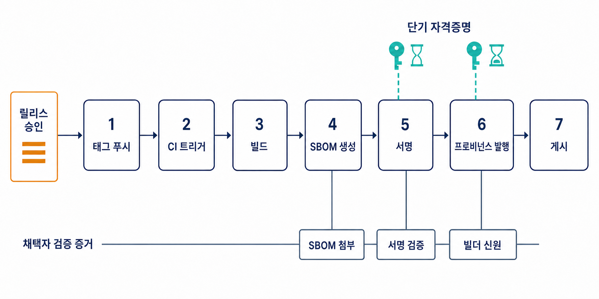

*[릴리스 보증 파이프라인 — SBOM·서명·프로비넌스]*

##### 안전하게 배포하기 — 서명·프로비넌스·SBOM

패키지를 올리는 것만으로는 부족하다. 채택자가 '누가 어떤 소스로 빌드했는지'를 스스로 검증할 수 있는 증거를 릴리스마다 남겨야 한다. 이 요구는 프로젝트를 알려 사용자를 늘리는 활동과는 별개다. 외부 오픈소스SW를 도입하는 쪽이 릴리스 서명과 출처 증명을 도입 심사 항목으로 확인하기 때문이다([오픈소스SW 사용 가이드 - 개발자 편: 오픈소스SW 선택 기준](#오픈소스sw-선택-기준)). 검증 수단도 갖춰졌다. npm 프로비넌스, GitHub artifact attestation, Homebrew 프로비넌스는 `cosign` 한 명령으로 검증할 수 있다[^releasing-cosign-verify]. PyPI 어테스테이션(PEP 740)은 객체 구조가 Sigstore 번들과 달라 `pypi-attestations` 같은 도구로 변환해야 `cosign`이 읽는다. 증거를 남기지 않은 릴리스는 이 심사에서 제시할 근거가 없다. 다음 다섯 가지를 릴리스 워크플로에 넣는다.

- [ ] **(1) 장기 API 토큰 대신 CI의 OIDC 기반 Trusted Publishing을 쓴다** — PyPI[^releasing-pypi-trusted]와 npm[^releasing-npm-trusted]이 지원한다. npm은 2025-12-09에 모든 classic token을 영구 폐기했고, 쓰기 권한 granular token은 최대 90일로 제한되며, 신규 패키지는 2FA가 기본값이다[^releasing-npm-token]. 채택자 확인: 프로비넌스에 기록된 빌드 워크플로.
- [ ] **(2) 아티팩트에 서명하고 프로비넌스를 발행한다** — npm은 `--provenance` 옵션으로 프로비넌스를 함께 게시한다[^releasing-npm-provenance]. GitHub Actions에서는 artifact attestation으로 빌드 증명을 만든다[^releasing-gh-attestations]. 채택자 확인: `cosign`으로 npm 프로비넌스·GitHub artifact attestation·Homebrew 프로비넌스를 단일 명령으로 검증한다[^releasing-cosign-verify].
- [ ] **(3) 릴리스마다 SBOM을 첨부한다** — SPDX 또는 CycloneDX 형식으로 생성해 릴리스 페이지에 올린다. SBOM의 개념과 최소 요구 사항은 [오픈소스SW 사용하기: SBOM 관리](#sbom-관리)에서 다루므로, 공개하는 쪽은 '생성해서 붙인다'만 담당한다. 채택자 확인: 첨부된 SBOM을 자사 SCA 도구에 투입한다.
- [ ] **(4) 게시 계정에 2FA를 강제하고 릴리스 태그에 서명한다** — 메인테이너 계정 탈취가 곧 패키지 침해로 이어진다. 채택자 확인: 저장소의 서명된 태그 표시.
- [ ] **(5) 릴리스는 개인 로컬 환경이 아니라 CI에서만 수행한다** — 로컬 릴리스는 (1)~(4)의 증거를 만들지 못한다. 채택자 확인: 프로비넌스에 기록된 빌더 신원.

빌드 프로비넌스의 수준을 외부에 설명해야 한다면 SLSA 빌드 트랙의 레벨을 기준으로 삼는다. 현행 명세는 v1.2다[^releasing-slsa]. 레벨별 요구사항은 명세 본문을 따른다.

[^releasing-pypi-trusted]: Trusted Publishers — PyPI Docs : https://docs.pypi.org/trusted-publishers/
[^releasing-npm-trusted]: Trusted publishers — npm Docs : https://docs.npmjs.com/trusted-publishers
[^releasing-npm-token]: npm classic tokens revoked, session-based auth and CLI token management now available — GitHub Changelog (2025-12-09) : https://github.blog/changelog/2025-12-09-npm-classic-tokens-revoked-session-based-auth-and-cli-token-management-now-available/
[^releasing-npm-provenance]: Generating provenance statements — npm Docs : https://docs.npmjs.com/generating-provenance-statements/
[^releasing-gh-attestations]: Artifact attestations — GitHub Docs : https://docs.github.com/en/actions/concepts/security/artifact-attestations
[^releasing-cosign-verify]: cosign Verification of npm Provenance, GitHub Artifact Attestations, and Homebrew Provenance — Sigstore Blog : https://blog.sigstore.dev/cosign-verify-bundles/
[^releasing-slsa]: SLSA Specification v1.2 : https://slsa.dev/spec/v1.2/


#### Issue tracker 활용 best practice

Issue tracker는 현업에서도 많이 쓰이므로 오픈소스SW에서도 똑같이 쓰면 된다고 생각하기 쉽다. 그러나 이를 들여다보는 대상이 사뭇 다르다는 점을 알아야 한다. 현업에서는 주로 회의 등으로 선별된 이슈를 Issue tracker에 등록하고 이에 맞춰 개발 일정을 관리한다. 반면 오픈소스SW에서는 의견 교환이 즉시 이뤄지지 않는다. 어떤 의견을 남기고 다른 사람이 동의하거나 다른 의견을 낼 때까지 기다려야 한다. 사람들이 궁금한 부분을 Issue tracker에서 해결하지 못하면 그 부담은 고스란히 메인테이너에게 돌아온다. 또한 사람들은 구체적인 도움 요청을 보았을 때 비로소 움직일지 고민하며, 그 고민의 일부가 기여로 이어진다.

이처럼 다양한 기능을 하는 Issue tracker에서 커뮤니케이션을 더 효율적으로 하기 위한 팁을 정리한다.

##### 이슈 템플릿 활용

새 이슈를 만들려고 New issue 버튼을 클릭했는데 빈 화면을 마주하면 어떤 내용을 써야 할지 막막할 때가 있다. 이슈 템플릿은 프로젝트에서 처음 이슈를 등록하는 사람에게 작성 방법을 안내한다. 사람들이 오픈소스SW 프로젝트를 탐색하고 사용하면서 떠오른 질문을 마음속에 쌓아두지 않고 적극적으로 소통하도록 돕는다. 템플릿 예시는 흔히 체크리스트를 함께 제공한다. 이는 이슈 해결에 필요한 정보를 미리 제공하도록 유도해, 부족한 정보를 묻고 답하는 데 드는 커뮤니케이션을 줄이고 문제 해결에만 집중하도록 돕는다.

- [GitHub에서 Issue template를 만드는 방법](https://docs.github.com/en/github/building-a-strong-community/manually-creating-a-single-issue-template-for-your-repository#adding-an-issue-template)[^releasing-github-issue]
- [GitLab에서 Issue template를 만드는 방법](https://docs.gitlab.com/ee/user/project/description_templates.html#create-an-issue-template)[^releasing-gitlab-issue]
- [이슈 템플릿 예시 모음](https://github.com/stevemao/github-issue-templates)[^releasing-issue-templates]

[^releasing-github-issue]: GitHub에서 Issue template를 만드는 방법 : https://docs.github.com/en/github/building-a-strong-community/manually-creating-a-single-issue-template-for-your-repository#adding-an-issue-template
[^releasing-gitlab-issue]: GitLab에서 Issue template를 만드는 방법 : https://docs.gitlab.com/ee/user/project/description_templates.html#create-an-issue-template
[^releasing-issue-templates]: 이슈 템플릿 예시 모음 : https://github.com/stevemao/github-issue-templates

##### Label 활용

이슈 제목을 명확하게 작성하는 것도 중요하지만, 문장만으로는 한눈에 내용을 파악하기 어렵다. 이슈에 라벨을 달아 필터가 작동하게 하고, 이슈 종류를 한눈에 파악할 수 있게 한다.


*[issue-label]*


기여를 염두에 둔 사람들에게는 이런 라벨이 도전할 만한 일감을 찾는 데 큰 도움이 된다.

##### 초심자를 위한 이슈 

많은 개발자는 오픈소스SW에 기여하는 일을 '언젠간 해보고 싶은 것' 목록에 넣어 두곤 한다. 직접 나서지 않는 이유는 다양하지만, 시간이 없다는 이유 다음으로 많이 꼽히는 것이 '자신이 없어서'다. 이런 사람들을 오픈소스SW 기여의 세계로 불러오는 방법 중 하나가 초심자를 위한 이슈 라벨이다.

주로 `good first issue` 혹은 `first timers only` 라는 이름으로 지어진 이 라벨은 메인테이너나 기존 커미터들이 해결할 수 있지만 초심자를 위해 남겨두었다는 표식으로 사용된다. 따라서 기존 다른 이슈보다 해결 방안에 대한 더 자세한 설명이나 힌트를 달아놓는 경우가 많다. 이렇게 작은 이슈부터 시작할 수 있는 환경을 만들어 조금씩 어려운 이슈에도 도전할 수 있도록 자신감을 키워주는 과정을 거치도록 한다. 이 과정을 통해 꾸준한 커미터를 만들 수 있다.

GitHub에서는 아래 사진처럼 good first issue 탐색을 장려하는 메시지를 띄워 주기도 한다. 


*[github-good-first-issue]*


#### Pull request 운영 best practice

이슈를 둘러보며 기여할지 고민만 하던 사람이 드디어 Pull request를 만들 결심을 했다고 가정해보자. 이 사람이 헤매지 않고 정기 기여자로 정착하려면 커뮤니케이션 과정에서 생길 수 있는 불편함을 최소화해야 한다. CONTRIBUTING 문서에서 많은 부분을 다루겠지만, 기여 과정을 더 효율적으로 만드는 팁을 정리한다.

#####  Pull request 템플릿 활용

각기 다른 생각을 가진 사람들이 어떤 변경을 반영하려면 다른 사람의 동의를 얻어야 한다. 동의를 구하려면 어떤 문제의식이 있었는지, 어떤 변경을 했는지, 그 결과가 무엇인지에 대한 설명이 필요하다. 그런데 이런 논리를 어떻게 작성해야 할지 모르는 사람들을 위해 Pull request 템플릿을 제공한다. 개발 과정에 익숙한 메인테이너도 같은 템플릿을 따라 작성한다. 다른 사람이 템플릿을 처음 사용할 때 작성 예시로 참고할 수 있기 때문이다.

문제 해결 이외에도 CONTRIBUTING에서 제시한 여러 개발 규칙이 있다. 이 내용을 Pull request 템플릿에서 체크리스트로 제공하면 코드 리뷰 과정에서 문제 해결에 집중하는 데 도움이 된다.

- [GitHub에서 Pull request template를 만드는 방법](https://docs.github.com/en/github/building-a-strong-community/creating-a-pull-request-template-for-your-repository)[^releasing-github-pr-template]
- [GitLab에서 Merge request template를 만드는 방법](https://docs.gitlab.com/ee/user/project/description_templates.html#create-a-merge-request-template)[^releasing-gitlab-pr-template]
- [Pull request 템플릿 예시 모음](https://github.com/stevemao/github-issue-templates)[^releasing-pr-template]

[^releasing-github-pr-template]: GitHub에서 Pull request template를 만드는 방법 : https://docs.github.com/en/github/building-a-strong-community/creating-a-pull-request-template-for-your-repository
[^releasing-gitlab-pr-template]: GitLab에서 Merge request template를 만드는 방법 : https://docs.gitlab.com/ee/user/project/description_templates.html#create-a-merge-request-template)
[^releasing-pr-template]: Pull request 템플릿 예시 모음 : https://github.com/stevemao/github-issue-templates

##### 적극적으로 댓글을 활용

사람들은 글자로만 소통하면 어감을 부정적으로 해석하는 경향이 있다. 열심히 기여했는데 환영받지 못한다고 느끼면 그 사람은 이후 지속해서 기여할 가능성이 낮아진다. 따라서 어떤 기여든 긍정적인 반응을 댓글로 남긴다. 이모지를 활용하는 것도 좋은 방법이다.

어떤 변경이 기존에 다른 사람이 개발한 부분과 연관된다면, 그 사람을 언급해 함께 확인하도록 안내한다. 기존 개발자는 해당 코드에 주인 의식을 느낄 수 있고, 새로운 변경이 기존 코드의 의도를 해칠 수도 있기 때문이다. 여러 사람이 참여할수록 커뮤니케이션 비용과 시간이 더 들지만, 결과적으로 더 건강하고 적극적인 커뮤니티를 만드는 데 큰 도움이 된다. 이런 커뮤니티는 나중에 메인테이너의 부담을 크게 줄여 준다.

##### 부드러운 재촉

여러 사람이 함께 개발하고 코드 리뷰에 참여하다 보면, 누군가의 응답이 늦어져 진행이 멈추는 경우가 종종 발생한다. 대개는 다른 일 때문에 오픈소스SW에 몰두하기 어려운 상황이다. 그렇다고 하염없이 반응을 기다리면 다른 의존적인 작업까지 지연될 수 있다. 이때는 당사자를 다시 한번 멘션해 특정 행동을 요청한다. 다그치듯 요구하기보다 "바쁘실 것 같은데 혹시 이렇게 진행해도 괜찮을까요?"나 "혹시 이 부분에 대해 더 의견이 없으신가요?"처럼 부드럽게 표현한다.

### 개발자 편 요약

지금까지 기업에 속한 개발자가 오픈소스SW 공개를 준비하고 운영하는 데 미리 알아 두면 좋은 팁을 살펴보았다. 요약하면 다음과 같다.

**오픈소스SW 공개를 준비하기**

- 내 프로젝트를 왜 오픈소스SW로 공개해야 하는지 기업 입장에서 생각해보기
- 공개 이후 운영 계획 생각해보기
- 오픈소스SW 운영에 필요한 도구를 탐색하고 공부하기
- `README.md` 잘 작성하기 
- `CONTRIBUTING.md` 잘 작성하기

**오픈소스SW 운영하기**

- 패키지 배포 방법 탐색하고 공부하기
- Issue tracker 잘 활용하기
  - 이슈 템플릿 활용
  - 이슈 라벨 활용
  - 초심자를 위한 이슈
- Pull request 잘 활용하기
  - Pull request 템플릿 활용
  - 댓글 활용
  - 사람들을 부드럽게 재촉하기

이 내용은 오픈소스SW 담당자의 시각에서 여러 프로젝트가 운영되는 모습을 살펴보며, 개발자가 이런 점을 조금 더 고려했다면 커뮤니티를 더 잘 형성했을 것이라는 아쉬움이 들었던 상황을 정리한 것이다. 따라서 기술적인 부분과는 거리가 멀다. 그러나 오픈소스SW에서 기술만큼 중요한 것이 커뮤니케이션이다. 온화한 커뮤니케이션은 더 강력한 커뮤니티를 형성한다. 강력한 커뮤니티는 다시 기술력 향상의 밑거름이 되어, 오픈소스SW가 성장하는 선순환의 고리를 만든다.

이뿐만 아니라 [오픈소스SW 공개 가이드 - 기업 편: 공개만 하면 끝인가요? 그 이후에 해야 할 일](#공개만-하면-끝인가요-그-이후에-해야-할-일) 에서 나열한 일에도 관심을 가질 것을 추천한다. 오픈소스SW를 가장 잘 설명할 수 있는 사람은 결국 개발한 사람이기 때문이다. 다만 이 모든 일을 메인테이너 혼자 지기에는 부담이 크다. 그렇기 때문에 커뮤니티를 잘 형성해야 한다. 커뮤니티가 메인테이너를 대신해 오픈소스SW 프로젝트를 바깥에 더 널리 알리는 역할을 하게 된다.


---

# 4. OSPO

현대의 ICT 기업은 소프트웨어 제품과 서비스 개발을 위해 오픈소스SW를 필수로 사용한다. 기업이 오픈소스SW 거버넌스 체계를 수립하는 목적은 세 가지다. 첫째, 오픈소스SW로부터 최대한의 가치를 창출한다. 둘째, 라이선스 의무를 지키지 못해 발생하는 법적 리스크를 완화한다. 셋째, 공급망 보안과 규제가 요구하는 의무를 이행한다. 앞의 두 축은 오래전부터 오픈소스SW 거버넌스의 목적이었다. 여기에 더해 규제 대응은 2026년 기업이 OSPO를 설립하는 강한 동인이 되었으며, 그 실행을 책임지는 조직이 OSPO다. 규제별 요구사항과 시행 일정은 [오픈소스SW 사용하기](#1-오픈소스sw-사용하기)의 규제 동향 절에서 다룬다.

글로벌 ICT 기업은 오픈소스SW 거버넌스 체계를 구축하고 이를 성장시키기 위해 OSPO<sub>Open Source Program Office</sub>라는 조직을 운영하고 있다. OSPO는 기업의 오픈소스SW 거버넌스 체계를 구축할 뿐만 아니라 기업의 성공을 위한 오픈소스SW 전략을 수립하고 실행하는 데 필요한 정책, 프로세스 및 도구를 제공한다.

세 번째 축이 OSPO의 실제 업무로 자리 잡았다는 점은 조사로도 확인된다. OSPO를 보유한 조직의 92%가 오픈소스SW 보안에 관여한다. 42%는 OSPO가 직접 보안 의사결정을 내리고, 50%는 담당 조직에 자문하며, 보안을 다루지 않는다는 응답은 7%에 그쳤다. 또한 79%는 생성형 AI 리스크 관리에 OSPO가 효과적이라고 답했다. 이 값은 2024년 조사의 65%에서 오른 것이다[^ospo-ospo-survey-2025].

Microsoft, Google, Meta와 같은 소프트웨어 리더 기업뿐만 아니라 Comcast, Bosch와 같은 전통 제조·통신 기업도 OSPO를 운영하고 있다(Meta·Microsoft·Comcast는 TODO Group 사례집[^ospo-case-index], Bosch는 자사 오픈소스SW 포털에서 확인된다). 국내에서도 전담 조직을 두는 기업이 늘고 있다. 공개된 자료로 확인되는 예를 들면 SK텔레콤은 자사 OSPO 소개 페이지를 운영하고 있고[^ospo-sktospo], 삼성전자·LG전자·카카오·LINE은 오픈소스SW 전담 조직 또는 그에 준하는 기능을 두고 있다. 다만 국내 기업의 OSPO 운영 여부를 한자리에 모아 둔 1차 출처는 없으므로, 특정 기업의 조직 형태는 그 기업의 공개 자료로 각자 확인해야 한다.


기업 규모와 지역에 따라 OSPO 보유 현황은 크게 갈린다. 다음은 2025년 8월 발간된 LF Research 조사(2025년 5~6월 실시, 총 응답 338건, 문항별 분석 표본 283~337건)가 보고한 OSPO 보유 현황이다[^ospo-ospo-survey-2025]. 연도별 추이는 표본 규모가 다른 별개 조사의 결과를 이어 붙인 것이다(2022년 950건, 2023년 472건, 2024년 222건, 2025년 285건).

| 구분 | 조사 결과 |
|------|-----------|
| 정식 OSPO 보유율 추이(전체, 연도별) | 2022년 30% → 2023년 43% → 2024년 26% → 2025년 32% |
| 비정식 OSPO 보유율 추이(전체, 연도별) | 2023년 23% → 2025년 18% |
| 규모별(보고서 본문 서술) | 중소조직의 72%가 OSPO를 보유하며 그중 대부분(55%)은 비공식으로 운영한다 — 보고서 본문 문장이며, 본문 Figure 6에서 도출한 값이 아니다[^ospo-ospo-figure6] |
| 지역별 보유율(정식+비정식 합계, 부록 A2·표본 337) | 아시아태평양 50%(정식 37%+비정식 13%) / 아메리카 46%(정식 29%+비정식 17%) / 유럽 36%(정식 22%+비정식 14%) / 그 외 지역 28%(정식 17%+비정식 11%) |

규모별과 지역별은 같은 지표가 아니므로 나란히 비교하지 않는다. 규모별은 보고서 본문의 서술 한 문장이 근거이고, 지역별은 부록 A2의 응답 비율이 근거다. 특히 규모별 도표(Figure 6)에서 '대·초대형 83%' 같은 보유율을 읽어 내면 안 된다. 그 83%는 정식 OSPO라고 답한 응답자 가운데 대·초대형 조직이 차지하는 비중이다.

한국 단독 수치는 이 보고서에 없다. 아시아태평양은 부록 A2 기준으로 정식 OSPO 비율(37%)과 정식+비정식 합계(50%) 모두 4개 지역·그룹 중 가장 높다[^ospo-ospo-region-a2]. 다만 이 조사의 표본은 오픈소스SW 거버넌스에 이미 관심이 있는 응답자 중심이므로 지역 모집단 전체의 보유율로 확대 해석해서는 안 된다.

[^ospo-ospo-survey-2025]: The 2025 State of OSPOs and Open Source Management, Linux Foundation Research, 2025년 8월 발간 : https://www.linuxfoundation.org/hubfs/Research%20Reports/LFResearch_StateofOSPO_082825.pdf
[^ospo-ospo-figure6]: 보고서 본문 Figure 6은 규모별 보유율이 아니라 항목별 규모 구성비다. 다섯 항목 모두 대·초대형과 중소 두 그룹의 합이 정확히 100%(17/83, 55/45, 68/32, 50/50, 68/32)이므로 보유율로 읽을 수 없고, 단일 선택 문항인데 중소조직 쪽 값을 모두 더하면 258%가 된다. 본문 Figure 7도 같은 방식으로 정규화되어 있다(정식 OSPO: 아메리카 43 + 유럽 32 + 아시아태평양 21). 따라서 이 가이드는 Figure 6에서 규모별 보유율을 도출하지 않고 보고서 본문 문장만 인용한다. 같은 보고서 29쪽이 전체 정식 OSPO 27%, 도입 계획 중 7%로 보고하므로 Figure 6의 중소조직 68%를 '계획 중 비율'로 읽는 해석도 성립하지 않는다.
[^ospo-ospo-region-a2]: 위 지역별 수치는 이 보고서 부록 Appendix A2(32쪽, 표본 337)를 근거로 한다. 같은 보고서 11쪽 본문 Figure 7(표본 285, Rest of World 제외)은 반대로 아메리카 89%·유럽 68%·아시아태평양 35%로 아시아태평양이 가장 낮다고 서술해 보고서 내부적으로 상충한다. 부록 A2 수치를 지역별 응답 비중(아메리카 39%·유럽 38%·아시아태평양 16%·그 외 7%, 표본 338)으로 가중평균하면 26.8%가 되어 보고서가 별도로 명시한 전체 정식 OSPO 비율 27%(29쪽)와 사실상 일치한다. 반면 11쪽 수치로 같은 방식의 계산을 하면 정식+비정식 합계가 약 71%가 되어 보고서의 전체 수치 42%(29쪽)와 크게 어긋난다. 이 가이드는 이 교차검증에 따라 부록 A2 수치를 기준으로 삼았다. 원문을 함께 확인하는 독자는 11쪽 값이 다르다는 점에 유의한다.

이 장에서는 OSPO의 역할 및 책임을 알아보고 국내 기업이 OSPO를 설립하기 위한 방법을 설명한다.

> 이 장의 내용은 TODO Group의 [How to create an open source program office](https://todogroup.org/resources/guides/how-to-create-an-open-source-program-office/)[^ospo-howtoospo]를 기반으로 작성하였으며, 2026년 7월 기준 판본을 참조하였다.

[^ospo-howtoospo]: How to create an open source program office, TODO Group (2026년 7월 참조) : https://todogroup.org/resources/guides/how-to-create-an-open-source-program-office/

## OSPO 정의와 역할

### 오픈소스 프로그램이란?

먼저, 오픈소스 프로그램이란 용어를 살펴보자. 오픈소스 프로그램<sub>Open Source Program</sub>이란 기업이 오픈소스SW를 활용하면서 (1) 라이선스 위반, 보안 취약점 리스크는 완화하고 (2) 오픈소스SW에서 최고의 가치를 창출하기 위한 프로그램이다. 여기에는 오픈소스SW 정책과 프로세스 수립, 그리고 이를 자동화·효율화할 수 있는 도구를 지원하는 일이 포함된다.


*[오픈소스 프로그램]*


### OSPO란?

OSPO<sub>Open Source Program Office</sub>는 오픈소스 프로그램을 만들고 운영하기 위한 조직이다. 어떻게 기업의 오픈소스SW 컴플라이언스를 관리할지, 개발자가 외부 오픈소스SW 프로젝트에 기여하기 위한 절차는 무엇인지, 사내의 프로젝트를 오픈소스SW로 공개하기 위한 절차는 무엇인지는 모두 OSPO가 수행해야 할 전략적 결정이다.

기업이 오픈소스SW에서 최대의 이익을 창출하기 위해서는 OSPO를 만들고 이를 통해 기업의 오픈소스SW 활동을 관리 및 지원해야 한다. 기업이 OSPO를 운영하며 오픈소스SW를 적극적으로 활용한다면 아래와 같은 효과를 기대할 수 있다고 알려져 있다.

- 소프트웨어 개발 인재를 유치하고, 기존 인력의 유출을 방지할 수 있다.
- 비즈니스 가치 창출과 혁신 추진을 가속화할 수 있다.
- 개발자가 비즈니스 로직 작성에 집중함으로써 비용 절감과 효율 향상을 기대할 수 있다.
- 제품 리더십을 통해 수익 창출과 시장 점유율 확보를 기대할 수 있다.

> TODO Group에서는 [OSPO의 정의](https://github.com/todogroup/ospodefinition.org)[^ospo-ospodefinition]에 대해 설명하는 글을 게시하였다. 한국어 자료로는 OpenChain 한국 워킹그룹의 [ISO 표준 기반 기업 오픈소스SW 관리 가이드 2026판](https://openchain-project.github.io/OpenChain-KWG/guide/opensource_for_enterprise/)[^ospo-kwg-guide-2026] 중 조직 구성 절을 참고할 수 있다.

[^ospo-ospodefinition]: Open Source Program Office (OSPO) Definition and Guide : https://github.com/todogroup/ospodefinition.org
[^ospo-kwg-guide-2026]: OpenChain 한국 워킹그룹, ISO 표준 기반 기업 오픈소스 관리 가이드 2026판 (2026-06-02 갱신) : https://openchain-project.github.io/OpenChain-KWG/guide/opensource_for_enterprise/

### OSPO 역할

OSPO의 세 가지 주요 역할은 다음과 같다.


*[OSPO 주요 역할]*


#### 1. 오픈소스SW의 올바른 사용

OSPO는 기업이 오픈소스SW를 사용하면서 라이선스 의무 사항을 준수할 수 있도록 오픈소스SW 정책과 프로세스를 수립해야 한다. 기업은 제품과 서비스 개발 시 사용한 오픈소스SW의 라이선스가 요구하는 바를 준수해야 하는데 이를 위한 활동을 오픈소스SW 컴플라이언스라고 한다. 기업은 올바른 오픈소스SW 컴플라이언스 활동을 통해 저작권 침해 리스크를 관리할 뿐만 아니라 오픈소스SW 커뮤니티에서 기업 브랜드 평판을 높일 수 있다.

이를 위한 세부 사항은 [오픈소스SW 사용하기](#1-오픈소스sw-사용하기)에서 자세히 다루었다.

#### 2. 외부 오픈소스SW 프로젝트로의 기여

기업 내 구성원에게 외부 오픈소스SW 프로젝트에 기여하도록 장려하는 것도 오픈소스SW를 전략적으로 활용하는 좋은 방법이다. OSPO는 오픈소스SW 기여 문화를 확산하면서도 기업의 지식재산은 보호할 수 있는 오픈소스SW 기여 정책을 수립해야 한다.

오픈소스SW 기여 활동으로 취할 수 있는 혜택과 고려 사항 및 세부 방법은 [오픈소스SW 기여하기](#2-오픈소스sw-기여하기)에서 자세히 다루었다.

#### 3. 사내 프로젝트의 오픈소스SW 공개

오픈소스SW를 적극적으로 활용하는 기업이라면 오픈소스SW를 단순히 사용하는 데 그치지 않고, 사내 프로젝트를 오픈소스SW로 공개하고 커뮤니티를 활성화하여 최대의 가치를 창출한다. OSPO는 기업의 비즈니스 전략을 고려하여 오픈소스SW 공개 정책을 수립하고, 이를 활성화하기 위한 실행 방안을 마련해야 한다.

이를 위한 세부 절차 및 방법은 [오픈소스SW 공개하기](#3-오픈소스sw-공개하기)에서 자세히 다루었다.


## OSPO 구성

### OSPO 구성 절차

그러면 기업이 OSPO를 만들기 위한 절차를 알아보자.


*[OSPO 구성 절차]*

#### 1. 리더를 임명하라

먼저 OSPO를 만들고 운영할 수 있는 적합한 리더를 찾는 것이 중요하다. 다음과 같은 역량을 갖고 있다면 OSPO의 리더로 적합하다.

- 오픈소스SW의 가치와 발전 가능성에 공감하고, 이를 사내에 전파하고자 하는 열정이 있다.
- 오픈소스SW 프로젝트에 개발자, 기여자로 참여한 경험이 있고, 오픈소스SW 개발 방법론을 충분히 이해한다.
- 기업의 비즈니스 전략과 일치하는 방향의 오픈소스SW 전략을 수립할 수 있도록 기업의 비즈니스를 폭넓게 이해한다.
- 오픈소스SW 전략과 정책을 모든 구성원이 이해하도록 전파할 수 있는 커뮤니케이션 역량을 갖추었다.
- 여러 기술 분야를 폭넓게 이해하여 개발자와 기술적인 소통이 가능하다.

누군가 임시로 역할을 맡아서 시작할 수도 있다. 하지만 OSPO가 조기에 올바른 역할을 수행하고 견고히 자리 잡기를 바란다면 전담하여 책임질 수 있는 리더를 임명해야 한다.

#### 2. OSPO의 역할을 정의하라

기업의 OSPO가 어떤 역할을 수행할지 정의한다. 기업마다 규모나 업종이 다르고, 오픈소스SW를 통해 얻고자 하는 목적이 다르므로 OSPO의 역할이 달라질 수 있다.

일반적으로 OSPO는 오픈소스SW 정책을 수립하고 이를 실행하기 위한 프로세스를 구성한다. 또한 프로세스 활동을 가능한 한 자동화하기 위한 도구를 개발하여 제공하는 역할을 수행한다. 이 과정에서 부서 간 협업을 유도하고, 발생하는 이슈를 해결한다.

OSPO는 구조화된 정책과 프로세스를 제공해야 하지만, 유연성도 유지해야 한다. OSPO가 모든 분야에 전문성을 갖고 모든 의사결정을 내리는 것은 현실적으로 불가능하다. OSPO는 오픈소스SW 사용자와 기여자에게 도움이 필요할 때 컨설팅을 제공하고 구성원이 스스로 개인 또는 기업의 비즈니스 결정을 내릴 수 있도록 허용해야 한다. 궁극적으로는 기업과 구성원의 요구를 모두 충족하기 위한 역할과 책임의 적절한 균형을 설정하는 것이 중요하다.


#### 3. 피드백을 수렴하라

한 번에 OSPO의 모든 것을 구축하기는 쉽지 않다. 우선 기본적인 사항을 준비한 후 기업 내부의 모든 관련 당사자로부터 피드백을 받아서 보완해나가는 것이 필요하다.

경영진으로부터 개발자에 이르기까지 모든 구성원의 피드백을 수렴한다. 기업의 비즈니스 전략이나 구성원의 요구 사항을 고려하지 않고 OSPO가 단독으로 수립한 정책이 장기적으로 성공하기를 기대할 수는 없다.


### OSPO 구성 방법

#### 어느 조직 내에 OSPO를 만들어야 하나?

OSPO는 기업의 어느 부서 내에 만드는 것이 적합하냐는 질문이 나올 수 있다. 개발 조직 내에 만들지, 아니면 법무 조직에 있어야 하는지를 고민할 수 있는데, 이는 기업의 비즈니스와 오픈소스SW 전략에 따라 달라진다.

##### 개발 조직 속에서의 OSPO

오픈소스SW를 활용하는 부서는 주로 소프트웨어 개발 조직이기 때문에 일반적으로 OSPO를 개발 조직 내에 만든다. 이를 통해 개발자가 더 효과적이고 생산적으로 오픈소스SW를 활용하도록 지원한다.

##### 법무 조직 속에서의 OSPO

대규모의 IP(지식 재산) 포트폴리오를 보유한 기업이라면 OSPO가 법무 조직 내에 있는 것이 유리할 수 있다. 오픈소스SW를 활용하면서 법무 조직과 긴밀하게 협력하여 IP 관련 법적 문제가 발생할 가능성을 사전에 점검하고 대응할 수 있다. 주로 칩세트와 같이 IP 집약적인 하드웨어 개발 회사에 적합하다.

##### 마케팅 조직 속에서의 OSPO

기업이 오픈소스SW를 사용하여 개발한 제품이나 서비스를 판매하는 비즈니스를 주력으로 한다면 마케팅 부서 내부에 OSPO를 만들어서 오픈소스SW 제품의 홍보와 마케팅에 집중하는 것이 유리할 수 있다.

#### OSPO에는 어떤 인원이 필요한가?

OSPO의 인원 구성과 각 역할 및 책임을 알아보자.

미리 한 가지 첨언하면 아래의 인원 구성은 전략적으로 OSPO에 충분한 리소스를 투입해야 할 이유가 명확히 있는 기업을 고려하여 설명하였다. 기업의 규모가 크지 않고, 오픈소스SW 활용을 이제 시작하는 기업이라면, 처음부터 아래의 모든 인원과 역할을 지정할 필요는 없다. 한 명의 오픈소스 프로그램 매니저를 임명하고, 관련 부서와의 협업을 통해 OSPO의 역할을 수행하면서 점차 규모를 키워갈 것을 권장한다.


*[OSPO의 인원 구성과 역할]*


##### 오픈소스 프로그램 매니저

오픈소스 프로그램 매니저는 오픈소스 프로그램을 관리하고 전략을 수립하는 전담 인원으로서 다음의 역할을 담당한다.
* 기업의 수익, 브랜드 인지도, 개발자 역량, 채용 등 비즈니스 목표에 부합하는 오픈소스SW 전략을 수립한다.
* 기업의 모든 오픈소스SW 활동을 감독한다.
* 효과적인 오픈소스SW 활동을 위한 정책을 수립하고 프로세스를 구축한다.

오픈소스 프로그램 매니저는 이처럼 기업 전반에 걸쳐 영향력을 미칠 수 있는 역할이기 때문에 효율성을 극대화하기 위해서 가능하다면 임원급 직책을 가진 자가 맡는 것이 좋다.

##### 컴플라이언스 담당

외부로 배포 혹은 서비스하는 제품 소프트웨어 및 서비스를 개발하는 조직은 오픈소스SW 컴플라이언스 활동을 수행해야 한다. 즉, 배포 소프트웨어에 포함된 오픈소스SW가 무엇인지 확인하고, 해당 오픈소스SW 라이선스의 의무 사항을 준수해야 한다. 컴플라이언스 담당은 기업의 오픈소스SW 컴플라이언스를 보장하기 위한 역할을 담당한다.

##### 법무 담당

오픈소스SW를 사용하거나 외부에 기여하는 활동은 저작권에 기반하여 라이선스를 받거나 부여하는 활동이다. 결국 법적인 판단이 필요한 일이 발생할 수밖에 없다. 따라서, OSPO는 법률 전문가를 포함해야 한다. 직접 포함할 수 없으면 법률 조언을 받을 수 있는 창구를 마련해야 한다.

OSPO의 법률 담당은 다음의 역할을 수행한다.
* 오픈소스SW 라이선스 및 기타 법적 자문을 제공한다.
* 외부 오픈소스SW 프로젝트에 기여 활동이 법적인 문제를 발생시킬 우려는 없는지 점검한다. 여기에는 CLA (Contributor License Agreement) 검토 등의 활동을 포함한다.

대기업의 경우 오픈소스SW 전문 변호사를 고용하는 경우도 있지만, 그렇지 않을 경우, 외부 컨설팅 업체를 활용하는 것도 고려할 수 있다.

참고로 오픈업 센터(Open UP)는 오픈소스SW 활용을 위한 [컨설팅 서비스](https://www.oss.kr/pages/5)[^ospo-plaza]를 제공한다. 사용 중인 오픈소스SW의 라이선스 의무 사항을 외부에서 점검받고자 하는 기업은 [라이선스 검증 신청](https://www.oss.kr/pages/14)[^ospo-oss-license-check] 창구를 이용할 수 있다[^ospo-nipa-reorg].

[^ospo-plaza]: 오픈업 센터(Open UP) 소개 : https://www.oss.kr/pages/5
[^ospo-oss-license-check]: 오픈업 센터 라이선스 검증 신청 : https://www.oss.kr/pages/14
[^ospo-nipa-reorg]: 2024년 3월 NIPA 조직개편으로 SW산업본부 산하 공개소프트웨어팀이 SW미래본부 SW산업팀으로 통합되었다. 컨설팅을 신청할 때 담당 창구를 확인한다. 출처 : AI 시대 더 중요해진 오픈소스SW, 하지만…NIPA '공개소프트웨어팀' 사라져, 디지털데일리, 2024-03-26 : https://m.ddaily.co.kr/page/view/2024032606541480965

##### IT 지원 담당

오픈소스 프로그램을 효율적으로 운영하기 위해서는 가능한 한 자동화해야 한다. IT 지원 담당은 도구를 활용하여 오픈소스SW 컴플라이언스와 오픈소스SW 보안 취약점 점검을 자동화하기 위한 역할을 담당한다.

##### 오픈소스SW 에반젤리스트

기업의 프로젝트를 오픈소스SW로 공개하고, 외부 프로젝트에 기여하는 활동을 장려하는 기업이라면 이를 외부에 홍보하기 위한 오픈소스SW 에반젤리스트의 역할이 중요하다. 오픈소스SW 에반젤리스트는 오픈소스SW 콘퍼런스 참여, 발표, 프로젝트 후원, 주기적인 홍보 문서 배포 등의 방법으로 기업의 오픈소스SW 활동을 외부에 알리는 역할을 담당한다.


#### 구체적으로 OSPO는 무엇을 해야 하는가?

##### 정책을 수립하라

오픈소스SW를 사용하면서 오픈소스SW 라이선스를 준수하지 않을 경우, 비즈니스 기회를 놓치거나 수익 손실(판매 손실, 인수 실패 등), 법적 피해(IP 소유권 손실, 수익 또는 파트너십 악화, 벌금 등) 및 브랜드 손상의 위험이 발생한다. 올바른 오픈소스SW 사용을 위한 정책을 수립해야 한다. 또, 올바른 오픈소스SW 커뮤니티에 구성원이 기여하는 방법, 내부 프로젝트를 오픈소스SW 커뮤니티에 공개하기 위한 방법도 포함해야 한다. 즉, OSPO는 다음을 다루는 오픈소스SW 정책을 수립해야 한다.

1. 오픈소스SW 사용 정책 : 구성원이 GitHub 등 외부 저장소에서 찾은 소스 코드를 컴플라이언스와 보안 취약점 관점에서 올바르게 사용하기 위한 방법
2. 오픈소스SW 기여 정책 : 구성원이 외부 오픈소스SW 프로젝트에 기여하기 위한 방법
3. 오픈소스SW 공개 정책 : 사내 프로젝트를 오픈소스SW로 공개하기 위한 방법

오픈소스SW 커뮤니티에서는 이러한 오픈소스SW 정책을 위한 템플릿 문서를 작성하여 공개하고 있다. 아직 오픈소스SW 정책이 없는 기업은 이러한 템플릿 문서를 참고하면서 기업에 맞게 개선하면 더 수월하게 정책을 수립할 수 있다. 한 번에 다 하려고 하기보다 계획을 수립하여 순차적으로 진행하는 것이 좋다.

- Google의 [오픈소스SW 정책 레퍼런스](https://opensource.google/documentation/reference)[^ospo-samplepolicy]
- OpenChain 한국 워킹그룹의 [오픈소스SW 정책 템플릿](https://openchain-project.github.io/OpenChain-KWG/guide/templates/1-policy/)[^ospo-policy-template]
- OpenChain 한국 워킹그룹의 [ISO 표준 기반 기업 오픈소스SW 관리 가이드 2026판](https://openchain-project.github.io/OpenChain-KWG/guide/opensource_for_enterprise/)[^ospo-kwg-guide-2026]

[^ospo-samplepolicy]: Google 오픈소스 정책 레퍼런스 : https://opensource.google/documentation/reference
[^ospo-policy-template]: OpenChain 한국 워킹그룹 오픈소스 정책 템플릿 : https://openchain-project.github.io/OpenChain-KWG/guide/templates/1-policy/

##### 정책을 전파하라

오픈소스SW 정책을 수립하는 것에 그쳐서는 안 되며, 이를 전사에 확산하는 노력을 병행해야 한다. 효과적인 확산을 위해서는 기업 내 고위 임원의 장기적인 지원이 필요하다. 이를 위해 CTO 또는 CIO에게 오픈소스SW 정책의 중요성을 설득력 있게 설명하고 지원을 요청한다.

모든 개발자가 오픈소스SW 정책의 존재를 알 수 있도록 해야 한다. 또한 법무팀, 구매팀과 같은 비개발 조직에서도 오픈소스SW 정책 활동에 참여하도록 환경을 조성한다.

다음은 오픈소스SW 정책과 문화를 확산하기 위한 한 예이다.

1. 오픈소스SW 교육 과정을 개설하여 기업 내 모든 개발자가 오픈소스SW 사용 및 기여를 이해하고, 참여하게 한다.
2. 기업 내 오픈소스SW 전문가로 구성된 커뮤니티를 만든다.
  * 오픈소스SW 커뮤니티 활동을 경험한 전문가들이 먼저 참여하게 한다.
  * 전문가들은 정기적으로 세미나 등을 통해 다른 개발자들에게 오픈소스SW 활동을 알린다.


##### 프로세스를 구축하라

정책이 기업의 올바른 오픈소스SW 활동을 위한 요구 사항 및 규칙이라고 한다면, 프로세스는 각 소프트웨어 개발 단계에서 정책을 준수하기 위해 수행해야 하는 일련의 절차이다.

Linux Foundation이 출간한 Open Source Compliance in the Enterprise에서는 이러한 프로세스를 설명하고 있다.


*[process]*


더불어 OpenChain 프로젝트에서 제공하는 Curriculum 문서에서도 유사하게 단계별 프로세스와 주요 활동을 설명하고 있다.


*[process2]*

OpenChain 한국 워킹그룹은 ISO/IEC 5230:2020 기반의 [샘플 오픈소스SW 컴플라이언스 프로세스 템플릿](https://openchain-project.github.io/OpenChain-KWG/guide/templates/2-process-template/)[^ospo-process-template]을 제공한다.

[^ospo-process-template]: OpenChain 한국 워킹그룹 샘플 오픈소스SW 컴플라이언스 프로세스 템플릿 : https://openchain-project.github.io/OpenChain-KWG/guide/templates/2-process-template/

기업은 이러한 자료를 참고하여 기업의 환경에 맞게 오픈소스SW 프로세스를 구축할 수 있다. 다만 프로세스 활동이 소프트웨어 개발의 병목 현상을 유발해서는 안 된다는 점에 유의한다. 아무리 프로세스가 충실하게 구축되었다고 할지라도 실제 활동을 수행해야 할 소프트웨어 개발 조직에 과부하가 발생한다면, 프로세스는 곧 아무 역할도 하지 못하는 한 장의 종이로 전락할 수 있음을 유념한다.

반복적으로 검토하여 불필요한 절차를 제거하고, 가능한 모든 과정을 자동화하기 위해 지속해서 개선한다. 또한 기업의 비즈니스 전략 및 오픈소스SW 개발 환경이 변화되는 상황에 맞춰서 정책과 프로세스도 역시 발전시켜야 한다.

##### 자동화 도구를 지원하라

프로세스를 자동화하고 간소화하기 위한 도구를 지원한다.

자동화 도구를 도입하는 방법으로는 (1) 자체 개발, (2) 상용도구 구매 및 (3) 오픈소스SW 도구 도입 등이 있을 수 있다. 오픈소스SW 도구에는 라이선스 비용이 발생하지 않는다. 다만 라이선스 비용이 없다는 사실과 총소유비용<sub>TCO, Total Cost of Ownership</sub>이 낮다는 사실은 구분해야 한다. 도입과 연동, 탐지 규칙 조정, 오탐 정리, 운영 인력에서 비용이 발생하며 그 합이 상용 도구 구독료를 넘는 경우도 있다. 한편 오픈소스SW 도구를 사용하면서 기업이 자체적으로 수정 및 추가한 부분을 다시 커뮤니티에 기여함으로써 오픈소스SW 생태계 발전에 기여할 수도 있다.

도구를 선택할 때는 다음 여섯 가지 기준을 각각 확인한다.

| 기준 | 확인 방법 |
|------|-----------|
| 스캔 정확도(오탐률·미탐률) | 자사 저장소 중 구성이 알려진 프로젝트 하나를 표본으로 스캔해 실제 사용 목록과 대조한다 |
| 지원 SBOM 포맷(SPDX·CycloneDX) | 산출된 SBOM 파일을 각 포맷의 공식 검증 도구로 통과시켜 본다 |
| VEX 발행 지원 | 탐지된 취약점에 '영향 없음' 판정을 기록하고 VEX 문서로 내보낼 수 있는지 확인한다 |
| 스캔 대상 범위(소스·바이너리·컨테이너·모델) | 배포 산출물의 실제 형태를 나열하고 그중 몇 가지를 스캔할 수 있는지 센다 |
| CI/CD 연동성 | 사내에서 쓰는 빌드 파이프라인에 시험 잡을 하나 붙여 실패 조건과 리포트 형식을 확인한다 |
| 운영 인력 확보 가능성 | 도구를 설치·갱신하고 오탐을 판정할 담당자와 그 업무 시간을 배정할 수 있는지 확인한다 |

초기에는 오픈소스SW 도구로 시작하되, 운영 인력을 확보할 수 있는지를 먼저 따진다.

개별 도구의 세부 내용은 [오픈소스SW 사용하기](#오픈소스sw-관리-도구-소개)에서 다룬다.

## OSPO 참고 자료

### OSPO 가이드

TODO Group은 기업이 OSPO를 설립하고 운영하기 위한 가이드를 제공하고 있어서 이를 소개한다.

* [How to create an open source program office](https://todogroup.org/resources/guides/how-to-create-an-open-source-program-office/)[^ospo-howtoospo]
* [Measuring your open source program's success](https://todogroup.org/resources/guides/measuring-your-open-source-programs-success/)[^ospo-measuring]
* [Tools for managing open source programs](https://todogroup.org/resources/guides/tools-for-managing-open-source-programs/)[^ospo-tools]

[^ospo-measuring]: Measuring your open source program's success, TODO Group : https://todogroup.org/resources/guides/measuring-your-open-source-programs-success/
[^ospo-tools]: Tools for managing open source programs, TODO Group : https://todogroup.org/resources/guides/tools-for-managing-open-source-programs/


### OSPO 기업 사례

또한, TODO Group은 Microsoft, Meta, Uber 등 오픈소스SW를 효과적으로 활용하는 기업들이 어떻게 OSPO를 운영하고 있는지, 각 기업의 사례를 취합하여 공개하였다. 이를 참고하면 더 구체적인 인사이트를 얻을 수 있다.

* [Meta](https://todogroup.org/resources/case-studies/meta/)[^ospo-meta]
* [Microsoft](https://todogroup.org/resources/case-studies/microsoft/)[^ospo-microsoft]
* [Comcast](https://todogroup.org/resources/case-studies/comcast/)[^ospo-comcast]
* [Capital One](https://todogroup.org/resources/case-studies/capital-one/)[^ospo-capitalone]
* [Porsche](https://todogroup.org/resources/case-studies/porsche/)[^ospo-porsche]

[^ospo-meta]: Meta's OSPO : https://todogroup.org/resources/case-studies/meta/
[^ospo-microsoft]: Microsoft's OSPO : https://todogroup.org/resources/case-studies/microsoft/
[^ospo-comcast]: Comcast's OSPO : https://todogroup.org/resources/case-studies/comcast/
[^ospo-capitalone]: Capital One's OSPO : https://todogroup.org/resources/case-studies/capital-one/
[^ospo-porsche]: Porsche's OSPO : https://todogroup.org/resources/case-studies/porsche/

이 외의 사례는 [TODO Group 사례 인덱스](https://todogroup.org/resources/case-studies/)[^ospo-case-index]에서 전체 목록을 볼 수 있다.

[^ospo-case-index]: TODO Group Case Studies : https://todogroup.org/resources/case-studies/

끝으로, SK텔레콤의 OSPO에 대한 글을 소개하며 글을 마친다: [SK텔레콤 OSPO](https://sktelecom.github.io/about/ospo/)[^ospo-sktospo]
[^ospo-sktospo]: SK텔레콤 OSPO : https://sktelecom.github.io/about/ospo/

>
> 지금까지 OSPO가 무엇인지, 구성 절차, 인원 구성과 역할에 대해 알아보았다. 소프트웨어 제품 및 서비스를 개발하는 기업이라면 많은 오픈소스SW를 사용하고 있을 것이다. 그런데도 오픈소스SW 거버넌스 체계가 전혀 없거나 주먹구구식으로 관리하고 있다면 이번 기회에 OSPO를 준비해보자. 하루아침에 팀장을 세우고 그럴싸한 팀을 꾸리라는 것은 아니다. 처음부터 OSPO의 모든 역할을 담당할 조직을 세우는 것보다는 한 명의 오픈소스 프로그램 매니저를 임명하는 것부터 시작하는 것이 중요하다. 한 명이라도 전담 인력을 지정하여 OSPO의 역할을 차근차근 수행할 수 있게 한다면 오픈소스SW의 진정한 가치를 발견할 수 있는 가능성이 열릴 것이다.
>


---

# 5. AI와 오픈소스SW

이 장이 다루는 자산은 앞선 장들이 전제한 오픈소스SW 컴포넌트가 아니다. AI 모델, 학습·평가에 사용하는 데이터셋, 그리고 AI 코딩 도구가 만들어 낸 코드 세 가지다. 이 세 자산은 라이선스가 부착되는 방식도, 의무가 파생물로 전파되는 경로도 라이브러리와 다르다.

그럼에도 이 장의 대전제는 'AI 자산을 위한 관리 체계를 새로 만들지 않는다'이다. 이미 운영 중인 오픈소스SW 거버넌스 프로세스에 자산 유형을 하나 더하는 편이 현실적이라고 이 가이드는 판단한다. 새 체계를 세우면 승인 경로가 둘로 갈라지고, 두 체계 사이에 끼는 자산(예: 오픈소스SW 라이브러리로 배포되는 모델 런타임)에서 관리 공백이 생긴다.

이 장도 다른 장과 같이 두 트랙으로 나뉜다. 기업 편은 정책·라이선스·규제를 다루고, 개발자 편은 AI 코딩 도구 사용과 모델 반입 실무를 다룬다. 같은 주제를 다룰 때 기업 편은 근거와 승인 기준을 서술하고 개발자 편은 배포 직전에 손으로 확인할 행위만 서술하며, 라이선스 원문과 규제 조항 같은 사실관계는 기업 편에 두고 반복하지 않는다. 정책을 세우는 독자는 기업 편을, 커밋과 배포를 직접 하는 독자는 개발자 편을 먼저 읽는다.

> 본 장의 라이선스 해석은 법률 자문이 아니다. 라이선스 원문과 법령을 근거로 확인 가능한 사실과 실무 판단 기준을 제시하는 데 목적이 있으며, 최종 판단은 각 사 법무 검토를 거친다.


## AI 오픈소스SW 가이드 - 기업 편

### AI 자산을 기존 오픈소스SW 거버넌스에 편입한다

#### 새 체계를 만들지 않는다 — 반입 승인·대장 등록·SBOM·고지·배포 승인 5단계에 '자산 유형'을 추가한다

이미 오픈소스SW 거버넌스를 운영 중인 기업이라면 AI 자산을 위해 프로세스를 새로 설계할 필요가 없다. 기존 5단계는 그대로 두고 각 단계에서 확인할 항목만 자산 유형별로 나눈다. 다음 표는 각 단계에서 소프트웨어 컴포넌트와 AI 모델·데이터셋의 확인 항목이 어떻게 갈라지는지 대조한 것이다. 자사 프로세스 문서와 나란히 놓고 빠진 항목을 찾는 용도로 쓴다.

| 기존 단계 | 소프트웨어 컴포넌트일 때 | AI 모델·데이터셋일 때 | 이 가이드의 참조 위치 |
|---|---|---|---|
| 반입 승인 | 컴포넌트 단위 라이선스 확인과 승인 요청 | 모델 라이선스·AUP<sub>Acceptable Use Policy</sub>·지역 제한 확인 | [모델 라이선스 실사](#모델-라이선스-실사), [「오픈소스SW 사용하기」](#1-오픈소스sw-사용하기) |
| 대장 등록 | 컴포넌트명·버전·라이선스 기록 | 개방성 등급, 베이스 모델 계보, 데이터셋 참조를 추가 기록 | [사내 표기 규칙 — 모델 대장의 '개방성 등급' 컬럼](#사내-표기-규칙--모델-대장의-개방성-등급-컬럼) |
| SBOM | SPDX·CycloneDX 컴포넌트 항목으로 표현 | SPDX AIPackage 또는 CycloneDX modelCard로 표현 | [「오픈소스SW 사용하기」](#1-오픈소스sw-사용하기)의 SBOM 관리 절 |
| 고지 | NOTICE 파일과 라이선스 전문 고지 | NOTICE 문구, 'Built with Llama' 류 표시, AI 기본법 고지를 함께 처리 | [한국 AI 기본법의 고지·표시 의무 — 오픈소스SW 모델도 면제되지 않는다](#한국-ai-기본법의-고지표시-의무--오픈소스sw-모델도-면제되지-않는다) |
| 배포 승인 | 배포 형태별 의무 이행 확인 | 파생 모델 명명 규칙, 라이선스 사본 동봉, AUP 전가 확인 | [파인튜닝 결과물의 라이선스 승계 — 5개 항목 배포 승인 체크리스트](#파인튜닝-결과물의-라이선스-승계--5개-항목-배포-승인-체크리스트), [「오픈소스SW 공개하기」](#3-오픈소스sw-공개하기) |

기존 컴포넌트 관리 대장에 '자산 유형' 컬럼(라이브러리 / 모델 / 데이터셋)을 추가하고 유형별 필수 필드를 다르게 정의하면 위 표가 그대로 대장 스키마가 된다.

승인 권한도 새로 만들지 않는다. AI 자산의 반입·배포 승인은 기존 오픈소스SW 승인 주체가 그대로 맡고 자산 유형별 확인 항목만 더한다. 다만 판단에 필요한 지식이 갈리므로 두 가지를 별도로 지정한다. 첫째, 모델·데이터셋 라이선스 원문 판정과 개방성 등급 기록의 소유자를 정한다 — 대장의 등급 값이 조달 문서와 제품 고지에 그대로 인용되기 때문이다. 둘째, 커스텀 라이선스 모델의 상업적 사용과 파생물 배포는 법무 검토를 거치는 경로로 고정한다. 오픈소스 프로그램을 운영하는 조직이라면 이 두 항목을 담당 업무 목록에 더하고, 조직을 어떻게 구성하고 인원을 배치할지는 [「OSPO」](#4-ospo)에서 다룬다.

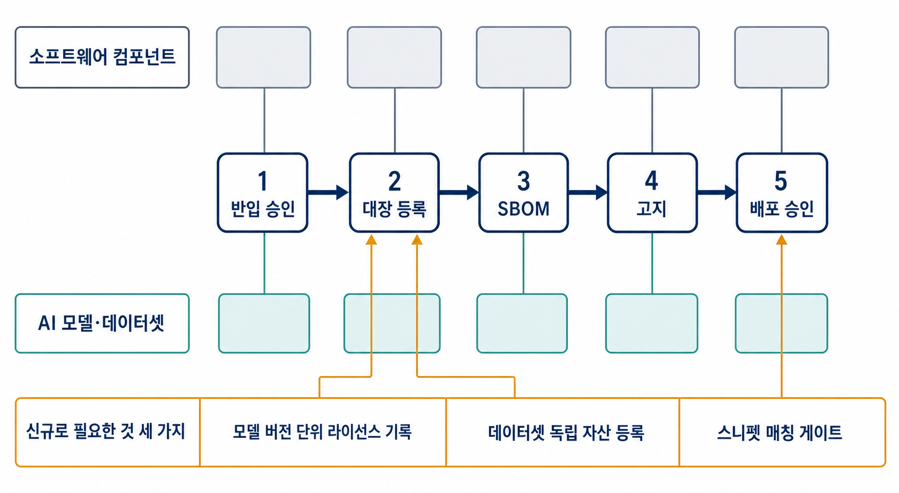

*[AI 자산의 기존 오픈소스SW 거버넌스 편입 구조]*

#### 신규로 필요한 것은 세 가지뿐이다 — 모델 버전 단위 라이선스 기록, 데이터셋의 독립 자산 등록, 스니펫 매칭 게이트

기존 프로세스에 없던 항목은 다음 세 가지다. 이 셋 외의 신규 단계를 임의로 늘리지 않는다.

1. **모델 버전 단위 라이선스 기록** — 같은 제품군 안에서 세대별로 라이선스가 갈리므로 '모델군' 단위로 기록하면 오판이 생긴다. 실제 사례는 [Gemma — 같은 제품군 안에서 라이선스가 갈린다(Gemma 3 이하 vs Gemma 4)](#gemma--같은-제품군-안에서-라이선스가-갈린다gemma-3-이하-vs-gemma-4)에서 다룬다.
2. **데이터셋의 독립 자산 등록** — 모델 라이선스와 데이터셋 라이선스는 별개이고, 데이터셋 라이선스 표기 자체의 신뢰도가 낮다. 근거와 등록 필드는 [데이터셋 거버넌스](#데이터셋-거버넌스)에서 다룬다.
3. **스니펫 매칭 게이트** — 기존 SCA<sub>Software Composition Analysis</sub>는 package manifest를 근거로 삼기 때문에 코드에 직접 써 넣어진 복사 조각을 보지 못한다. 검출 원리의 차이는 [의존성 SCA는 복사된 코드 조각을 보지 못한다 — 스니펫 매칭이 필요한 이유](#의존성-sca는-복사된-코드-조각을-보지-못한다--스니펫-매칭이-필요한-이유)에서 다룬다.

### '오픈소스 AI'라는 말의 기준

이 절의 목적은 사내 문서·조달 문서·제품 고지에서 어떤 모델을 '오픈소스SW'로 부를 수 있는지 판정하는 것이다.

#### OSAID 1.0의 3요소 — 데이터 정보·코드·파라미터

OSI<sub>Open Source Initiative</sub>의 Open Source AI Definition(OSAID) 1.0은 다음 세 요소를 '수정을 위한 선호 형태(preferred form to make modifications)'로 요구한다[^ai-ai-osaid].

- **데이터 정보(Data Information)** : 'Sufficiently detailed information about the data used to train the system so that a skilled person can build a substantially equivalent system'
- **코드(Code)** : 'The complete source code used to train and run the system'
- **파라미터(Parameters)** : 'The model parameters, such as weights or other configuration settings'

두 가지 사실을 함께 확인한다. 첫째, OSAID는 2024-10-28 공개된 1.0이 2026-07-31 현재도 유일한 안정판이며 v1.1과 v2.0은 미발표다. 둘째, OSI는 개별 AI 시스템을 인증하지 않는다 — 정의 수립 과정의 검증 단계에서 Pythia(EleutherAI), OLMo(AI2), Amber·CrystalCoder(LLM360), T5(Google)가 통과했으나 OSI는 'These results should be seen as part of the definitional process... they are not certifications of any kind. OSI will continue to validate only legal documents and will not validate or review individual AI systems'라고 명시했다[^ai-ai-osaid-faq]. 인증 제도가 존재하지 않으므로 '오픈소스SW 인증 모델'이라는 표현을 사내 금지 어휘로 등록한다.

[^ai-ai-osaid]: Open Source Initiative, The Open Source AI Definition – 1.0 : https://opensource.org/ai/open-source-ai-definition
[^ai-ai-osaid-faq]: Open Source Initiative, OSAID FAQs : https://opensource.org/ai/faq

#### 결론이 나지 않은 논쟁 — SFC·FSF·Debian의 비판

OSAID를 확정된 표준처럼 인용하면 사내 정책이 한쪽 입장에만 서게 된다. 세 진영의 비판이 남아 있다. Software Freedom Conservancy의 Bradley Kuhn은 2024-10-31 블로그에서 'the OSAID fails to place sufficient requirements on the licensing and public disclosure of training sets'라고 비판했다[^ai-ai-sfc-osaid]. FSF는 학습 데이터와 그 처리 스크립트까지 자유 소프트웨어여야 한다는 더 엄격한 입장으로 알려져 있으나, 2026-08 기준 확정 공개된 기준 문서는 확인되지 않았다. Debian에서는 개발자 Mo Zhou가 OSAID-1.0-RC2 단계에서 데이터 정보만 요구하면 오픈소스 AI가 원본 학습 데이터를 감출 수 있게 된다는 반대 의견을 debian-project 메일링 리스트에 제출하고, 이 문제에 대한 프로젝트 차원의 합의 절차를 제안했다[^ai-ai-debian-osaid].

세 비판의 공통 쟁점은 원본 학습 데이터가 아니라 데이터 정보만 요구한 타협이다. 이 논쟁은 종결되지 않았다. 따라서 사내 정책에서 'OSAID 준수'를 단일 판정 기준으로 삼지 않고, 최소 요건(라이선스 조항 실사)과 권고 요건(데이터 출처 공개 수준)을 분리해 규정한다.

[^ai-ai-sfc-osaid]: Software Freedom Conservancy, Open Source AI Definition Erodes the Meaning of "Open Source" : https://sfconservancy.org/blog/2024/oct/31/open-source-ai-definition-osaid-erodes-foss/
[^ai-ai-debian-osaid]: debian-project 메일링 리스트, Concerns regarding the "Open Source AI Definition" 1.0-RC2 : https://lists.debian.org/debian-project/2024/10/msg00005.html

#### G7 개방성 4단계 표기 체계 (2026-05-29)

2026-05-29 파리에서 열린 G7 디지털·기술 장관회의는 'G7 Vision on AI openness opportunities and shared language'를 승인해 AI 개방성을 4단계로 구분했다[^ai-ai-g7-openness]. 아래 표는 각 등급이 무엇을 공개하고 어떤 제한을 두는지 대조한 것으로, 사내 용어 표준과 모델 대장의 값 목록을 이 4단계에 맞춘다.

| 등급 | 공개 범위 | 사용 제한 | 적용 예 (이 가이드의 판단) |
|---|---|---|---|
| 데이터 공개 오픈소스 AI | 가중치·배포 코드·학습 코드·전체 학습 데이터를 모두 오픈소스SW 라이선스로 무상 공개 | 없음 | 해당 예를 특정하지 않음 |
| 오픈소스 AI | 가중치·배포 코드·학습 코드를 무상 공개하고 학습 데이터도 전체 공개가 원칙이나, 법적·기술적으로 공유가 불가능한 경우에 한해 그 데이터에 관한 데이터 정보로 대체 | 없음 | 해당 예를 특정하지 않음 |
| 가중치 공개 AI | 가중치와 배포 코드를 오픈소스SW 라이선스로 무상 공개 | 없음 | Gemma 4, Qwen3, gpt-oss |
| 가중치 제공 AI[^ai-ai-g7-weights-available] | 가중치와 배포 코드를 무상 공개하나 라이선스에 사용 제한 포함 | 상업·지역·용도 제한 | Llama 4, Gemma 3 |

마지막 열은 G7 문서에서 온 것이 아니다. G7 문서 본문에는 모델명이 한 건도 등장하지 않는다. 위 '적용 예'는 각 모델의 라이선스와 공개 구성요소를 이 가이드가 등급 정의에 대조해 넣은 것이다. 따라서 사내 문서나 조달 문서에 인용할 때는 등급 정의와 공개 범위까지만 국제 준거로 쓰고, 특정 모델의 등급은 그 모델의 라이선스 원문을 직접 확인해 판정한다. 모델 라이선스는 개정되므로 등급도 함께 바뀐다.

이 문서는 'This document constitutes a non-binding reference'라고 스스로 밝힌 비구속 준거이며, 법적 의무를 만들지 않는다. 그럼에도 사내 표기 기준으로 쓸 가치가 있는 이유는 원칙 4에 있다 — 'any description of an AI as "open" should clearly state which components are made available, whether with or without restrictions, rather than using the term "open" as a blanket characterization'. 문서는 목적에 open washing 방지를 명시한다[^ai-ai-g7-declaration].

[^ai-ai-g7-openness]: G7, Vision on AI openness opportunities and shared language (PDF) : https://www.entreprises.gouv.fr/files/files/Actualites/2026/g7/vision-AI-openness-opportunities-and-shared-language.pdf
[^ai-ai-g7-weights-available]: '가중치 제공 AI'는 가중치와 배포 코드를 무상으로 받을 수는 있으나 상업·지역·용도 등 사용 제한이 라이선스에 붙는 등급이다. G7 문서의 'Weights Available AI'에 대응하며, 한글 정착 표기가 없어 이 가이드에서 정한 표기다. 출처는 위 G7 문서와 같다.
[^ai-ai-g7-declaration]: GOV.UK, G7 Digital and Technology Ministerial Declaration, 29 May 2026 : https://www.gov.uk/government/publications/g7-digital-and-technology-ministerial-declaration-29-may-2026/g7-digital-and-technology-ministerial-declaration-29-may-2026

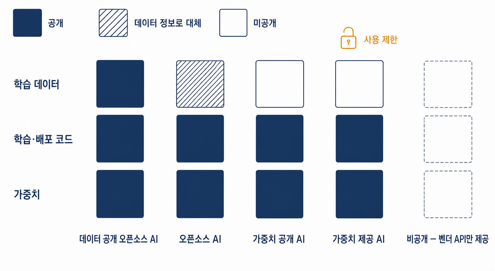

*[G7 AI 개방성 4단계와 공개 구성요소]*

#### 사내 표기 규칙 — 모델 대장의 '개방성 등급' 컬럼

앞의 두 기준을 사내에서 실제로 운영하려면 모델 등록 대장에 '개방성 등급' 컬럼을 필수 항목으로 둔다. 값은 자유 입력을 막고 다음 다섯 개로 고정한다. G7 4단계를 그대로 채택하는 이유는 그것이 국제 준거이기 때문이며, 벤더 API만 사용하는 경우를 담기 위해 '비공개' 하나를 더한다.

```text
[모델 등록 대장 — '개방성 등급' 컬럼 정의]

컬럼명     : 개방성 등급 (필수)
입력 방식   : 드롭다운 (자유 입력 금지)
허용 값     : 1) 데이터 공개 오픈소스 AI
             2) 오픈소스 AI
             3) 가중치 공개 AI
             4) 가중치 제공 AI
             5) 비공개 (벤더 API만 제공)
함께 기록   : 라이선스 원문 URL, 원문 확인 일자, 판정자
```

이 컬럼을 강제하는 이유는 두 가지 실무 위험 때문이다. 첫째, 조달 문서에 '오픈소스 AI 사용'으로 기재해 발주처의 오픈소스SW 정책 심사를 통과했으나 실제로는 사용 제한이 있는 커스텀 라이선스인 경우가 있다. 둘째, 같은 오인이 사내 오픈소스SW 승인 프로세스를 우회하는 통로가 된다. '라이선스 미표기'가 곧 '오픈소스SW'로 읽히기 쉬운 배경에는 Hugging Face 모델의 약 70%가 라이선스 표기 자체가 없다는 실태가 있다[^ai-ai-redmonk-hf]. 상세 수치와 개발자 단계의 대응은 [라이선스 미표기는 '오픈소스SW'가 아니라 '모든 권리 유보'다 — Hugging Face 실태](#라이선스-미표기는-오픈소스sw가-아니라-모든-권리-유보다--hugging-face-실태)에서 다룬다.

[^ai-ai-redmonk-hf]: RedMonk, License Distribution on Hugging Face (2026-05-12, 2차 출처 — 저자는 저작권 위반 모델을 걸러낼 수 없고 라이선스 분류 정확도를 보장할 수 없다는 한계를 명시했다) : https://redmonk.com/sogrady/2026/05/12/hugging-face-licensing/

### 모델 라이선스 실사

이 절은 모델을 반입할 때 라이선스 원문에서 무엇을 확인하는가를 벤더별로 정리한다.

#### Llama 4 — 700M MAU 임계, 'Built with Llama' 표시, 파생 모델 명칭 접두어

Llama 4 Community License(Version Effective Date: April 5, 2025)는 OSI 승인 라이선스가 아니다. 반입 시 확인할 의무는 다음 네 가지다[^ai-ai-llama4-license].

1. **사용자 수 임계** — 'If, on the Llama 4 version release date, the monthly active users of the products or services made available by or for Licensee, or Licensee's affiliates, is greater than 700 million monthly active users in the preceding calendar month, you must request a license from Meta'(제2조).
2. **계약서 사본 동봉과 표시 의무** — 배포 시 계약서 사본을 함께 제공하고, 관련 웹사이트·사용자 인터페이스·블로그 게시물·about 페이지·제품 문서 가운데 한 곳에 'Built with Llama'를 눈에 띄게 표시한다(제1.b.i).
3. **파생 모델 명칭 접두어** — Llama Materials나 그 출력물·결과물로 AI 모델을 만들거나 학습·파인튜닝해 배포하는 경우 그 모델 명칭 앞에 'Llama'를 붙인다(제1.b.i 후단).
4. **NOTICE 문구** — NOTICE 파일에 'Llama 4 is licensed under the Llama 4 Community License, Copyright © Meta Platforms, Inc. All Rights Reserved.'를 그대로 삽입한다.

제5조는 상표 라이선스를 원칙적으로 부여하지 않으면서 'Llama' 표장 사용을 위 명칭 의무 이행 목적으로만 허여하고 Meta의 브랜드 가이드라인 준수를 요구한다. 제1.b.iv는 Acceptable Use Policy 준수를 의무화한다. 700M MAU 임계는 국내 대부분 기업에 걸리지 않는다. 다만 조항이 'Licensee, or Licensee's affiliates'를 함께 세므로 계열사 합산 기준을 확인한다.

[^ai-ai-llama4-license]: Meta, LLAMA 4 COMMUNITY LICENSE AGREEMENT : https://github.com/meta-llama/llama-models/blob/main/models/llama4/LICENSE

#### 라이선스 본문 밖에 있는 제한 — Llama 4 멀티모달의 EU 조항

Llama 4의 멀티모달 모델에 대해서는 'the rights granted under Section 1(a) of the Llama 4 Community License Agreement are not being granted to you if you are an individual domiciled in, or a company with a principal place of business in, the European Union'이라는 제한이 붙는다. 이 제한은 LICENSE 파일이 아니라 USE_POLICY.md(Acceptable Use Policy)에 있다[^ai-ai-llama4-aup].

같은 조항은 'This restriction does not apply to end users of a product or service that incorporates any such multimodal models'라고 이어진다. 즉 EU 밖 법인이 만든 제품을 EU 최종 사용자가 사용하는 것은 허용된다. 이 구분을 빠뜨리면 필요 이상으로 넓은 금지 정책을 만들게 된다. 국내 기업에 실제로 문제가 되는 경우는 EU 자회사, EU 소재 연구소, EU 소재 외주 개발사를 통해 해당 모델을 다루는 때다.

이 사례의 교훈은 특정 벤더가 아니라 절차에 있다. 모델 승인 프로세스에 '라이선스 본문 외 부속 문서(AUP / Use Policy / Prohibited Use Policy) 확인' 단계를 필수화한다. 모델 대장에는 '지역 제한'과 '개발 수행 법인 소재지' 컬럼을 추가한다.

[^ai-ai-llama4-aup]: Meta, Llama 4 Acceptable Use Policy (USE_POLICY.md) : https://github.com/meta-llama/llama-models/blob/main/models/llama4/USE_POLICY.md

#### 흔한 오해 정정 — 증류 금지 조항은 Llama 3.1부터 삭제됐다

Llama 2와 Llama 3 라이선스에는 'You will not use the Llama Materials or any output or results of the Llama Materials to improve any other large language model (excluding Meta Llama 3 or derivative works thereof)'라는 조항이 있었다[^ai-ai-llama3-license]. 이 문장은 2024-07-23 공개된 Llama 3.1부터 삭제되었고 Llama 4 LICENSE에도 없다[^ai-ai-llama4-license]. 출력물로 다른 모델을 학습시킬 때 남는 의무는 파생 모델 명칭 앞에 'Llama'를 붙이는 것뿐이다.

2차 해설 가운데 Llama 4에 학습 금지나 경쟁사 제한이 있다고 서술한 것이 다수 있으나 원문과 일치하지 않는다. 여기서 얻을 일반 교훈은 하나다 — 버전별 LICENSE 원문을 직접 대조하고, 사내 위키에 요약본만 두는 대신 버전별 원문 스냅샷을 보관한다.

[^ai-ai-llama3-license]: Meta, llama3/LICENSE at main (meta-llama/llama3) : https://github.com/meta-llama/llama3/blob/main/LICENSE

#### Gemma — 같은 제품군 안에서 라이선스가 갈린다(Gemma 3 이하 vs Gemma 4)

Gemma 4는 Apache-2.0으로 공개됐다. Google Open Source Blog는 2026-04-02 게시글에서 'Gemma 4 models are the first in the Gemmaverse to be released under the OSI-approved Apache 2.0 license'라고 밝혔다[^ai-ai-gemma4]. 반면 Gemma 3 이하에는 커스텀 Gemma Terms of Use(최종 수정 2026-04-01)와 Prohibited Use Policy가 그대로 적용된다[^ai-ai-gemma-terms]. 구세대에 남는 의무는 다음 네 가지다.

1. **계약서 사본 제공** — 'You must provide all third party recipients of Gemma or Model Derivatives a copy of this Agreement'.
2. **NOTICE 파일 동봉** — Hosted Service를 통하지 않는 모든 배포에 'Gemma is provided under and subject to the Gemma Terms of Use found at ai.google.dev/gemma/terms' 문구를 담은 'Notice' 텍스트 파일을 동봉한다.
3. **원격 사용 제한권** — Google은 계약 위반이라고 합리적으로 판단하는 Gemma Services의 사용을 원격으로 제한할 권리를 유보한다.
4. **상표 권리 불허여** — 계약은 Google의 상표·상호·로고에 대한 어떤 권리도 부여하지 않는다.

'Model Derivatives' 정의는 가중치·파라미터·연산의 전이로 만들어진 다른 머신러닝 모델까지 포함하므로 증류 결과물도 포섭된다. 반면 출력물에 대해서는 'Google claims no rights in Outputs you generate using Gemma'로 권리를 주장하지 않는다. 실무 결론은 [신규로 필요한 것은 세 가지뿐이다 — 모델 버전 단위 라이선스 기록, 데이터셋의 독립 자산 등록, 스니펫 매칭 게이트](#신규로-필요한-것은-세-가지뿐이다--모델-버전-단위-라이선스-기록-데이터셋의-독립-자산-등록-스니펫-매칭-게이트)의 첫 항목과 직결된다. Gemma 3 이하 파생물은 Apache-2.0으로 재배포할 수 없다.

[^ai-ai-gemma4]: Google Open Source Blog, Gemma 4: Expanding the Gemmaverse with Apache 2.0 (게시글에 표기된 게시일은 2026-04-02이나 URL 경로에는 2026/03이 들어 있어 서로 어긋난다. 이 가이드는 게시글 표기를 인용했다) : https://opensource.googleblog.com/2026/03/gemma-4-expanding-the-gemmaverse-with-apache-20.html
[^ai-ai-gemma-terms]: Google AI for Developers, Gemma Terms of Use : https://ai.google.dev/gemma/terms

#### Mistral — 한 벤더 안의 3원 구조와 PoC→프로덕션 전환 게이트

Mistral은 모델별로 Apache-2.0, Mistral Research License, Mistral AI Non-Production License(MNPL)를 섞어 쓴다. 벤더 이름만으로 라이선스를 추정할 수 없다는 뜻이다. MNPL-0.1의 제한은 다음과 같이 보고된다[^ai-ai-mnpl].

- 사용 범위는 'testing, research, Personal, or evaluation purposes in Non-Production Environments'로 한정된다.
- 'Subject to the foregoing, You shall not supply the Mistral Models or Derivatives in the course of a commercial activity, whether in return for payment or free of charge, in any medium or form, including but not limited to through a hosted or managed service (e.g. SaaS, cloud instances, etc.), or behind a software layer.' (제3.2조) — 다만 같은 라이선스는 'Outputs are not considered as Derivatives'(정의 조항)와 'We claim no ownership rights in and to the Outputs'(제4.2조)를 함께 두므로, 출력물 자체의 취급은 이 금지 조항과 구분해 판단한다.
- 파생물 배포 시 수정 사실을 눈에 띄게 고지한다.
- 특허 소송을 제기하면 라이선스가 즉시 종료된다.
- 상업적 사용은 license@mistral.ai로 별도 요청한다.

이 절의 결론은 벤더 소개가 아니라 게이트 설계다. 'PoC 단계에서 사용한 모델의 라이선스를 프로덕션 전환 시점에 재확인한다'를 승인 프로세스의 항목으로 명시한다. 가장 흔한 위반 경로는 '연구용으로 받았으니 그대로 서비스한다'이다.


[^ai-ai-mnpl]: Mistral AI, Mistral AI Non-Production License (MNPL-0.1), 2026-07-31 확인 : https://mistral.ai/licenses/MNPL-0.1.md

#### 자사 모델을 공개할 때의 라이선스 선택 — Apache-2.0 / OpenMDW / 커스텀 3택 결정 트리

여기까지가 외부 모델을 가져다 쓰는 관점이었다면, 이 항은 자사 모델을 내보내는 관점이다. 배포물의 구성과 사용 제한 필요 여부에 따라 다음 세 갈래로 판단한다.

| 조건 | 선택 | 유의 사항 |
|---|---|---|
| 코드 중심 배포이고 사용 제한이 필요 없다 | Apache-2.0 | OSI 승인 라이선스이며 특허 조항을 포함한다 |
| 모델 가중치·코드·데이터·문서를 한 배포물로 내보내 라이선스 조각화를 피하려 한다 | OpenMDW | 승인 여부는 아래 서술 참조. 배포물 구성 요소를 'Model Materials' 하나로 덮는다 |
| 사용 제한이 반드시 필요하다 | 커스텀 라이선스 | 법무 승인 필수. EU AI Act 오픈소스SW 예외를 받지 못한다 |

OpenMDW는 Linux Foundation이 2026-05-28 OpenMDW-1.1을 공개했고, NVIDIA가 Cosmos·Isaac GR00T·Ising·Nemotron 모델군의 '향후 릴리스'부터 채택하겠다고 발표했다(현재 배포본의 적용 여부는 모델별로 확인한다)[^ai-ai-openmdw-lf]. SPDX License List 최신판 3.28.0(2026-02-20)에는 OpenMDW-1.0만 등재되어 있어 1.1에는 아직 표준 식별자가 없다 — SBOM에는 LicenseRef- 형태로 기록하고 라이선스 원문을 첨부한다[^ai-ai-spdx-list]. 다만 OSI 승인 여부는 공식 페이지에 언급이 없어 확인되지 않는다 — 'OSI 승인 라이선스다'라고 표기하지 않는다[^ai-ai-openmdw].

커스텀 라이선스를 선택하면 [EU AI Act의 오픈소스SW 예외는 좁다 — 무엇이 예외를 깨는가](#eu-ai-act의-오픈소스sw-예외는-좁다--무엇이-예외를-깨는가)에서 다루는 예외가 깨진다. 공개 절차 자체(공개 심의, 저장소 준비, 커뮤니티 운영)는 [「오픈소스SW 공개하기」](#3-오픈소스sw-공개하기)에서 다룬다.


[^ai-ai-openmdw-lf]: Linux Foundation, Linux Foundation Releases OpenMDW-1.1; NVIDIA Adopts OpenMDW : https://www.linuxfoundation.org/press/linux-foundation-releases-openmdw-1.1-nvidia-adopts-openmdw-for-cosmos-isaac-gr00t-ising-and-nemotron-ai-model-families
[^ai-ai-spdx-list]: SPDX License List 3.28.0 : https://spdx.org/licenses/
[^ai-ai-openmdw]: OpenMDW 공식 사이트 : https://openmdw.ai/

#### 행위 제한형 라이선스(OpenRAIL) — 제한이 파생물과 최종 사용자까지 전파된다

OpenRAIL 계열 라이선스는 상업적 사용을 허용하면서도 감시·추적, 허위정보 생성, 차별 등의 용도를 금지하고, 그 제한을 파생물에도 같거나 더 엄격한 형태로 부착할 것을 요구한다[^ai-ai-openrail]. 사용 제한이 있으므로 OSI 승인 라이선스가 아니다. OSI는 'Should OpenRAIL licenses be considered OS AI Licenses?' 웨비나를 열어 이 문제를 논의했으나 승인하지 않았다[^ai-ai-openrail-osi]. RedMonk의 2026-05-12 분석은 OpenRAIL을 OSI 비승인·모델 비특정 라이선스 가운데 가장 큰 카테고리로 분류했다[^ai-ai-redmonk-hf].

실무 결론은 하나다. 행위 제한 조항을 자사 서비스 이용약관에 그대로 전가(pass-through)해야 하는지를 법무 검토 항목으로 등록한다. 제한이 파생물과 최종 사용자까지 전파되도록 설계되어 있으므로 약관 미반영은 계약 위반 소지가 된다. 이미지·음성 생성 모델을 제품에 탑재하는 조직이 주 대상이다.

[^ai-ai-openrail]: Responsible AI Licenses (RAIL) FAQ : https://www.licenses.ai/faq-2
[^ai-ai-openrail-osi]: Open Source Initiative, Should OpenRAIL licenses be considered OS AI Licenses? (웨비나) : https://opensource.org/ai/webinars/should-openrail-licenses-be-considered-os-ai-licenses

#### 파인튜닝 결과물의 라이선스 승계 — 5개 항목 배포 승인 체크리스트

파인튜닝 결과물은 베이스 모델 라이선스의 파생물 정의에 포섭되는 것이 일반적이다. Llama 4는 '(or any derivative works thereof)'와 '(including another AI model) that contains any of them'으로 파생 AI 모델을 명시적으로 포섭하고[^ai-ai-llama4-license], Gemma Terms of Use의 'Model Derivatives'는 가중치·파라미터·연산의 전이로 만들어진 모델까지 포함한다[^ai-ai-gemma-terms]. 배포 승인 시 다음 다섯 항목을 확인한다.

| 확인 항목 | 어디를 보는가 |
|---|---|
| 베이스 모델 라이선스 사본 동봉 | Llama 4 제1.b.i, Gemma Terms of Use의 제3자 수령인 조항 |
| NOTICE 파일 문구 | Llama 4 NOTICE 지정 문구, Gemma Terms of Use의 Notice 텍스트 파일 요구 |
| 모델 명칭 규칙 | Llama 4 제1.b.i 후단(명칭 접두어) |
| AUP 전가 여부 | Llama 4 제1.b.iv, Gemma Prohibited Use Policy |
| 지역 제한 여부 | Llama 4 USE_POLICY.md의 EU 조항 |

서술 강도에 주의한다. 이들 라이선스의 강제력은 저작권이 아니라 계약(약관 수락)에 근거한다는 해석이 유력하다. 또한 미국 저작권청이 순수 AI 생성물의 저작물성을 부정하는 입장이어서 가중치의 저작물성 자체가 다투어질 수 있다[^ai-ai-uscopyright]. 따라서 '저작권 침해가 된다'로 단정하지 않고 '계약 위반 리스크가 실재한다' 수준으로 판단한다. 개발자가 배포 직전에 손으로 확인할 항목은 [파인튜닝 결과물을 배포하기 전에 확인할 것](#파인튜닝-결과물을-배포하기-전에-확인할-것)에 별도로 두었다.

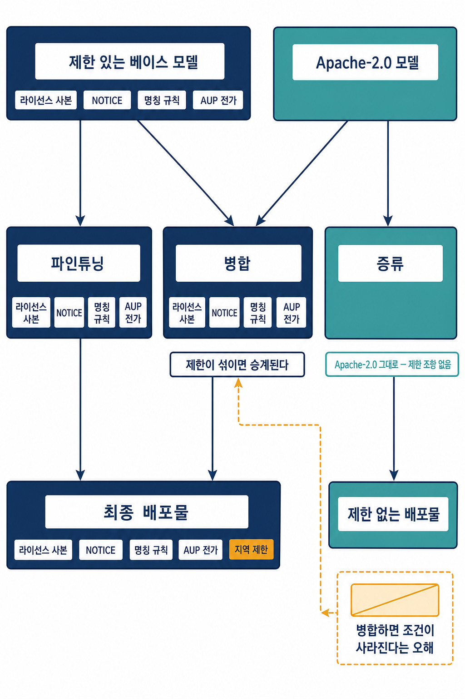

*[파생 모델의 라이선스 의무 승계 경로]*

#### 모델 라이선스 검토 체크리스트 (종합)

- [ ] 라이선스 원문을 모델 **버전별로** 직접 확인했는가 → [흔한 오해 정정 — 증류 금지 조항은 Llama 3.1부터 삭제됐다](#흔한-오해-정정--증류-금지-조항은-llama-31부터-삭제됐다)
- [ ] LICENSE 외 부속 문서(AUP·Use Policy·Prohibited Use Policy)를 확인했는가 → [라이선스 본문 밖에 있는 제한 — Llama 4 멀티모달의 EU 조항](#라이선스-본문-밖에-있는-제한--llama-4-멀티모달의-eu-조항)
- [ ] 사용자 수 임계나 매출 임계 조항이 있는가 → [Llama 4 — 700M MAU 임계, 'Built with Llama' 표시, 파생 모델 명칭 접두어](#llama-4--700m-mau-임계-built-with-llama-표시-파생-모델-명칭-접두어)
- [ ] 지역 제한이 있는가 → [라이선스 본문 밖에 있는 제한 — Llama 4 멀티모달의 EU 조항](#라이선스-본문-밖에-있는-제한--llama-4-멀티모달의-eu-조항)
- [ ] 파생물·증류물이 파생 정의에 포섭되는가 → [Gemma — 같은 제품군 안에서 라이선스가 갈린다(Gemma 3 이하 vs Gemma 4)](#gemma--같은-제품군-안에서-라이선스가-갈린다gemma-3-이하-vs-gemma-4)
- [ ] 배포 시 명칭 규칙·표시 의무·NOTICE 문구가 있는가 → [파인튜닝 결과물의 라이선스 승계 — 5개 항목 배포 승인 체크리스트](#파인튜닝-결과물의-라이선스-승계--5개-항목-배포-승인-체크리스트)
- [ ] 상표 사용 조건이 있는가 → [Llama 4 — 700M MAU 임계, 'Built with Llama' 표시, 파생 모델 명칭 접두어](#llama-4--700m-mau-임계-built-with-llama-표시-파생-모델-명칭-접두어)
- [ ] 행위 제한을 자사 약관에 전가해야 하는가 → [행위 제한형 라이선스(OpenRAIL) — 제한이 파생물과 최종 사용자까지 전파된다](#행위-제한형-라이선스openrail--제한이-파생물과-최종-사용자까지-전파된다)
- [ ] 상업 사용이 별도 요청 대상인가 → [Mistral — 한 벤더 안의 3원 구조와 PoC→프로덕션 전환 게이트](#mistral--한-벤더-안의-3원-구조와-poc프로덕션-전환-게이트)
- [ ] 모델 대장의 개방성 등급을 무엇으로 기록하는가 → [사내 표기 규칙 — 모델 대장의 '개방성 등급' 컬럼](#사내-표기-규칙--모델-대장의-개방성-등급-컬럼)

### 데이터셋 거버넌스

데이터셋은 모델에 딸린 부속물이 아니라 별도 자산이다. 모델을 승인했다는 사실이 그 모델의 학습 데이터셋을 승인했다는 뜻은 아니다.

#### 모델 라이선스와 데이터셋 라이선스는 별개다 — 누락률 70% 이상, 오류율 50% 이상

Data Provenance Initiative는 1,800개 이상의 텍스트 AI 데이터셋을 감사해 인기 데이터셋 호스팅 사이트에서 'licence omission rates of more than 70% and error rates of more than 50%'를 확인했다고 보고했다[^ai-ai-dpi-audit]. 실무 함의는 세 가지다.

1. 모델이 Apache-2.0이어도 학습에 사용한 데이터셋이 CC-BY-NC이거나 출처 불명일 수 있다.
2. 데이터셋 카드의 라이선스 필드를 그대로 SBOM에 옮기면 오류가 그대로 전파된다.
3. 저자원 언어, 창작 태스크, 합성 데이터는 제한적으로 라이선스되는 경향이 강하다.

EU 시장에 모델을 출하하는 경우 학습 콘텐츠 공개 요약 의무와 직결되므로 [EU AI Act의 오픈소스SW 예외는 좁다 — 무엇이 예외를 깨는가](#eu-ai-act의-오픈소스sw-예외는-좁다--무엇이-예외를-깨는가)를 함께 확인한다.

[^ai-ai-dpi-audit]: Nature Machine Intelligence(피어리뷰, 2024-08), A large-scale audit of dataset licensing and attribution in AI : https://www.nature.com/articles/s42256-024-00878-8

#### 데이터셋 등록 필수 5개 필드 — 출처 URL·라이선스·취득일·사용 목적·재배포 가부

다음 다섯 필드는 데이터셋을 독립 자산으로 등록할 때의 최소 단위다. 사내 자산 대장 스키마에 그대로 옮겨 쓴다.

| 필드 | 기록 규칙 | 확인 방법 |
|---|---|---|
| 출처 URL | 데이터셋 카드 주소가 아니라 원 배포처 URL을 기록한다 | 카드에 적힌 원 배포처 링크를 따라가 접속 확인 |
| 라이선스 | 데이터셋 카드 표기를 그대로 옮기지 않는다 | 원 배포처의 라이선스 표기와 교차 확인하고 불일치 시 원 배포처를 따른다 |
| 취득일 | 버전 대신 스냅샷 기준일을 기록한다(데이터셋은 갱신된다) | 내려받은 날짜와 커밋·리비전 식별자를 함께 남긴다 |
| 사용 목적 | 학습 / 평가 / 파인튜닝을 구분해 기록한다 | 목적별로 허용 범위가 달라지므로 용도 변경 시 재등록한다 |
| 재배포 가부 | 모델과 함께 배포할 수 있는지 여부를 가/부로 기록한다 | 라이선스 원문의 재배포 조항을 확인하고 근거 조항 번호를 남긴다 |

SBOM에 표기할 때는 SPDX AIPackage 또는 CycloneDX modelCard를 사용한다. 단계별 대응은 [새 체계를 만들지 않는다 — 반입 승인·대장 등록·SBOM·고지·배포 승인 5단계에 '자산 유형'을 추가한다](#새-체계를-만들지-않는다--반입-승인대장-등록sbom고지배포-승인-5단계에-자산-유형을-추가한다)의 표를 참조한다.

#### 코드 학습 데이터셋의 라이선스 혼입 — The Stack v2 사례

The Stack v2는 600개 이상의 언어, 67.5TB 규모로 '허용적 라이선스 또는 라이선스 없음' 코드를 수집한다[^ai-ai-bigcode-stack]. '라이선스 없음(no license)'은 저작권상 모든 권리가 유보된 상태이므로 포함 자체가 쟁점이다.

'Cracks in The Stack' 연구는 'Misidentified blob origins present an additional challenge, as they lead to the inclusion of non-permissively licensed code, raising serious compliance concerns'라고 보고했다. 같은 연구는 중복 제거 후에도 알려진 CVE 6,947건에 취약한 blob이 남아 있으며 코드 버전의 17%가 구버전이라고 밝혔다[^ai-ai-stack-cracks]. BigCode는 저장소 소유자를 위한 opt-out 절차와 'Am I in The Stack' 도구를 운영한다[^ai-ai-bigcode-optout].

이 사례에서 정할 것은 벤더 주장에 대한 태도다. 'AI 도구가 허용적 라이선스 코드만 학습했다'는 주장을 리스크 제거의 근거로 채택하지 않는다. 대신 스니펫 매칭 검사를 릴리스 게이트에 넣는다. 검사 구성은 [릴리스 전 3중 검사 — 의존성 SCA / 스니펫 매칭(diff 기준) / AI 도구 로그](#릴리스-전-3중-검사--의존성-sca--스니펫-매칭diff-기준--ai-도구-로그)에서 다룬다.

[^ai-ai-bigcode-stack]: BigCode, The Stack v2 데이터셋 카드(658개 언어, full 67.53TB, '허용적 라이선스 또는 라이선스 없음') : https://huggingface.co/datasets/bigcode/the-stack-v2
[^ai-ai-stack-cracks]: Cracks in The Stack: Hidden Vulnerabilities and Licensing Risks in LLM Pre-Training Datasets (arXiv 2501.02628, LLM4Code 2025 워크숍 채택, 피어리뷰) : https://arxiv.org/abs/2501.02628
[^ai-ai-bigcode-optout]: bigcode-project/opt-out-v2 : https://github.com/bigcode-project/opt-out-v2

### AI 규제와 미확정 쟁점

이 절은 확정된 의무(EU·한국)와 미확정 쟁점(저작물성·소송·벤더 면책)을 분리해 다룬다.

#### EU AI Act의 오픈소스SW 예외는 좁다 — 무엇이 예외를 깨는가

집행위의 2025-07-18 'Guidelines on the scope of obligations for general-purpose AI models'는 GPAI 오픈소스SW 예외의 범위를 아래와 같이 해석한다[^ai-ai-eu-gpai-guidelines]. 왼쪽에 해당하는 조건이 하나라도 있으면 예외를 주장할 수 없다.

| 예외를 깨는 것 | 예외를 깨지 않는 것 |
|---|---|
| 비상업·연구 전용 제한 | 귀속 표시 요구 |
| 재배포 금지 | 동일 라이선스 재배포 요구 |
| 사용자 수 임계(user-size thresholds) | 공공 안전 등 고위험 사용에 대한 합리적·비례적·비차별적 안전장치 |
| 상업 라이선스 강제 | 핵심 기능 무료 접근을 제한하지 않는 선택적 프리미엄 서비스 |
| 이중 라이선스(학술 무료 / 상업 유료) | |
| 지원·유지보수·업데이트·호스팅 접근 유료화 | |
| 핵심 기능에 대한 필수 결제 | |

세 가지를 함께 확인한다. 첫째, 체계적 위험(systemic risk) GPAI는 오픈소스SW여도 예외 없이 전 의무를 진다. 둘째, 예외가 적용되어도 학습 콘텐츠 공개 요약과 EU 저작권법 준수 정책 의무는 남는다[^ai-ai-eu-article53]. 셋째, 그 직접 결과로 700M MAU 임계를 둔 Llama 4는 이 예외를 받지 못한다.

GPAI 제공자가 관리할 시행 일자는 세 개다[^ai-ai-act]. 이 세 일자는 2026-07-27 발효한 Digital Omnibus로 변경되지 않았다[^ai-ai-omnibus].

- **2025-08-02** — GPAI 제공자 의무(제53·54·55조) 적용 개시(제113조 셋째 문단 (b)).
- **2026-08-02** — 집행위와 AI Office의 GPAI 집행 권한·과징금 부과 개시(제101조 및 제88~94조). AI Office 자체는 2025-08-02부터 존재하며, 이 날 시작되는 것은 조사·과징금 권한이다.
- **2027-08-02** — 2025-08-02 이전 EU 시장에 출시된 기존 GPAI 모델의 소급 준수 기한(제111조(3)).

고위험 시스템 의무의 적용 일자는 같은 개정으로 연기되었으므로 GPAI 일정과 같은 기준일로 관리하지 않는다. 전체 규제 기한은 [「오픈소스SW 사용하기」의 글로벌 SBOM 규제 동향](#글로벌-sbom-규제-동향) 기한표를 단일 기준으로 삼는다.

[^ai-ai-eu-gpai-guidelines]: artificialintelligenceact.eu, Overview of Guidelines for GPAI Models (2차 출처 — 집행위 가이드라인 해설) : https://artificialintelligenceact.eu/gpai-guidelines-overview/
[^ai-ai-eu-article53]: artificialintelligenceact.eu, Article 53: Obligations for Providers of General-Purpose AI Models (2차 출처) : https://artificialintelligenceact.eu/article/53/
[^ai-ai-act]: Regulation (EU) 2024/1689 (AI Act) : https://eur-lex.europa.eu/eli/reg/2024/1689/oj/eng
[^ai-ai-omnibus]: Regulation (EU) 2026/1744 of 8 July 2026 (Digital Omnibus on AI), OJ L, 2026/1744, 24.7.2026 : https://eur-lex.europa.eu/eli/reg/2026/1744/oj/eng

#### 한국 AI 기본법의 고지·표시 의무 — 오픈소스SW 모델도 면제되지 않는다

「인공지능 발전과 신뢰 기반 조성 등에 관한 기본법」은 2026-01-22 시행됐다[^ai-ai-kr-aiact]. 제31조(투명성 확보 의무)는 두 가지를 요구한다. 첫째, 고영향 AI 또는 생성형 AI 기반 제품·서비스를 제공할 때 해당 제품·서비스가 그러한 인공지능에 기반해 운용된다는 사실을 이용자에게 사전 고지한다. 둘째, 생성형 AI 결과물에는 그 결과물이 생성형 인공지능에 의해 생성되었다는 사실을 표시한다.

표시 방식은 결과물의 성격에 따라 갈린다. 딥페이크 결과물은 사람이 명확히 인식할 수 있는 가시적 표시가 필요하다. 일반 생성물은 사람 인식 방식과 기계 판독 방식(워터마크·메타데이터) 중에서 선택할 수 있으나, 기계 판독 방식을 택하면 안내 문구나 음성을 최소 1회 제공해야 한다[^ai-ai-kr-aiact-decree].

핵심은 예외의 부재다. 제31조 제4항과 시행령 제23조에 일부 예외(사용이 명백한 경우, 내부 업무 목적 사용 등)가 있으나, 오픈소스 AI를 대상으로 한 예외는 확인되지 않았다. 제재는 고지·표시 의무 위반 시 3천만원 이하 과태료다(법 제43조 제1항 제2호)[^ai-ai-kr-aiact]. 다만 과학기술정보통신부는 시행령 입법예고 단계에서 과태료 부과에 최소 1년 이상의 계도기간을 두겠다고 밝혔으므로, 실제 부과는 2027년 이후가 될 가능성이 크다[^ai-ai-kr-grace].

실행 지시는 하나다. AI 고지·표시를 기존 오픈소스SW 고지 화면과 같은 위치에 배치해 운영 부담을 줄이고, 오픈소스SW 모델 사용이 면제 사유가 아님을 정책 문서에 명시한다.

[^ai-ai-kr-aiact]: 국가법령정보센터, 인공지능 발전과 신뢰 기반 조성 등에 관한 기본법 : https://www.law.go.kr/lsInfoP.do?lsiSeq=268543
[^ai-ai-kr-aiact-decree]: 국가법령정보센터, 인공지능 발전과 신뢰 기반 조성 등에 관한 기본법 시행령(시행 2026-01-22) : https://www.law.go.kr/LSW/lsInfoP.do?efYd=20260122&lsiSeq=282879
[^ai-ai-kr-grace]: 과태료 계도기간 운영 등 상세조항을 담은 'AI 기본법' 시행령 입법예고 (2차 출처 — 법무법인 뉴스레터) : https://www.daeryunlaw.com/newsletter/news/246

#### AI 생성 코드에 저작권이 있는가 — 미국 저작권청의 입장과 국내 미확립

미국 저작권청은 2025-01-29 발표한 Part 2(Copyrightability)에서 프롬프트 입력만으로 만든 순수 AI 생성물의 저작물성을 부정하고 'prompts alone do not provide sufficient human control'이라고 밝혔다. 인간이 선택·배열·실질적 수정을 가한 부분은 사안별로 보호될 수 있다는 입장이다[^ai-ai-uscopyright]. 2025-05-09 사전공개된 Part 3(Generative AI Training)은 학습 목적 이용의 공정이용을 추정할 수 없고 사안별로 판단해야 한다고 보았으며, 새로운 법정 예외의 신설은 불필요하다고 결론지었다[^ai-ai-uscopyright-part3].

한국 저작권법에는 이에 대응하는 유권해석이 별도로 정리되어 있지 않아 국내 적용은 미확립이다. 실무에서는 릴리스 검토 항목 하나로 다룬다 — AI 생성 비중이 높은 산출물을 오픈소스SW로 사외 공개할 때 저작권이 성립하지 않아 라이선스 부여가 무의미해질 수 있다는 점을 검토하고, 인간 기여 기록(리뷰·수정 이력)을 남긴다. 공개 절차는 [「오픈소스SW 공개하기」](#3-오픈소스sw-공개하기)에서 다룬다.


[^ai-ai-uscopyright]: U.S. Copyright Office, Copyright and Artificial Intelligence (Part 2: Copyrightability, 2025-01-29) : https://www.copyright.gov/ai/
[^ai-ai-uscopyright-part3]: U.S. Copyright Office, Copyright and Artificial Intelligence Part 3: Generative AI Training (Pre-Publication Version, 2025-05-09, PDF) : https://www.copyright.gov/ai/Copyright-and-Artificial-Intelligence-Part-3-Generative-AI-Training-Report-Pre-Publication-Version.pdf

#### Doe v. GitHub — 진행 중이며 결론이 아니다

이 사건은 결론이 아니라 진행 상태로 인용한다. 경과는 다음과 같다[^ai-ai-copilot-litigation].

- 2023-05-11 : 미국 캘리포니아 북부지방법원(Judge Jon S. Tigar)이 오픈소스SW 라이선스 위반(계약 위반) 청구의 기각을 전부 기각하고 DMCA §1202(b)(1)·(b)(3) 청구도 유지했다.
- 2024-12 : §1202(b)가 '동일성(identicality)' 요건을 요구하는지에 대한 중간항소를 제9순회 항소법원이 수리했다.
- 2025-04-09 : 원고 측 opening brief가 제출됐다.
- 2026-02-11 : 구두변론이 열렸고, 2026-07-31 현재 계류 중이며 지방법원 절차는 정지 상태다.

쟁점은 AI 출력물이 원본과 동일하지 않아도 저작권 관리정보(CMI) 제거 책임이 성립하는가이다. 사내 정책 문서에는 이 사안을 '미확정 쟁점'으로 표시하고, 판결 확정 시 정책 재검토를 트리거할 모니터링 담당자를 지정한다.


[^ai-ai-copilot-litigation]: GitHub Copilot litigation — Case updates : https://githubcopilotlitigation.com/case-updates.html

#### 벤더 면책은 제품별·시점별로 다르다 — Customer Copyright Commitment

Microsoft Learn은 GitHub Offerings에 대해 'as of April 3, 2026, there are no additional required mitigations. Use of the Duplicate Detection filter feature is no longer required for CCC coverage. This feature remains available for optional use.'라고 밝힌다. 반면 다른 제품에는 요구가 남아 있다 — Azure OpenAI 코드 생성 시나리오는 protected material code model을 annotate 또는 filter 모드로 설정해야 한다. annotate 모드를 택하면 출력물에 인용된 라이선스를 준수해야 CCC가 적용된다(2023-12-01 발효). 비동기 필터를 사용해 사후 플래그된 출력물도 인용 라이선스를 준수하지 않으면 CCC가 적용되지 않는다(2024-05-21 발효). Copilot Studio는 외부 호스팅 모델을 연결하면 CCC가 적용되지 않는다(2025-06-01 발효)[^ai-ai-ccc].

벤더 면책 조건을 계약 갱신 주기마다 재확인하는 항목을 계약 관리 대장에 넣는다. 필터 요구가 사라졌다고 해서 사내 필터 정책까지 해제하지 않는다 — 면책과 위험 감소는 별개다.

[^ai-ai-ccc]: Microsoft Learn, Customer Copyright Commitment Required Mitigations : https://learn.microsoft.com/en-us/azure/foundry/responsible-ai/openai/customer-copyright-commitment

## AI 오픈소스SW 가이드 - 개발자 편

기업 편이 정책과 승인 기준을 다뤘다면, 개발자 편은 개인이 커밋 전과 배포 전에 직접 수행하는 확인을 다룬다. 조직의 정책이 아무리 촘촘해도 실제 코드와 모델을 다루는 손은 개발자의 것이다.

이 트랙은 두 상황을 다룬다. 하나는 AI 코딩 도구를 사용해 코드를 만들 때이고, 다른 하나는 외부 모델을 직접 내려받아 사용하거나 파생물을 만들 때다. 정책의 근거와 라이선스 원문 해석은 기업 편에 있으므로 필요할 때 해당 소절로 이동한다.

### AI 코딩 도구를 쓸 때

#### 코드 참조 필터가 잡지 못하는 것 — 약 150자 임계, GitHub 공개 저장소 색인 한정, 수개월 갱신 주기

GitHub Copilot의 code referencing은 공식 문서에 다음과 같이 규정되어 있다 — 'Copilot code referencing compares potential code suggestions and the surrounding code of about 150 characters against an index of all public repositories on GitHub.com'[^ai-ai-copilot-ref]. 같은 문서가 한계도 함께 밝힌다.

- **GitHub 밖 코드와 비공개 저장소 코드는 검색 대상이 아니다** — 'Code in private GitHub repositories, or code outside of GitHub, is not included in the search process'.
- **임계 미만의 짧은 조각은 통과한다** — 비교 단위가 약 150자이므로 그보다 짧은 일치는 걸리지 않는다.
- **색인이 수개월 주기로 갱신된다** — 'The search index is refreshed every few months'. 최근에 공개된 코드는 색인에 없을 수 있다.

일치가 발견되면 로그에 'the URLs of files containing matching code, and the name of the license that applies to that code, if any was found'가 기록된다. 조직 정책으로 개인 설정을 상속·강제할 수 있으며, 2026-02-18부터 Copilot coding agent도 code referencing을 지원한다[^ai-ai-copilot-agent-ref].

**필터를 켰다고 라이선스 리스크가 제거되지 않는다.** 위 세 한계가 겹치는 구간은 필터가 보지 못하는 사각지대다. 따라서 두 가지를 함께 한다 — 조직 정책에서 '공개 코드와 일치하는 제안 차단'을 강제 설정하고, code referencing 로그를 감사 증적으로 보존한다.

[^ai-ai-copilot-ref]: GitHub Docs, GitHub Copilot code referencing : https://docs.github.com/en/copilot/concepts/completions/code-referencing
[^ai-ai-copilot-agent-ref]: GitHub Changelog(2026-02-18), Copilot coding agent supports code referencing : https://github.blog/changelog/2026-02-18-copilot-coding-agent-supports-code-referencing/

#### 의존성 SCA는 복사된 코드 조각을 보지 못한다 — 스니펫 매칭이 필요한 이유

기존 SCA는 package manifest를 근거로 삼는다. 선언된 의존성만 목록화하므로, AI 코딩 도구가 패키지를 추가하지 않고 코드를 직접 써 넣으면 manifest에 아무 흔적도 남지 않는다. 검출 원리가 다른 검사가 필요한 이유가 여기에 있다. 세 검사가 각각 무엇을 보고 무엇을 놓치는지 아래 표로 대조한다.

| 검사 종류 | 검출 대상 | 놓치는 것 |
|---|---|---|
| 의존성 SCA | package manifest에 선언된 의존성 컴포넌트와 버전 | 코드에 직접 써 넣어진 복사 조각 |
| 스니펫 매칭 | 소스 파일 안에 복사된 코드 조각과 그 원본 라이선스 | 도구가 어떤 원본을 참조했는지에 대한 이력 |
| AI 도구 자체 로그(code referencing) | 도구가 감지한 공개 코드 일치와 해당 라이선스명 | GitHub 밖 코드, 약 150자 미만 조각, 색인 갱신 이전 코드 |

2026년 기준 스니펫 매칭의 대표 사례는 두 가지다. FOSSA는 2026-01 SCANOSS와 기술 제휴를 맺어 SCANOSS의 스니펫 탐지와 FOSSA의 라이선스 지식베이스를 결합했다[^ai-ai-fossa-scanoss]. Black Duck은 Snippet Analysis를 API로 제공해 AI 생성 코드를 대량 분석할 수 있게 했다[^ai-ai-blackduck-snippet]. 제품 간 우열이나 가격은 이 가이드에서 비교하지 않는다.

학습 데이터에서 라이선스가 새어 나오는 구조적 배경은 [코드 학습 데이터셋의 라이선스 혼입 — The Stack v2 사례](#코드-학습-데이터셋의-라이선스-혼입--the-stack-v2-사례)에 있다.

[^ai-ai-fossa-scanoss]: SCANOSS(벤더 발표, 2차 출처), FOSSA Partners With SCANOSS To Help Organisations Manage AI Coding Risks : https://scanoss.com/fossa-partners-with-scanoss-to-help-organisations-manage-ai-coding-risks/
[^ai-ai-blackduck-snippet]: Black Duck(벤더 발표, 2차 출처), Analyze AI-Generated Code with the Black Duck Snippet API : https://www.blackduck.com/blog/analyze-ai-generated-code-black-duck-snippet-api.html

#### 릴리스 전 3중 검사 — 의존성 SCA / 스니펫 매칭(diff 기준) / AI 도구 로그

세 검사는 커버리지가 서로 다르므로 하나로 대체되지 않는다. 릴리스 게이트에 다음 순서로 배치한다.

| 단계 | 무엇을 확인하는가 | 언제 돌리는가 | 실패 시 무엇을 하는가 |
|---|---|---|---|
| ① 의존성 SCA | manifest에 선언된 의존성의 라이선스와 취약점 | 의존성 변경이 포함된 모든 PR과 릴리스 전 | 문제 의존성을 교체하거나 승인 예외를 신청한다 |
| ② 스니펫 매칭 | 변경분(diff)에 포함된 복사 코드 조각과 그 원본 라이선스 | 릴리스 전, **전체 리포지토리가 아니라 diff 기준**으로 | 해당 조각을 제거·재작성하거나 원본 라이선스 의무를 이행한다 |
| ③ AI 도구 로그 | code referencing이 기록한 일치 파일 URL과 라이선스명 | 릴리스 전, 해당 기간 로그를 일괄 확인 | 일치 항목의 라이선스 의무를 확인하고 로그를 감사 증적으로 보존한다 |

②를 diff 기준으로 제한하는 것은 비용 통제 지침이다. 전체 리포지토리 상시 스캔은 검출량 대비 비용이 급격히 커진다. ③의 로그 보존은 [코드 참조 필터가 잡지 못하는 것 — 약 150자 임계, GitHub 공개 저장소 색인 한정, 수개월 갱신 주기](#코드-참조-필터가-잡지-못하는-것--약-150자-임계-github-공개-저장소-색인-한정-수개월-갱신-주기)의 실행 지시와 같은 항목이다.

이 3중 검사는 릴리스 절차 안에 놓이는 게이트이며, 릴리스 게이트 자체의 구성과 승인 흐름은 [「오픈소스SW 공개하기」](#3-오픈소스sw-공개하기)에서 다룬다. AI가 존재하지 않는 패키지명을 만들어 내는 패키지 환각과 그것을 노린 슬롭스쿼팅은 공급망 보안 주제이므로 이 장에서 다루지 않는다 — [「오픈소스SW 사용하기」](#1-오픈소스sw-사용하기)의 보안 절을 참조한다.

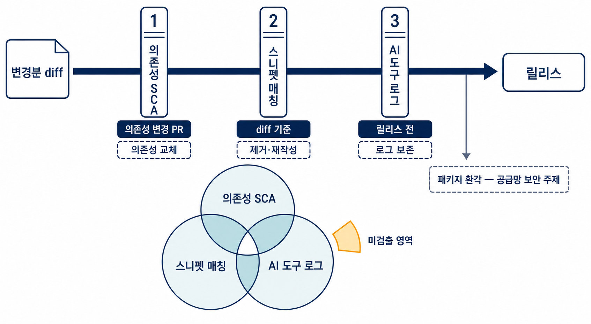

*[릴리스 전 3중 검사의 커버리지 구조]*

### 모델을 가져다 쓸 때

이 소절은 Hugging Face 등에서 모델을 직접 내려받는 개발자가 커밋 전에 확인할 것을 다룬다.

#### 라이선스 미표기는 '오픈소스SW'가 아니라 '모든 권리 유보'다 — Hugging Face 실태

RedMonk는 2026-05-12 약 290만 개 모델을 스캔해 약 100만 개만 라이선스가 표기되어 있다고 보고했다. 표기된 모델 가운데 'better than two thirds carried an OSI-approved license'였고, Apache-2.0이 2위인 MIT의 약 2.5배였다[^ai-ai-redmonk-hf]. 별도로 Stalnaker 외의 ACM TOSEM 게재 논문은 모델 760,460개와 데이터셋 175,000개를 분석해 ML 모델·데이터셋의 라이선스 관리, 문서화 지원, 자동 불일치 검증이 필요하다고 결론지었다[^ai-ai-hf-tosem].

라이선스 미표기는 오픈소스SW가 아니라 '모든 권리 유보'다. 미표기 모델의 사용 금지를 기본 정책으로 하고, 예외로 사용해야 할 때는 법무 검토를 거친다.

[^ai-ai-hf-tosem]: ACM TOSEM(피어리뷰), An Empirical Analysis of ML Model and Dataset Documentation, Supply Chain, and Licensing Challenges on Hugging Face : https://dl.acm.org/doi/10.1145/3776739

#### base_model 계보를 거슬러 올라간다 — 표기된 라이선스를 믿지 않는 이유

Laufer·Oderinwale·Kleinberg의 Hugging Face 186만 모델 분석은 '라이선스가 직관과 반대로 제한적인 상업 라이선스에서 허용형 또는 카피레프트 라이선스로 표류하며, 그것이 흔히 상류 라이선스의 조항을 위반한다(Licenses counter-intuitively drift from restrictive, commercial licenses towards permissive or copyleft licenses, often in violation of upstream license's terms)'고 관측했다[^ai-ai-hf-anatomy]. 승계되어야 할 제한이 파생 과정에서 사라지고 있고, 그 사라짐 자체가 이미 라이선스 위반이라는 뜻이다. 파생 모델에 표기된 라이선스를 그대로 믿지 않는 이유가 여기에 있다.

확인 절차는 다음과 같다.

1. 모델 카드의 `base_model` 필드를 확인한다.
2. 그 베이스 모델의 카드로 이동한다.
3. 원 베이스에 도달할 때까지 1~2를 반복한다.
4. 최종 원 베이스의 LICENSE 원문과 부속 문서(AUP)를 확인한다.

계보가 중간에 끊기거나 `base_model` 표기가 아예 없으면 그 모델을 사용하지 않거나 법무 검토로 보낸다.

[^ai-ai-hf-anatomy]: Anatomy of a Machine Learning Ecosystem: 2 Million Models on Hugging Face (arXiv 2508.06811, NeurIPS 2025 Regulatable ML 워크숍 포스터 — 본회의 피어리뷰 논문이 아닌 프리프린트) : https://arxiv.org/abs/2508.06811

#### 모델 병합 시 '가장 제한적 조건 채택' 원칙

mergekit 등으로 서로 다른 라이선스의 모델을 병합하면 결과물은 가장 제한적인 조건을 따른다고 보고 운영한다. 상호 배타적인 조항이 걸리면 병합 자체가 불가능해질 수 있다. 조합별 판단은 다음과 같다.

| 병합 조합 | 결과물에 적용할 조건 | 근거 |
|---|---|---|
| Apache-2.0 + Apache-2.0 | Apache-2.0 | 제한 조항이 없다 |
| Apache-2.0 + Llama 커스텀 | 명칭 접두어·NOTICE·AUP·지역 제한을 모두 승계 | Apache-2.0이 커스텀 조건을 씻어내지 못한다 |
| Apache-2.0 + Gemma 3 이하 커스텀 | 계약서 사본 제공·NOTICE·Prohibited Use Policy를 승계 | Model Derivatives 정의가 가중치·파라미터 전이 결과물을 포섭한다 |
| 커스텀 + 커스텀(조항 충돌) | 병합 불가로 판정하고 법무 검토로 보낸다 | 상호 배타적 조항을 동시에 충족할 수 없다 |

이 원칙은 법적으로 확정된 규칙이 아니라 계약 위반 리스크를 피하기 위한 보수적 운영 규칙이다. 병합 승인 절차에 '가장 제한적 조건 채택'을 명문화하고, 승인 기준 자체는 [파인튜닝 결과물의 라이선스 승계 — 5개 항목 배포 승인 체크리스트](#파인튜닝-결과물의-라이선스-승계--5개-항목-배포-승인-체크리스트)를 따른다.

#### 파인튜닝 결과물을 배포하기 전에 확인할 것

- [ ] 베이스 모델의 LICENSE 파일을 배포물에 포함했는가 → [파인튜닝 결과물의 라이선스 승계 — 5개 항목 배포 승인 체크리스트](#파인튜닝-결과물의-라이선스-승계--5개-항목-배포-승인-체크리스트)
- [ ] NOTICE 파일에 지정 문구를 넣었는가(Llama 4와 Gemma 3 이하는 문구가 지정되어 있다) → [Llama 4 — 700M MAU 임계, 'Built with Llama' 표시, 파생 모델 명칭 접두어](#llama-4--700m-mau-임계-built-with-llama-표시-파생-모델-명칭-접두어)
- [ ] 모델 이름이 명명 규칙을 지키는가(Llama 파생물은 'Llama' 접두어) → [Llama 4 — 700M MAU 임계, 'Built with Llama' 표시, 파생 모델 명칭 접두어](#llama-4--700m-mau-임계-built-with-llama-표시-파생-모델-명칭-접두어)
- [ ] AUP를 모델 카드에 링크했는가 → [라이선스 본문 밖에 있는 제한 — Llama 4 멀티모달의 EU 조항](#라이선스-본문-밖에-있는-제한--llama-4-멀티모달의-eu-조항)
- [ ] 지역 제한이 있는 모델을 제한 지역 조직에서 다루지 않았는가 → [라이선스 본문 밖에 있는 제한 — Llama 4 멀티모달의 EU 조항](#라이선스-본문-밖에-있는-제한--llama-4-멀티모달의-eu-조항)
- [ ] 배포물에 포함된 데이터셋이 재배포 가능한가 → [데이터셋 등록 필수 5개 필드 — 출처 URL·라이선스·취득일·사용 목적·재배포 가부](#데이터셋-등록-필수-5개-필드--출처-url라이선스취득일사용-목적재배포-가부)

---

여기까지 AI 모델·데이터셋·AI 생성 코드를 오픈소스SW 거버넌스 안에서 다루는 방법을 살펴보았다. 기업 편에서는 반입 승인·대장 등록·SBOM·고지·배포 승인 5단계에 '자산 유형'을 더하는 편입 방식, '오픈소스 AI'라는 말의 판정 기준, 벤더별 모델 라이선스 실사, 데이터셋 등록 5개 필드, EU AI Act와 한국 AI 기본법이 부과하는 의무를 다뤘다. 개발자 편에서는 릴리스 전 3중 검사, `base_model` 계보 추적, 모델 병합 시 '가장 제한적 조건 채택' 원칙을 다뤘다.

지금 착수할 것은 세 가지다.

1. **모델·데이터셋 대장을 먼저 만든다.** 기존 컴포넌트 대장에 '자산 유형'과 '개방성 등급' 컬럼을 추가하고, 이미 사용 중인 모델을 버전 단위로 채워 넣는다. 어떤 모델이 어느 라이선스로 들어와 있는지 목록이 없으면 그다음의 어떤 판정도 시작할 수 없다.
2. **릴리스 게이트에 스니펫 매칭을 diff 기준으로 넣는다.** 의존성 SCA만 돌리는 상태에서는 AI 코딩 도구가 직접 써 넣은 코드 조각이 검사 대상에서 빠진다. 전체 리포지토리 상시 스캔이 아니라 변경분 기준으로 시작한다.
3. **AI 고지·표시 의무 대응 상태를 확인한다.** 한국 AI 기본법 제31조는 2026-01-22부터 시행 중이고, EU 시장에 GPAI를 공급하는 경우 2026-08-02에 집행 권한이 개시된다. 오픈소스SW 모델을 쓴다는 사실이 면제 사유가 아니라는 점을 정책 문서에 명시한다.

이 장으로 가이드를 마친다. 다섯 장은 오픈소스SW 사용·기여·공개와 OSPO, 그리고 AI 자산이라는 서로 다른 국면을 다루지만 같은 구조를 공유한다 — 무엇을 쓰고 있는지 목록으로 확보하고, 라이선스와 규제가 요구하는 의무를 프로세스 단계에 넣고, 판정의 근거를 기록으로 남기는 것이다. 관리해야 할 자산의 종류는 앞으로도 늘어난다. 목록·프로세스·기록 세 축이 서 있는 조직은 새로운 자산 유형을 컬럼 하나와 확인 항목 몇 개로 흡수할 수 있고, 그렇지 않은 조직은 자산 유형마다 체계를 새로 세우게 된다. 이 가이드는 그 세 축을 세우는 데 필요한 판단 기준과 양식을 제공하는 데 목적이 있다.
